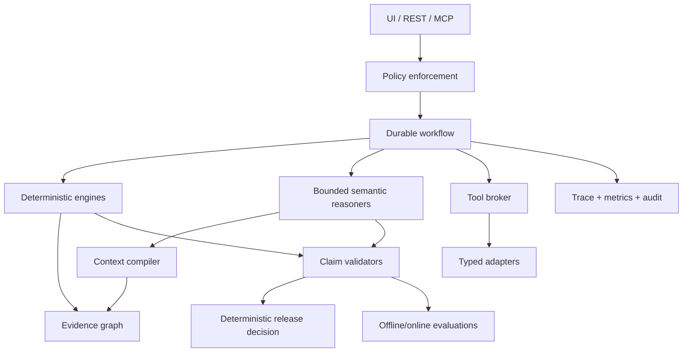

# Salesforce Change Assurance Intelligence Platform

## Agentic AI Assurance Retrofit Master

| Field | Value |
|---|---|
| Version | 1.0 |
| Date | 27 August 2026 |
| Applies to | Existing ~70% implementation and all subsequent development |
| Architecture authority | `salesforce-change-assurance-production-solution-design.md` v1.1 and L01-L14 layer documents |
| Demo anchor | Strategic Opportunity discount threshold `>15%` to `>10%` for amount `> INR 5 crore` |
| Governing principle | Deterministic engines establish truth; LLMs propose, explain and synthesize within evidence and policy boundaries |

## 1. Executive decision

Do not continue feature expansion under the current development pattern and do not fine-tune a model now. Put the codebase through a controlled assurance retrofit:

1. establish what is real, mocked, hardcoded, bypassed or missing;
2. restore typed ports and deterministic/semantic ownership boundaries;
3. instrument a reconstructible trace for every assurance run;
4. convert the demo into a machine-readable golden evaluation corpus;
5. enforce feature-specific guardrails outside prompts;
6. make every material claim evidence-verifiable or explicitly uncertain;
7. prove durable workflow, failure recovery, authorization and human approval;
8. resume feature development only after the vertical slice passes the retrofit gates.

The goal is not to make the LLM appear more intelligent. The goal is to make the complete system measurable, reproducible, safe and explainable.

**Evidence boundary:** this document set is grounded in the production solution design, L01-L14 layer designs and the reported concerns. It does not claim that the current source repository has been audited. All statements about the implementation remain hypotheses until A01 is executed against the actual code, configuration, database, prompts, tests and runtime traces.

## 2. What is wrong versus what is merely incomplete

| Concern | Likely root cause | Correct treatment | Not the primary treatment |
|---|---|---|---|
| Hardcoded output | Adapter/domain boundary bypass or demo shortcut | Deviation audit, typed ports, real/fixture adapter parity | Fine-tuning |
| Database not integrated | Persistence port or migration incomplete | Durable repositories, contract tests, checkpoint/outbox integration | Larger context window |
| LLM layer not properly integrated | Semantic task and context contracts unclear | Task-specific reasoner ports, structured output, evidence allowlist | One giant agent prompt |
| Expected vs actual unknown | No golden corpus/evaluators | Offline eval dataset, exact-set and policy evaluators | Manual “looks correct” review |
| Hallucinated impact/RCA | Claims are not mechanically tied to evidence | Claim ledger, evidence entailment/ID validation, abstention | “Do not hallucinate” prompt alone |
| Guardrails unclear | Policies live in prose or UI | Central policy enforcement points, tool capability classes, approvals | Model refusal alone |
| Observability unclear | Logs record errors but not agent trajectory/evidence | Trace tree, structured events, quality telemetry and audit separation | Dumping full prompts to logs |
| Fine-tuning unclear | Model optimization is being considered before failure diagnosis | Fine-tuning decision gate after stable eval evidence | Training on unreviewed traces |
| Project index/graph may drift | AI-maintained narrative treated as truth | Rebuildable index from authoritative sources with hashes and versions | Asking Claude to remember changes |

## 3. Non-negotiable product invariants

These are release-blocking invariants and should be encoded in `architecture/product-invariants.md`, ADRs and invariant tests.

- Impact, security, risk, coverage, test selection and release decisions are owned by deterministic engines.
- No `ImpactItem`, `SecurityFinding`, `RCAHypothesis`, automation repair or release reason exists without valid evidence references.
- An LLM cannot create a confirmed graph fact, approve an action, change a policy or select `GO / CONDITIONAL_GO / NO_GO`.
- Missing/stale/contradictory evidence produces `INCOMPLETE`, `UNKNOWN`, `INSUFFICIENT_EVIDENCE` or review—not “no impact.”
- Generated/repaired code is untrusted until it passes configured maturity gates.
- Simulation is always distinguishable from live execution and cannot silently satisfy a live-evidence gate.
- Tool authorization is enforced by application/policy code for every call; it is never delegated to the model.
- Personal Salesforce environments use synthetic data only. Client code, metadata, credentials or records are not used without explicit organizational approval.
- The system remains usable without an LLM, embeddings, live Salesforce, GitHub or Salesforce MCP.
- The Evidence Graph, policy bundles, outcome/evaluation memory and automation IR remain product-owned, provider-neutral IP.
- Product invariants and protected features require an ADR and explicit approval before simplification or removal.

## 4. New document set

| ID | Document | Core decision |
|---|---|---|
| A01 | `01-architecture-conformance-and-deviation-audit.md` | Freeze scope and establish implementation truth before remediation |
| A02 | `02-agentic-observability-and-traceability.md` | Every result must be reconstructible from one correlated trace |
| A03 | `03-evaluation-and-golden-dataset-engineering.md` | Evals measure agent/system quality separately from software tests |
| A04 | `04-guardrails-and-policy-enforcement.md` | Guardrails are executable controls at every trust/action boundary |
| A05 | `05-hallucination-grounding-and-claim-verification.md` | Material claims require evidence entailment, not merely citation presence |
| A06 | `06-rag-evidence-graph-and-memory-quality.md` | Exact/graph retrieval precedes semantic retrieval; memory is not truth |
| A07 | `07-fine-tuning-decision-and-model-customization.md` | Fine-tuning is on hold until behavior-specific failures and prerequisites exist |
| A08 | `08-prompt-model-context-and-version-lifecycle.md` | Prompt/model/context changes are versioned, evaluated and progressively promoted |
| A09 | `09-tool-mcp-and-agent-security.md` | Minimal tools, minimal permissions, complete mediation and trusted connectors |
| A10 | `10-agent-workflow-reliability-and-human-oversight.md` | Durable, idempotent, bounded workflows with human authority for material actions |
| A11 | `11-ai-governance-red-teaming-and-continuous-improvement.md` | Ownership, adversarial testing, incident response and controlled learning |

These documents refine—not replace—L09, L12, L13 and L14. Their controls also apply to L01-L08, L10 and L11.

## 5. Target cross-cutting architecture

Key separation:

- **Domain truth plane:** source snapshots, evidence graph, deterministic engines and immutable execution facts.
- **Semantic proposal plane:** requirement normalization, ambiguous mapping, code/RCA proposals and explanations.
- **Control plane:** authorization, approvals, guardrails, budgets, policy and release gates.
- **Assurance plane:** traces, metrics, logs, audit records, golden datasets and evaluation results.

## 6. Retrofit sequence for the existing 70%

### Phase 0 — Freeze and baseline (1–2 working days)

- Stop new feature work except critical fixes.
- Tag the current build and record config, prompts, model IDs, schemas and fixtures.
- Run available tests and capture a baseline report without “fixing while auditing.”
- Create the Implementation Deviation Register using A01.
- Classify every feature/module as `CORE_INVARIANT`, `PROTECTED`, `EXPERIMENTAL`, `ACCIDENTAL_COMPLEXITY` or `DEAD`.

**Exit:** repository truth is known; no critical component is only described by chat or project memory.

### Phase 1 — Contracts and real boundaries (2–4 working days)

- Freeze contract revisions for semantic tasks, telemetry, claims and policy decisions.
- Replace direct SDK/database/model construction inside agents with ports.
- Isolate hardcoded/fixture behavior behind explicitly named adapters.
- Make capability discovery report `LIVE`, `FIXTURE`, `SIMULATED`, `UNAVAILABLE` or `UNSUPPORTED`.
- Restore real persistence for run state, evidence references and outputs before optional embeddings.

**Exit:** fixture/live implementations pass the same port contracts and the UI cannot mislabel them.

### Phase 2 — Traceability (2–3 working days)

- Introduce `trace_id`, `run_id`, `step_id`, `evidence_pack_id` and version fields.
- Instrument one end-to-end trace using A02.
- Store redacted references/hashes instead of unrestricted prompts, source and Salesforce records.
- Add dashboards for run health, evidence quality, model/tool use, validation maturity and release outcomes.

**Exit:** one strategic-discount run can be reconstructed without reading application debug output.

### Phase 3 — Golden evaluations (3–5 working days)

- Encode the strategic-discount scenario as the first golden dataset.
- Add exact expected sets, must-not-claim items, expected trajectory, degradation states and release decision.
- Implement deterministic evaluators first; use a calibrated judge only for explanation quality.
- Pin source, graph, prompt, model, policy, parser and framework-profile versions.

**Exit:** expected-vs-actual is reported by capability; no team member needs to judge by impression.

### Phase 4 — Guardrails and hallucination controls (3–5 working days)

- Apply A04 and A05 at input, retrieval, model output, tool, execution and writeback boundaries.
- Enforce evidence allowlists and claim validation.
- Add `INSUFFICIENT_EVIDENCE`, `ABSTAIN`, `REVIEW_REQUIRED` and `POLICY_BLOCKED` outcomes.
- Block unapproved tools, nonexistent entities, unsupported claims, stale evidence and unsafe patches.

**Exit:** red-team and must-not-claim cases fail closed without destroying the deterministic-only flow.

### Phase 5 — Reliability, security and controlled resumption (3–5 working days)

- Prove checkpoint/resume, idempotency, bounded loops, external reconciliation and approval expiry.
- Threat-model MCP/tools, memory poisoning and generated-code execution.
- Add change-triggered eval selection and promotion gates.
- Resume the remaining feature backlog one vertical slice at a time.

**Exit:** the retrofit gates below pass and further development follows eval-driven change control.

## 7. Retrofit release gates

| Gate | Required evidence |
|---|---|
| Architecture conformance | No unresolved P0 bypass/hardcode in the demo path; all remaining deviations owned and dated |
| Persistence | Restart retains run/checkpoint/evidence/output; no duplicate external side effect |
| Trace reconstruction | 100% of material demo steps correlated under one trace and run |
| Evidence integrity | 100% of material claims have valid, accessible, snapshot-bound evidence |
| Unsupported claims | 0 release-blocking unsupported claims; no must-not-claim violation |
| Critical recall | No critical impact/security/mandatory-test false negative in the approved golden corpus |
| Test selection | 100% mandatory-obligation recall; exclusions carry reasons |
| Automation safety | No patch below policy maturity reaches execution/writeback |
| Release agreement | 100% exact agreement with deterministic golden release decisions |
| Tool safety | Every tool call authorized, schema-valid, bounded and traced |
| Human oversight | Sensitive action cannot proceed with missing/replayed/expired/self approval |
| Degradation | LLM/embedding/live Salesforce outage produces an explicit usable degraded result |

## 8. How development changes after the retrofit

For each small capability, the coding assistant must produce a pre-implementation packet:

1. requirement and architecture references;
2. deterministic versus semantic responsibilities;
3. contracts and data ownership;
4. failure, uncertainty and abstention behavior;
5. observability spans/events/metrics;
6. guardrails and action class;
7. unit, contract, integration, adversarial and evaluation cases;
8. exact modules to modify and prohibited boundaries;
9. definition of done and rollback plan.

Only after review should implementation start. After implementation, inspect at least one trace, one failing eval and one passing eval. This turns the assistant into a constrained implementer and explainer while the engineer retains design ownership.

## 9. Explicit non-actions

- Do not rewrite the complete 70% implementation.
- Do not add more agents to hide missing deterministic services.
- Do not treat LangSmith, Agentforce Observability or any single vendor as the canonical data model.
- Do not collect raw prompt/source content in telemetry by default.
- Do not train on production traces before privacy, quality, label and consent review.
- Do not allow LLM-as-judge to determine graph truth, security truth, mandatory coverage or the release code.
- Do not claim “zero hallucinations.” Claim measured unsupported-claim controls and known residual risk.

## 10. Research grounding

- [NIST AI RMF Generative AI Profile](https://nvlpubs.nist.gov/nistpubs/ai/NIST.AI.600-1.pdf) emphasizes lifecycle governance, provenance, pre-deployment testing, incident disclosure and proportionate independent evaluation.
- [OpenAI evaluation guidance](https://developers.openai.com/api/docs/guides/evaluation-best-practices) recommends eval-driven development, task-specific datasets, logging, automation, human calibration and continuous evaluation, and identifies vibe-based evaluation as an anti-pattern.
- [Anthropic hallucination guidance](https://platform.claude.com/docs/en/test-and-evaluate/strengthen-guardrails/reduce-hallucinations) recommends uncertainty, quote/citation grounding and claim verification while warning that techniques reduce rather than eliminate hallucination.
- [OWASP Agentic Top 10](https://genai.owasp.org/resource/owasp-top-10-for-agentic-applications-for-2026/) frames tool misuse, privilege abuse, supply-chain compromise, memory poisoning, cascading failure and human-agent trust as agent-specific risks.
- [Salesforce Testing API](https://developer.salesforce.com/docs/ai/agentforce/guide/testing-api.html) and [Agentforce OTel trace export](https://developer.salesforce.com/docs/ai/agentforce/guide/otel-api.html) are useful reference patterns, but the product remains independently operable.

## 11. Master definition of done

- A01-A11 are adopted through code/config/test changes, not merely stored as documentation.
- The Implementation Deviation Register is completed against the actual repository.
- One strategic-discount run passes deterministic, semantic, trajectory, adversarial, recovery and release evaluations.
- One trace reconstructs normalized requirement, snapshots, retrieval, graph query, engines, model calls, tool calls, validations, approvals, execution, RCA and release decision.
- Every feature has an owner, quality definition, guardrail owner, evaluator and operational alert.
- Fine-tuning remains `HOLD` until A07 entry gates pass.
- New changes cannot promote without their targeted tests/evals, version metadata and rollback path.
