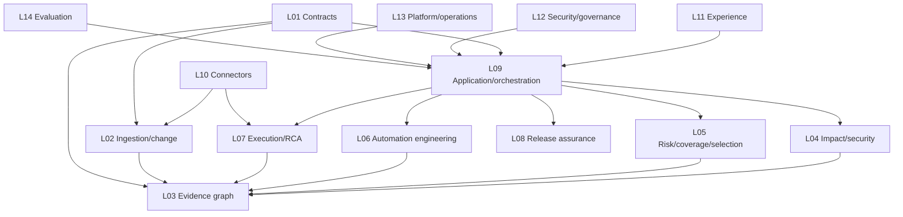
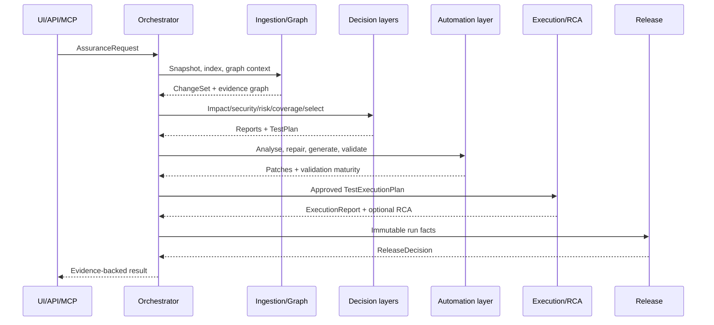

# Salesforce Change Assurance Intelligence Platform

## Integration Layer Master Design

| Field | Value |
|---|---|
| Version | 1.0 |
| Date | 24 August 2026 |
| Source baseline | `salesforce-change-assurance-production-solution-design.md` v1.1 |
| Purpose | Canonical cross-layer contracts, dependency rules, integration workflow and system-level completion criteria |

## 1. Integration objective

Integrate independently owned layers into one reproducible capability chain:

> **Requirement/change → source indexing → evidence graph → impact/security → risk/coverage/test selection → automation repair/generation → executable validation/execution → RCA → release assurance**

The master owns no domain algorithm. It defines how layers compose, how state and evidence cross boundaries, and which gates protect the integrated product.

## 2. Document set and ownership map

| ID | Document | Layer owner | Primary outputs |
|---|---|---|---|
| L01 | `01-contracts-and-domain-model.md` | Lead architect | Schemas, ports, events, compatibility policy |
| L02 | `02-source-ingestion-and-change-detection.md` | Salesforce/indexing engineer | `ChangeSet`, `SourceSnapshot`, `IngestBatch` |
| L03 | `03-evidence-graph-and-memory.md` | Graph/data engineer | Graph snapshot, evidence paths, project memory |
| L04 | `04-impact-and-security-intelligence.md` | Domain/security engineer | `ImpactReport`, `SecurityReport` |
| L05 | `05-risk-coverage-and-test-selection.md` | QE/decision engineer | `RiskReport`, `CoverageReport`, `TestPlan` |
| L06 | `06-test-automation-engineering.md` | Automation engineer | Inventory, repair/generation patches, validation plan |
| L07 | `07-test-execution-and-rca.md` | Execution/RCA engineer | `ExecutionReport`, `RCAReport` |
| L08 | `08-release-assurance.md` | Release/QE lead | `ReleaseDecision` |
| L09 | `09-agent-llm-and-orchestration.md` | Agent/platform engineer | Durable workflow, semantic proposals, approvals |
| L10 | `10-connectors-and-external-integrations.md` | Integration engineer | Port adapters and normalized failures |
| L11 | `11-api-ui-and-mcp-experience.md` | API/UI engineer | REST, UI, MCP resources/tools |
| L12 | `12-security-governance-and-audit.md` | Security engineer | Identity, policy, approvals, audit controls |
| L13 | `13-persistence-platform-and-operations.md` | Platform engineer | Durable stores, workers, SLOs, runbooks |
| L14 | `14-evaluation-and-quality-engineering.md` | QE/evaluation owner | Golden cases, quality gates, regression metrics |

## 3. Dependency direction



Rules:

- All layers depend on L01 contracts; L01 depends on no implementation.
- Domain layers never import concrete connectors, FastAPI, UI or MCP code.
- Experience adapters call application services, never LangGraph nodes or engines directly.
- L09 coordinates; it does not reimplement decisions owned by L04–L08.
- L12–L14 are cross-cutting control layers but integrate through explicit ports, policies and test gates.

## 4. Canonical run state

```python
class AssuranceState(TypedDict):
    request_id: str
    project_id: str
    mode: str
    policy_bundle: str
    source_snapshot_ids: list[str]
    requirement: RequirementSpec | None
    change_set: ChangeSet | None
    evidence_ids: list[str]
    impact: ImpactReport | None
    security: SecurityReport | None
    risk: RiskReport | None
    coverage: CoverageReport | None
    test_plan: TestPlan | None
    automation_impact: AutomationImpactReport | None
    automation_patches: list[AutomationPatch]
    automation_validation: list[AutomationValidationReport]
    execution: ExecutionReport | None
    rca: RCAReport | None
    release_decision: ReleaseDecision | None
    approvals: list[Approval]
    errors: list[WorkflowError]
```

State carries IDs and typed summaries. Large source, logs, DOM snapshots and patches live in the artifact store and are referenced by immutable hashes.

## 5. Contract exchange matrix

| Producer | Contract/event | Consumers | Required guarantees |
|---|---|---|---|
| L11/L09 | `AssuranceRequest` | L09 | Authorized, schema-valid, idempotency key |
| L02 | `RequirementSpec`, `ChangeSet` | L03/L04/L09 | Source hashes and versions present |
| L02 | `IngestBatch` | L03 | Canonical keys, parser/extractor version |
| L03 | `GraphResult`, `EvidenceRef[]` | L04–L09/L11 | Snapshot-bound, evidence-complete |
| L04 | `ImpactReport`, `SecurityReport` | L05/L06/L08/L09 | Every finding has evidence and certainty |
| L05 | `RiskReport`, `CoverageReport`, `TestPlan` | L06/L08/L09/L11 | Policy version and mandatory obligations |
| L06 | `AutomationImpactReport`, `AutomationPatch`, `AutomationValidationReport` | L07/L08/L09/L11 | Base hash, maturity, evidence, no direct writeback |
| L07 | `ExecutionReport`, `RCAReport` | L06/L08/L09/L11 | External IDs, simulation flag, evidence |
| L08 | `ReleaseDecision` | L09/L11 | Deterministic code, expiry, blockers/conditions |
| L12 | `PolicyDecision`, `Approval`, `AuditEvent` | All action layers | Actor, scope, policy version and decision |
| L13 | `RunEvent`, health/SLO signals | L09/L11/operations | Correlation ID and durable ordering |
| L14 | `EvalResult`, quality gate | CI/promotion | Build/policy/model/prompt/source versions |

## 6. End-to-end integration sequence



## 7. Integration state and failure policy

| State | Entry condition | Exit condition |
|---|---|---|
| `RECEIVED` | Request persisted | Authorization/idempotency complete |
| `NORMALIZING` | Valid request | `RequirementSpec` valid or manual-input task |
| `INDEX_CHECK` | Source refs captured | Fresh graph snapshot active |
| `ANALYSING` | Graph context available | Impact/security reports complete |
| `PLANNING` | Risk/coverage available | Test plan and obligations complete |
| `ENGINEERING` | Repair/generation needed | Isolated patches created or explicitly skipped |
| `VALIDATING` | Patch or existing asset selected | Required maturity achieved or run blocked |
| `AWAITING_APPROVAL` | Sensitive action pending | Scoped approval/rejection/expiry |
| `EXECUTING` | Authorized executable plan | Final/inconclusive external result |
| `DIAGNOSING` | Failure requires RCA | Ranked evidence-backed hypotheses |
| `DECIDING` | All required facts terminal | Versioned decision generated |
| `COMPLETED` | Decision persisted/audited | Feedback/outcome may attach later |

No layer silently downgrades a dependency. Unavailable live Salesforce, LLM, embeddings or execution is explicitly represented and affects the release policy.

## 8. Integration development notes

### Repository convention

```text
contracts/                    L01
packages/indexing/            L02
packages/graph/               L03
packages/impact|security/     L04
packages/risk|coverage|test_selection/ L05
packages/automation_*/        L06
packages/execution|rca/       L07
packages/release/             L08
packages/application|orchestration|agents/ L09
packages/connectors/          L10
apps/api|web + packages/mcp_server/ L11
packages/policy|audit/        L12
packages/platform + ops/      L13
tests/evals + packages/evaluation/ L14
```

### Contract-first development

1. Freeze or version the input/output contract.
2. Provide producer and consumer fixtures.
3. Implement the layer behind its public entry point.
4. Pass unit and contract tests.
5. Update `LAYER_INDEX.md`, graph/index artifacts and handoff.
6. Integrate using the fixture adapter before live services.

### Forbidden integration patterns

- UI importing domain packages.
- Agent nodes instantiating Salesforce/model SDKs.
- Risk or release logic hidden in prompts.
- A connector returning SDK objects across a port.
- A generated patch applied before validation/approval.
- Graph edges without evidence or active nodes.
- A release recommendation based on stale snapshots.

## 9. Integration packets

Each layer handoff contains:

```text
layer patch/bundle
LAYER_INDEX.md
HANDOFF.md
contract fixtures
unit and contract results
new/updated ADRs
index/graph update evidence
known risks and unsupported cases
```

The integration lead records the exact layer versions in an integration manifest.

## 10. Integration testing strategy

### Required test suites

- Contract compatibility across all producer/consumer pairs.
- Fixture and live adapter parity.
- End-to-end happy path from requirement to decision.
- LLM/embeddings/Salesforce unavailable degradation.
- Stale index and transactional graph activation.
- Worker crash/resume at every material checkpoint.
- Approval reject, expire and duplicate submission.
- Selenium repair plus Selenium/API/Apex generation and validation.
- Product defect versus automation defect RCA.
- Required test failure preventing `GO`.
- Evidence-ID referential integrity from UI to raw artifact.
- Cross-layer authorization and restricted evidence.
- Reproducibility with identical snapshots and versions.

### Integration quality gates

```text
schema compatibility       PASS
unit + layer contract      PASS
forbidden imports          PASS
index/graph integrity      PASS
automation validation      PASS
security/SBOM              PASS
golden eval thresholds     PASS
end-to-end fixture flow    PASS
failure/recovery flow      PASS
documentation/handoff      CURRENT
```

## 11. Master definition of done

- All L01–L14 layer definitions of done pass.
- One run proves the complete capability chain using immutable evidence.
- The same run is accessible from REST/UI and optional MCP.
- Fixture and live adapters can be swapped without domain-code changes.
- Every cross-layer payload validates against the checked-in schema.
- Every material output identifies source, graph, engine, policy, model/prompt and framework-profile versions where applicable.
- Generated/repaired automation cannot reach execution or writeback below required maturity/approval.
- Worker restart does not duplicate external side effects.
- `NO_GO`, `CONDITIONAL_GO` and `GO` cases are covered by deterministic tests.
- Audit, metrics, alerts and operator runbooks cover the integrated flow.
- No P0 layer depends on GitHub, Salesforce MCP, pgvector or a live org.

## 12. Master demo script

1. Submit the 15% → 10% strategic-discount requirement and local Git refs.
2. Show changed Flow/Apex/field and security/business impact paths.
3. Show coverage obligations and minimal test selection.
4. Show existing Selenium/API/Apex asset mappings.
5. Repair one impacted Selenium asset with evidence-backed locator/assertion change.
6. Generate targeted Selenium UI, Apex and API tests.
7. Reject an assertion-free artifact, then show validated artifacts.
8. Execute or simulate the authorized plan.
9. Seed a product or automation failure and show RCA classification.
10. Display evidence-backed `CONDITIONAL_GO`/`NO_GO`; resolve blockers and reproduce the final recommendation.

## 13. Integration change control

- Contract changes require an ADR and an impact list of producer/consumer layers.
- Layer implementations version independently; integration manifests pin compatible versions.
- Prompt, model, ontology, policy, parser and framework-profile changes trigger targeted eval suites.
- A source, graph, automation or policy change invalidates earlier release decisions.
- The master document is updated when a new layer, public contract, state transition or integration gate is introduced.
