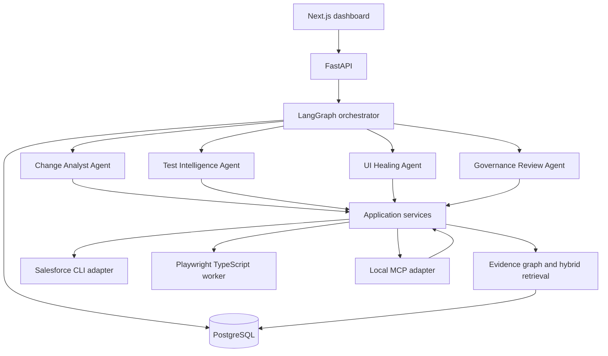

# Architecture

## Components



## Dependency direction

```text
domain <- application <- agents
domain <- application <- API / MCP / CLI / Playwright adapters
domain <- persistence interfaces <- PostgreSQL adapter
```

Domain modules never import FastAPI, LangGraph, MCP, Salesforce CLI or Playwright. Agents receive typed inputs and return typed proposals. Deterministic application services validate and persist them.

## Runtime boundaries

- Python 3.14.3: domain, FastAPI, LangGraph, PostgreSQL, retrieval and MCP.
- Node.js 26.5.x: Next.js and Playwright TypeScript.
- Salesforce CLI 2.148.3+: local authentication broker and Salesforce transport.
- PostgreSQL: durable checkpoints, evidence, claims, test/healing outcomes and audit.
- OpenAI/Azure OpenAI: replaceable reasoning and embedding providers.

## Debugging model

Every run has `run_id`, `trace_id` and ordered `step_id` values. Agent prompts, model/deployment names, policy versions, graph snapshot, evidence IDs and tool outcomes are recorded without secrets or raw frontdoor URLs. Each node can be replayed from its typed input.
