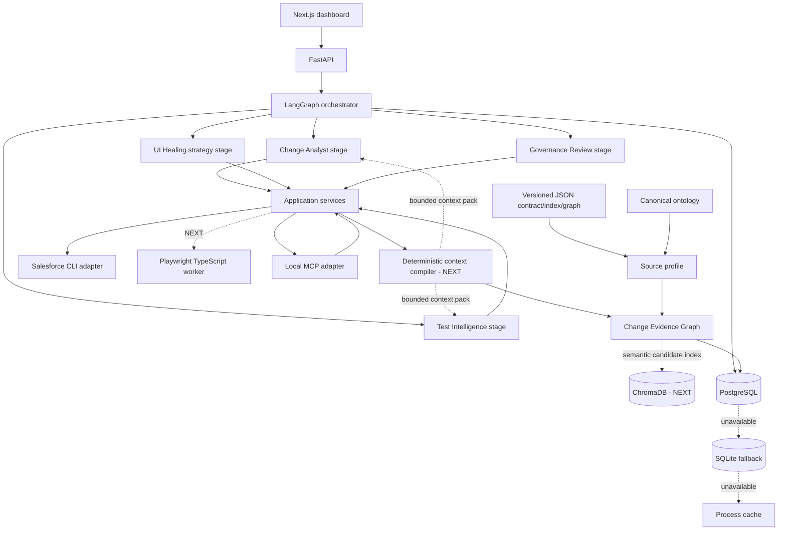

# Architecture

## Target components and current boundaries

Solid nodes exist at least as a foundation. Nodes marked `NEXT` are target adapters and must not be
presented as executed behavior.



## Dependency direction

```text
domain <- application <- workflow stages / future model-backed agents
domain <- application <- API / MCP / CLI / Playwright adapters
domain <- persistence interfaces <- PostgreSQL adapter
```

Domain modules never import FastAPI, LangGraph, MCP, Salesforce CLI or Playwright. Current
deterministic stages exchange typed state and persist typed deliverables. Future model-backed agents
must use the same contracts; deterministic application services remain the authority.

The Change Evidence Graph is the central intelligence fabric, not merely a dependency lookup.
The implemented normalization boundary maps source-owned node kinds and relations through a
versioned, self-hashed source profile into a versioned, self-hashed canonical ontology. Illegal
endpoint signatures and unmapped material vocabulary are explicit gaps, not guessed mappings.
Deterministic parsers and verified runtime/test receipts populate the authority plane. A future
context compiler selects a snapshot-isolated subgraph and supporting source/outcome evidence for
each specialist. Model/vector components may propose semantic links in a separate inference plane;
only deterministic verification or a separately scoped human-approval receipt can promote them. See
`Docs/10-graph-grounded-agent-reasoning.md`.

## Runtime boundaries

- Python 3.14.3: domain, FastAPI, LangGraph, PostgreSQL, retrieval and MCP.
- Node.js 26.5.x: Next.js and Playwright TypeScript.
- Salesforce CLI 2.148.3+: local authentication broker and Salesforce transport.
- PostgreSQL: target primary durable relational memory for checkpoints, runs, evidence/chunk
  metadata, graph edges, claims, test/healing outcomes and audit. The current runtime wires runs
  and checkpoints; the remaining repository ports are a foundation milestone. Schemas and reviewed
  migrations self-apply on startup.
- SQLite: auto-created durable fallback for complete run documents when PostgreSQL is unavailable.
- Versioned JSON plus process cache: source/evidence continuity and final non-durable runtime fallback.
- ChromaDB: the only supported persistent vector documents, embeddings and semantic index;
  derived and rebuildable from authoritative source snapshots.
- OpenAI/Azure OpenAI: replaceable reasoning and embedding providers.

## Current debugging model

Every run has `run_id` and `trace_id`. Each executed stage emits a bounded timestamped activity and
typed deliverable with capability IDs, opaque logged evidence/artifact references, policy identity,
measurements, gaps, sanitized failure class and next action. Complete ordered replay—step/parent
sequence, source/input digest, model/deployment records and tool outcomes—is a follow-up
observability milestone and is not implied by the current dashboard.
