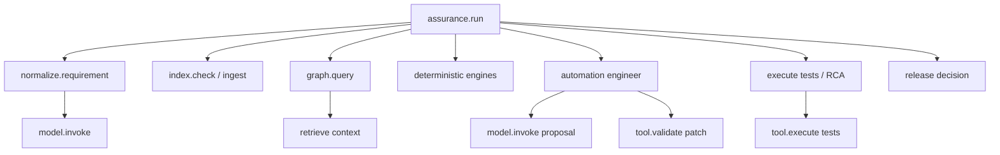

# A02 — Agentic Observability and End-to-End Traceability

## 1. Objective

Make every assurance result reconstructible: what the user requested, which immutable sources were used, which deterministic and semantic steps ran, which tools acted, what validation occurred, why the workflow retried/abstained/blocked, and how the final release recommendation was derived.

Observability answers “what happened and why?” It does not replace immutable audit records, evidence storage, evaluations or business decisions.

## 2. Three distinct telemetry planes

| Plane | Purpose | Retention/access | Examples |
|---|---|---|---|
| Operational telemetry | Reliability, latency, dependency health and debugging | Short/medium, operations role | spans, structured logs, counters, histograms |
| AI quality telemetry | Grounding, tool trajectory, model quality and eval signals | Controlled QE/AI role | retrieval IDs, claim validation, abstention, evaluator scores |
| Audit/evidence | Accountability and release/security proof | Policy-governed, tamper-evident | approvals, policy decisions, write actions, immutable evidence IDs |

Do not copy all audit/evidence content into operational logs. Correlate with IDs and enforce independent access policies.

## 3. Canonical correlation model

Every request must propagate:

```python
class TraceContext(BaseModel):
    trace_id: str
    run_id: str
    request_id: str
    project_id: str
    workflow_version: str
    step_id: str | None
    attempt: int = 1
    parent_step_id: str | None = None
    source_snapshot_ids: list[str] = []
    graph_snapshot_id: str | None = None
    policy_bundle_version: str
    build_id: str
```

External calls add provider request/correlation IDs. They never replace the platform `trace_id` or `run_id`.

## 4. Required trace tree



Minimum span catalogue:

- `assurance.run`
- `workflow.step`
- `source.snapshot`, `index.ingest`, `graph.query`, `retrieval.query`
- `impact.compute`, `security.compute`, `risk.compute`, `coverage.compute`, `tests.select`
- `model.invoke`, `model.validate_output`, `claim.verify`
- `automation.inventory`, `automation.patch`, `automation.validate`
- `tool.authorize`, `tool.execute`, `external.reconcile`
- `approval.request`, `approval.resolve`
- `test.execute`, `rca.classify`, `rca.synthesize`
- `release.evaluate`, `eval.score`

## 5. Attribute and event schema

Use OpenTelemetry-compatible fields plus a versioned application namespace. OpenTelemetry GenAI agent conventions are still marked development, so pin the convention revision and map through an internal schema adapter.

### Common span attributes

```text
sca.run.id
sca.project.id
sca.workflow.version
sca.step.name
sca.step.attempt
sca.operation.mode = LIVE | FIXTURE | SIMULATED | DEGRADED
sca.policy.bundle
sca.source.snapshot_ids
sca.graph.snapshot_id
sca.evidence.pack_id
sca.output.artifact_id
sca.result.status
sca.error.code
sca.security.classification
```

### Model span attributes

```text
gen_ai.operation.name
gen_ai.provider.name
gen_ai.request.model
gen_ai.response.model
gen_ai.usage.input_tokens
gen_ai.usage.output_tokens
sca.prompt.name
sca.prompt.version
sca.prompt.hash
sca.model.config.hash
sca.context.compiler.version
sca.context.token_count
sca.evidence.allowed_count
sca.output.schema_version
sca.output.schema_valid
sca.claim.count
sca.claim.unsupported_count
sca.abstained
```

### Retrieval/graph span attributes

```text
sca.retrieval.strategy = EXACT | GRAPH | HYBRID | VECTOR
sca.retrieval.query_hash
sca.retrieval.candidate_count
sca.retrieval.returned_count
sca.retrieval.min_score
sca.retrieval.filter_policy
sca.retrieval.index_version
sca.retrieval.stale_count
sca.graph.query_policy_version
sca.graph.depth
sca.graph.nodes_returned
sca.graph.edges_returned
sca.graph.inferred_ratio
```

### Tool/action events

Record `tool.requested`, `policy.decision`, `approval.required`, `tool.started`, `tool.completed`, `tool.failed` and `external.reconciled`. Each includes tool name/version, risk class, argument hash, result hash, actor, authorization decision ID, approval ID if required, external correlation ID and side-effect status.

## 6. Content capture and privacy

Default production policy:

- Do not put raw prompts, completions, source code, DOMs, Salesforce records, secrets or unrestricted tool results in spans/logs.
- Store redacted encrypted artifacts only when policy permits; telemetry records their content hash and artifact ID.
- Capture exact prompt/model input in synthetic local environments when useful for debugging.
- Redact before serialization so exporters never receive prohibited content.
- Apply field-level classification, tenant/project authorization and retention.
- Tokenize/hash stable IDs only where correlation remains necessary and policy allows it.
- Record whether content was captured, redacted, omitted or unavailable.

## 7. Structured log event

```json
{
  "timestamp": "2026-08-27T10:00:00Z",
  "level": "INFO",
  "event": "claim.verify.completed",
  "trace_id": "...",
  "run_id": "...",
  "step_id": "rca-synthesis",
  "claim_count": 7,
  "supported": 6,
  "unsupported": 1,
  "decision": "REVIEW_REQUIRED",
  "evidence_pack_id": "ep-...",
  "artifact_id": "artifact-...",
  "duration_ms": 48
}
```

Errors use stable codes and safe summaries. Stack traces are restricted and never returned as API business results.

## 8. Metrics and initial targets

### Reliability/SLO metrics

- run acceptance/completion/block/failure/cancel rates;
- step p50/p95/p99 duration, retry and timeout;
- queue age, lease expiry, stuck-run count and resume success;
- dependency availability, rate limit and circuit state;
- unknown external outcome and reconciliation duration;
- duplicate side-effect count (target `0`).

### AI/quality metrics

- evidence completeness and resolvability;
- unsupported material claim and must-not-claim rates;
- entity-ID validity and citation entailment;
- structured-output invalid rate;
- abstention/review rate and calibration;
- retrieval recall/precision, empty retrieval and stale context;
- tool selection/argument validity and forbidden-tool attempt;
- repair/generation compile, discovery, execution, acceptance and false-heal rates;
- eval pass/regression and release-decision agreement;
- human correction/override rates.

### Cost/capacity metrics

- tokens and cost by task, project, model and outcome;
- context size, cache hit, retries and wasted invalid calls;
- tool calls/run, validation attempts/run and execution minutes;
- cost per completed/accepted assurance run.

## 9. Dashboards

| Dashboard | Required views |
|---|---|
| Run operations | throughput, states, latency, queue, dependency, stuck/recovered runs |
| Evidence health | index age, graph integrity, missing/stale evidence, inferred ratio |
| Agent/model | task/model/prompt versions, tokens, invalid schema, abstention, unsupported claims |
| Automation engineering | dispositions, maturity funnel, compile/discovery/execution, false heals |
| Release assurance | GO/conditional/no-go, blockers, expired decisions, human overrides |
| Security/actions | authorization denials, prompt-injection signals, approvals, high-risk tool attempts |
| Evaluation | corpus/version, per-capability metrics, regressions, unreviewed production cases |

## 10. Alert policy

P0/P1 alerts:

- unsupported claim reaches a release blocker or UI definitive state;
- tool/write action lacks matching policy/approval event;
- simulated/fixture output is labelled live;
- stale/corrupt graph used for definitive decision;
- duplicate execution/write side effect;
- audit/evidence reference becomes unresolvable;
- suspected credential/sensitive content exposure;
- critical eval regression or must-not-claim violation.

Operational alerts include stuck runs, queue/SLO breach, dependency outage, model invalid-output spike, high abstention/retry cost, failed ingest, abnormal override rate and backup/restore failure.

## 11. Trace-to-evaluation flywheel

1. Flag failed, corrected, high-latency, high-cost, low-evidence and unusual-tool traces.
2. Redact and review them.
3. Convert approved cases into versioned eval candidates.
4. Add expected outcome, must-not-claim items and trajectory constraints.
5. Run against current and candidate builds.
6. Promote only when gates pass; keep production monitoring active.

No raw production trace becomes training/eval data automatically.

## 12. Vendor-neutral implementation

- Emit OpenTelemetry through a platform telemetry port/SDK.
- Route to an approved collector/backend.
- A LangSmith exporter may provide LLM-specific trace inspection, datasets and online/offline evaluation.
- Salesforce Agentforce Session Trace OTel may be imported as external trace evidence when native Agentforce is used.
- Neither vendor is the authoritative workflow/evidence store.

## 13. Retrofit tasks

1. Add correlation/version fields to L01 contracts.
2. Instrument the application-service entry and workflow step wrapper.
3. Instrument graph/retrieval, model and tool adapters.
4. Add output/claim validation events.
5. Implement redaction before export.
6. Build a local JSON/OTLP trace for the golden scenario.
7. Assert trace completeness in integration tests.
8. Add dashboards and alerts after field names stabilize.

## 14. Tests

- Context propagation across async worker, retry, resume and external adapter.
- Parent/child span integrity and no orphan material steps.
- Sensitive-field redaction and restricted artifact authorization.
- Error/timeout/cancel/approval paths.
- Cardinality limits and oversized payload rejection.
- Sampling keeps all security/write/error traces.
- Metrics match persisted run facts.
- Trace replay resolves every evidence/artifact/approval reference.
- Same run ID appears consistently in REST/UI/MCP and imported external trace.

## 15. Definition of done

- One trace reconstructs the complete strategic-discount run.
- Every material layer emits start/terminal status and stable error code.
- Prompt/model/context/policy/source/graph/framework versions are captured by reference/hash.
- No prohibited raw content appears in normal operational telemetry.
- Dashboards distinguish live, fixture, simulated and degraded operation.
- Trace completeness and redaction tests pass.
- Operators can locate root failure and evidence without reading arbitrary server output.

## 16. Primary references

- [OpenTelemetry GenAI semantic conventions repository](https://github.com/open-telemetry/semantic-conventions-genai)
- [OpenTelemetry agent/framework span conventions](https://github.com/open-telemetry/semantic-conventions-genai/blob/main/docs/gen-ai/gen-ai-agent-spans.md)
- [LangSmith observability](https://docs.langchain.com/langsmith/observability)
- [Salesforce Agentforce Session Trace OTel API](https://developer.salesforce.com/docs/ai/agentforce/guide/otel-api.html)
