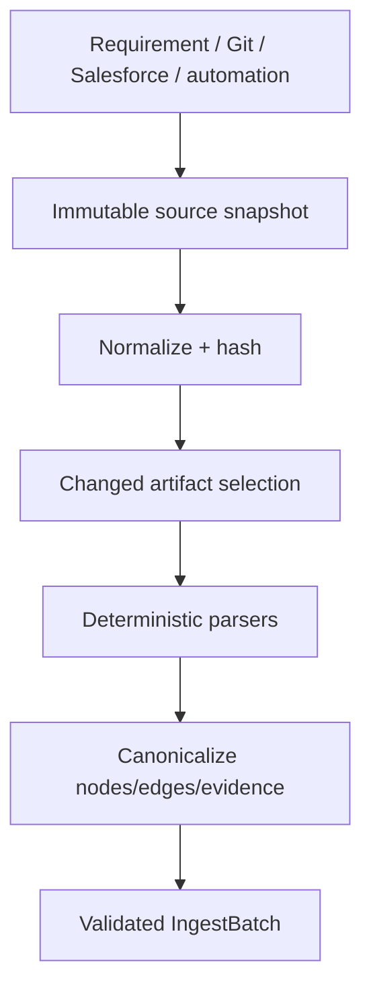

# L02 — Source Ingestion and Change Detection

## Layer charter

| Field | Value |
|---|---|
| Version/date | 1.0 / 24 August 2026 |
| Source baseline | `salesforce-change-assurance-production-solution-design.md` v1.1 |
| Mission | Convert requirements, Git changes, Salesforce metadata/code and automation repositories into canonical, evidence-bearing ingest data |
| Owner | Salesforce/indexing engineer |
| Inputs | Requirement text, local Git refs, fixture/live snapshots, repository content |
| Outputs | `RequirementSpec`, `ChangeSet`, `SourceSnapshot`, `IngestBatch` |

## Part A — Solution design

### Components

- Requirement intake normalizer boundary.
- Local Git diff and artifact reader.
- Salesforce XML metadata parsers.
- Bounded Apex symbol/SOQL/reference extractor.
- Automation repository inventory parsers for Selenium/Cucumber/API/Apex.
- Canonical-key and content-hash service.
- Incremental ingest coordinator.

### Processing flow



### Supported initial extraction

| Source | P0 extraction |
|---|---|
| Requirement | Actors, rules, thresholds, acceptance criteria, ambiguities |
| Git | Base/head, commits, changed paths, line hunks, change kind |
| Salesforce XML | Objects, fields, Flows, Permission Sets, Profiles, Validation Rules |
| Apex | Classes/methods, referenced classes, SOQL objects/fields, test methods |
| Selenium/TestNG/Cucumber | Test cases, Page Objects, locators, steps, tags, assertions |
| API automation | Routes, payload/schema models, assertions, auth abstraction |
| Project docs | ADRs, business rules, indexes and stable content chunks |

### Incremental rules

- Hash normalized content with SHA-256.
- Skip unchanged `(content_hash, parser_version)` artifacts.
- Mark missing entities/relationships inactive in the next successful snapshot; do not hard-delete.
- Emit deterministic evidence locator and extractor version for every structural fact.
- Semantic candidate links are separate proposals, never structural facts.

### R0.1 edge-envelope boundary

The current `canonical-edge-artifact-parser` is a deterministic parser for a bounded, already
canonical JSON edge claim. It is pinned by registry identity, version, implementation locator and
implementation SHA-256, and consumers replay its artifact bytes. This proves that a local claim was
parsed consistently; it does **not** attest that Salesforce, Git or a test runner produced the
underlying fact. The verification result therefore always carries
`UPSTREAM_SOURCE_CAPTURE_NOT_ATTESTED`, remains analysis-only and cannot authorize release.

Future source adapters must create the canonical artifact through a bounded, source-specific
capture receipt that binds the authenticated read/query, permitted source, capture time, response
digest, parser/normalizer version and project/snapshot. They must feed the same envelope verifier;
they must not create a second trust path or rename the current parser to imply source attestation.

### R0.4 local Git and graph-seed boundary

The verified local-Git producer captures complete bytewise base/candidate manifests and derives the
change partition itself. The follow-on mapper replays that capture plus current graph/path trust,
uses an exact repository locator to select a unique policy-defined source-artifact anchor, and
derives declared entities and affected path identities. It never accepts caller-provided paths,
seeds or mapping exemptions. Current catalog graphs remain discovery artifacts, not Git
candidate-tree receipts; therefore the R0.4b mapper exposes local structural alignment while
retaining a blocking graph-input-tree attestation gap.

R0.4c adds a separately pinned product-graph producer. It replays the verified change set, reads
base bytes by immutable Git object and candidate bytes through a bounded, no-follow handle under a
final repository replay, and accounts for every manifest file. Each side independently requires
exactly one portable, repository-relative `sfdx-project.json` at any depth; package roots resolve
relative to that descriptor. Ambiguous descriptors, unsafe or overlapping roots and portable path
aliases fail closed. Lookalike paths outside the resolved roots remain accounted but are not
Salesforce evidence. A
pinned Salesforce DX adapter deterministically emits supported semantic entities and relationships
for metadata, Apex, LWC, security, automation and presentation source families from those same
bytes. Unknown files under a package source root fail closed instead of disappearing from impact.
Raw-byte provenance and semantic element digests are separate, so formatting-only edits change the
file evidence without manufacturing a business-semantic change. Node and edge add/modify/delete
deltas and tombstones are independently recomputed from complete materializations.

This is the product Change Evidence Graph foundation, not `knowledge/project-index.json` or
`knowledge/application-graph.json`. Those generated repository graphs remain developer discovery
aids only. R0.4c attests exact file inventory and the supported semantic families; it does not claim
complete Salesforce-family coverage, upstream org capture, build/test execution, or downstream
change-seed completeness. `SEMANTIC_SOURCE_FAMILY_COVERAGE_INCOMPLETE`,
`CHANGE_SEED_SCOPE_NOT_ATTESTED` and the global release interlock therefore remain blocking.

R0.4d adds a separately pinned operation-aware compiler over the replayed R0.4c artifact. ADD
derives semantic seeds only from candidate evidence, DELETE derives them from base evidence and
requires the exact absence tombstone, and MODIFY retains independent base and candidate versions
even when they share one logical semantic ID. Source-artifact nodes remain provenance rather than
semantic impact. Every verified Git change is bound to its exact file disposition and file-node
delta; every semantic graph delta is classified as directly owned by changed files or as an
indirect graph effect. A supported but nonsemantic file receives an explicit
`NO_SEMANTIC_SEED` result rather than fabricated impact. This closes the supported-family local
operation-mapping slice only. Trusted side-specific path replay and complete source-family,
upstream, build, test and release evidence remain blocking.

The host-owned foundation pipeline composes R0.4a, R0.4c and R0.4d from the configured Git
repository root with no caller-supplied paths, changed-file list, graph or operation seeds. Its own
policy and implementation are independently pinned, each stage exposes exact input/output receipt
roles and permanent gaps, and downstream stages are `NOT_RUN` after an upstream failure. The public
projection is bounded and contains only typed measurements, receipt digests, policy identities and
sanitized failure codes; full artifacts remain inside the runtime verification boundary. A current
verification call replays the full host chain and rejects stale policy, source, time or artifact
bindings. `EXECUTED` means only that all three local foundation stages executed successfully:
evidence completeness remains `INCOMPLETE`, authority remains `ANALYSIS_ONLY`, release eligibility
remains false and `RELEASE_EVIDENCE_MODEL_INCOMPLETE` cannot be removed.

### Failure policy

- One malformed artifact is isolated and reported; policy decides whether snapshot activation is blocked.
- Unsupported syntax returns `UNSUPPORTED`, not an empty successful parse.
- A diff against missing refs fails fast.
- Source credentials and unrestricted Salesforce record data are never ingested.

## Part B — Development notes

### Repository

```text
packages/indexing/
├── service.py
├── snapshots.py
├── canonical_keys.py
├── parsers/
│   ├── salesforce_xml.py
│   ├── apex_symbols.py
│   ├── requirements.py
│   └── automation/
└── normalizers/
packages/connectors/local_git/
sample-salesforce/
tests/fixtures/automation/
```

### Implementation order

1. Canonical-key and evidence-locator rules.
2. Local Git and snapshot hashing.
3. Salesforce object/field/Flow/permission parsers.
4. Bounded Apex extraction.
5. Selenium/API/Apex automation inventory.
6. Incremental batch/dedupe logic.
7. Requirement semantic proposal behind `SemanticReasonerPort`.

### Development rules

- Parsers are pure/deterministic where practical.
- Preserve raw artifact hashes and exact source locators.
- Never invoke graph storage directly; return `IngestBatch` through the port.
- Do not install or execute repository dependencies during inventory.
- Parser feature support is explicit and versioned.

## Part C — Testing and definition of done

### Tests

- Golden files for every supported metadata/automation type.
- Malformed XML, encoding, namespaces and large-file boundaries.
- Git add/modify/delete/rename and binary-file behaviour.
- Apex comments/strings/queries and false-reference negatives.
- Locator/assertion/step extraction across representative frameworks.
- Same input/parser version produces identical batch/hash.
- One changed file triggers only affected re-ingest.
- Removed relationships become inactive after successful activation.

### Definition of done

- Strategic-discount fixture emits canonical Field/Flow/Apex/Permission/Test entities.
- Automation fixtures emit Selenium/API/Apex assets, locators, assertions and test-data relationships.
- Every structural node/edge has evidence, source hash and extractor version.
- Incremental ingest skips unchanged artifacts and handles deletion.
- Unsupported content is visible and cannot masquerade as successful coverage.
- Fixture and live snapshot sources produce the same canonical model for equivalent metadata.
- Contract tests with L01 and ingest tests with L03 pass.

### Integration handoff

- Parser support matrix and parser-set version.
- Golden `IngestBatch` fixtures and expected counts.
- Known unsupported constructs and snapshot activation policy.
