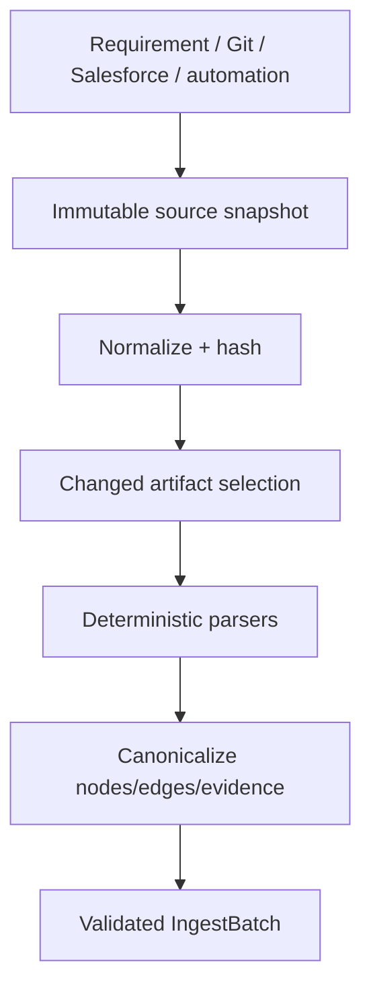

# L02 — Source Ingestion and Change Detection

## Layer charter

| Field | Value |
|---|---|
| Version/date | 1.0 / 24 August 2026 |
| Source baseline | `salesforce-change-assurance-production-solution-design.md` v1.1 |
| Mission | Convert requirements, Git changes, Salesforce metadata/code and automation repositories into canonical, evidence-bearing ingest data |
| Owner | Salesforce/indexing engineer |
| Inputs | Requirement text, local Git refs, fixture/live snapshots, repository content |
| Outputs | `RequirementSpec`, `ChangeSet`, `SourceSnapshot`, `IngestBatch` |

## Part A — Solution design

### Components

- Requirement intake normalizer boundary.
- Local Git diff and artifact reader.
- Salesforce XML metadata parsers.
- Bounded Apex symbol/SOQL/reference extractor.
- Automation repository inventory parsers for Selenium/Cucumber/API/Apex.
- Canonical-key and content-hash service.
- Incremental ingest coordinator.

### Processing flow



### Supported initial extraction

| Source | P0 extraction |
|---|---|
| Requirement | Actors, rules, thresholds, acceptance criteria, ambiguities |
| Git | Base/head, commits, changed paths, line hunks, change kind |
| Salesforce XML | Objects, fields, Flows, Permission Sets, Profiles, Validation Rules |
| Apex | Classes/methods, referenced classes, SOQL objects/fields, test methods |
| Selenium/TestNG/Cucumber | Test cases, Page Objects, locators, steps, tags, assertions |
| API automation | Routes, payload/schema models, assertions, auth abstraction |
| Project docs | ADRs, business rules, indexes and stable content chunks |

### Incremental rules

- Hash normalized content with SHA-256.
- Skip unchanged `(content_hash, parser_version)` artifacts.
- Mark missing entities/relationships inactive in the next successful snapshot; do not hard-delete.
- Emit deterministic evidence locator and extractor version for every structural fact.
- Semantic candidate links are separate proposals, never structural facts.

### Failure policy

- One malformed artifact is isolated and reported; policy decides whether snapshot activation is blocked.
- Unsupported syntax returns `UNSUPPORTED`, not an empty successful parse.
- A diff against missing refs fails fast.
- Source credentials and unrestricted Salesforce record data are never ingested.

## Part B — Development notes

### Repository

```text
packages/indexing/
├── service.py
├── snapshots.py
├── canonical_keys.py
├── parsers/
│   ├── salesforce_xml.py
│   ├── apex_symbols.py
│   ├── requirements.py
│   └── automation/
└── normalizers/
packages/connectors/local_git/
sample-salesforce/
tests/fixtures/automation/
```

### Implementation order

1. Canonical-key and evidence-locator rules.
2. Local Git and snapshot hashing.
3. Salesforce object/field/Flow/permission parsers.
4. Bounded Apex extraction.
5. Selenium/API/Apex automation inventory.
6. Incremental batch/dedupe logic.
7. Requirement semantic proposal behind `SemanticReasonerPort`.

### Development rules

- Parsers are pure/deterministic where practical.
- Preserve raw artifact hashes and exact source locators.
- Never invoke graph storage directly; return `IngestBatch` through the port.
- Do not install or execute repository dependencies during inventory.
- Parser feature support is explicit and versioned.

## Part C — Testing and definition of done

### Tests

- Golden files for every supported metadata/automation type.
- Malformed XML, encoding, namespaces and large-file boundaries.
- Git add/modify/delete/rename and binary-file behaviour.
- Apex comments/strings/queries and false-reference negatives.
- Locator/assertion/step extraction across representative frameworks.
- Same input/parser version produces identical batch/hash.
- One changed file triggers only affected re-ingest.
- Removed relationships become inactive after successful activation.

### Definition of done

- Strategic-discount fixture emits canonical Field/Flow/Apex/Permission/Test entities.
- Automation fixtures emit Selenium/API/Apex assets, locators, assertions and test-data relationships.
- Every structural node/edge has evidence, source hash and extractor version.
- Incremental ingest skips unchanged artifacts and handles deletion.
- Unsupported content is visible and cannot masquerade as successful coverage.
- Fixture and live snapshot sources produce the same canonical model for equivalent metadata.
- Contract tests with L01 and ingest tests with L03 pass.

### Integration handoff

- Parser support matrix and parser-set version.
- Golden `IngestBatch` fixtures and expected counts.
- Known unsupported constructs and snapshot activation policy.
