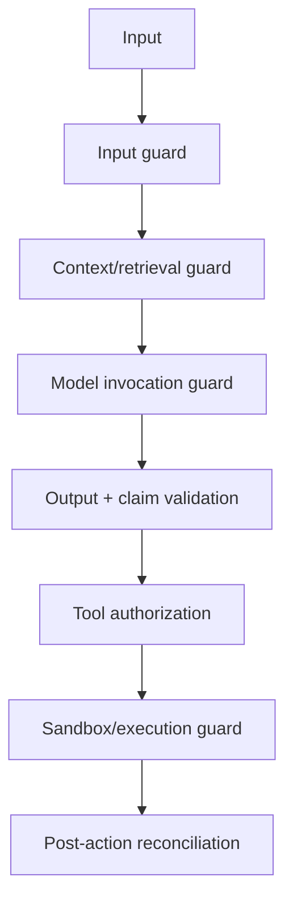

# A04 — Guardrails and Policy Enforcement

## 1. Objective

Convert safety, correctness and governance statements into executable controls. A prompt sentence is guidance; a guardrail is independently enforced and produces a traceable decision.

## 2. Guardrail decision contract

```python
class GuardrailDecision(BaseModel):
    decision_id: str
    control_id: str
    control_version: str
    stage: str
    outcome: Literal[
        "ALLOW", "DENY", "REQUIRE_APPROVAL", "ABSTAIN", "REVIEW_REQUIRED"
    ]
    reason_code: str
    evidence_ids: list[str]
    actor_id: str | None
    action_scope_hash: str | None
    expires_at: datetime | None
```

The model may supply a risk signal, but application/policy code produces the decision.

## 3. Defense-in-depth control points



No single control is assumed perfect. Controls fail closed for critical truth/action paths and degrade safely for optional semantic assistance.

## 4. Input guardrails

- Authenticate and authorize project, environment and classification scope.
- Validate schema, size, type, encoding and content references.
- Separate developer/system instructions from requirement/source/document data.
- Detect or flag direct injection/jailbreak patterns without relying on detection alone.
- Reject embedded credentials, production records and prohibited client data.
- Normalize source URIs and prevent path/URL escape.
- Treat source comments, documents, OCR, logs, DOM and tool results as untrusted data.
- Rate-limit abusive or unbounded requests.

## 5. Retrieval and context guardrails

- Enforce project/tenant/source authorization before retrieval.
- Pin source and graph snapshot versions.
- Apply source-type allowlists and evidence confidence rules.
- Filter inactive/rejected/stale/poisoned graph edges.
- Cap depth, result count, bytes/tokens and inferred-edge ratio.
- Label every context item with origin, hash, classification and trust class.
- Encode untrusted strings as data structures/tool results, never concatenate into instructions.
- Reject context without resolvable provenance for material tasks.
- Preserve explicit exclusions and “not found” state.

## 6. Model invocation guardrails

- Only approved model/provider/task combinations.
- Versioned prompt, schema, context compiler and model configuration.
- Per-task token, time, cost and attempt budgets.
- Tool allowlist narrowed to the current state/action class.
- External knowledge disabled for evidence-restricted tasks.
- Secrets/sensitive fields redacted before invocation.
- Structured output or strict tool schema wherever supported.
- Temperature/config appropriate to task, but never treated as a correctness control.
- No retries for unsupported reasoning without changing evidence/strategy; bounded retry for transient transport/schema repair only.

## 7. Output guardrails

- Parse against exact Pydantic/JSON Schema contract.
- Reject unknown evidence IDs, canonical entities, tools, actions, enums and policy codes.
- Validate every material claim using A05.
- Separate `CONFIRMED`, `CORROBORATED`, `INFERRED`, `UNKNOWN` and `CONTRADICTORY`.
- Prevent semantic output from overwriting deterministic facts.
- Require bounded size, no embedded executable instruction and safe rendering.
- Validate generated code/patch with security and executable maturity gates.
- Convert failure to typed abstention/review, not silent fallback text.

## 8. Tool and action classes

| Class | Examples | Default control |
|---|---|---|
| A0 — Pure read/compute | read active graph, exact retrieval, deterministic engine | Auto if authorized and bounded |
| A1 — Restricted read | Salesforce metadata/SOQL, sensitive evidence | Scope/field/query policy; trace |
| A2 — Isolated proposal | generate patch/test/RCA proposal | Auto in approved artifact workspace; no external write |
| A3 — Sandboxed validation | compile/discover/fixture execution | Allowlisted commands, sandbox and resource budget |
| A4 — Non-prod side effect | create sandbox data, execute sandbox tests, apply feature-branch patch | Human approval + expected state/head + scoped identity |
| A5 — High-impact change | deploy metadata, modify permissions, protected branch | Disabled in pilot; two-person approval if enabled later |
| A6 — Production mutation/destruction | production DML/destructive deployment | Out of scope |

The tool broker enforces class, scope, caller, environment, approval, idempotency and expected-state conditions before execution.

## 9. Feature-specific guardrail matrix

| Capability | Hard control | Safe failure |
|---|---|---|
| Requirement normalization | schema, source quote/evidence, ambiguity thresholds | `REVIEW_REQUIRED` |
| Metadata/graph | canonical-key existence, snapshot freshness, allowed edges | `INCOMPLETE` |
| Impact | output entities subset of graph/evidence pack; propagation rules | `UNKNOWN_IMPACT` |
| Security | permission/control evidence and severity rules; no LLM clearing | unresolved/review |
| Risk | pure formula, versioned factors/overrides | `INCOMPLETE` |
| Coverage/test selection | mandatory obligations pinned before optimization | `NO_GO`/missing test spec |
| Automation repair | base hash, allowed paths, dependency/secret/unsafe pattern checks | rejected patch |
| Locator healing | unique target, negative states, variants and regression | abstain/manual repair |
| Test generation | schema, compile, discovery, assertion/mutation sensitivity | remain below `VERIFIED` |
| Execution | authorized immutable plan, environment/identity, external ID | `INCONCLUSIVE` + reconcile |
| RCA | hypotheses only, evidence and contradicting evidence required | `INSUFFICIENT_EVIDENCE` |
| Release | deterministic truth table; expiry and completeness | `NO_GO`/`CONDITIONAL_GO` |
| Explanation | claims subset of decision/evidence facts | safe factual summary/review |

## 10. Approval receipt

```yaml
approval_id: ""
requester_id: ""
approver_id: ""
action_class: A4
tool_name: apply_patch_to_feature_branch
resource_scope:
  project_id: ""
  repository: ""
  branch: ""
  expected_head: ""
argument_hash: ""
policy_version: ""
decision: APPROVED
issued_at: ""
expires_at: ""
used_at: null
```

Receipts are one-time, immutable, scope-bound and revalidated immediately before the action. Requester self-approval is rejected where separation-of-duties policy applies.

## 11. Policy enforcement architecture

- Central `PolicyDecisionPort` with policy-as-code/data under version control.
- Enforcement at API/application boundary and again in the tool/execution adapter.
- UI/MCP hiding is usability only; server-side denial is authoritative.
- Connector credentials cannot confer broader rights than policy permits.
- Downstream systems enforce their own least-privilege authorization (complete mediation).
- Policy changes require owner, ADR/change record, tests, eval impact, staged rollout and audit.

## 12. Guardrail telemetry

Record control/version, input hash, outcome/reason, actor/project, action class, evidence/approval IDs, latency and whether the decision prevented an action. Metrics:

- allow/deny/review/approval/abstain by control;
- false positive/negative from reviewed cases;
- injection attempts by source type;
- invalid schema/evidence/entity/tool attempts;
- approval age/expiry/replay/self-approval denial;
- sandbox and policy escape attempts;
- budget/cycle terminations.

## 13. Retrofit tasks

1. Inventory prompt-only safety statements and map each to an enforcement point.
2. Create the guardrail and policy-decision contracts.
3. Classify every current tool/action A0-A6.
4. Add output/entity/evidence validators before semantic output persists.
5. Add the tool broker/policy hook before adapters.
6. Implement scoped approval receipts for A4+.
7. Add sandbox and expected-head/state checks.
8. Instrument and adversarially test every control.

## 14. Tests

- Direct and indirect prompt injection in every untrusted source type.
- Schema bypass, unknown enum/entity/evidence/tool and oversized output.
- Cross-project evidence access and Salesforce field/query overreach.
- Forbidden tool/functionality and privilege escalation.
- Approval missing, expired, replayed, altered arguments, changed head and self-approval.
- Sandbox path/network/resource/command escape.
- Product-defect test “healing” attempt.
- Conflicting/low-evidence result and safe abstention.
- Guardrail unavailable: critical actions fail closed; optional semantics degrade.

## 15. Definition of done

- Every semantic task and tool has explicit controls, owner, version and safe failure.
- No material authorization or release decision exists only in a prompt.
- Every A4+ action requires valid scoped policy/approval and expected-state checks.
- The strategic-discount adversarial corpus cannot create nonexistent impact, unsafe patch, wrong-target heal or unauthorized execution.
- Guardrail decisions are traceable, evaluated and reviewed for false positives/negatives.

## 16. Primary references

- [Anthropic prompt-injection guardrails](https://platform.claude.com/docs/en/test-and-evaluate/strengthen-guardrails/mitigate-jailbreaks)
- [Anthropic strict tool use](https://platform.claude.com/docs/en/agents-and-tools/tool-use/strict-tool-use)
- [OpenAI structured outputs](https://developers.openai.com/api/docs/guides/structured-outputs)
- [OWASP Excessive Agency](https://genai.owasp.org/llmrisk/llm062025-excessive-agency/)
- [OWASP LLM Prompt Injection Prevention Cheat Sheet](https://cheatsheetseries.owasp.org/cheatsheets/LLM_Prompt_Injection_Prevention_Cheat_Sheet.html)
