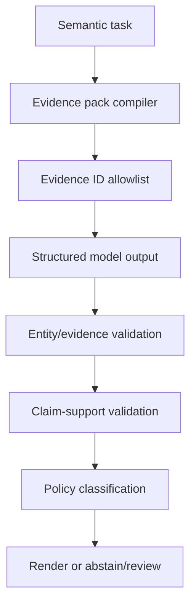

# A05 — Hallucination Prevention, Grounding and Claim Verification

## 1. Objective

Prevent unsupported model output from becoming product truth. The correct engineering target is not “zero hallucinations”—which cannot be guaranteed—but zero unsupported material claims reaching deterministic decisions or approved actions, plus measured residual risk in explanatory and hypothesis outputs.

## 2. Platform-specific hallucination taxonomy

| Type | Example | Primary control |
|---|---|---|
| Entity fabrication | Claims an Apex class/field/test not in snapshot | canonical entity validator |
| Evidence-ID fabrication | Cites nonexistent evidence | evidence allowlist/resolver |
| Citation laundering | Evidence exists but does not support the claim | entailment/relationship validator |
| Graph overreach | Treats inferred/low-confidence edge as confirmed | confidence policy + deterministic traversal |
| Stale-truth error | Uses prior source/graph version | snapshot freshness and binding |
| Causal fabrication | RCA asserts root cause from correlation | hypothesis status + evidence/contradiction |
| Numeric/policy fabrication | Model calculates risk or release code | deterministic engine only |
| Execution-state fabrication | Says tests ran live when simulated/failed | immutable execution fact validator |
| Code capability fabrication | Generated test said to work without compile/discovery | maturity state machine |
| Authority fabrication | Model assumes approval/permission | policy/approval resolver |
| Omission/false negative | Misses critical impacted component/test | golden recall and mandatory rules |
| Confidence miscalibration | Strong certainty with weak evidence | calibrated confidence class + review |

## 3. Claim-first response contract

Material semantic outputs must produce a machine-verifiable claim ledger before human-readable prose.

```python
class MaterialClaim(BaseModel):
    claim_id: str
    claim_type: Literal[
        "ENTITY", "RELATION", "IMPACT", "SECURITY", "AUTOMATION",
        "EXECUTION", "RCA_HYPOTHESIS", "EXPLANATION"
    ]
    subject_key: str
    predicate: str
    object_value: str | int | float | bool | None
    evidence_ids: list[str]
    certainty: Literal[
        "CONFIRMED", "CORROBORATED", "INFERRED_HIGH",
        "INFERRED_LOW", "UNKNOWN", "CONTRADICTORY"
    ]
    source_scope: Literal["PROVIDED_EVIDENCE_ONLY"]
    validator_status: Literal["PENDING", "SUPPORTED", "UNSUPPORTED", "CONTRADICTED"]
```

The presentation layer renders only claims that pass the policy for their use. Unsupported claims are retracted or converted to explicit review/uncertainty.

## 4. Trust hierarchy

1. Immutable API/source/execution fact with hash and locator.
2. Confirmed deterministic graph edge.
3. Corroborated independent evidence.
4. High-confidence semantic proposal approved/corroborated as policy permits.
5. Low-confidence inference for review only.
6. General model knowledge—excluded from source-restricted product claims.

Higher layers cannot be contradicted or cleared by lower layers. A model explanation never overrides an execution result, security rule, mandatory test or release gate.

## 5. Grounding pipeline



### Evidence pack requirements

- task purpose and exact output schema;
- source/graph snapshot IDs and age;
- strongest allowed evidence paths and exact source excerpts;
- canonical entities and allowed relationships;
- explicit exclusions and must-not-claim items;
- prior execution/validation facts if relevant;
- contradiction and uncertainty list;
- permitted evidence IDs only.

## 6. Validation layers

### Layer 1 — Syntactic validity

JSON/Pydantic schema, types, enums, size and required fields.

### Layer 2 — Referential validity

Every entity/evidence/tool/policy/version resolves inside the authorized pinned snapshot/pack.

### Layer 3 — Relationship validity

The predicate is allowed for subject/object types and is present in deterministic evidence or explicitly labelled inference.

### Layer 4 — Entailment/support

Check whether cited evidence actually supports, contradicts or is irrelevant to the claim. Use exact structured checks wherever possible; a calibrated judge may flag ambiguous prose support for human review.

### Layer 5 — Completeness/negative checks

Ensure required claims/obligations are not omitted and must-not-claim items are absent.

### Layer 6 — Use policy

Decide whether the validated claim may be displayed as definitive, shown as possible, sent for review or excluded from downstream gates.

## 7. Feature policies

### Impact and security

- Output target must exist in graph snapshot.
- Confirmed impact requires a permitted deterministic propagation path.
- Security finding must cite the relevant permission/profile/Flow/Apex/control configuration.
- Critical inferred-only findings become review/blockers but not confirmed truth.
- No evidence means `UNKNOWN`, never “no impact.”

### Automation repair/generation

- LLM output is a proposal, not proof.
- All referenced symbols/files/locators exist at the recorded base.
- Patch must apply, compile, be discovered and execute as configured.
- Assertions trace to obligations and demonstrate failure against known-bad behavior when practical.
- Locator heal proves unique intended target and negative-state safety.

### RCA

- Use `hypothesis`, not `root_cause`, until confirmed.
- Each hypothesis has supporting and contradicting evidence, confidence and next diagnostic action.
- Deterministic classifier features and failure signature are retained.
- If top hypotheses are indistinguishable, return `INSUFFICIENT_EVIDENCE`.
- RCA cannot alter raw test status or authorize a repair.

### Release explanation

- Generate only after deterministic release code/reasons exist.
- Explanation claims are a subset/paraphrase of persisted decision facts.
- Unknown evidence IDs or altered release code fail validation.

## 8. Abstention design

Abstention is a successful safe outcome when evidence is insufficient.

```text
INSUFFICIENT_EVIDENCE
CONTRADICTORY_EVIDENCE
STALE_EVIDENCE
UNSUPPORTED_ENTITY_OR_SYNTAX
MODEL_OUTPUT_INVALID
REVIEW_REQUIRED
SEMANTIC_SERVICE_UNAVAILABLE
```

The response states what is known, what is missing, why the missing evidence matters and the smallest next action. It must not fill the gap with general model knowledge.

## 9. Metrics

```text
unsupported_claim_rate
evidence_completeness
evidence_resolvability
citation_entailment_accuracy
entity_validity_rate
must_not_claim_violation_rate
critical_false_negative_rate
abstention_precision and recall
confidence calibration by evidence class
RCA top-1/top-3 with evidence validity
```

Primary targets: 100% valid evidence for material claims, 0 unsupported release-blocking claims, 0 critical must-not-claim violations and 0 model-selected release codes.

## 10. Detection versus prevention

- Prevention: deterministic truth ownership, bounded evidence pack, exact retrieval, allowlists, structured output, tools and policy.
- Detection: claim/evidence/entailment validators, must-not-claim evaluator, online quality rules and human review.
- Containment: inferred/review states, no downstream gating, disabled actions and safe degradation.
- Learning: reviewed failure becomes an eval case; it does not automatically become graph/training truth.

Best-of-N, self-critique or a second model may help surface inconsistency, but they are not independent proof and are reserved for non-critical semantic quality after deterministic validation.

## 11. Retrofit tasks

1. Identify every semantic output that currently returns free-form prose.
2. Add claim/evidence fields to semantic contracts.
3. Implement canonical entity/evidence resolvers.
4. Add claim relationship/support validators.
5. Add abstention/review statuses to workflow and UI.
6. Prevent unsupported claims from persistence/downstream consumption.
7. Add must-not-claim and false-negative eval cases.
8. Monitor reviewed unsupported claims and confidence calibration.

## 12. Tests

- Valid ID but irrelevant evidence.
- Valid evidence supporting only part of a multi-part claim.
- Nonexistent entity/evidence/version.
- Inactive/rejected/inferred graph edge presented as confirmed.
- Stale source/graph context.
- Contradictory evidence.
- Missing critical impact/test obligation.
- RCA correlation framed as certainty.
- Simulation framed as live execution.
- Explanation changes deterministic release code.
- Correct abstention and smallest-next-action response.

## 13. Definition of done

- Every material semantic output has a validated claim ledger.
- Every cited evidence item resolves and supports the stated relationship/use.
- Unsupported/contradicted claims cannot drive impact, security, test, patch, execution or release truth.
- UI distinguishes confirmed, inferred, unknown and contradictory output.
- Golden and adversarial cases measure unsupported claims, omissions and abstention quality.
- Critical information is independently validated even when a model reports high confidence.

## 14. Primary references

- [Anthropic: Reduce hallucinations](https://platform.claude.com/docs/en/test-and-evaluate/strengthen-guardrails/reduce-hallucinations)
- [OpenAI: Developing hallucination guardrails](https://developers.openai.com/cookbook/examples/developing_hallucination_guardrails)
- [LangSmith: Evaluate a RAG application](https://docs.langchain.com/langsmith/evaluate-rag-tutorial)
- [NIST AI RMF Generative AI Profile](https://nvlpubs.nist.gov/nistpubs/ai/NIST.AI.600-1.pdf)
