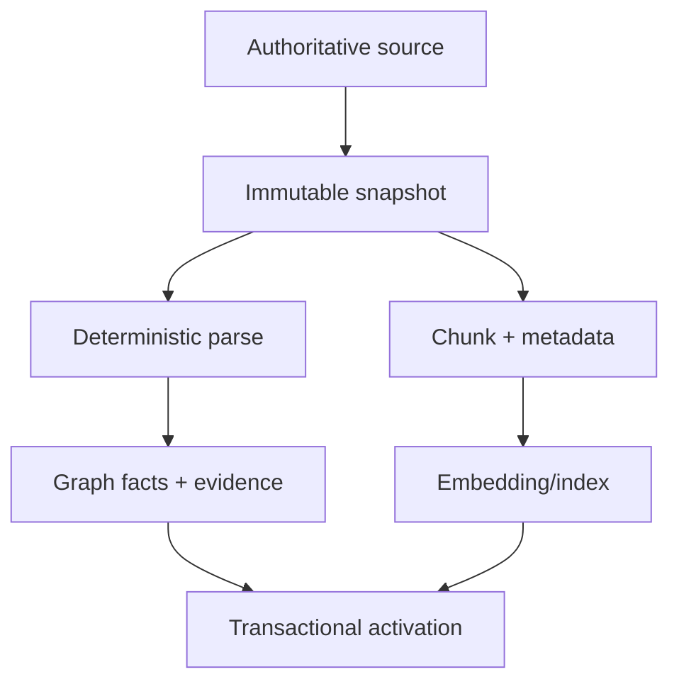

# A06 — RAG, Evidence Graph and Memory Quality

## 1. Objective

Provide relevant, fresh, authorized and provenance-bearing context without turning semantic retrieval or agent memory into system truth. The Change Evidence Graph is authoritative for verified relationships; vector retrieval is an optional recall mechanism for ambiguous text.

## 2. Knowledge classes

| Class | Examples | Truth status | Update mechanism |
|---|---|---|---|
| Authoritative source | Git blob, Salesforce metadata/API snapshot, test result, policy | Primary evidence | connector/ingest with hash/version |
| Verified graph fact | canonical node/confirmed edge/evidence path | Product truth within snapshot | deterministic parser/API/human verification |
| Semantic retrieval item | document/code chunk/vector match | Candidate context | indexed from authoritative source |
| Run state | workflow/checkpoint/current approvals | Operational truth | durable transaction/state machine |
| Outcome memory | accepted RCA, incident, release outcome, human correction | Reviewed evidence | governed feedback process |
| Conversational/free-form memory | model summary/history | Convenience only | never promoted without verification |

## 3. Retrieval precedence

1. Exact canonical key/symbol/source locator.
2. Deterministic graph traversal with allowed relationships.
3. Structured filters/keyword search.
4. Hybrid semantic retrieval/reranking.
5. Manual review when recall/confidence is insufficient.

Embeddings do not replace the graph, source parser or permission model.

## 4. Ingestion pipeline



Every node/edge/chunk stores project, source URI, source type, content hash, locator, snapshot, parser/chunker/embedding versions, classification, validity interval and access-control metadata.

## 5. Chunking and indexing

- Chunk by semantic/source boundaries: Apex class/method, Flow element, metadata member, test case/assertion, ADR section and business rule.
- Preserve parent document and exact line/XML/component locator.
- Store a deterministic normalized chunk hash.
- Add concise contextual header (project/component/type) without altering original text.
- Keep source text and generated summary separate.
- Re-embed only when content, contextualization or embedding version changes.
- Mark removed/superseded chunks inactive; do not serve them to current queries.
- Separate synthetic fixture and live/non-production sources.
- Never embed secrets or unrestricted Salesforce records.

## 6. Query pipeline

```text
authorize project/source/classification
→ pin active snapshot
→ normalize query without losing canonical identifiers
→ exact/graph retrieval
→ optional hybrid semantic retrieval
→ metadata and freshness filters
→ rerank/deduplicate/diversify
→ evidence/context budget selection
→ injection/taint screening and labelling
→ context pack with explicit exclusions/unknowns
```

The context compiler prioritizes critical confirmed evidence, then corroboration, then relevant inferred/retrieved material. Truncation never silently removes a critical blocker; it records omitted counts/reasons.

## 7. Context pack contract

```yaml
context_pack_id: ""
task: impact_explanation
project_id: ""
source_snapshot_ids: []
graph_snapshot_id: ""
retrieval_policy_version: ""
items:
  - context_item_id: ""
    source_uri: ""
    content_hash: ""
    locator: ""
    trust_class: CONFIRMED
    evidence_ids: []
    classification: INTERNAL
    text_artifact_id: ""
exclusions: []
contradictions: []
missing_required_context: []
token_count: 0
```

## 8. Memory architecture

### Short-term

Typed `AssuranceState` and checkpoints. Store IDs and compact facts, not uncontrolled conversation text.

### Project memory

Rebuildable indexes, ontology, framework profiles, ADRs and approved business rules. AI-generated summaries include source hashes and expire/rebuild when inputs change.

### Outcome memory

Human-confirmed RCA, accepted/rejected patches, false heals, incidents, overrides and release outcomes. Retain rejected examples for evaluation.

### Retention

Use the intended 90-day useful-memory target as a configurable default for non-regulated operational/semantic memory, subject to enterprise data policy. Authoritative release/audit evidence follows its own retention class. Expiration must delete/inactivate all derived vector/chunk representations consistently.

## 9. Retrieval security and poisoning controls

- Authorize before retrieval and again before artifact expansion.
- Treat retrieved text as untrusted data, never instructions.
- Record ingestion identity/source and require trusted source allowlists.
- Detect changed tool/docs/index artifacts and require re-review where material.
- Isolate tenant/project indexes and encryption keys as required.
- Prevent cross-source prompt instructions from altering policy/tool behavior.
- Reject poisoned/malformed metadata and maintain prior valid snapshot on ingest failure.
- Keep `REJECTED` semantic links inactive and available only to eval/review.
- Validate vector index/source referential integrity in backup/restore.

## 10. Evaluation metrics

- reference evidence/node/edge recall and precision;
- retrieval relevance and grounded answer faithfulness;
- freshness/stale-context rate;
- exact/canonical resolution success;
- empty/over-broad retrieval rate;
- context coverage of critical evidence;
- inferred/rejected/unauthorized contamination rate;
- latency, token count, cache hit and cost;
- downstream unsupported-claim and false-negative rate by retrieval strategy.

## 11. Golden retrieval cases

- Exact lookup of `Opportunity.Discount__c` and strategic approval Flow.
- Business phrase resolves to correct canonical rule/components.
- 10% and INR 5 crore boundaries retrieve correct rule/test evidence.
- Unrelated Account rule remains excluded.
- Permission-negative context is retained under tight token budget.
- Stale 15% document/chunk is inactive after snapshot activation.
- Rejected semantic link cannot influence definitive impact.
- Cross-project and restricted Salesforce evidence is denied.
- Injection text inside source/test/doc remains data.
- Embedding unavailable still yields exact/graph usable result.

## 12. Retrofit tasks

1. Inventory all sources of context and memory currently fed to agents.
2. Remove manually maintained project graph/index as canonical truth; make it rebuildable.
3. Add source/snapshot/hash/locator/trust/access metadata.
4. Implement exact/graph path before optional vector retrieval.
5. Add context-pack contract and deterministic budget compiler.
6. Add active/inactive/rejected/freshness filters.
7. Separate run, project, outcome and conversational memory stores.
8. Build retrieval evals before tuning chunk size, embeddings or reranker.

## 13. Tests

- Incremental ingest, deletion, rollback and snapshot time travel.
- Chunk/hash determinism and version invalidation.
- Exact/graph/keyword/vector fallback behavior.
- Authorization and cross-project isolation.
- Poisoned source, malicious instruction and malformed content.
- Token-budget preservation of critical evidence.
- Backup/restore graph-vector-artifact referential integrity.
- 90-day expiration and derived-data removal.
- Embedding/vector outage degradation.

## 14. Definition of done

- All context items are authorized, snapshot-bound and provenance-bearing.
- Exact/graph retrieval independently supports the core demo.
- Semantic/vector retrieval is optional, evaluated and cannot create confirmed truth.
- Context compiler exposes exclusions, contradictions and missing critical context.
- Project index/knowledge graph can be fully rebuilt from authoritative sources.
- Memory types, retention and promotion rules are explicit and tested.
- Retrieval quality metrics are tied to downstream impact/claim outcomes.

## 15. Primary references

- [OpenAI Retrieval guide](https://developers.openai.com/api/docs/guides/retrieval)
- [LangSmith RAG evaluation](https://docs.langchain.com/langsmith/evaluate-rag-tutorial)
- [Anthropic contextual retrieval cookbook](https://platform.claude.com/cookbook/capabilities-contextual-embeddings-guide)
- [Anthropic embeddings guidance](https://platform.claude.com/docs/en/build-with-claude/embeddings)
- [OWASP Agentic Top 10](https://genai.owasp.org/resource/owasp-top-10-for-agentic-applications-for-2026/)
