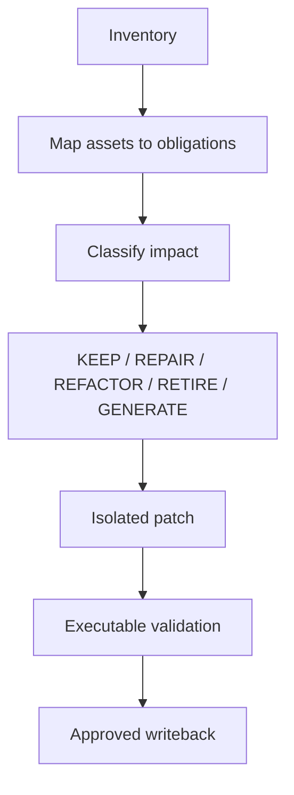

# L06 — Test Automation Engineering

## Layer charter

| Field | Value |
|---|---|
| Version/date | 1.0 / 24 August 2026 |
| Source baseline | `salesforce-change-assurance-production-solution-design.md` v1.1 |
| Mission | Map existing automation to affected obligations, repair impacted assets, generate missing complete scripts and prove executable maturity |
| Owner | Test automation engineer |
| Inputs | `TestPlan`, impact/security reports, graph context, automation repositories and framework profiles |
| Outputs | Inventory, `AutomationImpactReport`, `AutomationPatch`, `AutomationValidationReport` |

## Part A — Solution design

### Lifecycle



### Automation Intermediate Representation

`AutomationIR` expresses scenario, preconditions, data, actions, locators/API calls, assertions, cleanup, tags and obligations independently of syntax. Framework adapters parse/render the IR.

### Initial framework adapters

- Selenium Java + TestNG/Page Object.
- Salesforce Apex tests.
- API Java/RestAssured or approved API framework.
- Optional Cucumber/Playwright/Python adapters after P0.

### Impact classifications

Locator drift, workflow change, assertion/oracle change, API contract, test data, permission, timing/synchronization, framework migration and removed behaviour.

### Repair precedence

1. Deterministic AST/XML transformation.
2. Approved migration recipe.
3. Repository template/generator.
4. Similar validated asset retrieval.
5. Bounded LLM patch proposal.
6. Manual task/abstention.

### Locator healing

Rank stable metadata/component identity, accessibility role/name, controlled test IDs, label/container relationships, historical reliability and bounded visual/OCR evidence. Accept only a unique intended target that passes negative-state and stability checks. Fixed sleeps, fragile positional XPath and blind JavaScript click are not successful heals by default.

### Complete generation

Generate the complete framework artifact set: test/feature, Page Object/client/helpers, data fixture, tags/registration, setup/teardown and meaningful assertions linked to acceptance criteria.

### Maturity gates

```text
DRAFT → STATICALLY_VALID → COMPILED → DISCOVERABLE → EXECUTABLE → VERIFIED → ACCEPTED
```

Writeback modes: `SUGGEST_ONLY`, `GENERATE_PATCH`, `VALIDATE_PATCH`, `APPLY_TO_BRANCH`. Protected branches and deployment remain outside automatic writeback.

## Part B — Development notes

### Repository

```text
packages/automation_inventory/
packages/automation_ir/
packages/automation_maintenance/
packages/test_generation/
packages/locator_healing/
packages/automation_validation/
packages/framework_adapters/
├── selenium_java/
├── apex/
└── api/
```

### Implementation order

1. Inventory + canonical asset model.
2. IR plus parse/render round trip.
3. Framework profiles from fixture repositories.
4. Impact classifier and deterministic repair recipes.
5. Isolated Git patch service.
6. Validation gates.
7. LLM fallback proposals.
8. Approved branch writeback and re-index event.

### Engineering rules

- Never modify the active worktree during generation.
- Pin base commit/content hashes; reject stale-head application.
- No automatic package installation or embedded secrets.
- Generated code executes only in an isolated, resource-bounded sandbox.
- A passing test without meaningful assertion/mutation sensitivity is not verified.
- Framework-specific code stays inside adapters.

### Hackathon deliverables

- Repair one existing Selenium locator/assertion asset.
- Generate one targeted Selenium UI test, one Apex boundary test and one API business-process test.
- Show exact patch, evidence, maturity and validation results.

## Part C — Testing and definition of done

### Tests

- Golden automation inventories and obligation mappings.
- IR parse/render round-trip without assertion/obligation loss.
- Deterministic repair recipes and golden diffs.
- Locator uniqueness, negative state, viewport/data variants and false-heal corpus.
- Secret/forbidden API/dependency detection.
- Compile/type/framework discovery.
- Known-good/known-bad and assertion-free mutation cases.
- Stale-head, patch conflict, approval and protected-path tests.
- Repeat-run flakiness policy.

### Definition of done

- Existing Selenium/API/Apex assets map to graph obligations with evidence.
- Impacted asset receives correct disposition and repair plan.
- Selenium repair is unique, stable, evidence-backed and passes its regression.
- Targeted Selenium, Apex and API artifacts are complete, compile, are discovered and execute against fixture/sandbox policy.
- Assertion-free or wrong-target tests are rejected.
- Patches are isolated, reproducible and cannot overwrite concurrent changes.
- Only approved `ACCEPTED` assets emit writeback/re-index events.
- Metrics include repair precision, compile/discovery/execution/acceptance and false-heal rates.

### Integration handoff

- Provide framework profiles, IR/schema version and patch base hashes.
- Provide validation reports/artifact IDs to L07/L08.
- Document unsupported framework constructs and manual prerequisites.
