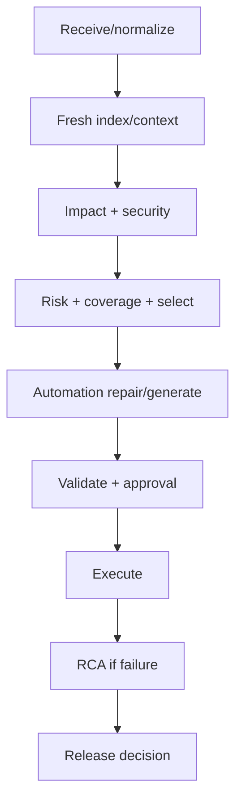

# L09 — Agent, LLM and Workflow Orchestration

## Layer charter

| Field | Value |
|---|---|
| Version/date | 1.0 / 24 August 2026 |
| Source baseline | `salesforce-change-assurance-production-solution-design.md` v1.1 |
| Mission | Coordinate the durable assurance workflow and use bounded semantic reasoning without moving deterministic decisions into prompts |
| Owner | Agent/platform engineer |
| Inputs | `AssuranceRequest`, application commands and layer outputs |
| Outputs | Checkpointed `AssuranceState`, approvals/tasks, terminal run result |

## Part A — Solution design

### Workflow



### Semantic tasks

- Requirement normalization.
- Ambiguous business-to-metadata candidate mapping.
- Non-mechanical automation repair/new-script proposal.
- RCA hypothesis synthesis.
- Grounded human-readable explanations.

Git diff, parsing, graph traversal, risk, coverage, test selection, executable validation and release gates remain deterministic.

### Prompt contract

Every prompt has exact input/output schema, allowed evidence IDs/tools, no-evidence behaviour, confidence rubric, limits, examples, prompt version and failure behaviour. Invalid/unsupported output is rejected.

### Context compiler

Select project/layer policy, task schema, changed components, strongest evidence paths, exact source fragments, relevant tests/outcomes, affected automation IR/framework profile and explicit uncertainty. Target 6k–10k project-supplied tokens.

### Durability and approvals

- Persist checkpoint after each material step.
- Resume safely without repeating completed idempotent work.
- Pause before writeback, sandbox data creation, privileged execution or deployment.
- Bounded repair/validation loops; manual fallback after limit.

## Part B — Development notes

### Repository

```text
packages/application/
packages/orchestration/
packages/agents/
prompts/runtime/
skills/runtime/
```

### Implementation order

1. Direct synchronous application-service happy path without LLM.
2. Typed state and step functions.
3. Durable checkpoint/resume.
4. Approval interrupt and cancellation.
5. Requirement normalizer.
6. Context compiler/semantic reasoners.
7. Repair loop, error routing and observability.

### Engineering rules

- Nodes call public layer services through ports.
- No giant prose in shared state.
- Store evidence/artifact IDs, not raw large payloads.
- Model/tool versions and input hashes accompany semantic outputs.
- Treat retrieved content as data, not instructions.
- Token/time/cost budgets per semantic task.

## Part C — Testing and definition of done

### Tests

- Every state transition and invalid transition.
- Checkpoint resume after process kill at each step.
- Duplicate request and idempotent step behaviour.
- Approval approve/reject/expire/cancel.
- LLM unavailable, timeout, invalid schema and hallucinated evidence ID.
- Bounded repair loop termination.
- Deterministic-only degraded flow.
- Concurrent run isolation.

### Definition of done

- Complete fixture flow reaches terminal release recommendation.
- Restart resumes without duplicated external side effect.
- No node imports concrete connector or reimplements domain decision.
- LLM outage leaves a usable deterministic/manual path.
- Semantic outputs validate and cite only supplied evidence.
- Sensitive actions pause with exact scoped approval.
- Run events, errors and state are queryable/audited.

### Integration handoff

- Publish workflow/state version and step catalogue.
- Provide state-machine and failure-injection fixtures.
- Document retry/timeout/approval configuration.
