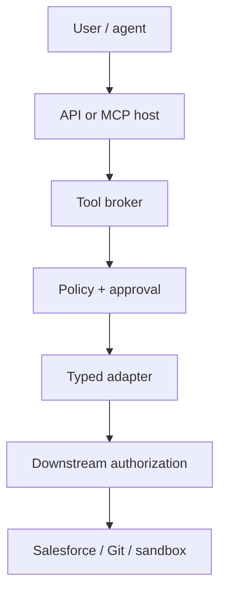

# A09 — Tool, MCP and Agent Security

## 1. Objective

Prevent tool misuse, excessive agency, privilege abuse, supply-chain compromise, prompt injection, unexpected code execution and data leakage. MCP is an interoperability surface—not a trust boundary or authorization system.

## 2. Core security principles

- Expose only the minimum required high-level capability.
- Split read, compute, execute and write interfaces.
- Avoid open-ended shell, URL fetch, database query and file-system tools.
- Use least-privilege, audience-bound, short-lived credentials.
- Authorize every call in application/downstream systems (complete mediation).
- Treat tool definitions, descriptions, inputs and results as untrusted supply-chain/data inputs.
- Validate structured arguments before policy and again before adapter execution.
- Require human approval for material side effects.
- Sandbox generated code and local MCP processes.
- Pin/review connector/tool versions and detect behavioral drift.

## 3. Approved capability surface

Preferred high-level operations:

```text
analyse_change
read_change_evidence
read_impact_security_test_plan
analyse_automation_impact
generate_isolated_test_patch
validate_isolated_test_patch
request_authorized_test_execution
diagnose_failure
read_release_recommendation
```

Do not expose direct protected-branch write, metadata deploy, permission modification, production DML, arbitrary SOQL, arbitrary shell or arbitrary URL fetch.

## 4. Tool manifest

```yaml
tool_id: sca.validate_test_patch
version: 1.0.0
owner: automation-platform
source_digest: ""
input_schema: ValidatePatchRequest@1
output_schema: AutomationValidationReport@1
action_class: A3
data_classes: [INTERNAL]
allowed_projects: []
allowed_environments: [local, integration]
network: deny
filesystem:
  read: [isolated_worktree]
  write: [isolated_artifact_dir]
credential_profile: none
idempotent: true
timeout_ms: 180000
approval_policy: none
```

Every connected MCP server/tool is in an AI/tool bill of materials with source, version/digest, owner, permissions, data destinations, review date and kill switch.

## 5. Authorization architecture



Requirements:

- Host validates identity and resource audience.
- Broker binds user/project/environment/action class and argument hash.
- Policy decides; valid approval is consumed where required.
- Adapter acquires its own minimal downstream credential; incoming tokens are not blindly forwarded.
- Downstream enforces scope and returns external correlation ID.
- Post-action reconciliation records exact outcome.

## 6. MCP-specific controls

- Follow OAuth 2.1 protected-resource authorization for remote servers.
- Validate issuer, audience, scopes, resource binding, redirects and authorization URLs.
- Production authorization endpoints use HTTPS; reject dangerous URL schemes.
- Trust/pin approved servers; require review before adding or updating one.
- For local `stdio`, show/approve exact command and arguments; restrict filesystem/network/process privileges.
- Prefer enterprise-managed authorization/approved identity where available.
- Treat tool annotations as hints, never enforcement.
- Load only task-relevant tool definitions; progressive discovery reduces context/attack surface but does not create trust.
- Sanitize/validate prompt/resource/tool outputs; label untrusted content and screen high-risk results.
- Bound result size and return artifact/resource references rather than dumping sensitive content.

## 7. Prompt injection and tool-result taint

Track a taint/trust label for context obtained from source files, docs, web, OCR, Salesforce records and tools. Once untrusted content is read:

- it cannot request new tools/permissions;
- it cannot modify system/task instructions;
- high-risk action requires fresh policy/approval based on the original user intent;
- tool output is schema-validated and optionally screened before entering the model;
- suspicious instructions are logged/evaluated, not followed;
- model-generated arguments remain untrusted until broker validation.

## 8. Generated code and execution

- Isolated worktree pinned to base hash.
- Allowlisted build/test commands; no arbitrary shell composition.
- CPU/memory/time/file/process limits.
- Deny network by default; allow explicit endpoints only when required.
- No production/Salesforce write credentials in sandbox.
- Restrict paths/file count/patch size and prohibit protected configuration/secrets.
- Scan secrets, dependencies, licenses, unsafe APIs and destructive behavior.
- Validate compile, discovery, execution and assertions before acceptance.
- Destroy/reset sandbox after run; preserve only approved artifacts and immutable evidence.

## 9. Salesforce separation

Use separate identities and interfaces for:

- metadata/read-only org discovery;
- restricted SOQL/data inspection;
- non-production test execution/data setup;
- branch/source writeback;
- deployment/permission changes (disabled in pilot).

The agent never receives raw Salesforce credentials. Query/object/field/environment scopes are enforced in the connector and Salesforce authorization.

## 10. Supply-chain controls

- Source and checksum/signature for plugins, skills, MCP servers, SDKs and model/tool definitions.
- Dependency lock/SBOM and vulnerability/license scan.
- Owner and update/change notification.
- Tool definition diff and reapproval on functionality/permission change.
- Test against malicious/compromised connector behavior.
- Disable/remove unused connectors and legacy tools.
- Kill switch/circuit breaker per connector/tool.

## 11. Threat/evaluation matrix

| Threat | Required test/control |
|---|---|
| Goal hijack/prompt injection | tainted content, policy-bound intent, forbidden-tool eval |
| Tool misuse/excessive agency | minimal surface, typed broker, complete mediation |
| Identity/privilege abuse | audience/scope/project/environment tests, separate identities |
| Agentic supply chain | manifest/digest/review/update diff, malicious server test |
| Unexpected code execution | no arbitrary shell, sandbox/path/network/resource tests |
| Memory/context poisoning | provenance, snapshot activation, rejected data and rollback |
| Insecure inter-agent/tool output | authenticated/authorized messages, schemas and hashes |
| Cascading failure | budgets, circuit breakers, checkpoints and safe degradation |
| Human-agent trust exploitation | evidence UI, approval exact scope, no model authority |
| Data exfiltration | egress deny, redaction, least privilege and output limits |

## 12. Retrofit tasks

1. Inventory every tool, MCP server, skill/plugin and connector.
2. Remove unused/open-ended capability from the model surface.
3. Create manifest/action class and exact schemas.
4. Route all calls through the policy-aware tool broker.
5. Separate identities and downstream scopes.
6. Add taint labels and tool-result screening.
7. Sandbox validation/execution and block production paths.
8. Add supply-chain monitoring, kill switches and adversarial tests.

## 13. Tests

- Malicious tool description, resource, prompt and result.
- Unauthorized project/environment/field/path/action.
- OAuth issuer/audience/scope/redirect/URL-scheme attacks.
- Local MCP command/path/network privilege escalation.
- Unknown/extra arguments and schema confusion.
- Approval argument/head substitution and replay.
- Connector update adds hidden write capability.
- Data exfiltration through model/tool error/result.
- Sandbox escape, fork bomb/resource exhaustion and dependency install.
- Circuit-breaker/kill-switch behavior.

## 14. Definition of done

- Approved tool/MCP inventory and bill of materials are complete.
- Model sees only task-relevant minimal tools.
- Every call has identity, project, policy, schema, action class and trace.
- A4+ side effects cannot run without scoped approval/expected state.
- No arbitrary production write/deploy/DML or protected-branch tool is exposed.
- Injection, supply-chain, privilege, sandbox and exfiltration tests pass.
- A connector can be disabled without corrupting deterministic state.

## 15. Primary references

- [MCP Security Best Practices](https://modelcontextprotocol.io/docs/2026-07-28/tutorials/security/security_best_practices)
- [MCP Authorization](https://modelcontextprotocol.io/specification/draft/basic/authorization)
- [MCP Enterprise-Managed Authorization](https://modelcontextprotocol.io/extensions/auth/enterprise-managed-authorization)
- [OWASP Top 10 for Agentic Applications](https://genai.owasp.org/resource/owasp-top-10-for-agentic-applications-for-2026/)
- [Anthropic Claude Code security](https://docs.anthropic.com/en/docs/claude-code/security)
- [Anthropic MCP guidance](https://docs.anthropic.com/en/docs/claude-code/mcp)
