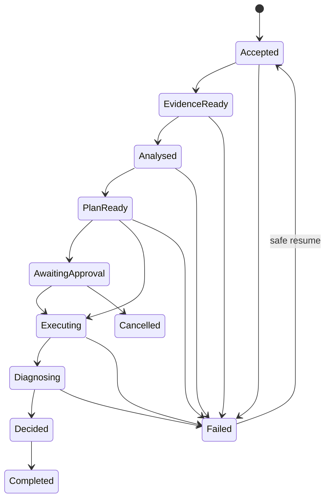

# A10 — Agent Workflow Reliability and Human Oversight

## 1. Objective

Make the end-to-end assurance run durable, bounded and recoverable while keeping humans—not agents—in authority over material execution and writeback. A model outage, retry, process restart or approval delay must not corrupt facts, duplicate a side effect or silently change a release decision.

## 2. Scope and architectural fit

This control applies across ingestion, graph build, impact/security, risk/coverage/test selection, automation engineering, execution, RCA and release assurance. It strengthens L07, L08, L09, L12 and L13 without moving deterministic responsibilities into the workflow engine.

The workflow coordinates authoritative services; it does not become a second implementation of their business rules.

## 3. Canonical run state machine



Each transition has a typed command, preconditions, produced artifacts, immutable receipt and permitted next states. `FAILED`, `CANCELLED`, `TIMED_OUT`, `POLICY_BLOCKED`, `INCOMPLETE` and `INSUFFICIENT_EVIDENCE` are explicit outcomes—not exceptions hidden behind a generic success response.

## 4. Durable workflow contract

```yaml
run_id: ""
trace_id: ""
workflow_name: change_assurance
workflow_version: 1.0.0
state: ANALYSED
state_version: 8
project_id: ""
actor_id: ""
source_snapshot_ids: []
graph_snapshot_id: ""
policy_bundle_id: ""
prompt_model_config_ids: []
input_artifact_ids: []
output_artifact_ids: []
pending_command: null
attempt_budgets: {}
approval_ref: null
last_receipt_id: ""
created_at: ""
updated_at: ""
```

The checkpoint must contain references and versions sufficient to reproduce decisions. Large or sensitive payloads remain in classified artifact stores; checkpoints contain IDs, hashes and redacted summaries.

## 5. Reliability invariants

- A state transition commits once through optimistic concurrency or an equivalent compare-and-swap mechanism.
- A retry receives the same logical `operation_id` and idempotency key.
- External execution or writeback has a durable intent and a reconciled receipt.
- A workflow never guesses whether a timed-out external action completed.
- A resumed run uses its pinned snapshots and policy/model/prompt versions unless an explicit migration starts a new run revision.
- Semantic retries cannot modify confirmed deterministic artifacts.
- A loop has maximum attempts, wall-clock budget, token/cost budget and a termination outcome.
- Approval cannot be inferred from chat wording, model output or the identity that proposed the action.
- Release decision is recalculated by the deterministic engine after relevant evidence changes.

## 6. Idempotency and side-effect discipline

### 6.1 Operation identity

Derive an operation key from stable fields such as:

```text
project_id + run_id + workflow_step + target + input_hash + policy_version
```

Persist the key before the side effect. A duplicate request returns the prior receipt or enters reconciliation; it does not repeat blindly.

### 6.2 Intent–execute–reconcile

For test execution, patch writeback and any future deployment-like action:

1. persist an authorized intent and expected target state;
2. dispatch through an outbox or durable queue;
3. receive/store the provider execution ID;
4. poll or consume events to obtain terminal facts;
5. reconcile provider result, artifacts and local state;
6. produce an immutable execution receipt.

If delivery is uncertain, enter `RECONCILIATION_REQUIRED`. Do not automatically replay a non-idempotent action.

### 6.3 Compensation

Compensation is action-specific and never described as generic rollback. A Git branch can be abandoned; a test environment can be reset; an already delivered notification can only be superseded. Store the actual compensation semantics in each adapter manifest.

## 7. Retry, timeout and fallback policy

| Failure | Retry policy | Fallback/outcome |
|---|---|---|
| Model transient/429 | Capped exponential backoff with jitter | Approved alternate route or `SEMANTIC_UNAVAILABLE` |
| Invalid model schema | One constrained repair attempt at most | Deterministic-only result or review |
| Salesforce/Git read timeout | Bounded retry if idempotent | Pinned cached snapshot marked stale, or `INCOMPLETE` |
| Graph query timeout | Retry with fixed query budget | Partial result cannot satisfy completeness gate |
| Test runner disconnect | Reconcile using provider execution ID | `EXECUTION_STATUS_UNKNOWN` until reconciled |
| Policy/authorization denial | No retry | `POLICY_BLOCKED` |
| Approval expired/rejected | No implicit renewal | Return to plan/review or cancel |
| Persistent store unavailable | Do not continue state-changing work | Fail closed and resume after recovery |

Fallback must preserve task contracts, data policy, tool permissions and certainty semantics. A cheaper/faster model is not a valid fallback if it is not approved for the task and data class.

## 8. Bounded agent behavior

Each semantic node declares:

- allowed input and output schemas;
- allowed evidence types and tool IDs;
- maximum model calls and tool calls;
- maximum tokens, cost and elapsed time;
- allowed retry reasons;
- termination and abstention conditions;
- whether human review is mandatory.

No open-ended “think until solved” loop is permitted. For this platform, most flows should be predefined orchestration with bounded semantic nodes, not autonomous planning.

## 9. Human oversight model

### 9.1 Human decision points

| Decision | Human authority |
|---|---|
| Resolve ambiguous requirement/material mapping | Accept, reject or edit proposal |
| Accept generated/repaired automation patch | Approve only after maturity evidence is visible |
| Execute costly or privileged test plan | Approve target, scope, budget and expiry |
| Write patch to governed repository | Approve exact diff/hash and destination |
| Override release gate | Not supported as silent change; record an explicit risk acceptance outside the deterministic recommendation |
| Promote prompt/model/policy/config | Approve evaluated version and rollout scope |

Read-only analysis of approved synthetic/local sources can remain automatic. Production Salesforce write/deploy/DML and protected-branch write remain out of scope for the demo path.

### 9.2 Approval receipt

```yaml
approval_id: ""
decision: APPROVED
approver_id: ""
approver_roles: []
requester_id: ""
action_class: A4
action_type: test_execution
target_environment: integration
argument_hash: ""
artifact_hashes: []
expected_target_version: ""
limits:
  max_tests: 25
  max_duration_seconds: 1800
issued_at: ""
expires_at: ""
consumed_at: null
```

The broker checks scope, argument/artifact hashes, environment, expected state, separation-of-duties rule, expiry and replay status at execution time. Any material mutation invalidates the approval.

### 9.3 Meaningful review

The reviewer UI must show:

- requested action and target;
- deterministic reason and affected assets;
- exact patch/test plan and validation maturity;
- evidence links, uncertainty and contradictions;
- predicted cost/duration and blast radius;
- policy checks and denied alternatives;
- approve, reject and request-change controls.

Avoid approval fatigue: batch only actions with the same target/risk and preserve item-level visibility. Never use pre-checked consent or vague “continue” prompts for material actions.

## 10. Concurrency, cancellation and change drift

- Use optimistic state versions to prevent two workers from advancing the same run.
- Propagate cancellation to safe, cancellable activities and mark uncancellable external work for reconciliation.
- Before execution/writeback, compare current target revision to the approved expected revision.
- A source, policy, graph or patch change after approval requires re-analysis or re-approval according to impact.
- Superseded runs remain auditable and cannot overwrite results of the newer run.

## 11. Degradation modes

| Unavailable dependency | Product behavior |
|---|---|
| LLM | Continue deterministic impact/risk/coverage/selection/release; omit or queue semantic proposals/explanations |
| Embeddings/ChromaDB | Continue exact and graph retrieval; mark semantic recall limitation |
| Live Salesforce | Use explicitly pinned fixture/cached snapshot if allowed and label it; never present as live |
| Git provider | Use approved local snapshot; disable writeback |
| Test runner | Produce plan/patch validation only; release gate sees missing execution evidence |
| Observability exporter | Buffer within bounded durable queue; core audit/security events fail closed if they cannot be retained |

## 12. Operational metrics and SLO candidates

- workflow completion, incomplete and policy-block rates;
- state/step latency and queue age;
- retry, timeout and exhausted-budget rates;
- duplicate dispatch prevented and unresolved reconciliation count;
- resume success after worker restart;
- approval wait time, rejection, expiry and replay-block rate;
- tool/model dependency availability and circuit-breaker state;
- degraded-mode usage and age of pinned evidence;
- orphaned runs and terminal-state lag.

Initial SLOs should be based on measured local/integration baselines. Never improve completion rate by converting incomplete or uncertain runs into success.

## 13. Retrofit into the existing implementation

1. Inventory all orchestration paths, background jobs, direct side effects and manual resume instructions.
2. Select the strategic-discount workflow as the first canonical state machine.
3. Add durable run/checkpoint/receipt/approval stores through ports.
4. Move retries out of ad hoc agent code into activity policies.
5. Introduce operation IDs, outbox dispatch and reconciliation for test execution first.
6. Add explicit degraded and terminal outcomes to API/UI contracts.
7. Implement scoped approval at the broker before enabling any governed writeback.
8. Exercise crash/restart, duplicate delivery, timeout and stale-approval scenarios.
9. Extend the pattern one vertical capability at a time.

## 14. Required tests

- Crash before/after each checkpoint and resume without divergence.
- Duplicate queue delivery produces one external action/receipt.
- External timeout reconciles completed, failed and unknown provider states.
- Concurrent workers cannot both commit a transition.
- Cancellation during model, graph, test execution and writeback phases.
- Expired, replayed, self-approved, wrong-target and hash-mismatched approval.
- Source/patch/policy drift after approval.
- Model, ChromaDB, Salesforce, Git, runner and exporter outage.
- Loop/token/cost/time budgets terminate correctly.
- Deterministic results remain unchanged across semantic retry/fallback.
- UI/API distinguish live, fixture, simulated, stale and unavailable evidence.

## 15. Definition of done

- The demo workflow is a persisted, versioned state machine with typed transitions.
- Restart, retry and duplicate delivery cannot corrupt state or repeat side effects.
- Every external action has intent, authorization, provider ID and terminal/reconciliation receipt.
- Agent loops and resource use are bounded and observable.
- Material actions require scoped, expiring, non-replayable approval checked at execution time.
- Human reviewers receive evidence, uncertainty, blast radius and exact artifact/action details.
- Dependency outages yield explicit safe degradation rather than fabricated completeness.
- Release recommendation remains deterministic and any business override is separately governed and audited.

## 16. Primary references

- [LangGraph persistence](https://docs.langchain.com/oss/python/langgraph/persistence)
- [LangGraph interrupts and human-in-the-loop](https://docs.langchain.com/oss/python/langgraph/interrupts)
- [OWASP Excessive Agency](https://genai.owasp.org/llmrisk/llm062025-excessive-agency/)
- [OWASP Top 10 for Agentic Applications](https://genai.owasp.org/resource/owasp-top-10-for-agentic-applications-for-2026/)
- [NIST AI RMF Generative AI Profile](https://nvlpubs.nist.gov/nistpubs/ai/NIST.AI.600-1.pdf)
