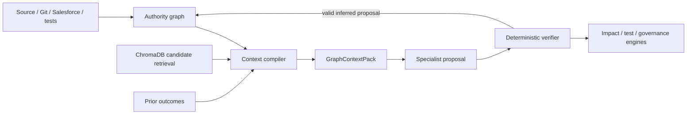

# Graph-grounded agent reasoning

## Architecture decision

Adopt ontology-guided Change Evidence Graph reasoning as the central intelligence architecture.
This is superior to isolated vector RAG or free-form agent collaboration because it preserves
structured relationships, exact provenance and deterministic decision boundaries while still
allowing models to interpret ambiguous business language.

The design is influenced by the repository's deep-research report, but does not claim the current
runtime is Microsoft GraphRAG or that an LLM has built the authoritative graph. The current code has
source-graph ingestion, strict ontology/profile normalization, lexical/path seeding, deterministic
foundation traversal and evidence receipts. Source records without complete envelopes stay
`UNVERIFIED`. Semantic search is standalone and not yet fused into assurance runs.

## Four planes

1. **Authority plane** — deterministic parsers, reviewed source contracts, Git diffs, Salesforce
   reads, test receipts and human confirmations create versioned nodes/edges with provenance.
2. **Context plane** — a deterministic compiler selects a project/snapshot-isolated subgraph,
   evidence paths, source fragments, policies and prior outcomes within explicit budgets.
3. **Proposal plane** — bounded specialist agents and ChromaDB similarity propose semantic links,
   explanations or hypotheses. All such output starts `INFERRED`.
4. **Decision plane** — deterministic validators check citations, ontology, freshness, conflicts,
   authorization and tests; deterministic governance alone chooses the release code.

## Canonical graph domains

The ontology connects these reusable domains without embedding the first demo's object, field,
record, alias or route names in core code:

- requirement, business rule and business process;
- Salesforce metadata, code, security and integration components;
- source file, symbol, commit and change set;
- test case, obligation, execution and coverage evidence;
- incident, causal hypothesis, release decision and human override/outcome.

The implemented ontology defines source-neutral node classes, relation classes, materiality and
legal endpoint signatures. The implemented Salesforce profile maps all current concrete node and
relation terms into those classes and pins the ontology identity. Contract/profile tampering,
duplicate or ambiguous mapping and illegal signatures fail closed. Causal propagation remains a
separate A2 policy; normalization itself never declares reachability or risk.

## Directional propagation and risk

Discovery and risk are separate deterministic stages. A propagation matrix declares, for every
canonical relation, whether a change at the source or target may propagate, the allowed endpoint
roles, maximum depth and required evidence state. The query planner emits ordered path receipts;
it does not assume that every reachable node is affected. Inverse-edge, cycle and diamond fixtures
must prove that the graph does not reverse causality or duplicate impact.

Risk policy then evaluates confirmed impact paths using explicit inputs: business criticality,
security/authorization reach, change intent, path class/depth, evidence state and—only after it is
governed—historical outcomes. The current node-kind severity default remains a foundation. A
missing required risk input creates a visible gap rather than an invisible fallback, and historical
outcomes cannot change runtime decisions until a reviewed policy/evaluation version adopts them.

## Typed boundaries

`GraphContextPack` must contain:

- project ID, source ref, source snapshot/hash, ontology version/hash and request/input hash;
- seed entities and why each was selected;
- ordered confirmed paths with edge evidence state, source, freshness and direction;
- bounded source fragments and prior-outcome references;
- candidate semantic hits labeled as candidates, never facts;
- blocking/nonblocking gaps plus item, depth, token and time budgets.

`GraphReasoningProposal` must contain:

- specialist/capability and provider/model/prompt identities;
- context-pack hash and proposed canonical relation or conclusion;
- endpoints and evidence IDs that are a subset of the pack;
- concise basis, assumptions, contradictions and abstention state;
- no hidden chain-of-thought or authorization/release field.

## Trust and degradation rules

- Cross-project or cross-snapshot paths are rejected.
- Missing, stale, expired, contradictory or untrusted edges never become confirmed context.
- Unmapped material kinds/relations create a blocking gap; benign context may be omitted visibly.
- Semantic/vector similarity only ranks candidates. It cannot confirm a dependency or satisfy a
  release/test/evidence gate.
- Conflicting confirmed facts require review; the model cannot choose which fact to discard.
- If the LLM, embeddings or ChromaDB is unavailable, deterministic exact/lexical/graph analysis
  continues and semantic capability is marked unavailable.
- PostgreSQL is authoritative relational graph/outcome memory when its ports are implemented.
  JSON/SQLite are degraded factual fallbacks; ChromaDB is derived and rebuildable.

## Current and planned scope

| Capability | Current truth | Next acceptance boundary |
|---|---|---|
| Trusted edge envelope | R0.1 deterministically compiles and replays immutable local canonical-edge envelopes against externally pinned project/snapshot, raw and normalized graph, ontology/profile, parser registry/implementation, policy, artifact bytes, evidence state and time. Release-only gaps are isolated from analysis, failed aggregate replay cannot partially promote paths, and all outputs retain the upstream-capture gap and `ANALYSIS_ONLY` scope | Add an attested source-capture producer and independently versioned historical normalizer replay; persist/anchor envelope inputs without making persistence itself authority; then feed those attested receipts into the implemented R0.2 local path-replay boundary |
| Complete material-path replay | R0.2 derives a non-caller-narrowable candidate scope from all graph nodes and every reachable material target under independently pinned path, propagation and R0.1 trust roots. It requires exact current edge-envelope union and ordered structural/trusted path equality, binds seed/path/zero-path partitions, and rejects capacity, expiry, omission, addition, reorder, reversal, substitution and static-provenance tamper. Historical receipts refresh only after current replay | Add independently attested `VerifiedChangeSet` seeds, upstream capture, durable anchoring and R0.3 immutable release-input composition. Until then local path coverage remains `ANALYSIS_ONLY`, `release_eligible=false` with blocking change-seed/source-capture gaps |
| Immutable release-input composition | R0.3 candidate foundation binds the whole v2 run/request candidate surface, candidate change/build bytes, current-replayed R0.2/R0.1 graph-path roots, deterministically replayed risk per stable structural path, advisory downstream candidate payloads and current policy identities into a canonical expiring manifest. Mutation, omission, duplicate IDs, cross-scope reuse, unsafe locators, expiry, fabricated paths and valid-path risk swaps fail closed | Add producer-derived `VerifiedChangeSet` and candidate build, provenance-bound risk factors, R0.4 per-impact obligations/exact-build execution, R0.5 authoritative conflicts/scoped approvals, and durable independent anchoring. Until producer completeness is non-caller-narrowable, the manifest remains `ANALYSIS_ONLY`, `release_eligible=false` with exact permanent gaps |
| Verified local change and graph-seed mapping | R0.4a uses a policy-pinned local-Git producer to derive complete base/candidate trees and ADD/MODIFY/DELETE entries from actual bytes. R0.4b independently replays that capture and current R0.2/R0.1, maps each supported changed locator to one unique source-profile-derived graph anchor, binds declared entities and derives every matching stable affected-path identity. Caller paths/seeds/mappings are absent; unsafe, aliased, unmapped, ambiguous, zero-path, stale and tampered inputs fail closed | Add a pinned graph-producer receipt that proves candidate/base graph inputs correspond to the exact Git tree, plus deleted-artifact tombstones. Until then `GRAPH_INPUT_TREE_NOT_ATTESTED` and `CHANGE_SEED_SCOPE_NOT_ATTESTED` remain blocking. Then retain captured candidate bytes as the sole build input and bind trusted toolchain/config/environment/output manifests before satisfying `CANDIDATE_BUILD_NOT_VERIFIED` |
| Trusted evidence graph | Source JSON graph plus canonical ontology/source-profile normalization, stable normalized digest and explicit mapping/trust gaps exist; the real source currently lacks record envelopes | Add upstream record-level evidence envelopes, prove first-source trusted-behavior equivalence and add durable graph ports |
| Directional propagation/risk | Separately pinned propagation/risk policies and deterministic path/risk evaluators pass inverse/cycle/diamond, bounded-enumeration, artifact-tamper, source/profile-binding, endpoint-trust and missing-factor tests, but are not yet consumed by assurance runs | Add grounded risk-factor receipts and freshness; then integrate identities, paths and risk gaps into the workflow and retire bidirectional traversal |
| Graph context compiler | Isolated analysis-only foundation compiles replay-validated structural paths under pinned count/character/byte budgets, keeps unresolved fragments and semantic receipts candidate-only, and exposes omissions/foundation gaps | Add typed seed-rationale receipts, deterministic depth/work-unit accounting, provider-specific token/time budgets, governed fragment resolution/redaction, prior outcomes and semantic-index receipts; then integrate a trusted replay-validating workflow consumer |
| Semantic retrieval | Ephemeral standalone cosine search exists; candidate-only fusion contracts and deterministic degradation are implemented in isolation | Add real exact/lexical/graph/in-process adapters, then the snapshot-isolated ChromaDB adapter without promoting evidence state |
| Hybrid candidate fusion | Request/context/channel/freshness-bound exact, lexical, confirmed-graph and semantic receipts fuse under a pinned policy and invariant evaluation contract; protected tiers, conflicts, omissions, replay and outages are tested, while upstream A3 gaps remain blocking | Add trusted A3 verification receipts, real channel adapters and at least 20 human-adjudicated cases before making ranked-quality claims |
| Graph-grounded specialist | The provider-neutral proposal/verifier directly replays A3/A4 inputs, and an isolated A6 consumer now replays A3/A4/A5 again, binds the complete request and graph identities, replays current governance, isolates failures and emits only a separate bounded candidate/inferred advisory result | Add the real OpenAI/Azure structured-output adapter with adapter-level hard cancellation, independent durable capture and consumption receipts, retry-safe CAS/checkpoint/service integration and at least 20 adjudicated quality cases |
| Outcome memory | A replay-safe foundation persists non-authorizing trusted-test, typed incident and unverified correction candidates through append-only PostgreSQL/SQLite/JSON/cache adapters; service reads replay exact stored runs and incident chains, and health exposes the active durability mode | Verify live PostgreSQL transactions/concurrency; add public HTTP/MCP access, signed/tamper-evident anchoring, historical-policy replay, decision/override/production outcome kinds, A3 prior-outcome receipts and an adjudicated corpus |

## P0 release-evidence prerequisites

Before any release-authorizing decision is enabled, the current foundation must add:

1. explicit edge envelopes: the R0.1 local-artifact foundation now binds edge ID, legal canonical
   signature/direction, project/snapshot, deterministic parser implementation, artifact/hash and
   freshness. Completion still requires attested upstream source capture and separately scoped
   human-promotion receipts from R0.5;
2. complete replayable path receipts: the R0.2 local foundation now derives and replays every
   reachable material-target path and exact R0.1 edge union. Completion still requires attested
   changed seeds/upstream capture and R0.3 immutable release-input binding;
3. separate canonical analysis-input and release-input digests, with the latter covering evidence,
   paths, risk, obligations, executions, conflicts and every policy/ontology/fusion identity;
4. `VerifiedChangeSet` and candidate-build/environment identity on analysis and execution, plus
   per-impact `TestObligation` coverage;
5. immutable scoped `HumanEvidenceApproval` receipts; an evidence item cannot self-assert
   `HUMAN_CONFIRMED`;
6. typed propositions/polarity and deterministic conflict sets—never insertion-order overwrite.

The executable governance policy keeps release authority disabled until these are implemented and
independently verified. This does not block impact exploration; it prevents incomplete evidence
from being represented as release authorization or rejection.

Historical release decisions are never trusted merely because they were persisted. API/service
reads derive a current effective decision under the active policy and retain any displaced result
only as a non-authoritative `recorded_decision` audit fact.

## Measurable acceptance

Implementation tests must prove:

- 100% of context-pack paths have source snapshot/hash and confirmed/human-confirmed edge receipts;
- 100% of accepted proposal evidence IDs and endpoints belong to the exact context pack;
- 0 cross-project, cross-snapshot, expired or inferred edges satisfy a confirmed-fact gate;
- identical source/policy/request inputs produce the same context-pack hash and deterministic paths;
- inverse edges, cycles and diamonds cannot reverse causality or duplicate impact;
- missing mandatory risk inputs create an explicit gap; risk values identify the governing policy;
- every capacity truncation emits an explicit gap and never silently drops a mandatory test path;
- renaming source entities while preserving topology does not change decision class;
- unavailable semantic dependencies preserve the deterministic result and expose degradation.

Corpus-level precision/recall claims remain governed by the minimum-sample rules in
`Docs/07-governance-and-evaluation.md`; these invariants are contract tests, not an accuracy claim.

The product name for this design is “graph-grounded agent reasoning” or “ontology-guided evidence
retrieval.” It is not a current Microsoft GraphRAG implementation: community/global summaries,
local/global query modes and comparative GraphRAG evaluations are outside this scope.
