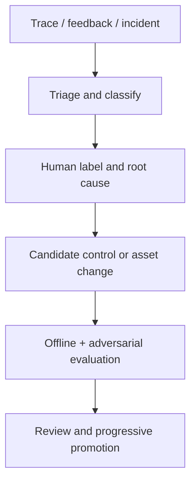

# A11 — AI Governance, Red Teaming and Continuous Improvement

## 1. Objective

Establish named accountability, controlled change, adversarial assurance, incident response and evidence-based improvement across the system lifecycle. Governance must control code, models, prompts, data, graph/memory, tools, policies and evaluations—not just the final chat response.

## 2. Governance outcomes

The operating model must be able to answer:

- Who owns each capability, decision, dataset, guardrail and production risk?
- Which version of every AI-system asset produced a result?
- What evidence permitted promotion, and who approved it?
- Which residual risks are accepted, by whom and until when?
- How are unsafe behavior, quality drift and incidents detected and contained?
- Which feedback is eligible to change the system, and how is it reviewed?

## 3. AI-system inventory and bill of materials

Maintain a versioned registry for:

| Asset class | Minimum registry fields |
|---|---|
| Capability/agent/workflow | owner, purpose, risk tier, allowed decisions/actions, users/environments |
| Deterministic engine/policy | version/hash, owner, invariants, tests, effective dates |
| Model/endpoint | provider, exact model/snapshot, task approvals, data class, region/retention terms, fallback |
| Prompt/context policy | version/hash, task, schemas, tools, evidence scope, eval baseline |
| Dataset/evaluation | owner, provenance, consent/license, splits, label rubric, sensitive data, version |
| Source/graph/memory | authority, parser/version, snapshot/hash, retention, trust and deletion policy |
| Tool/MCP/adapter | source/digest, capabilities, privileges, data destinations, owner, kill switch |
| Generated artifact | lineage, maturity, validation evidence, approval and target |
| External dependency | vendor/version, availability/security assumptions, exit/fallback plan |

This registry is part of the release evidence and incident blast-radius analysis.

## 4. Risk tiering

| Tier | Example | Required governance |
|---|---|---|
| G0 — deterministic/read-only | exact graph lookup | standard engineering controls and audit |
| G1 — semantic/read-only | explanation or normalization proposal | task evals, grounding, versioning, monitoring |
| G2 — generated executable proposal | Apex/API/UI patch | sandbox, security/quality validation, human review |
| G3 — material execution | governed test execution using credentials | scoped approval, budgets, receipts, reconciliation |
| G4 — repository/system write | approved branch writeback or future metadata change | separation of duties, exact artifact approval, rollback/incident plan |
| G5 — release/business decision | release recommendation | deterministic policy only; human risk acceptance separately recorded |

Risk tier is the maximum of data sensitivity, autonomy, privilege, irreversibility, blast radius and decision consequence. A model's confidence does not lower the tier.

## 5. Accountabilities

| Role | Accountable for |
|---|---|
| Product/solution owner | product invariants, capability scope, accepted residual risk |
| Domain engine owner | deterministic correctness, policy/rule changes, exact evaluators |
| AI engineering owner | semantic task design, prompts/models/context, eval quality, fallback |
| Evidence/data owner | source authority, graph/index quality, provenance, retention/deletion |
| Automation owner | IR/profiles, generated patch maturity, runner and framework safety |
| Security owner | threat model, tool/MCP review, identity, secrets, red team and incidents |
| Reliability owner | workflow durability, SLOs, recovery, dependency/cost controls |
| Evaluation owner | dataset integrity, labels, judge calibration, regression gates |
| Release authority | production change approval and recorded risk acceptance—not alteration of engine facts |

One person may hold several roles during development, but the decisions and evidence remain distinct. Generated code or agent output cannot approve itself.

## 6. Change classification and promotion

Every change declares affected assets and selects the relevant evaluations.

| Change | Mandatory evidence before promotion |
|---|---|
| Domain rule/release policy | exact regression suite, policy diff, golden decision agreement, owner approval |
| Parser/graph schema/traversal | rebuild comparison, provenance/edge tests, impact recall regression |
| Prompt/context/retrieval | targeted offline eval, injection/grounding tests, token/cost/latency comparison |
| Model/endpoint/fallback | full task baseline, safety and schema tests, canary, rollback proof |
| Tool/MCP/permission | threat-model delta, authorization/schema/adversarial tests, bill-of-materials update |
| Generated-code template/framework profile | compile/discovery/execution/stability/security regression |
| Guardrail/policy | allow/deny boundary tests, false-block analysis, red-team replay |
| Dataset/judge/rubric | provenance/label review, leakage check, calibration against human labels |

Promotion states: `DRAFT → REVIEWED → INTEGRATION → CANARY → APPROVED`; any state can move to `QUARANTINED` or `RETIRED`. Production rollout uses a bounded cohort, monitors quality and safety, and has a tested rollback trigger.

## 7. Red-team program

### 7.1 Threat families tailored to this platform

1. **Requirement/issue injection:** text asks the agent to ignore policy, reveal data or deploy directly.
2. **Source/metadata poisoning:** malicious comments, labels or metadata descriptions become instructions.
3. **Retrieval poisoning:** untrusted content outranks authoritative evidence or forged evidence IDs are cited.
4. **Graph/memory poisoning:** inferred or stale facts become confirmed edges; malicious outcomes persist.
5. **Tool-description/result injection:** connector content changes intended tool choice or arguments.
6. **Goal hijacking and excessive agency:** explanation task evolves into execution/writeback.
7. **Privilege/identity abuse:** cross-project access, wrong org, token forwarding, confused deputy or replay.
8. **Generated-code attack:** exfiltration, arbitrary network/file access, destructive DML, secret use or resource exhaustion.
9. **Automation manipulation:** mandatory tests are omitted, assertions weakened or failed scripts misclassified as product defects.
10. **RCA hallucination:** plausible root cause without evidence, fabricated log, historical incident leakage or false certainty.
11. **Release manipulation:** prompt/model attempts to override deterministic gate or hide missing evidence.
12. **Availability/cost attack:** recursive agents, unbounded tools, huge context, retry storms or runner exhaustion.
13. **Human-factor attack:** misleading confidence/citation, approval fatigue or presenting simulation as live.
14. **Supply-chain attack:** changed MCP/tool/model/dependency/template introduces new capability or data destination.

### 7.2 Test design

For each threat, keep:

- normal control case;
- direct attack;
- indirect/encoded/obfuscated variants;
- multi-turn and tool-mediated variant;
- authorization and cross-project variant;
- expected block/abstain/degrade outcome;
- must-not-call tools and must-not-claim facts;
- expected telemetry/alert/audit artifacts.

Red-team cases become a versioned adversarial regression corpus. Sensitive exploit details have restricted access, but stable safe reproductions run in CI/integration.

### 7.3 Independence and cadence

- Feature owner runs routine adversarial tests for every relevant change.
- A different reviewer challenges G2+ capabilities before promotion.
- Security-led threat-model review occurs before new tool/data/write capability.
- Periodic exercises cover complete vertical workflows and incident response.
- Material incidents and near misses create new regression cases.

## 8. Safety and quality case per capability

Each capability keeps a concise assurance case:

```yaml
capability_id: impact_explanation
owner: ""
risk_tier: G1
intended_use: ""
prohibited_uses: []
authoritative_truth: evidence_graph_and_impact_engine
semantic_role: explain_only
known_failure_modes: []
controls: []
golden_dataset_versions: []
adversarial_dataset_versions: []
quality_thresholds: {}
residual_risks: []
risk_acceptance_refs: []
monitoring_and_alerts: []
last_reviewed_at: ""
```

It links claims to test/eval results and observed operation. It is not a narrative declaration of “safe AI.”

## 9. Incident response

### 9.1 Incident triggers

- unauthorized or attempted tool/action/data access;
- unsupported material claim or critical false negative;
- wrong release recommendation caused by policy/data/software defect;
- model/provider/data leakage or retention concern;
- poisoned graph/memory/evaluation/training data;
- generated code escaping controls or causing material side effects;
- approval bypass/replay or identity confusion;
- uncontrolled cost/loop/cascading failure;
- simulation/fixture presented as live;
- trace/audit gap that prevents reconstruction.

### 9.2 Response sequence

1. **Contain:** disable capability/tool/model route using kill switch; revoke credentials; stop promotion/writeback.
2. **Preserve:** retain redacted trace, receipts, versions, source snapshots, hashes and approvals under incident policy.
3. **Assess:** determine affected projects/runs/artifacts using registry and lineage.
4. **Correct:** fix the deterministic, data, policy, prompt, model, connector or operational cause.
5. **Prove:** add/replay regression and adversarial cases; independently review material incidents.
6. **Recover:** progressively re-enable with monitored cohort and rollback.
7. **Disclose/learn:** follow organizational notification duties and update risk, controls and documentation.

The LLM may summarize evidence; it does not declare root cause or incident closure without human validation.

## 10. Continuous improvement without uncontrolled self-learning

Feedback enters a governed queue and never changes prompts, policies, memory, datasets or models directly.



### 10.1 Root-cause classes

- authoritative source/ingestion/parser defect;
- graph/query/rule/policy defect;
- retrieval/context defect;
- prompt/schema/model behavioral defect;
- tool/authorization/workflow/reliability defect;
- generated-code/framework/runner defect;
- label/evaluator/judge defect;
- UX/human-review defect;
- unsupported use or missing product capability.

Choose the lowest-risk effective remedy. Do not fine-tune a model for deterministic, integration, data-authority or policy failures.

### 10.2 Feedback and label governance

- Separate user preference from factual correction and safety incident.
- Require source/evidence for labels about impact, security, tests, RCA and release.
- Track labeler, rubric, confidence, disagreement and adjudication.
- Prevent train/eval leakage and deduplicate scenario families.
- Remove/quarantine poisoned, unlicensed, private or low-quality examples.
- Preserve an untouched holdout and periodically refresh distribution coverage.
- Require explicit review before data becomes evaluation or training material.

## 11. Metrics and reporting

Report by capability, risk tier, environment, source mode and version:

- deterministic correctness/recall and release agreement;
- grounded/material unsupported-claim and abstention rates;
- mandatory-test recall and false exclusion;
- guardrail block, false-block and bypass rates;
- adversarial pass rate by threat family;
- authorization/approval/reconciliation anomalies;
- quality, latency, cost and failure deltas after change;
- incident/near-miss count, severity, time to contain/recover;
- evaluation coverage and stale dataset/control count;
- model/tool/source/version concentration and untested-change count;
- human correction, disagreement and approval outcomes.

Avoid one aggregate “AI accuracy” score. A high explanation score cannot offset a security false negative or release-policy mismatch.

## 12. Governance artifacts

```text
governance/
├── product-invariants.md
├── ai-system-registry/
├── risk-register/
├── capability-assurance-cases/
├── data-and-model-cards/
├── threat-models/
├── red-team-reports/
├── risk-acceptances/
├── incident-playbooks/
└── promotion-and-rollback-records/
```

Documents are generated from or linked to machine-readable versioned facts where possible. Chat history is not an approval or system of record.

## 13. Retrofit into the existing implementation

1. Name owners for L01-L14 and A01-A11 controls.
2. Create the AI-system inventory from dependencies, configs, prompts, adapters and workflows found in the deviation audit.
3. Assign risk tiers and prohibited uses to each semantic task/tool/action.
4. Record current unapproved versions and deviations as baseline—not as approved production state.
5. Convert current security/quality prompts into executable control and adversarial cases.
6. Create red-team cases for the strategic-discount journey, including poisoned metadata, mandatory-test omission, false RCA and release override.
7. Establish incident kill switches for model route, tool, connector, workflow and writeback.
8. Require change manifests and targeted eval selection in CI.
9. Establish a weekly retrofit quality review, then move to risk/change-based cadence after stabilization.
10. Review residual risks before controlled feature development resumes.

## 14. Required exercises and tests

- Inventory completeness against runtime dependencies/configuration and observed traces.
- Model/prompt/tool/source/policy change selects the correct gates.
- Canary regression triggers rollback and preserves run evidence.
- One exercise per red-team family with expected block/alert/audit.
- Poisoned feedback cannot enter memory/eval/training automatically.
- Cross-project/source access and approval replay are contained.
- Kill switch stops new actions without corrupting active/recorded state.
- Incident drill reconstructs affected runs and artifacts from lineage.
- Human/judge disagreement is measured and adjudicated.
- Risk acceptance expires and reopens the risk.
- Retired asset cannot be routed or called.

## 15. Definition of done

- Every capability, model, prompt, dataset, source, tool, policy and generated artifact type has an owner and versioned registry entry.
- Risk tier, intended/prohibited use, controls, evals, monitoring and residual risk are recorded per capability.
- Relevant change types cannot promote without targeted tests/evals and approved rollback.
- The adversarial corpus covers the platform-specific threat families and runs continuously where safe.
- Kill switches, incident evidence preservation and recovery have been exercised.
- Feedback cannot silently update behavior, memory, policies, datasets or models.
- Material incidents and risk acceptances have accountable human decisions and expiry/review.
- Governance evidence is linked to runtime/configuration truth, not maintained only as prose.

## 16. Primary references

- [NIST AI RMF Generative AI Profile](https://nvlpubs.nist.gov/nistpubs/ai/NIST.AI.600-1.pdf)
- [OWASP Top 10 for Agentic Applications](https://genai.owasp.org/resource/owasp-top-10-for-agentic-applications-for-2026/)
- [OWASP Prompt Injection Prevention Cheat Sheet](https://cheatsheetseries.owasp.org/cheatsheets/LLM_Prompt_Injection_Prevention_Cheat_Sheet.html)
- [OpenAI evaluation best practices](https://developers.openai.com/api/docs/guides/evaluation-best-practices)
- [Anthropic prompt-injection mitigation](https://platform.claude.com/docs/en/test-and-evaluate/strengthen-guardrails/mitigate-jailbreaks)
