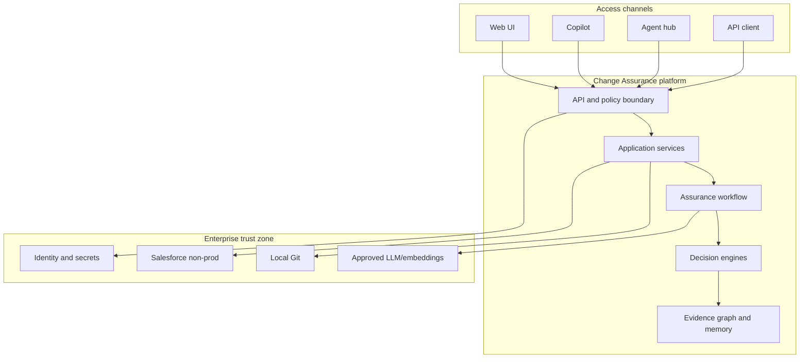
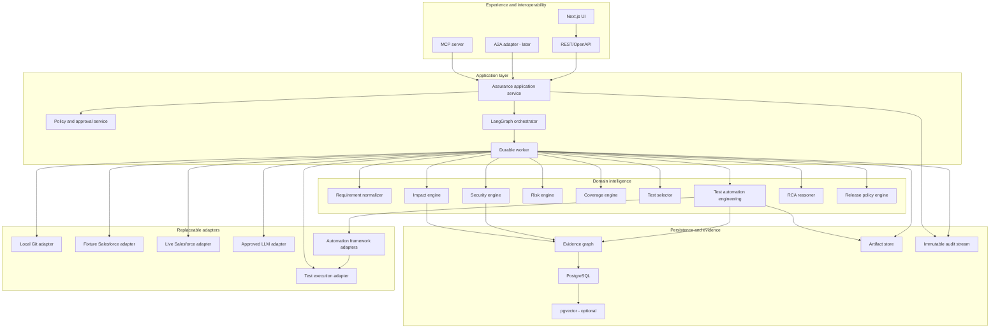
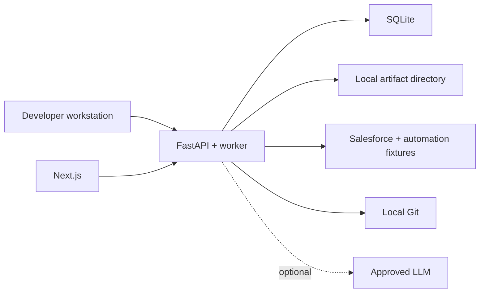
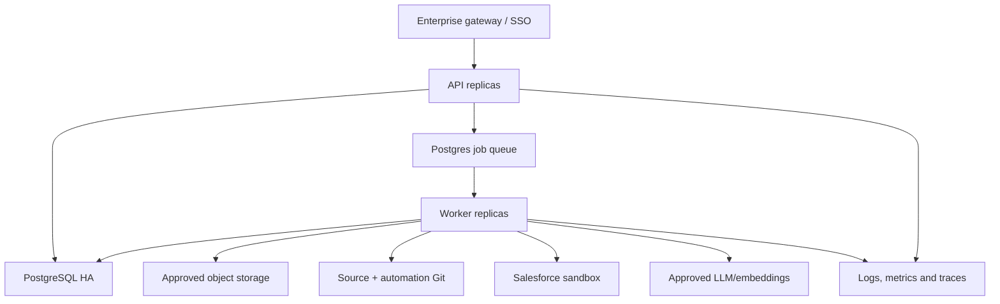
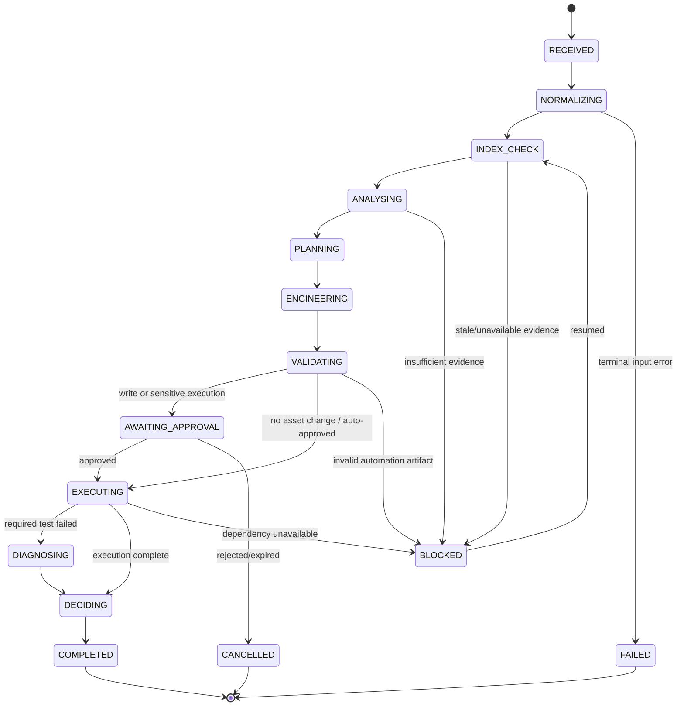
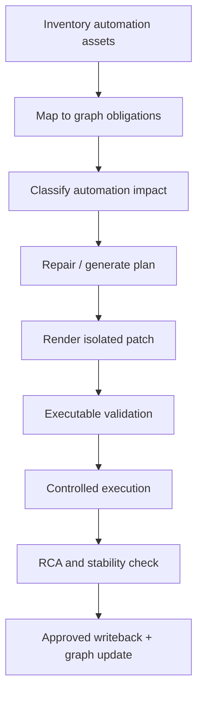
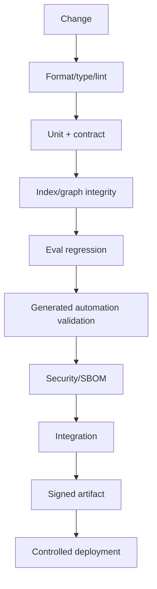

# Salesforce Change Assurance Intelligence Platform

> Historical reference: canonical implementation documentation now lives in `../docs/`. This version 1.1 document remains background architecture input and is not ingested as current runtime truth.

## Production Solution Design

| Field | Value |
|---|---|
| Document status | Proposed baseline for architecture review |
| Version | 1.1 |
| Date | 24 August 2026 |
| Revision | Adds the Test Automation Engineering Layer and end-to-end automation-asset lifecycle |
| Primary source | *Defensible Salesforce Change Assurance Platform: Product Moat, Agent Architecture and Build Blueprint* (`deep-research-report.md`) |
| Supporting source | *Salesforce Change Assurance Intelligence Platform — Hackathon Build Blueprint* |
| Initial delivery profile | Five-week hackathon, 4–6 contributors, local Git, paired Salesforce and Selenium/API/Apex fixtures |
| Production target | Enterprise-controlled, single-tenant deployment with approved Salesforce, LLM, identity, secrets and database services |

---

## 1. Executive design decision

Build one bounded product capability:

> Given a business requirement and/or a source change, determine which Salesforce business rules, processes, metadata, code, security controls, automation assets and tests are affected; repair impacted automation, generate missing executable tests, validate and execute them, diagnose failures, and return an auditable release recommendation.

The platform's durable intellectual property is the combination of:

1. a cross-plane **Salesforce Change Evidence Graph**;
2. versioned, deterministic **impact, risk, coverage, test-selection and release policies**;
3. **evidence provenance and confidence** for every material conclusion; and
4. accumulated **human decisions, release outcomes, incidents and evaluation results**.

The complete product capability chain is:

> **Impact Analysis → Automation Coverage Analysis → Test Maintenance and Generation → Executable Validation → Test Execution → RCA → Release Assurance**

LLMs, LangGraph, Copilot, MCP, Salesforce APIs, GitHub and the UI are replaceable implementation or access mechanisms. They are not the product's source of truth.

This document deliberately separates two delivery profiles:

- **Hackathon profile:** offline-first, Salesforce/automation-fixture-backed, SQLite/JSONL, local Git, enterprise LLM optional, simulated execution permitted.
- **Production profile:** PostgreSQL, durable workflow checkpoints, enterprise identity and secrets, live read-only Salesforce integration, controlled test execution, audit retention, observability, backup and recovery.

The five-week build can be production-minded and contract-complete, but it is not production-certified until the security, performance, resilience and operational gates in this design are passed.

## 2. Goals, non-goals and success measures

### 2.1 Goals

- Turn unstructured requirements into a versioned `RequirementSpec` with business rules and acceptance criteria.
- Detect relevant local Git changes without requiring GitHub.
- Parse a supported subset of Salesforce metadata and Apex deterministically.
- Maintain a graph joining business, metadata, implementation, security, test and outcome planes.
- Separate confirmed structural facts from inferred semantic relationships.
- Produce reproducible impact, risk, coverage and test-selection results.
- Inventory existing Selenium, API and Apex automation assets and map them to business rules, Salesforce components and test obligations.
- Detect automation assets affected by metadata, locator, workflow, API, permission, assertion or test-data changes.
- Generate reviewable repairs for impacted scripts and complete executable scripts for uncovered scenarios.
- Heal UI locators using deterministic evidence first and semantic reasoning only as a bounded fallback.
- Validate generated or repaired code through syntax, compile, framework-discovery, security and execution gates.
- Feed validated automation changes and RCA outcomes back into the graph and maintenance history.
- Use an LLM only where semantic judgement or explanation adds value.
- Make every conclusion traceable to immutable evidence.
- Expose the same application services through REST, UI and a small MCP surface.
- Work without a live Salesforce org; add live connectivity through ports.
- Resume safely after process or dependency failure without duplicating side effects.
- Collect evaluation and human-correction data from the first demonstration.

### 2.2 Non-goals for the first release

- Full Salesforce metadata coverage.
- Autonomous production deployment or unrestricted DML.
- Replacement of Salesforce-native test execution, CI/CD or release governance.
- Perfect Apex static analysis.
- A general-purpose Salesforce chatbot.
- A large catalogue of low-level MCP tools.
- Multi-tenant SaaS control plane.
- Neo4j, Kafka, Redis or Kubernetes unless measured scale justifies them.
- Automatic learning that changes decision policy without review and versioning.

### 2.3 Measurable success criteria

| Area | Hackathon exit | Production pilot exit |
|---|---|---|
| End-to-end flow | Requirement/change to release recommendation works against fixture | Same flow works against an approved live non-production org |
| Evidence | 100% of impact and release findings have `EvidenceRef` | 100%; evidence is immutable, access-controlled and retained |
| Determinism | Same inputs and policy versions produce the same engine results | Reproducibility verified in regression tests |
| Impact quality | ≥0.85 precision and ≥0.80 recall on curated fixture cases | Thresholds agreed per client/domain; no critical false negative in pilot corpus |
| Unsupported claims | <5% in eval corpus | <1% for release-blocking claims |
| Test selection | Includes every mandatory scenario and excludes demonstrated irrelevant UI regression | Agreed coverage and reduction targets met on pilot releases |
| Automation maintenance | At least one impacted Selenium asset is mapped and repaired as a reviewable patch | Agreed repair precision; no unreviewed write to protected branches |
| Script generation | Missing Selenium UI, Apex and API scenarios produce complete framework-conformant artifacts | Generated assets compile, are discovered by each framework and pass configured validation gates |
| Locator healing | Demonstrates one evidence-backed locator repair with before/after proof | Healing precision, false-heal rate and stability thresholds meet pilot policy |
| Safety | No live write/deploy path enabled | Sensitive actions require policy decision and human approval |
| Operability | Local verification script and run audit | SLOs, dashboards, alerts, backup/restore and runbooks proven |

## 3. Source-derived architectural invariants

The following are non-negotiable unless changed through an Architecture Decision Record (ADR):

1. The core application is independent of any specific LLM, Salesforce connector, MCP server or source-hosting provider.
2. Python application services and deterministic engines own domain behaviour; LangGraph coordinates long-running workflow state.
3. FastAPI is the canonical application boundary. UI, MCP and any future A2A adapter call the same services.
4. Agents use typed contracts. They do not exchange uncontrolled prose as state.
5. Agents never import concrete connectors. They depend on ports.
6. Deterministic evidence takes precedence over model inference.
7. Every conclusion carries evidence, confidence, extractor identity and source version.
8. Semantic graph edges never receive confidence `1.0` unless subsequently structurally or human verified.
9. The LLM cannot directly deploy metadata, mutate Salesforce data or change permissions.
10. Personal Salesforce environments contain synthetic data only.
11. Chat history is temporary; contracts, ADRs, indexes, graph state, policies, evaluations and outcomes are durable memory.
12. PostgreSQL/pgvector, live Salesforce, GitHub, Copilot MCP and Spring Boot are adapters or deployment choices, not POC blockers.
13. Generated code and repaired scripts are untrusted proposals until they pass executable validation and the configured approval gate.
14. Automation-framework knowledge is isolated behind framework adapters; the domain layer operates on a canonical Automation Intermediate Representation.
15. Deterministic script analysis and locator repair precede LLM generation; the LLM may propose patches but cannot directly modify a protected branch.

## 4. System context and trust boundaries



Trust-boundary rules:

- Inputs from requirements, Git, Salesforce, retrieved documents and MCP clients are untrusted data.
- Authentication happens at the API/MCP boundary; authorization is re-evaluated for every operation.
- Access tokens are audience-bound and are never forwarded blindly to downstream services.
- Connector credentials exist only inside the connector runtime and approved secret store.
- The graph stores necessary metadata and hashes, not secrets or unrestricted record payloads.
- Network egress is allowlisted to approved Salesforce and model endpoints.

## 5. Logical architecture



### 5.1 Bounded components

| Component | Responsibility | Owns | Must not own |
|---|---|---|---|
| API boundary | Authentication, request validation, idempotency, rate limits, resource representation | API versions, request IDs | Domain decisions |
| Application service | Use-case authorization, transaction boundaries, run creation and querying | Run lifecycle | Graph algorithms or prompts |
| Orchestrator | Step ordering, parallel branches, checkpoints, retries, approvals | Workflow state | Risk formula or connector details |
| Indexing service | Parse sources, canonicalize identifiers, diff snapshots, upsert graph | Parser versions, ingest runs | Release decisions |
| Evidence graph | Store/traverse entities and relationships with provenance | Nodes, edges, evidence links | Free-form agent memory |
| Impact engine | Deterministic traversal and impact classification | Impact rules | Direct Salesforce calls |
| Security engine | Permission/control paths, bypass checks, sensitive-change rules | Security findings | Credential management |
| Risk engine | Versioned deterministic inherent/residual risk score | Risk policy versions | Narrative explanation |
| Coverage engine | Map changed rules/components to existing validation | Coverage facts and gaps | Test generation |
| Test selector | Find minimum sufficient test set under mandatory constraints | Selection policy | Test execution |
| Automation inventory | Parse automation repositories and map assets to obligations/components | Automation asset index and structural mappings | Business impact decisions |
| Automation maintenance engine | Classify script impact and create evidence-backed repair plans | Repair policy, locator ranking and patch proposals | Direct protected-branch writes |
| Test generation engine | Convert uncovered obligations into complete framework-specific artifacts | Automation IR, templates and generated patches | Package installation or test deployment |
| Executable validation service | Prove syntax, compile, discovery, policy and execution readiness | Validation reports and artifact maturity | Release recommendation |
| Framework adapters | Translate the canonical Automation IR to/from Selenium, API and Apex frameworks | Framework syntax and conventions | Cross-framework domain rules |
| Semantic reasoners | Normalize ambiguous requirements, infer candidate links, explain and synthesize | Prompt/model versioned proposals | Canonical facts or approvals |
| Release engine | Apply blocking rules and produce recommendation | Decision policy version | Final human authorization |
| Connector adapters | Translate external APIs/files to canonical ports | Connector-specific errors | Domain rules |
| Audit service | Append security and decision events | Tamper-evident audit records | Operational debug payloads |

### 5.2 Why Spring Boot is outside the core

Spring Boot may be added as a thin enterprise façade for SSO, a corporate gateway or Java platform onboarding. It must call the same FastAPI/OpenAPI contract and must not duplicate agent orchestration or domain decisions.

## 6. Deployment profiles

### 6.1 Profile A — offline hackathon



- Single process is acceptable for the demo, but API, worker and ports remain separable.
- SQLite and JSONL implement the same repository contracts used by PostgreSQL.
- Test execution may be simulated, but simulation is visibly labelled and cannot produce `GO` under the default release policy.
- The paired Salesforce and automation repositories are the canonical integration inputs on the organisation machine.

### 6.2 Profile B — enterprise pilot



- One client/tenant per deployment for the pilot.
- API instances are stateless; workers claim durable jobs with database row locking.
- LangGraph checkpoints and canonical run state are stored in PostgreSQL.
- Artifacts are encrypted and content-addressed in an approved object store.
- Live Salesforce defaults to metadata/read-only operations. Execution uses a separately scoped credential.

### 6.3 Profile C — scaled enterprise service

Add multi-tenant isolation, a managed job/broker service, horizontal autoscaling, per-tenant encryption keys and regional data controls only after the pilot has measured workload and regulatory needs. The domain contracts remain unchanged.

## 7. End-to-end run lifecycle

### 7.1 Run state machine



### 7.2 Processing sequence

1. **Receive and authorize.** Validate request, tenant/project scope and caller role. Bind an idempotency key to the normalized request hash.
2. **Snapshot inputs.** Persist requirement, Git refs/diff, source snapshot identifiers and policy/config versions.
3. **Normalize requirement.** An LLM may propose structured rules; Pydantic validates output. Low-confidence or contradictory fields create a review item.
4. **Verify index freshness.** Compare source content hashes with the latest successful ingest. Incrementally re-index changed material.
5. **Build evidence context.** Resolve changed components and graph neighbourhoods. Store the graph query and result snapshot used by the run.
6. **Analyse impact and security.** Run deterministic branches in parallel. Semantic reasoners may add candidate findings, never confirmed facts.
7. **Calculate risk.** Apply a versioned deterministic formula and blocking overrides.
8. **Calculate coverage.** Resolve covered and missing business-rule, component, boundary and permission scenarios.
9. **Select tests.** Apply mandatory scenario rules, then a weighted set-cover algorithm for the remaining coverage universe.
10. **Analyse automation impact.** Map selected obligations and changed Salesforce components to existing Selenium, API and Apex assets. Classify locator, workflow, assertion, data, permission, API-contract and framework impacts.
11. **Plan maintenance.** Decide per asset whether to keep, repair, refactor, retire or replace it. Missing obligations become generation tasks.
12. **Repair and generate.** Produce patches in an isolated workspace through framework adapters. Deterministic transformations and templates run before bounded LLM code proposals.
13. **Validate automation artifacts.** Run syntax, compile, static-policy, dependency, framework-discovery and isolated execution checks. Invalid artifacts return to the repair loop with bounded attempts.
14. **Authorize writeback/execution.** Apply tool policy. Pause for approval before applying a patch to a working branch, creating Salesforce data, deploying metadata or using elevated access.
15. **Execute or simulate.** Persist commands/tool inputs by hash, source/patch versions, external execution IDs, logs and results. Do not retry non-idempotent operations automatically.
16. **Diagnose failures.** Distinguish product defect, automation defect, locator drift, test-data issue, environment failure and flakiness. Correlate changes, automation patches, graph neighbours, logs and prior incidents.
17. **Close the maintenance loop.** If RCA identifies an automation defect, propose a corrected patch, re-run validation and record the accepted/rejected maintenance outcome.
18. **Decide.** Apply release policy to facts. The LLM may explain but cannot change the decision code.
19. **Human review and feedback.** Record approval, override reason and corrected relationships separately from the original result.
20. **Close and evaluate.** Update automation mappings and maintenance history only from accepted artifacts; emit metrics and attach later production outcomes.

### 7.3 Failure semantics

| Failure | Behaviour |
|---|---|
| Invalid requirement/schema | Fail fast with field-level error; no run execution |
| Duplicate submission | Return the existing run for the same principal, project and idempotency key |
| Stale index | Re-index affected sources; block decision if freshness cannot be established |
| Salesforce unavailable | Continue fixture/static analysis if allowed; label live validation unavailable; never silently downgrade |
| LLM unavailable | Continue deterministic path; mark semantic fields unresolved; route to manual review |
| Embeddings unavailable | Use graph, exact text and symbol retrieval |
| Framework adapter unavailable | Return a framework-neutral test specification/Automation IR; mark executable generation unavailable |
| Generated code does not compile | Mark artifact `INVALID`, preserve diagnostics, make a bounded repair attempt, and prevent writeback/execution |
| Proposed locator does not identify one stable element | Reject the locator repair; retain the current failure and evidence for review |
| Patch conflicts with current branch | Re-index the new head, invalidate the patch and regenerate; never force-apply |
| Generated test is flaky | Mark `UNSTABLE`; exclude it from mandatory control credit until stability policy passes |
| Test timeout | Mark `INCONCLUSIVE`, preserve external execution ID, and prevent `GO` when required tests are incomplete |
| Worker crash | Resume from durable checkpoint; completed idempotent steps are not repeated |
| Low-confidence critical inference | Create mandatory reviewer task; inference cannot independently block or approve release |

## 8. Canonical domain contracts

All external payloads use versioned JSON schemas generated from Pydantic models. Internal code imports these contracts from `contracts/`; it does not redefine them.

### 8.1 Identity and versioning

- IDs use sortable UUIDv7 values for runs and evidence records.
- Domain entities use stable canonical keys such as `sf:Field:Opportunity.Discount__c`.
- Every contract contains `schema_version`.
- Every engine output contains `engine_version` and `policy_version`.
- Every semantic output contains `model_id`, `prompt_version` and `input_hash`.
- Timestamps are UTC ISO-8601.
- Breaking schema changes require a new API major version and migration/compatibility plan.

### 8.2 Core contracts

| Contract | Key fields |
|---|---|
| `RequirementSpec` | id, source text hash, summary, actors, business rules, acceptance criteria, assumptions, ambiguities |
| `ChangeSet` | project, base/head refs, commits, changed files/components, change kinds, source snapshot |
| `EvidenceRef` | id, source type, source URI, source version/hash, locator, relation, extractor, confidence, classification |
| `ImpactReport` | affected rules/processes/components, impact type, direction, certainty, rationale, evidence IDs |
| `SecurityReport` | affected grants/controls, privilege path, bypass scenarios, severity, evidence IDs |
| `RiskReport` | factors, inherent score, control credit, residual score, level, overrides, policy version |
| `CoverageReport` | required scenarios, covered scenarios, gaps, coverage strength, evidence IDs |
| `TestPlan` | selected tests, new test specifications, reason, covered obligations, execution order, prerequisites |
| `AutomationAsset` | canonical ID, framework, language, type, repository/path/symbol, owned locators/data/assertions, mapped obligations, content hash |
| `AutomationImpactReport` | impacted assets, change classification, affected regions, confidence, recommended disposition, evidence IDs |
| `AutomationRepairPlan` | asset/base hash, transformations, candidate locators, expected behaviour, risks and validation gates |
| `AutomationIR` | framework-neutral scenario, steps, data, calls, locators, assertions, setup/teardown and tags |
| `AutomationPatch` | base/head hashes, unified diff, generated files, generator/prompt/template versions and approval status |
| `AutomationValidationReport` | syntax/compile/discovery/security/execution results, diagnostics, maturity and evidence IDs |
| `ExecutionReport` | adapter, external run IDs, status, test results, timestamps, artifacts, simulation flag |
| `RCAReport` | ranked hypotheses, confidence, supporting/contradicting evidence, next diagnostic action |
| `ReleaseDecision` | recommendation, blocking reasons, conditions, unresolved items, expiry, evidence IDs |
| `Approval` | action, requested scope, requester, approver, decision, reason, expiry, policy version |

### 8.3 Example assurance request

```json
{
  "schema_version": "1.0",
  "project_id": "strategic-sales-demo",
  "requirement": {
    "text": "Strategic opportunities above INR 5 crore with discount above 10% require Regional VP approval."
  },
  "change_source": {
    "kind": "local_git",
    "repository_id": "salesforce-change-assurance",
    "base_ref": "main",
    "head_ref": "feature/threshold-10"
  },
  "execution_mode": "PLAN_ONLY",
  "policy_profile": "pilot-default"
}
```

### 8.4 Evidence contract

```json
{
  "id": "0198e2f0-2d47-7b51-9f6d-9d8dcfe4b301",
  "source_type": "SALESFORCE_FLOW_XML",
  "source_uri": "repo://sample-salesforce/flows/Strategic_Discount_Approval.flow-meta.xml",
  "source_version": "git:9b7c1d2",
  "source_hash": "sha256:...",
  "locator": "decisionRules[0].conditions[1]",
  "relation": "READS",
  "subject_key": "sf:Flow:Strategic_Discount_Approval",
  "object_key": "sf:Field:Opportunity.Discount__c",
  "extractor": "flow-parser@1.3.0",
  "confidence": 1.0,
  "classification": "CONFIRMED",
  "observed_at": "2026-08-24T10:00:00Z"
}
```

## 9. Port contracts and adapter policy

```python
class SalesforcePort(Protocol):
    async def snapshot_metadata(self, scope: MetadataScope) -> SourceSnapshot: ...
    async def get_component(self, ref: ComponentRef) -> ComponentArtifact: ...
    async def describe_object(self, api_name: str) -> ObjectDescription: ...
    async def query_read_only(self, request: QueryRequest) -> QueryResult: ...
    async def run_tests(self, plan: TestExecutionPlan) -> ExternalExecution: ...

class GitPort(Protocol):
    async def diff(self, repository: str, base: str, head: str) -> ChangeSet: ...
    async def show(self, repository: str, ref: str, path: str) -> SourceArtifact: ...

class GraphPort(Protocol):
    async def upsert_snapshot(self, ingest: IngestBatch) -> IngestResult: ...
    async def traverse(self, query: GraphQuery) -> GraphResult: ...
    async def evidence(self, ids: list[str]) -> list[EvidenceRef]: ...

class SemanticReasonerPort(Protocol):
    async def structured_reason(self, task: SemanticTask) -> SemanticProposal: ...

class TestPort(Protocol):
    async def plan_capabilities(self) -> TestCapabilities: ...
    async def execute(self, plan: TestExecutionPlan) -> ExecutionReport: ...

class AutomationRepositoryPort(Protocol):
    async def inventory(self, repository: str, ref: str) -> AutomationInventory: ...
    async def read_asset(self, ref: AutomationAssetRef) -> AutomationSource: ...
    async def create_isolated_patch(self, request: PatchRequest) -> AutomationPatch: ...
    async def apply_approved_patch(self, patch_id: str, expected_head: str) -> ApplyResult: ...

class AutomationFrameworkPort(Protocol):
    async def parse(self, source: AutomationSource) -> AutomationIR: ...
    async def render(self, ir: AutomationIR, conventions: FrameworkProfile) -> GeneratedAssets: ...
    async def validate(self, assets: GeneratedAssets, gates: ValidationGates) -> AutomationValidationReport: ...

class LocatorEvidencePort(Protocol):
    async def capture_ui_model(self, target: UiTarget) -> UiModelSnapshot: ...
    async def rank_candidates(self, request: LocatorRepairRequest) -> list[LocatorCandidate]: ...
```

Adapter rules:

- Normalize external errors to a small typed taxonomy: `AUTH`, `AUTHZ`, `RATE_LIMIT`, `TIMEOUT`, `UNAVAILABLE`, `INVALID_RESPONSE`, `UNSUPPORTED`, `CONFLICT`.
- Include connector name/version and external correlation ID in telemetry, not in domain decisions.
- Enforce timeouts, bounded retries with jitter and circuit breakers at adapters.
- Do not return vendor SDK objects across the port.
- Fixture and live adapters must pass the same contract test suite.
- Selenium/API/Apex framework adapters must pass a shared Automation IR round-trip and validation contract suite.
- Salesforce read and execute credentials are separate principals.

## 10. Change Evidence Graph design

### 10.1 Node taxonomy

| Plane | Node types |
|---|---|
| Business | Requirement, BusinessRule, AcceptanceCriterion, BusinessProcess, Control |
| Salesforce | SalesforceObject, SalesforceField, Flow, ApexClass, ApexMethod, LWC, ValidationRule, PermissionSet, Profile, Integration |
| Source/change | Repository, File, Symbol, Commit, ChangeSet, SourceSnapshot |
| Quality | TestCase, TestSuite, TestScenario, TestRun, CoverageObservation, AutomationAsset, AutomationFramework, PageObject, StepDefinition, Locator, TestDataAsset, Assertion, APIOperation, AutomationPatch, ValidationRun |
| Operations | Incident, FailureSignature, Release, ReleaseDecision, HumanDecision |
| Evidence | Evidence, Artifact, IngestRun, PolicyVersion, PromptVersion, ModelVersion |

### 10.2 Edge vocabulary

Edges are allowlisted by source and target type in `architecture/graph-schema.yaml`.

```text
APPLIES_TO        Requirement → BusinessRule
IMPLEMENTED_BY    BusinessRule → Flow/Apex/LWC/ValidationRule
CONTROLS          Control → BusinessRule/Process
READS             Flow/Apex/LWC → SalesforceField
WRITES            Flow/Apex/LWC → SalesforceField
CALLS             Apex/LWC/Flow → Apex/Integration/Flow
DEPENDS_ON        Component → Component
GRANTS            PermissionSet/Profile → Object/Field/Apex
AFFECTS           Component → BusinessProcess
CHANGES           Commit/ChangeSet → File/Component
COVERS             TestCase/Scenario → Component/BusinessRule/Control
IMPLEMENTS          AutomationAsset → TestCase/TestScenario
USES_LOCATOR        AutomationAsset/PageObject → Locator
LOCATES             Locator → SalesforceField/LWC/UiElement
CALLS_API           AutomationAsset → APIOperation/Integration
USES_TEST_DATA      AutomationAsset → TestDataAsset
ASSERTS             AutomationAsset → BusinessRule/AcceptanceCriterion/Field
GENERATED_FROM      AutomationPatch/Asset → TestSpecification/Evidence
REPAIRS             AutomationPatch → AutomationAsset/Locator
VALIDATED_BY        AutomationPatch/Asset → ValidationRun
EXECUTES           TestRun → TestCase
FAILED_ON          TestRun → Component
CAUSED_BY          Incident → Component/BusinessRule
BASED_ON           ReleaseDecision/HumanDecision → Evidence
SUPERSEDES         EntityVersion → EntityVersion
```

### 10.3 Provenance and confidence

| Class | Confidence | Meaning | Release use |
|---|---:|---|---|
| `CONFIRMED` | 1.00 | Deterministic parser, signed API response or human verification | May directly drive gates |
| `CORROBORATED` | 0.90–0.99 | Multiple independent sources agree | May drive gates under policy |
| `INFERRED_HIGH` | 0.75–0.89 | Strong semantic or heuristic link | Requires corroboration for critical gate |
| `INFERRED_LOW` | 0.50–0.74 | Plausible but uncertain | Review item only |
| `REJECTED` | 0.00 | Human or deterministic contradiction | Retained for evaluation, inactive for traversal |

Confidence is not probability unless the extractor has been calibrated. The score expresses evidence class and is displayed with its extractor.

### 10.4 Incremental ingest algorithm

1. Acquire a source snapshot and immutable source version.
2. Normalize line endings and semantically irrelevant ordering where safe.
3. Calculate SHA-256 per artifact.
4. Skip parse/chunk/embed if artifact hash and parser version are unchanged.
5. Parse into candidate nodes/edges with deterministic locators.
6. Canonicalize keys and validate the graph schema.
7. In one ingest transaction, upsert current entities and mark disappeared relationships inactive.
8. Persist evidence records before activating edges.
9. Chunk only changed semantic content.
10. Reuse embeddings by `(content_hash, model_id, chunking_version)`.
11. Recalculate affected derived relationships and project indexes.
12. Run graph integrity tests; only then mark the ingest `SUCCEEDED`.

### 10.5 Graph integrity rules

- One active node per `(project_id, canonical_key)`.
- Every active edge references active nodes and at least one evidence record.
- Structural edges require a deterministic extractor.
- No unsupported edge type or source/target pairing.
- No orphan `ReleaseDecision`, `TestRun` or `HumanDecision`.
- An ingest never partially replaces an active snapshot.
- Derived edges identify their derivation policy and upstream edge set.
- Deletion means inactive/superseded, not physical removal, until retention permits purge.

## 11. Persistence model

### 11.1 Primary stores

| Store | Production use | Hackathon substitute |
|---|---|---|
| PostgreSQL | Runs, checkpoints, graph, evidence metadata, policies, audit index, evaluations | SQLite |
| Approved object store | Raw snapshots, diffs, test logs, reports, large artifacts | Local content-addressed directory |
| pgvector | Semantic retrieval over approved chunks | Omitted or exact text search |
| Observability platform | Metrics, logs, traces and alerts | Local structured logs |

### 11.2 Core relational tables

| Table | Important fields |
|---|---|
| `project` | id, tenant_id, name, classification, active |
| `source_snapshot` | id, project_id, source_type, external_ref, content_hash, created_at |
| `ingest_run` | id, snapshot_id, parser_set_version, status, counts, error_code, timestamps |
| `kg_node` | id, project_id, node_type, canonical_key, properties_json, content_hash, valid_from/to, active |
| `kg_edge` | id, project_id, src_id, dst_id, edge_type, confidence, extractor, evidence_id, valid_from/to, active |
| `evidence` | id, project_id, source_uri, source_hash, locator, classification, artifact_id, observed_at |
| `artifact` | id, project_id, content_hash, media_type, storage_uri, encryption_key_ref, size, retention_class |
| `assurance_run` | id, project_id, request_hash, status, mode, policy_bundle, created_by, timestamps |
| `workflow_checkpoint` | run_id, step, state_json, state_version, lease, updated_at |
| `analysis_output` | run_id, output_type, schema_version, engine_version, payload_json, output_hash |
| `approval` | id, run_id, action, scope_json, status, requester, approver, reason, expires_at |
| `test_execution` | id, run_id, adapter, external_id, status, simulation, timestamps, artifact_ids |
| `automation_asset` | id, project_id, canonical_key, framework, language, asset_type, repository, path, symbol, content_hash, active |
| `automation_mapping` | asset_id, target_key/obligation_id, mapping_type, confidence, extractor, evidence_id, active |
| `automation_patch` | id, run_id, base_ref/hash, patch_hash, status, generator/template/prompt versions, artifact_id, approved_by |
| `automation_validation` | id, patch_id/asset_id, gate, status, tool/version, diagnostics_artifact_id, duration, environment |
| `locator_history` | id, canonical_ui_target, locator_strategy/value hash, validity window, success/failure counts, evidence_id |
| `policy_version` | id, policy_type, semantic_version, content_hash, effective_from, approved_by |
| `prompt_version` | id, purpose, semantic_version, content_hash, model_constraints |
| `eval_case` | id, project_id, input_json, expected_json, tags, approved_by |
| `eval_run` | id, eval_case_id, build_id, actual_json, metrics_json, status |
| `human_feedback` | id, run_id, target_type/id, original, correction, rationale, actor, created_at |
| `outbox_event` | id, aggregate_id, event_type, payload_json, status, attempts, next_attempt_at |
| `audit_event` | id, timestamp, actor, action, resource, decision, correlation_id, prev_hash, event_hash |

### 11.3 Transaction and concurrency rules

- Run creation and idempotency-key reservation occur in one transaction.
- Workers claim jobs using `SELECT ... FOR UPDATE SKIP LOCKED` and renewable leases.
- Each workflow step writes output, checkpoint and outbox event atomically.
- Optimistic versions prevent two reviewers from resolving the same approval differently.
- Ingest activates a new source snapshot only after integrity validation.
- Outbox delivery is at-least-once; consumers deduplicate by event ID.

## 12. Deterministic decision engines

### 12.1 Impact engine

Inputs: `ChangeSet`, optional `RequirementSpec`, graph snapshot and `ImpactPolicy`.

Algorithm:

1. Resolve changed files to canonical components using structural evidence.
2. Traverse allowlisted edges by direction and bounded depth.
3. Apply edge-specific propagation rules; for example, `WRITES` to a sensitive field propagates farther than `READS` from a utility class.
4. Stop at policy-defined boundaries to avoid graph explosion.
5. Group paths by affected business rule, process, control, security principal and test obligation.
6. Score path strength from the minimum edge confidence, source reliability and path length.
7. Deduplicate findings by canonical target and impact type.
8. Attach the shortest strongest evidence paths plus alternative corroborating paths.
9. Return confirmed and possible findings separately.

The engine never creates a relationship. Missing relationships are emitted as semantic-reasoning tasks; accepted proposals return through graph review/ingest.

### 12.2 Security engine

Minimum rules:

- Changed field/object access and affected Permission Sets/Profiles.
- Apex class access affected by class changes.
- Flow execution context and elevated/system-mode implications.
- A user who can change a threshold/input but cannot approve the outcome.
- Separation-of-duties and bypass scenarios.
- New integration/user access or broader query surface.
- Secrets, credentials or endpoints introduced in source changes.

Security findings are classified `INFO`, `LOW`, `MEDIUM`, `HIGH`, `CRITICAL`. A critical finding cannot be cleared by an LLM explanation.

### 12.3 Risk engine

All factors are normalized to `[0,1]` and computed from facts. Default `risk-policy@1.0`:

| Factor | Weight | Example evidence |
|---|---:|---|
| Business/control criticality | 0.18 | Rule/control classification |
| Blast radius | 0.15 | Weighted affected nodes/processes |
| Security sensitivity | 0.18 | Permission paths and bypass findings |
| Data integrity | 0.12 | Writes, validation and migration effects |
| Integration impact | 0.10 | API/event/downstream dependencies |
| Change complexity | 0.08 | Component/change-kind score |
| Coverage gap | 0.12 | Mandatory obligations not covered |
| Historical failure signal | 0.04 | Similar prior incidents/releases |
| Evidence uncertainty | 0.03 | Missing/low-confidence critical paths |

\[
InherentRisk = round\left(100 \times \sum_i w_i f_i\right)
\]

Control credit is calculated only from verified controls, capped at 20 points:

- required tests passed: up to 10;
- independent review/approval complete: up to 4;
- rollback or feature-control mechanism verified: up to 3;
- production-like validation complete: up to 3.

\[
ResidualRisk = max(0, InherentRisk - ControlCredit)
\]

| Score | Level |
|---:|---|
| 0–24 | Low |
| 25–49 | Medium |
| 50–74 | High |
| 75–100 | Critical |

Policy overrides take precedence over the numeric score. Examples: an unresolved critical security bypass sets residual risk to at least 80; a stale source snapshot makes the result `INCOMPLETE`, not low risk.

### 12.4 Coverage engine

Coverage is obligation-based, not only line coverage. Obligations include:

- each affected business rule and acceptance criterion;
- positive, negative and boundary values;
- every affected security/control path;
- meaningful integration contract;
- changed Flow/Apex/Validation Rule component;
- regression for a historically fragile path.

Each test-to-obligation mapping records evidence strength: explicit assertion mapping, executed code/Flow observation, declared mapping or semantic inference. Only policy-approved strengths count toward mandatory coverage.

### 12.5 Test selector

1. Build the universe of mandatory obligations from impact, security and policy.
2. Pin tests required by policy: critical control, permission-negative, production-incident regression and changed Apex minimums.
3. For remaining obligations, select tests using weighted greedy set cover:

\[
utility(test) = \frac{new\ weighted\ obligations\ covered \times reliability}{execution\ cost + flakiness\ penalty}
\]

4. Respect prerequisites, test-layer ordering and concurrency limits.
5. Validate that every mandatory obligation is covered. Uncovered obligations become test specifications, never silently ignored.
6. Return excluded high-cost suites and a reason, showing why complete UI regression is unnecessary or required.

### 12.6 Test Automation Engineering Layer

#### 12.6.1 Purpose and outcome

The Test Automation Engineering Layer closes the gap between recommending a test and producing a trustworthy automation asset. It owns this lifecycle:

> **Analyse existing scripts → map scripts to impacted components → repair affected scripts → generate missing scripts → validate/execute → RCA → update accepted automation assets**

It supports five different outcomes per automation asset:

| Disposition | Meaning |
|---|---|
| `KEEP` | Asset remains valid; no change required |
| `REPAIR` | Localized change such as locator, data, assertion, API contract or workflow step |
| `REFACTOR` | Structure or framework convention must change without altering intended coverage |
| `RETIRE` | Asset is obsolete, duplicate or covers a removed behaviour |
| `GENERATE` | No valid asset covers a required obligation; create a complete new one |

The platform does not equate generated text with automation. An asset becomes usable only after its configured executable validation gates pass.

#### 12.6.2 Internal pipeline



Every stage produces typed output and evidence. The stage can be re-run independently when its input hash, framework profile or policy version changes.

#### 12.6.3 Automation inventory and structural mapping

The inventory service parses the automation repository to extract:

- test suites, classes, methods, Cucumber features and step definitions;
- Page Objects, component abstractions and reusable utilities;
- UI locators and locator strategies;
- API routes, request/response models and schema assertions;
- Apex test methods, `Test.startTest/stopTest`, data factories and asserted objects/fields;
- test data dependencies, users/roles/permission sets and environment configuration references;
- tags, owners, execution history, duration and flakiness;
- imports, calls, setup/teardown and framework conventions.

Mappings are created in this order:

1. structural symbol and metadata references;
2. explicit tags/annotations/manifest mappings;
3. observed execution coverage or network/UI traces;
4. stable naming and repository conventions;
5. semantic inference requiring confidence and review.

This makes the graph answer both directions:

- “Which scripts are affected by `Opportunity.Discount__c`?”
- “Which business rules and components does this Selenium/API/Apex test actually validate?”

#### 12.6.4 Automation impact classification

| Change class | Examples | Default response |
|---|---|---|
| Locator drift | changed ID/class, DOM nesting, accessible name or Lightning rendering | Rank and validate locator candidates |
| Workflow change | added approval step, changed navigation or branching | Update steps and expected transitions |
| Assertion/oracle change | threshold, status, message or calculation changed | Regenerate boundary/oracle assertions from business rule |
| API contract change | route, payload, field, type, status code or auth scope changed | Update client/request/assertions; run contract validation |
| Test-data change | required field, validation rule, record type or reference data changed | Update data builder/fixture and cleanup policy |
| Permission change | user/role/permission set behaviour changed | Add/update positive and negative identity scenarios |
| Timing/synchronization | asynchronous Flow/event/UI behavior changed | Replace arbitrary waits with framework-approved conditions |
| Framework change | dependency/API convention or base class changed | Apply versioned migration recipe and compile suite |
| Behaviour removed | feature/rule no longer exists | Retire only after evidence and owner approval |

Classification uses source diffs, graph paths and parser facts. The LLM may explain or propose a non-obvious classification but cannot mark an asset safe without validation.

#### 12.6.5 Canonical Automation Intermediate Representation

Framework-specific source is converted into `AutomationIR` so domain reasoning is not tied to Selenium, RestAssured, Playwright or Apex syntax.

```json
{
  "schema_version": "1.0",
  "scenario_id": "TS-STRATEGIC-DISCOUNT-BOUNDARY",
  "layer": "API",
  "preconditions": ["user has Strategic_Deal_User permission"],
  "data": {"Amount": 50000001, "Discount__c": 10.01},
  "steps": [
    {"action": "create", "target": "Opportunity"},
    {"action": "invoke", "target": "strategic-discount-approval"}
  ],
  "assertions": [
    {"target": "Approval_Status__c", "operator": "equals", "expected": "Pending Regional VP"}
  ],
  "obligations": ["BR-STRATEGIC-DISCOUNT", "BOUNDARY:ABOVE_10", "PERMISSION:POSITIVE"]
}
```

Framework adapters own rendering and parsing; `AutomationIR` owns intended behaviour. A round-trip test verifies that parse → IR → render does not silently lose obligations or assertions.

#### 12.6.6 Repair planning and patch generation

Repair/generation precedence:

1. deterministic AST/XML transformation;
2. approved framework migration recipe;
3. repository template and code-generation rule;
4. retrieval of a structurally similar validated asset;
5. bounded LLM patch proposal using exact source regions and `AutomationIR`;
6. manual engineering task when confidence or validation is insufficient.

The patch service works in an isolated worktree/workspace pinned to the base commit. It never edits the contributor's active working tree during generation. Each `AutomationPatch` contains:

- base commit and source hashes;
- unified diff and complete generated files;
- obligations addressed and evidence used;
- deterministic transformation, template, model and prompt versions;
- dependency changes, if any, called out separately;
- validation plan and known limitations.

Package/dependency installation is not performed automatically. A new dependency creates a review item and license/security gate.

#### 12.6.7 Locator healing

Locator healing is a specialized repair path, not a blind retry mechanism.

Candidate evidence sources, in priority order:

1. stable Salesforce/LWC component identity and metadata mapping;
2. accessibility role/name and associated label;
3. stable semantic attributes such as controlled `data-*` test IDs;
4. DOM relationship to a confirmed label/container;
5. historical locator success and page/component scope;
6. bounded visual/OCR evidence when DOM/accessibility evidence is incomplete;
7. LLM candidate proposal as a last resort.

Candidates are ranked on uniqueness, stability, semantic relevance, scope, historical reliability and implementation cost. A repair is rejected unless it:

- resolves exactly one intended element in the target state;
- does not match a protected/incorrect control in negative page states;
- survives configured viewport/data variants;
- passes the affected test and a locator-specific regression check;
- records before/after DOM or accessibility evidence by hash.

Fallback JavaScript clicks, fixed sleeps or fragile positional XPath are not accepted as a successful heal unless an explicit framework policy permits them with a remediation condition.

#### 12.6.8 Framework adapters

Initial adapter contracts support:

| Adapter | Initial responsibilities |
|---|---|
| Selenium Java + TestNG | Page Objects, locators, waits, assertions, suite/test discovery and Maven compile/test |
| Selenium Java + Cucumber | Feature/scenario mapping, step definitions, Page Objects, tags and runner integration |
| Salesforce Apex test | Test class/method generation, data factory usage, assertions, metadata companion file and compile/test request |
| API Java/RestAssured | Request builders, auth abstraction, payload/schema assertions and Maven execution |
| API Python/pytest | Fixture/client conventions, assertions and pytest discovery/execution |
| Playwright TypeScript — optional | Role/label locators, Page Objects/fixtures and Playwright test discovery |

The hackathon does not need every adapter. It must prove the shared contract with one UI adapter, one API adapter and one Apex adapter; additional adapters reuse the same IR and validation service.

#### 12.6.9 Complete script generation

A `TestSpecification` is expanded into a complete artifact set required by the selected framework, not just a method body. Depending on the adapter, this includes:

- test/feature file;
- Page Object or reusable client change;
- step definition or helper/data factory change;
- data/config fixture without embedded credentials;
- framework tags/annotations and suite registration when required;
- assertions traceable to acceptance criteria;
- cleanup/teardown behavior;
- README or handoff note for prerequisites the platform cannot create safely.

Generation reuses the repository's naming, package, assertion, logging, reporting and error-handling conventions from a versioned `FrameworkProfile`. If conventions are ambiguous, the artifact remains `DRAFT` and requires an owner decision.

#### 12.6.10 Executable validation gates

| Maturity | Required proof |
|---|---|
| `DRAFT` | Schema-valid IR and render completed |
| `STATICALLY_VALID` | Parse/format/static-policy/security gates pass |
| `COMPILED` | Language/build compilation passes |
| `DISCOVERABLE` | Target framework lists the test/scenario |
| `EXECUTABLE` | Isolated fixture/mock execution starts and produces a valid result |
| `VERIFIED` | Required sandbox/target execution and stability checks pass |
| `ACCEPTED` | Owner approval and writeback complete |

Mandatory validation sequence:

1. patch applies cleanly to the recorded base;
2. source parses and formatting policy passes;
3. no secret, forbidden API, destructive command or unapproved dependency is introduced;
4. compilation/type checking passes;
5. framework discovery finds the expected asset exactly once;
6. contract/unit tests for shared helpers pass;
7. generated test runs against fixture/mock, then approved Salesforce sandbox where required;
8. assertions demonstrate that the test fails against a known-bad fixture/mutation when practical;
9. configured repeat runs meet flakiness/stability threshold;
10. coverage mapping confirms the intended obligations, not merely a passing status.

A passing test with no meaningful assertion or mutation sensitivity cannot become `VERIFIED`.

#### 12.6.11 Controlled writeback

Modes are policy controlled:

| Mode | Behaviour |
|---|---|
| `SUGGEST_ONLY` | Return repair/generation plan; no code created |
| `GENERATE_PATCH` | Produce isolated reviewable diff |
| `VALIDATE_PATCH` | Execute approved local validation commands in sandbox |
| `APPLY_TO_BRANCH` | Apply to an explicitly named branch after approval and head-hash check |

Protected branches, deployments and pull/merge operations remain outside automatic writeback. After acceptance, the platform re-indexes the changed assets, updates graph mappings, links the patch and validation evidence, and invalidates any release recommendation based on the prior automation snapshot.

#### 12.6.12 RCA and maintenance feedback loop

RCA first classifies a failure as one or more of:

```text
PRODUCT_DEFECT
AUTOMATION_DEFECT
LOCATOR_DRIFT
TEST_DATA_DEFECT
ENVIRONMENT_DEFECT
FLAKY_OR_TIMING
UNKNOWN
```

For an automation-class failure, RCA identifies the smallest implicated source region, evidence, proposed repair and validation gates. Accepted repairs create positive maintenance history; rejected repairs and false locator heals are retained as negative evaluation cases. Historical success informs ranking but never overrides current deterministic evidence.

Key automation-engineering metrics are repair precision, generated compile rate, framework discovery rate, first-pass execution rate, false-heal rate, human acceptance rate, maintenance time saved and post-acceptance flakiness.

### 12.7 Release policy

The engine returns a recommendation; a human release authority remains accountable during pilot operation.

**`NO_GO` when any of the following applies:**

- a required test failed;
- a required repaired/generated automation asset is below the policy-required validation maturity;
- a critical control/security gap is unresolved;
- mandatory obligations remain uncovered;
- source/evidence integrity failed;
- a required approval was rejected or expired;
- the product detects contradictory confirmed evidence;
- execution used unapproved scope or identity.

**`CONDITIONAL_GO` when no blocker exists but:**

- execution was simulated or a required environment was unavailable;
- one or more high-impact links remain inferred rather than confirmed;
- non-blocking tests are inconclusive;
- rollback, monitoring or time-bound remediation is required;
- residual risk is High and the policy allows risk acceptance.

**`GO` only when:**

- all mandatory obligations are covered and required tests passed;
- no unresolved High/Critical security finding exists;
- evidence completeness meets the policy threshold;
- residual risk is within the approved limit;
- the analysis and source snapshots are current;
- all mandatory approvals are present.

The result includes an expiry. Any source, requirement, policy, test or environment change invalidates the recommendation.

## 13. Agent and LLM design

### 13.1 Deterministic versus semantic responsibilities

| Task | Owner |
|---|---|
| Git diff, hashing, parsing, graph traversal | Deterministic code |
| Risk, coverage, test selection, release gates | Deterministic code |
| Automation inventory, mapping and known AST/XML repairs | Deterministic code |
| Framework rendering, compile/discovery and patch validation | Deterministic adapters |
| Locator candidate ranking and uniqueness/negative-state checks | Deterministic code |
| Requirement normalization | LLM proposal + schema validation/review |
| Ambiguous business-to-metadata mapping | LLM proposal with confidence |
| Non-mechanical repair or new-script proposal | Bounded LLM proposal rendered/validated through a framework adapter |
| Business explanation | LLM grounded only in approved evidence pack |
| RCA synthesis | LLM ranks hypotheses from logs/graph/history |
| Approval and final accountability | Human/policy |

### 13.2 Prompt contract

Every runtime prompt defines:

- exact input and output schema;
- evidence IDs that may be cited;
- tools allowed and forbidden;
- no-evidence behaviour;
- confidence rubric;
- maximum output size;
- prompt and policy version;
- representative positive, negative and abstention examples.

The model output is rejected if it cites an evidence ID not present in the supplied pack, invents a canonical entity, violates schema or attempts a tool instruction.

### 13.3 Context construction

Use a bounded context compiler:

1. required project and policy summary;
2. contract schema for the current task;
3. changed components and strongest graph paths;
4. exact source fragments referenced by evidence;
5. relevant tests and prior outcome summaries;
6. affected automation source regions, Automation IR and framework profile;
7. explicit exclusions and uncertainty.

Project-supplied task context targets 6,000–10,000 tokens. Truncation is evidence-aware: critical and confirmed evidence is retained before narrative context.

### 13.4 Model safety and resilience

- Use structured output and validate with Pydantic.
- Treat retrieved text as quoted data, never instructions.
- Redact secrets and configured sensitive fields before model calls.
- Store hashes and model/prompt metadata; store full prompts only when policy permits.
- Apply per-task token, time and cost limits.
- Use bounded retries only for transient failure, not invalid reasoning.
- Provide a deterministic/manual fallback.
- Do not let model output change policies, graph facts or approvals directly.
- Never treat model-generated code as executable evidence until framework validation independently proves it.

## 14. REST API design

Base path: `/api/v1`. OpenAPI is generated and checked into `contracts/openapi/` for consumers.

| Method and path | Purpose | Role |
|---|---|---|
| `POST /assurance-runs` | Create an analysis/validation run | Analyst |
| `GET /assurance-runs/{runId}` | Status and summary | Viewer |
| `GET /assurance-runs/{runId}/events` | Server-sent progress events | Viewer |
| `GET /assurance-runs/{runId}/impact` | Impact report | Viewer |
| `GET /assurance-runs/{runId}/security` | Security report | Authorized Viewer |
| `GET /assurance-runs/{runId}/risk` | Risk report and factors | Viewer |
| `GET /assurance-runs/{runId}/coverage` | Coverage report | Viewer |
| `GET /assurance-runs/{runId}/test-plan` | Selected and missing tests | Viewer |
| `GET /assurance-runs/{runId}/automation-impact` | Existing assets affected and disposition | Viewer |
| `GET /assurance-runs/{runId}/automation-plan` | Repair/generation plan and validation gates | Viewer |
| `POST /assurance-runs/{runId}/automation-patches` | Generate an isolated repair/new-test patch | Analyst/Operator |
| `GET /automation-patches/{patchId}` | Patch, evidence, status and maturity | Viewer |
| `POST /automation-patches/{patchId}/validate` | Run approved executable-validation gates | Operator |
| `POST /automation-patches/{patchId}/approvals` | Approve/reject writeback scope | Approver |
| `POST /automation-patches/{patchId}/apply` | Apply approved patch to named branch with head check | Operator |
| `GET /assurance-runs/{runId}/evidence` | Paginated evidence | Viewer |
| `GET /assurance-runs/{runId}/graph` | Bounded run graph | Viewer |
| `POST /assurance-runs/{runId}/approvals` | Approve/reject exact pending action | Operator/Approver |
| `POST /assurance-runs/{runId}/execute` | Request authorized test execution | Operator |
| `POST /assurance-runs/{runId}/cancel` | Cancel pending work | Analyst/Operator |
| `GET /assurance-runs/{runId}/release-decision` | Recommendation and conditions | Viewer |
| `POST /assurance-runs/{runId}/feedback` | Record correction or override | Analyst/Approver |
| `POST /projects/{projectId}/ingests` | Start controlled indexing | Operator |
| `GET /projects/{projectId}/graph/nodes/{key}` | Inspect a component neighbourhood | Viewer |
| `GET /health/live` | Process liveness | Platform |
| `GET /health/ready` | Dependencies required for accepted workload | Platform |

API rules:

- `Idempotency-Key` is required for run creation, execution and approvals.
- Mutating responses return a resource plus `ETag`; updates use `If-Match`.
- Long operations return `202 Accepted` with a run/task URI.
- Errors use RFC 9457 Problem Details with a stable `error_code`.
- Pagination uses opaque cursors.
- Evidence and graph endpoints enforce result/depth caps.
- Request and correlation IDs are returned on every response.
- API payloads never reveal raw credentials, internal stack traces or unrestricted model prompts.

The UI adds dedicated **Automation Impact**, **Repair Plan**, **Generated Assets**, **Patch Diff** and **Validation** views. Each changed line, locator candidate and assertion links back to its obligation and evidence. Apply/writeback controls are hidden unless the user has the required role and an active scoped approval.

## 15. MCP and future A2A surface

MCP exposes high-level product capabilities only:

| MCP tool | Application service | Side-effect class |
|---|---|---|
| `analyse_change` | Create plan-only run | Read/compute |
| `get_change_evidence` | Read bounded evidence | Read |
| `explain_business_impact` | Read grounded explanation | Read/compute |
| `explain_security_impact` | Read security report | Restricted read |
| `recommend_regression_tests` | Read test plan | Read/compute |
| `analyse_automation_impact` | Read affected automation assets | Read/compute |
| `generate_test_patch` | Create an isolated repair/generation patch | Compute, no repository writeback |
| `validate_test_patch` | Request permitted validation gates | Approval/policy-gated compute |
| `diagnose_failure` | Create/read RCA task | Compute |
| `get_release_recommendation` | Read decision | Read |
| `request_test_execution` | Create pending action | Approval-gated |

Resources:

```text
project://{projectId}/index
change://{runId}
graph://{projectId}/component/{canonicalKey}
release://{runId}/evidence
```

MCP authentication maps to the same enterprise identity and roles as REST. The server validates issuer, audience, scope and resource binding; downstream credentials are never derived by token pass-through. Tool outputs are size-bounded and return resource links for large evidence.

A2A is a later adapter for long-running enterprise-agent tasks. It advertises capabilities but does not expose internal tools, graph schema, prompts or workflow state.

MCP does not expose direct protected-branch writeback. It may generate and validate a patch or request an approval; application of an approved patch remains a separately authorized application-service operation.

## 16. Security and compliance design

### 16.1 Roles

| Role | Capabilities |
|---|---|
| Viewer | Read permitted run summaries and non-restricted evidence |
| Analyst | Create plan-only runs, add feedback, propose graph links |
| Operator | Start ingests and approved test execution |
| Approver | Approve/reject scoped sensitive actions and risk acceptance |
| Admin | Configure projects, connectors, policies and retention; cannot self-approve restricted actions by default |

Separation of duties is policy-configurable. Production should prevent the requester from approving privileged execution or accepting critical risk.

### 16.2 Control set

- Enterprise OIDC/OAuth 2.1 authentication; short-lived access tokens.
- Project/tenant-scoped RBAC and optional ABAC for classification/environment.
- Separate service identities for API, worker, Salesforce read and Salesforce execution.
- Secrets in the approved vault; rotation and revocation tested.
- TLS in transit; database, artifact and backup encryption at rest.
- Row-level tenant/project controls where multi-tenancy is introduced.
- Network allowlists and deny-by-default egress.
- Dependency pinning, SBOM, license review, vulnerability and secret scanning.
- Signed build artifacts and environment promotion controls.
- Prompt-injection defenses: source labelling, instruction/data separation, tool allowlists and output validation.
- Generated code executes only in a sandbox with allowlisted build commands, CPU/memory/time limits, deny-by-default network and no production credentials.
- Patch policy restricts repositories, branches, paths, file counts and size; protected paths require code-owner approval.
- Data minimization and configurable redaction before external model calls.
- Tamper-evident audit chain for access, tools, approvals, policy changes and release decisions.
- Retention classes for source snapshots, evidence, operational logs, prompts and model payloads.
- Legal hold and deletion workflow defined before production data onboarding.

### 16.3 Action policy

| Action | Default policy |
|---|---|
| Read local Git/fixture/index | Auto |
| Traverse graph/run engines | Auto |
| Generate proposed test artifact | Auto, isolated output |
| Analyse automation repository and impacted scripts | Auto, read-only |
| Generate repair/new-script patch in isolated workspace | Auto, bounded by repository and framework policy |
| Compile/discover generated tests | Policy check; allowlisted commands only |
| Apply generated patch to named feature branch | Human approval and expected-head check |
| Read Salesforce metadata | Auto when scope approved |
| Read-only SOQL | Policy check, field/query allowlist |
| Execute existing tests | Operator request; approval based on environment |
| Create synthetic test data | Human approval, sandbox only |
| Deploy metadata | Disabled in pilot; two-person approval if later enabled |
| Modify permissions | Disabled by default |
| Production DML | Out of scope |

## 17. Reliability, performance and operability

### 17.1 Initial production-pilot SLOs

| Indicator | Target |
|---|---:|
| API availability, monthly | 99.5% excluding planned maintenance |
| Read API latency | p95 <500 ms, excluding large artifact download |
| Run acceptance latency | p95 <2 s |
| Static analysis completion | p95 <120 s for ≤200 changed components and warm index |
| Automation patch generation | p95 <180 s for ≤10 affected assets, excluding external build/test duration |
| Evidence persistence | 99.99% of completed run outputs durably recorded |
| Duplicate side effects | 0 for platform-controlled execution requests |
| Recovery point objective | ≤15 min for transactional data |
| Recovery time objective | ≤4 h pilot |

External Salesforce/model/test latency is reported separately and does not disappear inside platform latency.

### 17.2 Resilience patterns

- Per-adapter deadlines and circuit breakers.
- Exponential backoff with jitter for idempotent transient operations.
- No automatic retry of an operation whose outcome is unknown; reconcile by external ID.
- Durable workflow checkpoints after every material step.
- Bulkheads for indexing, analysis and execution worker pools.
- Backpressure: per-project concurrency limits and bounded queues.
- Graceful degradation without LLM, embeddings or live Salesforce.
- Database migrations are backward-compatible across a rolling deployment.
- Restore drills validate database plus artifact referential integrity.

### 17.3 Observability

Use OpenTelemetry-compatible traces, metrics and structured logs.

Key metrics:

- runs created/completed/blocked/failed by policy and version;
- step duration, retry and timeout counts;
- index freshness and ingest error counts;
- graph node/edge counts, orphan rate and inferred-edge ratio;
- evidence completeness;
- model latency, tokens, invalid-schema rate and abstention rate;
- test reduction, test flakiness and execution duration;
- automation assets mapped/affected/repaired/generated and validation maturity;
- patch generation/validation latency, compile/discovery/acceptance rates and false-heal rate;
- release recommendation distribution and human override rate;
- impact precision/recall and unsupported-claim rate from evals;
- authorization denials and approval ageing.

Never place credentials, unrestricted record content or unredacted model inputs in operational logs.

### 17.4 Runbooks

Minimum runbooks cover:

- Salesforce authentication/revocation failure;
- model endpoint outage or policy block;
- stuck run and expired worker lease;
- failed ingest or corrupt graph snapshot;
- high unsupported-claim/eval regression;
- test execution with unknown external outcome;
- generated patch compile/discovery failure or suspected false locator heal;
- database failover and artifact restore;
- suspected credential or evidence exposure.

## 18. Testing and evaluation strategy

| Layer | Required tests |
|---|---|
| Contracts | JSON-schema compatibility, serialization and breaking-change checks |
| Parsers | Golden metadata fixtures, malformed input, namespace/encoding and mutation tests |
| Automation inventory | Golden Selenium/Cucumber/API/Apex repositories, symbol/locator/data/assertion extraction and mapping |
| Automation IR/adapters | Parse/render round-trip, convention profiles and lossless obligation/assertion tests |
| Repair/generation | Golden diffs, compile/discovery, forbidden-pattern checks and deterministic transformations |
| Locator healing | Uniqueness, negative-state, DOM/accessibility variants, false-heal and stability cases |
| Executable validation | Known-good/known-bad assets, mutation sensitivity, flakiness and sandbox isolation |
| Graph | Schema/property tests, traversal fixtures, snapshot activation and dedupe |
| Engines | Table-driven rules, boundary values, determinism and policy-version tests |
| Adapters | Shared port contract suite, timeouts, retries and normalized errors |
| Orchestrator | State transitions, resume, approval expiry, partial failure and cancellation |
| API/MCP | AuthN/AuthZ, idempotency, pagination, rate/size limits and schema tests |
| Security | SAST, dependency/secret scanning, threat cases, prompt injection and tool abuse |
| Performance | Ingest, graph traversal, concurrent runs and artifact-size tests |
| Resilience | Worker kill/restart, dependency outage, retry/reconciliation and DB failover |
| Evals | Impact, evidence, security, test selection, RCA and release-decision agreement |
| UAT | Salesforce/QE/release stakeholder review using known changes |

### 18.1 Evaluation metrics

```text
impact precision and recall
business-rule precision and recall
unsupported-claim rate
evidence completeness and validity
security finding precision and critical recall
mandatory-obligation coverage
test-selection precision and reduction
automation-impact precision and recall
repair precision and human acceptance rate
generated compile and discovery rate
first-pass executable rate
locator-heal precision and false-heal rate
post-acceptance flakiness
RCA top-1 and top-3 accuracy
release-decision agreement
human override and correction rate
```

Evals are versioned with source snapshot, graph snapshot, policy bundle, model, prompt and build. A model/prompt/policy upgrade cannot be promoted if it breaches agreed regression thresholds.

### 18.2 Minimum golden scenarios

- Strategic discount threshold 15% → 10%.
- Boundary values exactly below/at/above threshold.
- Permission-negative user attempting bypass.
- Flow changed but Apex test unchanged.
- Existing Selenium Page Object locator points to the old target and is repaired from structural/accessibility evidence.
- Existing API assertion still expects the 15% rule and is updated to the 10% boundary.
- Missing Apex/API boundary scenario generates a complete compilable/discoverable artifact.
- Generated script compiles but has no meaningful assertion; validation must reject it.
- Patch is generated against a stale branch head; writeback must be blocked and regenerated.
- Seeded automation defect is separated from a seeded product defect by RCA.
- Requirement mentions an unrelated Account rule; system must not claim impact.
- Missing live Salesforce with valid fixture analysis.
- Conflicting requirement and Git change.
- Stale index and failed re-ingest.
- Required test timeout.
- Human rejection of an inferred graph edge.

## 19. Repository and development governance

```text
salesforce-change-assurance/
├── PROJECT_INDEX.md
├── AGENTS.md
├── architecture/
│   ├── ARCHITECTURE.md
│   ├── graph-schema.yaml
│   ├── threat-model.md
│   └── decisions/
├── contracts/
│   ├── models.py
│   ├── ports.py
│   ├── events.py
│   ├── schemas/
│   └── openapi/
├── apps/
│   ├── api/
│   └── web/
├── packages/
│   ├── application/
│   ├── orchestration/
│   ├── connectors/
│   ├── indexing/
│   ├── graph/
│   ├── impact/
│   ├── security/
│   ├── risk/
│   ├── coverage/
│   ├── test_selection/
│   ├── automation_inventory/
│   ├── automation_ir/
│   ├── automation_maintenance/
│   ├── test_generation/
│   ├── locator_healing/
│   ├── automation_validation/
│   ├── framework_adapters/
│   │   ├── selenium_java/
│   │   ├── apex/
│   │   └── api/
│   ├── rca/
│   ├── release/
│   └── mcp_server/
├── knowledge/
│   ├── ontology.yaml
│   ├── business-rules/
│   └── generated/
├── policies/
├── prompts/runtime/
├── skills/
├── sample-salesforce/force-app/
├── scripts/
├── tests/
│   ├── unit/
│   ├── contract/
│   ├── integration/
│   ├── security/
│   ├── performance/
│   └── evals/
└── ops/
    ├── dashboards/
    ├── alerts/
    └── runbooks/
```

Development rules:

- Teams implement against contracts, not other teams' concrete classes.
- `PROJECT_INDEX.md`, nearest `AGENTS.md`, `LAYER_INDEX.md`, task, contract and context pack are the prescribed AI read order.
- Public contract changes require an ADR, compatibility analysis and contract-test update.
- Each contribution includes tests, index update, graph refresh and handoff.
- Generated automation is contributed as a patch with its `AutomationIR`, evidence, validation report and framework profile version.
- Framework-specific code never leaks into impact, risk, coverage or release engines.
- Local Git patches/bundles are acceptable when no approved remote exists.
- The integration branch accepts a layer only after unit, contract, import-boundary, index and eval gates pass.
- Dependency versions are pinned after enterprise approval and recorded in an SBOM. Versions quoted by the source blueprint are baselines to revalidate at implementation start.

## 20. CI/CD and environment promotion

### 20.1 Verification pipeline



The hackathon uses `scripts/verify.py` locally. An approved CI system later invokes the same script; CI-specific YAML must remain thin.

### 20.2 Environments

| Environment | Data | External access | Promotion gate |
|---|---|---|---|
| Local | Synthetic fixtures | Optional approved LLM | Local verification |
| Integration | Synthetic + generated test data | Mock/live sandbox adapters | Contract, integration and eval gates |
| UAT | Approved non-production org | Enterprise services | Security review and stakeholder acceptance |
| Production | Client-approved metadata/evidence | Least-privilege enterprise endpoints | Change approval, signed artifact, rollback/readiness |

Database migrations use expand/migrate/contract. Prompt, policy, ontology and parser changes are promoted as versioned artifacts with the application build.

## 21. Five-week delivery plan

### 21.1 Workstreams

| Owner/workstream | Primary responsibility |
|---|---|
| Lead architect/product | Contracts, ADRs, ontology, policy, integration, demo story |
| Salesforce/indexing | Synthetic fixture, metadata/Apex extraction, live adapter spike |
| Graph/backend | Persistence, ingest, evidence graph, impact/risk engines |
| Test automation engineering | Automation inventory/IR, Selenium and Apex/API adapters, repair, generation, locator healing and executable validation |
| Platform/product experience | Orchestration, API/UI/MCP, execution, RCA, release flow and observability |

With four contributors, combine graph/backend with indexing and combine platform/product experience with the lead. With six contributors, split QE/evals, agent/orchestration and API/UI into separate owners.

### 21.2 Milestones

| Week | Deliverable | Exit evidence |
|---|---|---|
| 1 — Foundation | Contracts, ports, Automation IR, framework profiles, fixture and golden scenarios | Contract tests; Salesforce and automation fixtures parse; demo acceptance agreed |
| 2 — Evidence core | Git diff, metadata/automation inventory, graph mappings and evidence API | Threshold change resolves to business/Field/Flow/Permission plus affected Selenium/API/Apex assets |
| 3 — Decisions and maintenance | Impact, security, risk, coverage, test selection, repair planning and locator healing | Golden impact cases pass; one Selenium repair produces an evidence-backed patch |
| 4 — Generation and product | Complete targeted Selenium UI, Apex and API generation, executable validation, workflow, FastAPI and initial UI | All generated assets compile/are discovered; repair and generation visible end to end |
| 5 — Execution and assurance | Controlled execution, RCA feedback loop, release policy, MCP, observability and demo | Full capability chain, eval report, security checklist, runbook and handoff |

### 21.3 Scope guard

P0 for the five-week build:

- contracts/ports;
- synthetic fixture;
- local Git diff;
- metadata index and graph;
- deterministic impact/risk/coverage/test selection;
- automation repository inventory and graph mapping;
- one Selenium Java automation adapter with deterministic locator/assertion repair and complete targeted UI-test generation;
- one Apex adapter and one API adapter, each generating a complete missing executable test artifact;
- isolated patch creation plus syntax/compile/discovery/execution validation;
- RCA classification covering product versus automation failure and maintenance feedback;
- requirement normalization with manual fallback;
- end-to-end orchestrator;
- REST and usable UI;
- evidence and release recommendation;
- evaluation suite and local verification.

P1 if capacity remains:

- Cucumber support, stability/flakiness validation and MCP automation tools;
- security reasoner and richer live execution;
- PostgreSQL and embeddings;
- live personal Developer Edition validation.

P2 after the hackathon:

- Playwright/other framework adapters, enterprise-scale framework migration recipes and broader self-healing;
- DX/Hosted MCP Salesforce adapters, A2A, Spring façade, GitHub adapter, multi-tenancy and autonomous deployment controls.

## 22. Production readiness gates

The platform may move from hackathon to enterprise pilot only when all applicable gates pass.

### Architecture and data

- Ports have both fixture and production adapter contract tests.
- Graph schema, canonical-key policy and migration strategy are approved.
- Data classification, residency, retention and deletion are approved.
- Backup and restore preserve graph/evidence/artifact referential integrity.

### Security

- Threat model and privacy review complete.
- Enterprise identity, RBAC and separation of duties tested.
- Secret rotation/revocation tested.
- Egress allowlist and model data-handling approval complete.
- SAST, dependency, license, container and secret scans meet policy.
- Prompt injection and unauthorized tool-use tests pass.

### Quality and decision safety

- Golden eval thresholds pass with no critical unsupported claim.
- Automation inventory/mapping precision meets the approved pilot threshold.
- Generated/repaired assets pass parse, compile, discovery, execution and assertion-sensitivity gates required by their framework profile.
- Locator-healing false-positive and false-heal rates meet policy on representative Lightning states.
- Patch writeback, stale-head rejection and protected-branch controls are proven.
- Risk and release policies are signed off by QE/release/security stakeholders.
- Every release decision is reproducible from immutable inputs and versions.
- Human override is audited; automatic policy learning is disabled.

### Operations

- SLO dashboard and paging alerts are active.
- Load, soak, failure/recovery and restore tests pass.
- Runbooks are exercised by the operating team.
- Support ownership, incident severity and escalation are defined.
- Rollback and forward-fix procedures are proven.

## 23. Key risks and mitigations

| Risk | Consequence | Mitigation |
|---|---|---|
| Incomplete Apex/metadata parsing | Missed impact | Declare supported subset; evidence confidence; parser golden corpus; live/API enrichment later |
| Semantic hallucination | False impact or RCA | Evidence-ID allowlist, schema validation, abstention, unsupported-claim eval, no direct gates from weak inference |
| Stale graph | Incorrect decision | Snapshot hashes, freshness gate, transactional ingest activation |
| Excess scope/multi-agent theatre | Incomplete demo | Protect the single vertical story and P0 list |
| No GitHub/shared remote | Integration friction | Contracts, local branches, patches/bundles, integration lead and local verification |
| No Salesforce CLI/MCP | Blocked live integration | Fixture-first `SalesforcePort`; direct API/MCP adapters later |
| LLM/embedding access delayed | Missing semantic features | Manual structured input, deterministic graph/exact retrieval fallback |
| False confidence in `GO` | Release harm | Human authority, blocking overrides, expiry, simulation cannot yield default `GO` |
| Sensitive data sent to model | Compliance breach | Redaction, classification, allowlisted endpoint, prompt logging policy and audit |
| Test selector optimizes away critical test | Control failure | Mandatory obligations pinned before cost optimization |
| Generated code is syntactically valid but behaviourally weak | False assurance | Framework discovery, real assertions, mutation sensitivity, coverage remapping and human approval |
| Incorrect locator heal | Test acts on the wrong control while passing | Unique/negative-state checks, accessibility/metadata evidence, false-heal evals and before/after proof |
| Automated patch overwrites concurrent work | Source corruption or lost changes | Isolated worktree, base/head hashes, optimistic writeback and no force-apply |
| Framework-specific coupling | High cost to add or migrate frameworks | Canonical Automation IR, framework profiles and shared adapter contract suite |
| Repair loop consumes unbounded model/build resources | Cost or availability risk | Bounded attempts, token/time budgets and manual fallback |
| Model/policy drift | Non-reproducible output | Version every input; eval gate; controlled promotion |
| Framework/vendor churn | Rework | Stable ports, schemas and high-level REST/MCP capabilities |

## 24. Architecture decisions to record

| ADR | Decision |
|---|---|
| ADR-001 | Evidence graph and deterministic decision engines are the domain core |
| ADR-002 | FastAPI/application services are the canonical boundary |
| ADR-003 | LangGraph orchestrates but does not own decision logic |
| ADR-004 | PostgreSQL adjacency model; NetworkX for bounded in-memory algorithms |
| ADR-005 | Fixture-first Salesforce integration through `SalesforcePort` |
| ADR-006 | Local Git is P0; GitHub is an adapter |
| ADR-007 | Semantic links are proposals with explicit confidence/provenance |
| ADR-008 | Obligation-based coverage and constrained set-cover test selection |
| ADR-009 | Release recommendation is deterministic and human-accountable |
| ADR-010 | Postgres-backed durable jobs/outbox before adding a message broker |
| ADR-011 | Runtime prompts and development-assistant instructions are separate assets |
| ADR-012 | Single-tenant pilot before multi-tenant SaaS |
| ADR-013 | Automation intent is represented in a canonical Automation IR with framework adapters |
| ADR-014 | Generated/repaired assets are isolated patches and cannot bypass executable validation or approval |
| ADR-015 | Locator healing is deterministic-evidence-first and must prove uniqueness plus negative-state safety |

## 25. Open decisions and enterprise dependencies

These do not block the offline core, but must be resolved for a live pilot:

1. Approved enterprise LLM and embedding endpoints, data-use terms and quotas.
2. Approved Python/Node artifacts and exact pinned versions.
3. PostgreSQL version, pgvector availability, HA/backup service and schema ownership.
4. Enterprise identity provider, role mapping and approver groups.
5. Secrets platform and connector credential rotation process.
6. Salesforce integration method, OAuth scopes, sandbox and test-execution principal.
7. Approved artifact storage, classification, retention and encryption controls.
8. Approved CI, container registry, runtime platform and observability stack.
9. Copilot MCP policy if that demonstration channel is required.
10. Release risk thresholds and final business/QE/security decision owners.
11. Approved automation repositories, framework versions, build commands and sandboxing mechanism.
12. Branch-protection/writeback policy and required automation-code owners/approvers.
13. Availability of browser binaries, Maven/Salesforce test tooling and live sandbox execution for the chosen demo adapters.

## 26. Demonstration acceptance scenario

Input:

> Change the strategic Opportunity discount threshold from 15% to 10% for Opportunities above INR 5 crore; Regional VP approval remains mandatory.

The demo must prove:

1. Local Git identifies the Flow/Apex/metadata change.
2. Structural evidence links `Opportunity.Discount__c` to the approval Flow and business rule.
3. Permission/control analysis identifies who may alter the input and who approves it.
4. Coverage shows the old 15% boundary and the missing 10% boundary/bypass scenario.
5. Automation inventory maps existing Selenium/API/Apex assets to the affected rule, field, Flow and obligations.
6. The system identifies an existing Selenium locator/assertion or API assertion that is now impacted.
7. It produces an isolated, evidence-backed repair patch and shows its exact changed lines.
8. It generates a complete targeted Selenium UI test, a complete missing Apex boundary test and a complete API/business-process test—not only test descriptions—including setup/data, actions and assertions.
9. The repaired Selenium asset plus all three generated artifacts pass syntax, compile, framework discovery and fixture/sandbox execution gates; a deliberately assertion-free artifact is rejected.
10. Test selection chooses an Apex boundary test, a negative permission test and an API/business-process test; it explains why full UI regression is excluded.
11. A seeded failure is classified by RCA as product, automation, locator, data, environment or flaky, with evidence and the next repair action.
12. Only an approved patch can update the named feature branch; accepted assets are re-indexed into the graph.
13. Simulation or live execution records immutable results.
14. The release engine returns `CONDITIONAL_GO` or `NO_GO` until missing mandatory evidence/tests are resolved.
15. Every displayed conclusion, automation repair and generated assertion opens its evidence path.
16. The same application service is invoked from UI and, if enabled, MCP.
17. Re-running with identical snapshots, framework profiles and policies reproduces deterministic reports and patches.

## 27. Definition of done

The solution is complete for the hackathon when:

- the full scenario runs from requirement/change to recommendation;
- fixture and local Git are the only mandatory external inputs;
- typed schemas validate all workflow transitions;
- every impact/security/release finding has valid evidence;
- deterministic engines pass unit, boundary and reproducibility tests;
- existing Selenium/API/Apex assets are inventoried and mapped to graph obligations;
- one impacted Selenium automation asset is repaired as an isolated patch using evidence-backed locator/assertion maintenance;
- one missing targeted Selenium UI test, one Apex test and one API test are generated as complete framework-conformant artifacts;
- the Selenium repair and all three generated artifacts pass the required syntax, compile, discovery and execution gates;
- stale-head, unapproved writeback, forbidden dependency and meaningless-assertion cases are blocked;
- RCA distinguishes at least a product defect from an automation defect and feeds an accepted repair back into the asset index;
- unsupported-claim and negative eval cases pass;
- a failed/missing required test prevents `GO`;
- the workflow resumes after an injected worker failure;
- the UI shows status, impact, risk, security, coverage, affected automation, repair/generated patches, validation, RCA, evidence and decision;
- API and optional MCP use the same services;
- architecture, indexes, ADRs, setup, verification and handoff are current;
- unresolved production dependencies are documented without being hidden by simulation.

## 28. Source traceability

| Design choice in this document | Grounding in `deep-research-report.md` | Supporting blueprint section |
|---|---|---|
| Evidence graph + decision engine + outcome memory as moat | Executive finding; “actual moat”; long-term memory | Executive summary; Product moat |
| Channels and connectors are replaceable | Architecture for current environment; agent runtime/interoperability | Architectural principle; important boundary |
| Fixture-first Salesforce integration | Split Salesforce environment; final integration contract | Environment; Salesforce connector priorities |
| Python/FastAPI/LangGraph core; optional Spring façade | Technology architecture; Spring Boot boundary | Minimal stack; Spring Boot position |
| Contract-first layered team model | Layerwise team development | Team ownership; local Git model |
| Graph taxonomy, provenance and confidence | Knowledge/code graph; semantic links | Graph model; PostgreSQL schema |
| Incremental hash/dedupe/context compiler | Graph/RAG update; project memory | Incremental pipeline; context pack |
| Deterministic code versus semantic agents | Canonical agent state and orchestration | Agent workflow; shared typed state |
| High-level MCP tools | Agent runtime/connectors/interoperability | Copilot integration |
| Three-layer guardrails and approvals | Prompts/skills/guardrails | Guardrails; security baseline |
| Evaluation corpus as compounding asset | Long-term memory and eval metrics | Evaluation section |
| Narrow strategic-discount demo | Hackathon build path | Demo scenario and build order |
| Automation impact, repair, generation, validation and RCA loop | User-directed scope extension building on the source's coverage, test selection, execution and RCA design | Test selector/execution/RCA components and agent workflow |

## 29. Recommended immediate next actions

1. Approve the 15 ADR decisions above or record alternatives.
2. Freeze contract v1 for the assurance contracts plus `AutomationAsset`, `AutomationImpactReport`, `AutomationIR`, `AutomationPatch` and `AutomationValidationReport`.
3. Create paired Salesforce and Selenium/API/Apex fixture repositories plus the golden evaluation scenarios before agent work.
4. Implement metadata/automation parsers → graph → impact as the first vertical slice.
5. Freeze the Selenium Java, Apex and API framework profiles for the demo.
6. Implement automation mapping, deterministic repair, isolated patch generation and executable validation before broad LLM code generation.
7. Implement the risk, coverage, test-selection and release policies as versioned data plus deterministic code.
8. Add LangGraph after the direct application-service flow works, including the bounded repair/validation loop.
9. Connect the enterprise LLM for normalization, ambiguous repair generation and explanation with deterministic fallback.
10. Add UI, then MCP; validate the same run ID, evidence and automation-patch maturity across both channels.
11. Use the production-readiness gates as the formal boundary between hackathon success and enterprise pilot.

---

### Final architecture statement

The platform must remain valuable if the model, agent framework, Copilot integration, Salesforce MCP implementation, automation framework and hosting environment all change. Its enduring asset is the verified graph of how business changes affect Salesforce implementation, access controls, automation assets, validation and outcomes—and the versioned policies and framework-neutral automation intent that turn that evidence into maintainable executable tests and a repeatable, reviewable release recommendation.
