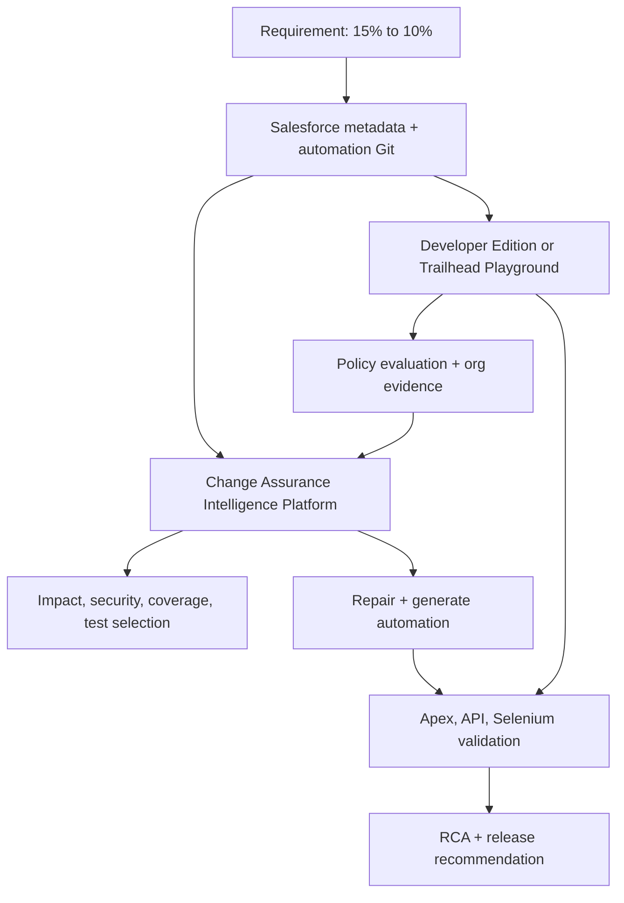
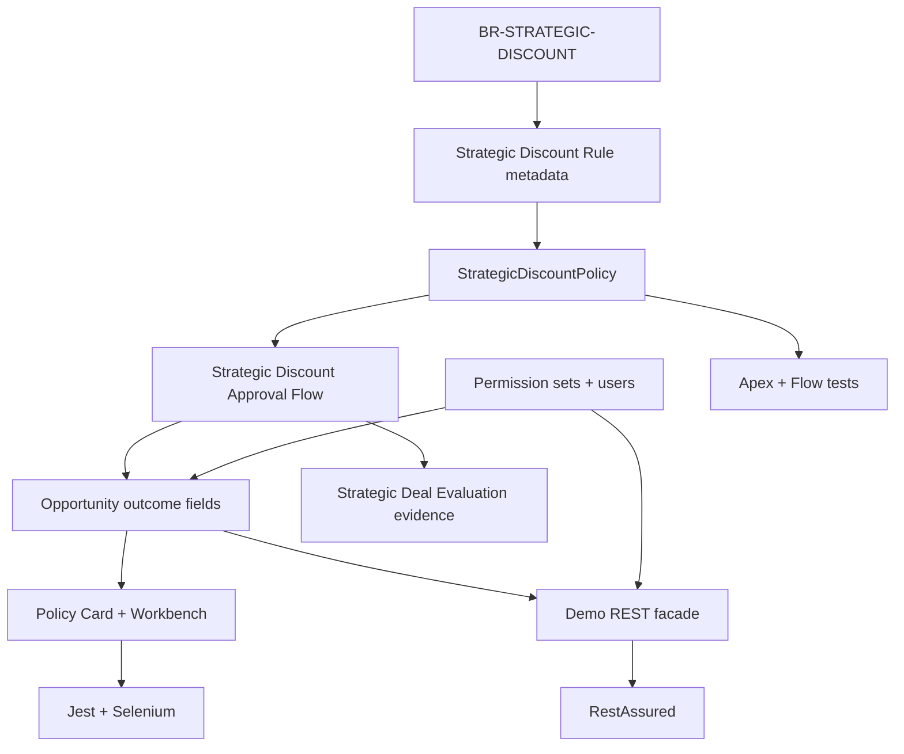

# Strategic Deal Assurance Salesforce App

## Live Developer Org / Trailhead Playground and Codex Implementation Guide

| Document control | Value |
|---|---|
| Version | 2.0 — live-org showcase edition |
| Updated | 1 September 2026 |
| Product baseline | Salesforce Change Assurance Intelligence Platform solution design v1.1 |
| Primary purpose | Build a reproducible Salesforce app that supplies live evidence for every hackathon capability |

| Item | Decision |
|---|---|
| Target outcome | A working live Salesforce demo app, source-controlled DX fixture, runnable Apex/API/UI suites, controlled mutations, and evidence packs for the Change Assurance Intelligence Platform |
| Recommended org | A dedicated, free Salesforce Developer Edition org |
| Fallback org | A new Trailhead Playground |
| Recommended build route | Local Salesforce CLI + Git + Codex CLI or Codex in the ChatGPT desktop app |
| Manual work that remains | Account creation, email activation, MFA, browser OAuth, security-sensitive integration setup, approval of patches/deployments, and one short Flow Builder seed if generated Flow XML is incompatible |
| Data policy | Synthetic demo data only; no customer or production data |
| Baseline business rule | A strategic Opportunity with Amount greater than INR 5 crore and Discount greater than 15% requires Regional VP approval |
| Demonstrated change | Reduce the discount threshold from greater than 15% to greater than 10%; the amount and approver rules remain unchanged |
| Live execution rule | A live Apex/API/UI result must identify the org, source commit, deployed metadata version, test asset hash, execution time, and whether any step was simulated |
| Release rule | A simulated, stale, unauthenticated, or untraceable mandatory result can never produce `GO` |

This guide turns the product solution design into a Salesforce application that can be developed in a personal org and used as the canonical live integration fixture. The wider Change Assurance Intelligence Platform still runs outside Salesforce and consumes this app's requirement, Git metadata, org metadata, security configuration, automation assets, live test results, logs, DOM evidence, and approval decisions.

Version 1 of this guide was sufficient for a fixture-first POC. Version 2 makes the following capabilities live-demo requirements instead of optional ideas:

- deployed and queryable Salesforce metadata, Flow, Apex, permissions, Lightning app, LWC, and synthetic data;
- live Apex tests, authenticated REST tests, and a real Selenium end-to-end smoke test;
- an auditable policy-evaluation record for correlating input, rule version, outcome, and test execution;
- controlled branches for business change, locator drift, permission regression, product defect, automation defect, and bad test data;
- deterministic reset, preflight, execution, cleanup, and evidence-capture commands;
- a capability-to-evidence matrix and a rehearsable multi-run demo script.

> **Important scope boundary:** the Salesforce app is the system-under-test and evidence producer. Impact, risk, coverage, test selection, repair/generation, RCA, approvals, and release decisions remain in the Change Assurance Intelligence Platform. Do not move those decisions into Salesforce code or prompts.

---

## 0. Live-demo capability contract

The app is ready only when the platform can demonstrate every row below using either live Salesforce evidence or an explicitly labelled fixture where live execution is not the capability being tested.

| Platform capability | Required org/repository stimulus | Evidence the platform must show | Pass gate |
|---|---|---|---|
| Change detection | `demo-baseline-15` versus the 10% feature branch | Requirement diff, Git diff, metadata hash, changed symbols | Exact source refs and hashes are recorded |
| Business/technical impact | Custom Metadata threshold and linked policy components | Paths from requirement → rule record → Apex → Flow → Opportunity/LWC/API/tests | Every reported path opens valid evidence |
| Security impact | Sales, approver, integration, and automation permissions | CRUD/FLS/class/app access and approval-role differences | No unsupported permission claim; critical paths are complete |
| Risk scoring | Threshold change plus control and test gaps | Deterministic factors, policy version, overrides | Re-running the same snapshot reproduces the score |
| Obligation coverage | 10.00, 10.01, missing approver, non-strategic, permission-negative cases | Covered/missing obligations and evidence strength | Every mandatory boundary/control obligation is accounted for |
| Intelligent test selection | Tagged Apex/API/UI/permission tests | Minimal selected suite and reasons for excluding unrelated UI regression | All mandatory tests are pinned before optimization |
| Automation inventory | Apex, Flow tests, RestAssured, Selenium/Page Objects, LWC Jest | Assets, symbols, locators, data, assertions, tags, framework profiles | Inventory hashes match the active commit |
| Maintenance classification | Stale 15% expectations and renamed UI hook | `KEEP`, `REPAIR`, `REFACTOR`, `RETIRE`, or `GENERATE` per asset | Classification includes exact source regions and evidence |
| Test repair | Existing Apex/API assertion and Selenium locator | Isolated patch with base hash, changed lines, rationale, validation plan | No active-worktree/protected-branch direct edit |
| Complete test generation | Missing 10.00/10.01/API/UI/permission scenario | Framework-conformant setup, data, actions, assertions, teardown, tags | Parse, compile, discovery, assertion-quality, and execution gates pass |
| Locator healing | Controlled `data-testid` drift while accessible label remains stable | Old locator failure, ranked candidates, uniqueness/negative checks, selected locator | Repaired locator is unique and stable across repeated live runs |
| Executable validation | Known-good and deliberately assertion-free generated assets | Compile/discovery/security/execution/mutation-sensitivity results | Assertion-free artifact is rejected |
| Live execution | Authorized Developer Edition/Playground | Apex, REST, Selenium results tied to org and commit | Mandatory live results are not simulated and are fresh |
| RCA | Product, automation/locator, data, environment, and flaky seeds | Ranked hypotheses, supporting/contradicting evidence, next diagnostic action | Product defect is distinguished from automation defect |
| Controlled writeback | Approved isolated patch | Approver, scope, expiry, base/head hashes, post-write validation | Stale or unapproved patch is blocked |
| Release assurance | Results before and after repair | `NO_GO`/`CONDITIONAL_GO` then eligible `GO`, with blockers/conditions | Decision comes from versioned deterministic policy |
| Evidence/audit | Policy-evaluation log, org result IDs, hashes, platform events | Click-through evidence chain and audit events | No conclusion lacks an `EvidenceRef` |
| Reproducibility/resume | Repeat same inputs; inject one worker interruption | Identical deterministic reports; no duplicate Salesforce side effects | Run resumes idempotently and records the interruption |
| UI/API/MCP parity | Same assurance run queried through enabled surfaces | Same run ID and underlying service results | No separate business logic per surface |

### 0.1 Required demo profiles

Use explicit profiles so missing live capabilities cannot be hidden.

| Profile | What must be live | Permitted simulation | Eligible final decision |
|---|---|---|---|
| `FIXTURE_DEV` | Local parsers, graph, automation validation | Salesforce connection and test execution | At most `CONDITIONAL_GO` |
| `LIVE_CORE` | Metadata retrieve/deploy, SOQL, Apex and REST execution | Selenium only if interactive login is unavailable | At most `CONDITIONAL_GO` when UI is mandatory |
| `LIVE_SHOWCASE` | Metadata, data, permissions, Apex, REST, LWC/Selenium smoke, evidence capture | Only deliberately injected platform-worker failure | Eligible for policy-controlled `GO` |

The hackathon rehearsal and final demo should use `LIVE_SHOWCASE`. Retain `FIXTURE_DEV` for ordinary development when the org is unavailable.

### 0.2 One app, several controlled runs

Do not try to demonstrate all categories in one polluted execution. Reset to the tagged baseline between runs.

| Run | Controlled change/failure | Main capability proven | Expected initial result |
|---|---|---|---|
| R1 | 15% → 10% rule change, tests still at 15% | Impact, security, risk, coverage, selection | `NO_GO` or `CONDITIONAL_GO` |
| R2 | Approved 10% repair plus missing tests | Repair, generation, validation, writeback | Eligible to progress after live tests |
| R3 | Rename only the controlled LWC test hook | Locator drift/healing | Block until unique healed locator passes |
| R4 | Change strict `>` to inclusive `>=` | Product-defect RCA | `NO_GO` |
| R5 | Leave product correct but keep a stale API/UI assertion | Automation-defect RCA | Block automation asset, not product release blindly |
| R6 | Omit Regional VP approver in synthetic data | Test-data/configuration RCA | `NO_GO` for that mandatory scenario |
| R7 | Revoke/expire the execution authorization or target a false alias | Environment RCA and abstention | `INCOMPLETE`; never infer product failure |
| R8 | Inject a bounded timing fault in a test-only branch | Flaky classification and rerun policy | `INCONCLUSIVE` until stability policy completes |
| R9 | Add an unrelated Account requirement and no matching Git change | Hallucination/unsupported-claim control | No confirmed Opportunity impact; weak inference is labelled/rejected |
| R10 | Requirement says 10% while Git changes to 12% | Conflict detection and human review guardrail | `INCOMPLETE`/`NO_GO`; no silent reconciliation |
| R11 | Use a deliberately stale graph snapshot | Freshness gate and re-ingestion | Analysis blocked or marked stale until re-index succeeds |
| R12 | Interrupt the platform worker after Salesforce create but before checkpoint | Durable resume and idempotency | Resume without duplicate Opportunity/evaluation side effects |

---

## 1. What you are building

You are building two connected things:

1. **Strategic Deal Assurance**, a small but production-minded Salesforce app on the standard `Opportunity` object.
2. **A source-controlled change-assurance fixture**, containing Salesforce metadata plus Apex, API, and UI automation assets that the Change Assurance Intelligence Platform can analyze, repair, generate, execute, and use for RCA.

The Salesforce app contains:

- Opportunity fields for strategic deal classification, discount, Regional VP approver, approval status, explanation, applied rule version, and last evaluation time.
- A Custom Metadata Type that centrally stores the amount and discount thresholds.
- Bulk-safe Apex policy logic exposed as a Flow invocable action.
- A record-triggered Flow that reevaluates approval only when relevant inputs change, writes a queryable policy-evaluation audit record, handles faults, and avoids infinite update recursion.
- Separate sales, approver, integration, and optional browser-runner permission sets.
- A Lightning app, Opportunity page, and required LWC policy card with controlled semantic test hooks.
- An Apex REST facade for a narrow, authenticated business-process API scenario.
- Native Approval Process enforcement after the core live fixture is stable; functional single-user mode is allowed only when license limits prevent segregation of duties.
- Synthetic Opportunities representing boundary, positive, negative, permission, and failure scenarios.

The surrounding repository contains:

- Apex tests for deterministic policy boundaries.
- RestAssured tests and CLI REST probes for end-to-end live record behavior.
- Selenium Java + TestNG Page Objects for live UI smoke, impact, repair, locator-healing, and generation demonstrations.
- LWC Jest tests and Salesforce Flow tests for lower-level executable evidence.
- A baseline Git tag, a 10% feature branch, controlled mutation branches, and deterministic demo/reset scripts.



### What this demo proves

The intended demonstration is:

1. Git detects the threshold change.
2. The evidence graph links the changed rule to Custom Metadata, Apex, Flow, Opportunity fields, permissions, and tests.
3. Coverage identifies obsolete 15% assertions and missing 10% boundary cases.
4. Existing UI/API/Apex automation is classified as `KEEP`, `REPAIR`, `REFACTOR`, `RETIRE`, or `GENERATE`.
5. The platform proposes an isolated repair patch and complete missing test artifacts.
6. The artifacts pass parse, compile, discovery, execution, assertion-quality, and stability gates.
7. A seeded failure is classified as product, automation, locator, data, environment, timing/flaky, or unknown.
8. The release decision remains `NO_GO` or `CONDITIONAL_GO` until mandatory evidence passes.
9. After approved repairs pass against the live org, the same deterministic policy can return an eligible `GO` without changing its rules in a prompt.

---

## 2. Choose the personal Salesforce environment

### Recommended: dedicated Developer Edition

Use a dedicated Developer Edition for this project. Salesforce describes Developer Edition as a free, full-featured environment for building apps, Apex, automation, and API integrations, and its current edition remains available as long as it is kept in use. Start from Salesforce's [Developer Edition introduction and signup link](https://developer.salesforce.com/blogs/2025/03/introducing-the-new-salesforce-developer-edition-now-with-agentforce-and-data-cloud).

Why it is the preferred choice:

- It is a standalone personal development org rather than a course-specific environment.
- It is easier to name, authorize repeatedly, and keep as the live demo integration target.
- It supports Salesforce CLI, Metadata API, Apex, Flow, permission sets, REST API, and synthetic records.
- It is better suited to a multi-week source-control workflow.

### Fallback: Trailhead Playground

Use a new Trailhead Playground if Developer Edition signup is unavailable or you want to start immediately. Trailhead documents that a new Playground can be created from the org selector on a hands-on unit and usually takes a few minutes. The username and password can be obtained through the Playground Starter app; see [Access Playground Credentials and Management](https://trailhead.salesforce.com/content/learn/modules/trailhead_playground_management/get-your-trailhead-playground-username-and-password).

Limitations for this project:

- Playgrounds are excellent for learning but can contain Trailhead-specific packages and configuration.
- It is easy to accidentally use the wrong Playground.
- Credentials are initially hidden until you reset the password.
- Some newer features or limits may differ from a fresh Developer Edition.

### Selection rule

| Situation | Choose |
|---|---|
| You want a stable five-week project and demo org | Developer Edition |
| Developer Edition signup is blocked | Trailhead Playground |
| You are completing Trailhead badges at the same time | Use a separate Playground for the badges; do not use the app org |
| You already have a production Salesforce org | Do not use it; create a personal non-production org |

Do not build this fixture in a real client org. The fixture deliberately creates fields, automation, security configuration, records, and tests that must stay isolated.

### 2.1 Org capability preflight

Before generating metadata, record the answers in `evidence/org-capability-preflight.md`. Do not assume that every personal org exposes the same licenses or preview features.

| Check in Setup | Minimum for `LIVE_SHOWCASE` | Fallback if unavailable |
|---|---|---|
| Company Information → edition and API requests | Developer Edition/Playground with API access | Use another dedicated personal org |
| User Licenses | Admin plus a second suitable user or an integration user license | Use admin for functional execution; label SOD limitation |
| Permission Set Licenses | Enough entitlement for intended integration user | Use an existing Salesforce user with least privilege |
| My Domain | Deployed | Deploy before LWC/OAuth work |
| Flows | Record-triggered Flow and Flow tests available | Use Apex/CLI checks and document missing Flow-test evidence |
| External Client Apps | Creation/management available | Use interactive CLI authorization for the demo API probes |
| Hosted MCP Servers | Optional; standard/custom server available and enabled by admin | Use CLI/REST adapters; MCP is not a core dependency |
| Available storage | Enough for synthetic Opportunities and evaluation logs | Add cleanup before every rehearsal |

Store no org ID, username, domain, license allocation, or limits in a public repository. A sanitized report may retain only edition, capability booleans, collection time, and a one-way environment fingerprint.

---

## 3. Create and secure the personal account

### 3.1 Developer Edition setup

1. Open the Developer Edition signup link from the Salesforce page above.
2. Enter your real name and personal email address.
3. Enter a company value such as `Personal Learning` or `Hackathon Lab`.
4. Choose your country and role.
5. Create a globally unique Salesforce username. It must look like an email address but does not have to be a working mailbox. Example:

   ```text
   your.name+changeassurance.dev@example.com
   ```

6. Accept the terms and submit the form.
7. Open the activation email and set a strong, unique password.
8. Complete MFA enrollment if prompted. Prefer an authenticator app or security key.
9. Sign in and bookmark the org's My Domain URL.
10. In **Setup → Company Information**, verify the org edition and available user/API limits.
11. In **Setup → Company Information** or locale settings, use an India/INR currency locale for the demo if the org permits it. Do not enable multi-currency solely for this fixture unless the team needs currency conversion behavior.
12. In **Setup → My Domain**, confirm that My Domain is deployed. New orgs commonly have it already.

### 3.2 Trailhead Playground setup

1. Sign in to Trailhead with your personal account.
2. Open any hands-on unit.
3. At the bottom of the page, select the current org name and choose **Create Playground**.
4. Give it a distinctive name such as `Change Assurance Demo`.
5. Launch it after creation.
6. Open **App Launcher → Playground Starter → Get Your Login Credentials**.
7. Record the generated username.
8. Select **Reset My Password**, follow the email link, and set a strong password.
9. Do not change the generated Playground username; Trailhead warns that changing it can complicate later use.
10. Complete MFA if prompted.

Salesforce's current DX setup walkthrough confirms that a Playground password is required for tools outside Trailhead and that Salesforce CLI manages the app lifecycle, source synchronization, and tests; see [Set Up Your Salesforce DX Environment](https://trailhead.salesforce.com/content/learn/projects/quick-start-lightning-web-components/set-up-salesforce-dx).

### 3.3 Security rules before development

- Never paste a Salesforce password, security token, OAuth refresh token, SFDX auth URL, client secret, or access token into a Codex prompt.
- Never commit `.sf/`, `.sfdx/`, `.env`, browser profiles, screenshots containing tokens, or command output containing a frontdoor URL.
- Use the Salesforce CLI's local authenticated session.
- Grant the minimum access required through permission sets.
- Use synthetic names, accounts, opportunities, and emails.
- Keep the first connection interactive; automate noninteractive authentication only later and only with a dedicated automation user, External Client App, certificate, and secure secret store.

### 3.4 Authentication design for the live demo

Use separate authentication lanes. MFA applies to human interactive access; OAuth is the correct foundation for API/CLI automation.

| Lane | Identity | Recommended authentication | Demo use |
|---|---|---|---|
| Human administration | Your personal admin | Browser login with MFA | Setup, approval, manual recovery |
| Local Salesforce CLI | Your admin during development | One-time `sf org login web`, then the CLI's stored OAuth authorization | Deploy, retrieve, Apex tests, SOQL, CLI REST probes |
| Agent/API execution | Dedicated integration user when the org provides one | External Client App + JWT certificate flow | Noninteractive metadata/data/test execution |
| Live Selenium | Dedicated least-privilege UI test user when a spare license exists | Interactive pre-auth/MFA handoff before the suite; controlled temporary browser profile | End-to-end Lightning test |
| Personal-org fallback | Your admin | Interactive pre-auth/MFA handoff immediately before Selenium | Functional demo only; not production segregation of duties |

As of July 2026, Salesforce's enforcement guidance states that the **Waive Multi-Factor Authentication for Exempt Users** permission no longer automatically exempts users from MFA in the affected enforcement program. Therefore:

- do not design the demo around a blanket MFA waiver;
- do not exempt your personal administrator merely to make Selenium unattended;
- use an interactive login checkpoint for the hackathon UI suite;
- use OAuth JWT/client-credentials-style server-to-server authentication for API and agent work;
- if a Salesforce support-approved exception or temporary extension applies to a dedicated automation account, verify it in that org immediately before relying on it and record the limitation.

The interactive Selenium runner must:

1. start a fresh, task-specific browser profile outside the repository;
2. open the My Domain login page;
3. pause while you enter credentials and complete MFA without the agent seeing them;
4. detect the Strategic Deal Assurance app shell after login;
5. start the timed test only after authenticated readiness;
6. close the browser and securely delete or expire the temporary profile after the run.

Never automate MFA prompts, scrape authenticator codes, persist a frontdoor/session URL, or reuse a personal browser profile in CI.

### 3.5 External Client App and JWT lane

For a fully unattended API/CLI lane, create an External Client App (ECA). Salesforce requires an ECA for current `sf org login jwt` authorization.

1. Confirm a dedicated integration user license in **Setup → Company Information**. Developer Editions can expose one or more integration user licenses; verify your actual org.
2. Create a least-privilege permission set `Change_Assurance_Integration` with API access, required Opportunity/evaluation-object CRUD/FLS, and Apex class access only.
3. Generate a certificate/key pair locally. Commit only the public certificate if your policy permits; keep the private key outside the repository in the approved secret store.
4. In **Setup → External Client Apps**, create `Change Assurance Demo Integration`.
5. Enable OAuth and the JWT bearer flow; add only the scopes required by the test harness.
6. Configure admin pre-authorization and assign only the integration permission set/user.
7. Record the client ID as non-secret configuration. Treat the private key and any client secret as secret.
8. Authorize without printing credentials:

   ```bash
   sf org login jwt \
     --username "$CAIP_SF_INTEGRATION_USERNAME" \
     --client-id "$CAIP_SF_ECA_CLIENT_ID" \
     --jwt-key-file "$CAIP_SF_JWT_KEY_FILE" \
     --instance-url "$CAIP_SF_INSTANCE_URL" \
     --alias caip-ci
   ```

9. Run a read-only query first, then a synthetic record create/delete smoke test.
10. Revoke the ECA or rotate the certificate after the event if it is no longer needed.

If the ECA cannot be created, `sf org login web` plus CLI REST probes is an acceptable live hackathon fallback, but label the API lane as interactive rather than CI-ready.

---

## 4. Install the local development tools

### Required

- Git
- Salesforce CLI (`sf`)
- Codex CLI or Codex in the ChatGPT desktop app opened on the local repository
- A current browser
- Java 17 and Maven for the required RestAssured and Selenium Java fixtures
- Node.js/npm for the required LWC Jest tests and Salesforce Code Analyzer tooling

### Optional but useful

- Visual Studio Code
- Salesforce Extension Pack
- Chrome/Edge plus a matching Selenium-managed driver
- Salesforce Code Analyzer and the current Salesforce DX/metadata context skills available to the coding assistant
- A Salesforce Hosted MCP SObject server for an optional OAuth-governed read/query demonstration

### 4.1 Verify Salesforce CLI

Install Salesforce CLI using Salesforce's platform-specific installer, then run:

```bash
sf --version
sf update
sf commands --help
```

The official Trailhead DX setup states that Salesforce CLI controls environment creation, source synchronization, and test execution. The live command syntax should always be checked against the [Salesforce CLI command reference](https://developer.salesforce.com/docs/platform/salesforce-cli-reference/guide/).

### 4.2 Install and run Codex locally

Use Codex locally so it can work against the same repository and installed Salesforce CLI. The official [Codex CLI guide](https://learn.chatgpt.com/docs/codex/cli) documents that Codex can inspect and edit a local repository, run installed tools, and automate repeatable terminal workflows.

On supported macOS/Linux environments, the current official installer is:

```bash
curl -fsSL https://chatgpt.com/codex/install.sh | sh
```

Then:

```bash
codex
```

Sign in with ChatGPT when prompted. On Windows, use the installation option shown on the official Codex CLI page, or use the ChatGPT desktop app/IDE extension.

Start with normal workspace permissions. Codex uses a workspace sandbox plus an approval policy; network and out-of-workspace actions can require approval. Review [Agent approvals and security](https://learn.chatgpt.com/docs/agent-approvals-security) before broadening access.

### 4.3 Preflight checks

From a terminal, or by asking Codex to run them:

```bash
git --version
sf --version
java -version
mvn -version
codex --version
```

Java/Maven and Node/npm may be absent during the first metadata-only milestone, but `LIVE_SHOWCASE` is not complete until all required toolchains are installed and their versions are captured in the evidence manifest.

---

## 5. Create the source-controlled project

Run these commands yourself or give the first Codex prompt in section 15.

```bash
sf project generate --name strategic-deal-assurance --manifest
cd strategic-deal-assurance
git init
git add .
git commit -m "chore: initialize Salesforce DX project"
```

Salesforce documents `sf project generate` as the command that creates the DX project structure and `sfdx-project.json`; see [Generate a Salesforce DX project](https://developer.salesforce.com/docs/platform/salesforce-cli-reference/guide/cli_reference_template_generate_project.html).

Use this target structure:

```text
strategic-deal-assurance/
├── AGENTS.md
├── README.md
├── sfdx-project.json
├── package.json
├── pom.xml
├── manifest/
│   └── package.xml
├── force-app/main/default/
│   ├── applications/
│   ├── classes/
│   ├── customMetadata/
│   ├── flows/
│   ├── flowTests/
│   ├── layouts/
│   ├── lwc/
│   │   ├── strategicDealPolicyCard/
│   │   └── strategicDealWorkbench/
│   ├── objects/
│   │   ├── Opportunity/fields/
│   │   ├── Strategic_Deal_Evaluation__c/fields/
│   │   └── Strategic_Discount_Rule__mdt/fields/
│   ├── permissionsets/
│   ├── permissionSetGroups/
│   ├── approvalProcesses/
│   └── flexipages/
├── automation/
│   ├── api-restassured/src/test/java/
│   ├── ui-selenium/src/test/java/
│   ├── framework-profiles/
│   └── automation-ir/
├── data/
│   ├── seed-plan.json
│   └── *.json
├── demo/
│   ├── manifests/
│   ├── mutations/
│   │   ├── threshold-10/
│   │   ├── locator-drift/
│   │   ├── product-inclusive-boundary/
│   │   ├── stale-automation/
│   │   └── permission-regression/
│   └── expected/
├── scripts/
│   ├── preflight/
│   ├── org/
│   ├── test/
│   ├── demo/
│   └── evidence/
├── requirements/
│   ├── BR-STRATEGIC-DISCOUNT-baseline.md
│   └── BR-STRATEGIC-DISCOUNT-change-10.md
└── evidence/                       # generated, sanitized, retention-controlled
    ├── README.md
    ├── manifests/
    ├── apex/
    ├── api/
    ├── ui/
    ├── metadata/
    └── rca/
```

### 5.1 Add repository guidance for Codex

Codex reads repository `AGENTS.md` instructions before it works. The official [AGENTS.md guide](https://learn.chatgpt.com/docs/agent-configuration/agents-md) describes repository-scoped guidance and precedence. Create this file:

```md
# AGENTS.md

## Goal
Maintain the Strategic Deal Assurance Salesforce fixture used by the Change Assurance Intelligence Platform demo.

## Rules
- Use Salesforce DX source format under force-app/main/default.
- Use the API version already present in sfdx-project.json; do not invent a newer version.
- Keep the rule threshold in Strategic_Discount_Rule.Default custom metadata, not duplicated in Flow or Apex.
- Amount comparison is strictly greater than INR 50,000,000.
- Discount comparison is strictly greater than the configured threshold.
- Apex must be bulk-safe, with sharing, deterministic, and free of DML/SOQL in loops.
- Do not add credentials, tokens, SFDX auth URLs, org URLs with session IDs, or real customer data.
- Do not delete metadata or deploy destructive changes without explicit approval.
- Treat Flow XML as version-sensitive. If generation fails, ask for a UI-created seed Flow, retrieve it, then edit it.
- Keep UI locators accessible and stable; prefer role, label, and data-testid over CSS position or generated Lightning classes.
- Keep `Strategic_Deal_Evaluation__c` append-only for demo evidence; cleanup is performed only by an explicit reset script.
- Every live test must tag `BR-STRATEGIC-DISCOUNT`, its framework, obligation IDs, and live/fixture mode.
- Every mutation must be isolated, named, reversible, and applied only after the baseline commit/hash is verified.
- Never let the LLM invent or change release/risk rules, approve its own patch, or mutate permissions/deployments directly.
- Do not use `sf org open --url-only`, a frontdoor URL, or access-token output to bypass interactive UI authentication.

## Required verification
- Run Apex tests with code coverage after Apex changes.
- Validate or deploy only to the explicitly named non-production org alias caip-dev.
- Query synthetic Opportunities after deployment and show boundary outcomes.
- Review git diff before committing.
- Done means metadata deploys, tests pass, Flow is active, no secrets are tracked, and the 15% baseline is tagged.
- Run Salesforce Code Analyzer for Apex, Flow, and LWC source; unresolved High/Critical findings block the live showcase.
- Capture evidence using structured command output, redact environment identifiers, and hash artifacts before ingestion.
```

---

## 6. Authorize the org for Salesforce CLI

From the project directory:

```bash
sf org login web --alias caip-dev --set-default
```

This is the principal human handoff:

1. Codex can start the command.
2. Your browser opens.
3. You enter Salesforce credentials and complete MFA yourself.
4. You approve access.
5. Return to the terminal after the success page appears.

Salesforce documents that `sf org login web` opens browser authentication and then authorizes deploy/retrieve commands; it also recommends an alias. See [org login web](https://developer.salesforce.com/docs/platform/salesforce-cli-reference/guide/cli_reference_org_login_web.html).

Verify without printing secrets:

```bash
sf org list
sf org display --target-org caip-dev
sf org open --target-org caip-dev
```

Do not run commands that display the access token or SFDX auth URL in a recorded terminal or prompt.

---

## 7. Salesforce application design

### 7.1 Metadata inventory

| Type | API name | Purpose | P0/P1 |
|---|---|---|---|
| Standard object | `Opportunity` | Main business record | P0 |
| Opportunity field | `Strategic_Deal__c` | Marks the deal as strategic | P0 |
| Opportunity field | `Discount__c` | Discount percentage | P0 |
| Opportunity field | `Regional_VP_Approver__c` | User expected to approve | P0 |
| Opportunity field | `Approval_Status__c` | Not Required, Pending, Approved, Rejected, Configuration Error | P0 |
| Opportunity field | `Approval_Reason__c` | Human-readable evaluation evidence | P0 |
| Opportunity field | `Policy_Rule_Version__c` | Rule version applied by the latest evaluation | P0 |
| Opportunity field | `Policy_Evaluated_At__c` | Timestamp of latest policy evaluation | P0 |
| Custom Metadata Type | `Strategic_Discount_Rule__mdt` | Central policy configuration | P0 |
| Custom metadata record | `Strategic_Discount_Rule.Default` | Active rule: 5 crore and 15% baseline | P0 |
| Custom object | `Strategic_Deal_Evaluation__c` | Append-only queryable evidence for each relevant policy evaluation | P0 |
| Apex class | `StrategicDiscountPolicy` | Bulk policy evaluation and Flow action | P0 |
| Apex test | `StrategicDiscountPolicyTest` | Boundary and configuration validation | P0 |
| Apex class | `StrategicDealPolicyController` | Security-conscious read model for LWC | P0 |
| Apex class | `StrategicDealDemoApi` | Narrow REST facade for live API tests | P0 |
| Apex tests | Controller/API test classes | Security, serialization, positive and negative API behavior | P0 |
| Flow | `Strategic_Discount_Approval` | Reevaluate relevant Opportunity changes | P0 |
| Flow Test | `Strategic_Discount_Approval_*` | Live record-triggered Flow boundary and recursion checks | P0 when supported |
| Permission set | `Strategic_Deal_User` | Input-field edit and outcome read access | P0 |
| Permission set | `Regional_VP_Approver` | Approver outcome access | P0 |
| Permission set | `Change_Assurance_Integration` | Least-privilege API/Apex access for agent execution | P0 for unattended API |
| Permission set | `Strategic_Deal_UI_Runner` | Least-privilege browser test access | P0 when a spare UI user exists |
| Custom application | `Strategic_Deal_Assurance` | Demo navigation shell | P0 |
| Lightning component | `strategicDealPolicyCard` | Read-only live status, rule version and evaluation history | P0 |
| Lightning component | `strategicDealWorkbench` | Controlled create/edit surface for stable end-to-end UI automation | P0 |
| LWC Jest suites | Both components | Component behavior, events, accessibility and failure states | P0 |
| Approval Process | `Strategic_Opportunity_Regional_VP` | Native submit/approve/reject/lock behavior | P1; required for full workflow showcase |

### 7.2 Required dependency graph in the org fixture

The app must be rich enough to create meaningful impact paths without becoming a second product. The expected high-value paths are:



Required evidence edges for indexing:

| Source | Relationship | Target |
|---|---|---|
| Requirement acceptance criterion | `CONFIGURED_BY` | `Strategic_Discount_Rule.Default` |
| Apex class | `READS_CONFIG` | Custom Metadata fields |
| Flow | `INVOKES` | `StrategicDiscountPolicy.evaluate` |
| Flow | `READS/WRITES` | Opportunity input/outcome fields |
| Flow | `CREATES` | `Strategic_Deal_Evaluation__c` |
| Permission set | `GRANTS` | Object, field, class and application access |
| LWC | `READS/WRITES` | Opportunity fields; `CALLS` controller |
| REST facade | `CALLS/READS/WRITES` | Policy and Opportunity/evaluation data |
| Automation asset | `ASSERTS` | Acceptance criterion, boundary, permission or UI target |
| Test run | `PRODUCES` | Org result, evaluation row, logs and assertion evidence |

### 7.3 Business-rule truth table

The operators are intentionally strict (`>`), not inclusive (`>=`).

| Strategic | Amount INR | Discount baseline | Approver | Expected status |
|---:|---:|---:|---|---|
| No | 60,000,000 | 20.00 | Present | Not Required |
| Yes | 50,000,000 | 20.00 | Present | Not Required |
| Yes | 50,000,000.01 | 15.00 | Present | Not Required |
| Yes | 50,000,000.01 | 15.01 | Present | Pending Regional VP |
| Yes | 50,000,000.01 | 15.01 | Missing | Configuration Error |
| Yes | Null | 20.00 | Present | Not Required |
| Yes | 60,000,000 | Null | Present | Not Required |

After the feature change, replace 15.00/15.01 with 10.00/10.01. The 5-crore boundary does not change.

For every evaluated row, assert both the Opportunity outcome and the newest `Strategic_Deal_Evaluation__c` record. The evidence row must contain the Opportunity reference, input snapshot, approval-required flag, outcome, reason, rule version, source, correlation ID, and evaluation time.

### 7.4 Why Custom Metadata is the source of truth

Do not copy the number `15` into the Flow, Apex, Approval Process criteria, LWC, and tests as separate production values. Central configuration prevents policy drift. The graph still maps the changed custom metadata record to the Apex class, Flow, Opportunity fields, permissions, and automation assertions.

Tests contain explicit boundary expectations because they are independent oracles. When the requirement changes, the assurance product should find and repair those old test expectations rather than silently reading the same configuration under test.

### 7.5 Demo fixture constraints

- Keep one active Custom Metadata record named `Default` for the primary scenario.
- Do not hardcode Salesforce record IDs, usernames, org URLs, or generated Lightning classes.
- Every custom component, class, Flow resource, permission set, and test contains the requirement ID in its description or tags.
- Use explicit sharing and database access modes in Apex, even where API 67.0 defaults are safer, so behavior remains clear across org versions.
- Keep the business policy deterministic. LLMs may explain or propose patches but never participate in Salesforce runtime evaluation.
- The evaluation object is evidence, not the platform's immutable audit store. The assurance platform copies and hashes selected rows/results into its own evidence store.

---

## 8. Implement the metadata

Codex should generate the XML files using the current `sourceApiVersion` from `sfdx-project.json`. The snippets below show the important values; all files use this root namespace:

```xml
xmlns="http://soap.sforce.com/2006/04/metadata"
```

### 8.1 Opportunity fields

Create these files under `force-app/main/default/objects/Opportunity/fields/`.

#### `Strategic_Deal__c.field-meta.xml`

```xml
<?xml version="1.0" encoding="UTF-8"?>
<CustomField xmlns="http://soap.sforce.com/2006/04/metadata">
    <fullName>Strategic_Deal__c</fullName>
    <defaultValue>false</defaultValue>
    <description>Marks an Opportunity as subject to the strategic-deal approval policy.</description>
    <label>Strategic Deal</label>
    <type>Checkbox</type>
</CustomField>
```

#### `Discount__c.field-meta.xml`

```xml
<?xml version="1.0" encoding="UTF-8"?>
<CustomField xmlns="http://soap.sforce.com/2006/04/metadata">
    <fullName>Discount__c</fullName>
    <description>Requested discount percentage. Enter 15 for 15 percent.</description>
    <label>Discount</label>
    <precision>5</precision>
    <scale>2</scale>
    <type>Percent</type>
</CustomField>
```

#### `Regional_VP_Approver__c.field-meta.xml`

```xml
<?xml version="1.0" encoding="UTF-8"?>
<CustomField xmlns="http://soap.sforce.com/2006/04/metadata">
    <fullName>Regional_VP_Approver__c</fullName>
    <deleteConstraint>SetNull</deleteConstraint>
    <description>User responsible for Regional VP approval.</description>
    <label>Regional VP Approver</label>
    <referenceTo>User</referenceTo>
    <relationshipName>Strategic_Opportunities</relationshipName>
    <required>false</required>
    <type>Lookup</type>
</CustomField>
```

#### `Approval_Status__c.field-meta.xml`

```xml
<?xml version="1.0" encoding="UTF-8"?>
<CustomField xmlns="http://soap.sforce.com/2006/04/metadata">
    <fullName>Approval_Status__c</fullName>
    <description>Current outcome of the strategic discount evaluation.</description>
    <label>Approval Status</label>
    <type>Picklist</type>
    <valueSet>
        <restricted>true</restricted>
        <valueSetDefinition>
            <sorted>false</sorted>
            <value><fullName>Not Required</fullName><default>true</default><label>Not Required</label></value>
            <value><fullName>Pending Regional VP</fullName><default>false</default><label>Pending Regional VP</label></value>
            <value><fullName>Approved</fullName><default>false</default><label>Approved</label></value>
            <value><fullName>Rejected</fullName><default>false</default><label>Rejected</label></value>
            <value><fullName>Configuration Error</fullName><default>false</default><label>Configuration Error</label></value>
        </valueSetDefinition>
    </valueSet>
</CustomField>
```

#### `Approval_Reason__c.field-meta.xml`

```xml
<?xml version="1.0" encoding="UTF-8"?>
<CustomField xmlns="http://soap.sforce.com/2006/04/metadata">
    <fullName>Approval_Reason__c</fullName>
    <description>Deterministic explanation of the latest policy evaluation.</description>
    <label>Approval Reason</label>
    <length>32768</length>
    <type>LongTextArea</type>
    <visibleLines>4</visibleLines>
</CustomField>
```

Also create these two traceability fields:

```xml
<!-- Policy_Rule_Version__c.field-meta.xml -->
<?xml version="1.0" encoding="UTF-8"?>
<CustomField xmlns="http://soap.sforce.com/2006/04/metadata">
    <fullName>Policy_Rule_Version__c</fullName>
    <description>Rule version applied during the latest BR-STRATEGIC-DISCOUNT evaluation.</description>
    <label>Policy Rule Version</label>
    <length>40</length>
    <trackHistory>true</trackHistory>
    <type>Text</type>
</CustomField>
```

```xml
<!-- Policy_Evaluated_At__c.field-meta.xml -->
<?xml version="1.0" encoding="UTF-8"?>
<CustomField xmlns="http://soap.sforce.com/2006/04/metadata">
    <fullName>Policy_Evaluated_At__c</fullName>
    <description>UTC time of the latest BR-STRATEGIC-DISCOUNT evaluation.</description>
    <label>Policy Evaluated At</label>
    <trackHistory>true</trackHistory>
    <type>DateTime</type>
</CustomField>
```

Enable history tracking where supported for `Discount__c`, `Strategic_Deal__c`, `Regional_VP_Approver__c`, `Approval_Status__c`, and `Policy_Rule_Version__c`. Verify deployability in the actual org because standard-object history settings and tracked-field limits can vary. History is supplemental evidence; the custom evaluation record is the canonical live test correlation artifact.

### 8.2 Policy-evaluation evidence object

Create `force-app/main/default/objects/Strategic_Deal_Evaluation__c/Strategic_Deal_Evaluation__c.object-meta.xml`:

```xml
<?xml version="1.0" encoding="UTF-8"?>
<CustomObject xmlns="http://soap.sforce.com/2006/04/metadata">
    <deploymentStatus>Deployed</deploymentStatus>
    <description>Append-only synthetic execution evidence for BR-STRATEGIC-DISCOUNT.</description>
    <enableActivities>false</enableActivities>
    <enableFeeds>false</enableFeeds>
    <enableHistory>true</enableHistory>
    <label>Strategic Deal Evaluation</label>
    <nameField>
        <displayFormat>SDE-{000000}</displayFormat>
        <label>Evaluation Number</label>
        <type>AutoNumber</type>
    </nameField>
    <pluralLabel>Strategic Deal Evaluations</pluralLabel>
    <sharingModel>ReadWrite</sharingModel>
</CustomObject>
```

Create its fields from this exact contract. Codex should generate complete metadata using the project's current API version and validate it before deployment.

| API name | Type | Required behavior |
|---|---|---|
| `Opportunity__c` | Lookup → Opportunity | Required relation to evaluated record |
| `Correlation_Id__c` | Text(80), external ID | Flow interview/test correlation; not globally unique across restored fixtures |
| `Amount_INR__c` | Number(18,2) | Input snapshot |
| `Discount_Percent__c` | Number(5,2) | Input snapshot |
| `Strategic_Deal__c` | Checkbox | Input snapshot |
| `Approver_Present__c` | Checkbox | Input snapshot without exposing a user identity |
| `Approval_Required__c` | Checkbox | Deterministic policy result |
| `Outcome__c` | Restricted picklist | Not Required, Pending Regional VP, Configuration Error, Approved, Rejected |
| `Reason__c` | Long Text Area(32768) | Deterministic explanation |
| `Rule_Version__c` | Text(40) | `baseline-15` or `change-10` |
| `Evaluation_Source__c` | Restricted picklist | Flow, REST, UI, Apex Test, Seed |
| `Evaluated_At__c` | DateTime | UTC event time |
| `Input_Hash__c` | Text(64) | SHA-256 of normalized non-sensitive inputs |

Security rules:

- Sales and approver users receive read access only to evaluation rows related to Opportunities they can access.
- Only the Flow/Apex service and integration runner create rows.
- No normal user edits or deletes evidence rows.
- Cleanup is an explicit admin/demo reset operation and is separately audited.
- Do not store access tokens, usernames, email addresses, raw debug logs, or full serialized user records.

### 8.3 Custom Metadata Type

Create `force-app/main/default/objects/Strategic_Discount_Rule__mdt/Strategic_Discount_Rule__mdt.object-meta.xml`:

```xml
<?xml version="1.0" encoding="UTF-8"?>
<CustomObject xmlns="http://soap.sforce.com/2006/04/metadata">
    <description>Version-controlled strategic discount approval configuration.</description>
    <label>Strategic Discount Rule</label>
    <pluralLabel>Strategic Discount Rules</pluralLabel>
    <visibility>Public</visibility>
</CustomObject>
```

Add fields under its `fields/` directory:

| File/API name | Type | Detail |
|---|---|---|
| `Active__c.field-meta.xml` | Checkbox | Default `false` |
| `Minimum_Amount_INR__c.field-meta.xml` | Number | Precision 18, scale 2 |
| `Discount_Threshold_Percent__c.field-meta.xml` | Number | Precision 5, scale 2 |
| `Rule_Version__c.field-meta.xml` | Text | Length 40 |

Use these complete field definitions:

```xml
<!-- fields/Active__c.field-meta.xml -->
<?xml version="1.0" encoding="UTF-8"?>
<CustomField xmlns="http://soap.sforce.com/2006/04/metadata">
    <fullName>Active__c</fullName>
    <defaultValue>false</defaultValue>
    <description>Whether this policy configuration can be used.</description>
    <fieldManageability>DeveloperControlled</fieldManageability>
    <label>Active</label>
    <type>Checkbox</type>
</CustomField>
```

```xml
<!-- fields/Minimum_Amount_INR__c.field-meta.xml -->
<?xml version="1.0" encoding="UTF-8"?>
<CustomField xmlns="http://soap.sforce.com/2006/04/metadata">
    <fullName>Minimum_Amount_INR__c</fullName>
    <description>Strict lower amount boundary in INR.</description>
    <fieldManageability>DeveloperControlled</fieldManageability>
    <label>Minimum Amount INR</label>
    <precision>18</precision>
    <scale>2</scale>
    <type>Number</type>
</CustomField>
```

```xml
<!-- fields/Discount_Threshold_Percent__c.field-meta.xml -->
<?xml version="1.0" encoding="UTF-8"?>
<CustomField xmlns="http://soap.sforce.com/2006/04/metadata">
    <fullName>Discount_Threshold_Percent__c</fullName>
    <description>Strict lower discount boundary expressed as a percentage.</description>
    <fieldManageability>DeveloperControlled</fieldManageability>
    <label>Discount Threshold Percent</label>
    <precision>5</precision>
    <scale>2</scale>
    <type>Number</type>
</CustomField>
```

```xml
<!-- fields/Rule_Version__c.field-meta.xml -->
<?xml version="1.0" encoding="UTF-8"?>
<CustomField xmlns="http://soap.sforce.com/2006/04/metadata">
    <fullName>Rule_Version__c</fullName>
    <description>Human-readable policy version linked to evidence.</description>
    <fieldManageability>DeveloperControlled</fieldManageability>
    <label>Rule Version</label>
    <length>40</length>
    <type>Text</type>
</CustomField>
```

Create `force-app/main/default/customMetadata/Strategic_Discount_Rule.Default.md-meta.xml`:

```xml
<?xml version="1.0" encoding="UTF-8"?>
<CustomMetadata xmlns="http://soap.sforce.com/2006/04/metadata"
    xmlns:xsi="http://www.w3.org/2001/XMLSchema-instance"
    xmlns:xsd="http://www.w3.org/2001/XMLSchema">
    <label>Default</label>
    <protected>false</protected>
    <values>
        <field>Active__c</field>
        <value xsi:type="xsd:boolean">true</value>
    </values>
    <values>
        <field>Minimum_Amount_INR__c</field>
        <value xsi:type="xsd:double">50000000</value>
    </values>
    <values>
        <field>Discount_Threshold_Percent__c</field>
        <value xsi:type="xsd:double">15</value>
    </values>
    <values>
        <field>Rule_Version__c</field>
        <value xsi:type="xsd:string">baseline-15</value>
    </values>
</CustomMetadata>
```

### 8.4 Bulk-safe Apex policy

Create `force-app/main/default/classes/StrategicDiscountPolicy.cls`:

```apex
public with sharing class StrategicDiscountPolicy {
    private static final String CONFIG_NAME = 'Default';
    private static final String STATUS_NOT_REQUIRED = 'Not Required';
    private static final String STATUS_PENDING = 'Pending Regional VP';
    private static final String STATUS_CONFIGURATION_ERROR = 'Configuration Error';

    public class Input {
        @InvocableVariable(label='Opportunity Amount' required=true)
        public Decimal amount;

        @InvocableVariable(label='Discount Percent' required=true)
        public Decimal discountPercent;

        @InvocableVariable(label='Strategic Deal' required=true)
        public Boolean strategicDeal;

        @InvocableVariable(label='Regional VP Approver Id')
        public String regionalVpApproverId;
    }

    public class Output {
        @InvocableVariable public Boolean approvalRequired;
        @InvocableVariable public Boolean configurationValid;
        @InvocableVariable public String desiredStatus;
        @InvocableVariable public String reason;
        @InvocableVariable public String ruleVersion;
        @InvocableVariable public Datetime evaluatedAt;
        @InvocableVariable public String inputHash;
    }

    @InvocableMethod(
        label='Evaluate Strategic Discount Approval'
        description='Evaluates the version-controlled strategic opportunity approval policy.'
    )
    public static List<Output> evaluate(List<Input> inputs) {
        List<Output> outputs = new List<Output>();
        if (inputs == null) {
            return outputs;
        }

        Strategic_Discount_Rule__mdt config =
            Strategic_Discount_Rule__mdt.getInstance(CONFIG_NAME);

        Boolean active = config != null && config.Active__c == true;
        Decimal minimumAmount = config == null ? null : config.Minimum_Amount_INR__c;
        Decimal threshold = config == null ? null : config.Discount_Threshold_Percent__c;
        String ruleVersion = config == null ? null : config.Rule_Version__c;

        for (Input input : inputs) {
            outputs.add(evaluateOne(
                input,
                minimumAmount,
                threshold,
                active,
                ruleVersion
            ));
        }
        return outputs;
    }

    @TestVisible
    private static Output evaluateOne(
        Input input,
        Decimal minimumAmount,
        Decimal threshold,
        Boolean active,
        String ruleVersion
    ) {
        Output output = new Output();
        output.ruleVersion = ruleVersion;
        output.evaluatedAt = System.now();
        output.inputHash = hashInput(input);

        if (active != true || minimumAmount == null || threshold == null) {
            output.approvalRequired = false;
            output.configurationValid = false;
            output.desiredStatus = STATUS_CONFIGURATION_ERROR;
            output.reason = 'Strategic discount policy configuration is missing or inactive.';
            return output;
        }

        output.configurationValid = true;
        Boolean approvalRequired = input != null
            && input.strategicDeal == true
            && input.amount != null
            && input.amount > minimumAmount
            && input.discountPercent != null
            && input.discountPercent > threshold;

        output.approvalRequired = approvalRequired;

        if (approvalRequired && String.isBlank(input.regionalVpApproverId)) {
            output.desiredStatus = STATUS_CONFIGURATION_ERROR;
            output.reason = 'Regional VP approval is required, but no approver is configured.';
            return output;
        }

        if (approvalRequired) {
            output.desiredStatus = STATUS_PENDING;
            output.reason = 'Strategic deal exceeds INR ' + String.valueOf(minimumAmount)
                + ' and discount threshold ' + String.valueOf(threshold)
                + '%. Regional VP approval is required.';
        } else {
            output.desiredStatus = STATUS_NOT_REQUIRED;
            output.reason = 'The Opportunity does not exceed every configured strategic approval boundary.';
        }
        return output;
    }

    private static String hashInput(Input input) {
        if (input == null) {
            return EncodingUtil.convertToHex(
                Crypto.generateDigest('SHA-256', Blob.valueOf('null'))
            );
        }
        String normalized = String.join(new List<String>{
            String.valueOf(input.strategicDeal),
            String.valueOf(input.amount),
            String.valueOf(input.discountPercent),
            String.valueOf(!String.isBlank(input.regionalVpApproverId))
        }, '|');
        return EncodingUtil.convertToHex(
            Crypto.generateDigest('SHA-256', Blob.valueOf(normalized))
        );
    }
}
```

Create `StrategicDiscountPolicy.cls-meta.xml` and set `<apiVersion>` to the exact `sourceApiVersion` already in `sfdx-project.json`. The example shows `67.0`; replace it only if the generated project contains a different value:

```xml
<?xml version="1.0" encoding="UTF-8"?>
<ApexClass xmlns="http://soap.sforce.com/2006/04/metadata">
    <apiVersion>67.0</apiVersion>
    <status>Active</status>
</ApexClass>
```

### 8.5 Apex tests

Create `StrategicDiscountPolicyTest.cls`. These are true boundary oracles; do not compute the expected answer from the custom metadata under test.

```apex
@IsTest
private class StrategicDiscountPolicyTest {
    private static StrategicDiscountPolicy.Input request(
        Boolean strategic,
        Decimal amount,
        Decimal discount,
        String approverId
    ) {
        StrategicDiscountPolicy.Input input = new StrategicDiscountPolicy.Input();
        input.strategicDeal = strategic;
        input.amount = amount;
        input.discountPercent = discount;
        input.regionalVpApproverId = approverId;
        return input;
    }

    private static StrategicDiscountPolicy.Output evaluateBaseline(
        StrategicDiscountPolicy.Input input
    ) {
        return StrategicDiscountPolicy.evaluateOne(
            input,
            50000000,
            15,
            true,
            'baseline-15'
        );
    }

    @IsTest
    static void exactAmountBoundaryDoesNotRequireApproval() {
        StrategicDiscountPolicy.Output result = evaluateBaseline(
            request(true, 50000000, 20, UserInfo.getUserId())
        );
        System.assertEquals(false, result.approvalRequired);
        System.assertEquals('Not Required', result.desiredStatus);
    }

    @IsTest
    static void exactDiscountBoundaryDoesNotRequireApproval() {
        StrategicDiscountPolicy.Output result = evaluateBaseline(
            request(true, 50000000.01, 15, UserInfo.getUserId())
        );
        System.assertEquals(false, result.approvalRequired);
        System.assertEquals('Not Required', result.desiredStatus);
    }

    @IsTest
    static void aboveBothBoundariesRequiresApproval() {
        StrategicDiscountPolicy.Output result = evaluateBaseline(
            request(true, 50000000.01, 15.01, UserInfo.getUserId())
        );
        System.assertEquals(true, result.approvalRequired);
        System.assertEquals('Pending Regional VP', result.desiredStatus);
        System.assert(result.reason.contains('15'));
    }

    @IsTest
    static void nonStrategicDealDoesNotRequireApproval() {
        StrategicDiscountPolicy.Output result = evaluateBaseline(
            request(false, 60000000, 20, UserInfo.getUserId())
        );
        System.assertEquals(false, result.approvalRequired);
    }

    @IsTest
    static void missingApproverFailsClosed() {
        StrategicDiscountPolicy.Output result = evaluateBaseline(
            request(true, 60000000, 20, null)
        );
        System.assertEquals(true, result.approvalRequired);
        System.assertEquals('Configuration Error', result.desiredStatus);
    }

    @IsTest
    static void missingConfigurationFailsClosed() {
        StrategicDiscountPolicy.Output result = StrategicDiscountPolicy.evaluateOne(
            request(true, 60000000, 20, UserInfo.getUserId()),
            null,
            null,
            false,
            null
        );
        System.assertEquals(false, result.configurationValid);
        System.assertEquals('Configuration Error', result.desiredStatus);
    }

    @IsTest
    static void configuredInvocableIsBulkSafe() {
        List<StrategicDiscountPolicy.Input> inputs = new List<StrategicDiscountPolicy.Input>{
            request(true, 60000000, 20, UserInfo.getUserId()),
            request(false, 60000000, 20, UserInfo.getUserId())
        };
        Test.startTest();
        List<StrategicDiscountPolicy.Output> outputs =
            StrategicDiscountPolicy.evaluate(inputs);
        Test.stopTest();
        System.assertEquals(2, outputs.size());
        System.assertEquals(true, outputs[0].configurationValid);
        System.assertEquals(64, outputs[0].inputHash.length());
        System.assertNotEquals(null, outputs[0].evaluatedAt);
    }
}
```

Add a companion class metadata file using the same project API version. Add at least one 20-record bulk test, one null-input test, and one test proving the hash changes when a material policy input changes but does not expose the approver ID.

### 8.6 Security-conscious LWC controller and REST facade

Add `StrategicDealPolicyController` as the read model for the policy card. It must:

- be declared `with sharing` explicitly;
- expose only `@AuraEnabled(cacheable=true)` read methods;
- use explicit user-mode queries and return a narrow DTO, not an Opportunity sObject;
- return current outcome, reason, applied rule version, evaluation time, and the five newest evaluation summaries;
- exclude raw user IDs, usernames, tokens, and debug details;
- throw a user-safe `AuraHandledException` for not-found/no-access cases;
- have tests under a limited-permission `System.runAs` user.

Add `StrategicDealDemoApi` with `@RestResource(urlMapping='/strategic-deals/v1/*')` for the narrow live API scenario. Supported operations:

| Method/path | Purpose | Required behavior |
|---|---|---|
| `POST /services/apexrest/strategic-deals/v1/opportunities` | Create a synthetic Opportunity | User-mode DML; allowlisted fields; return record ID and correlation ID only |
| `PATCH /.../opportunities/{id}` | Change allowed policy inputs | Reject approval-outcome fields; user-mode DML |
| `GET /.../opportunities/{id}` | Read outcome and latest evaluation | User-mode query; narrow DTO |
| `GET /.../evaluations?correlationId=...` | Correlate a live test | Exact correlation match and pagination limit |

The facade exists to give the automation-generation layer a stable, intentionally small API contract. It does not replace the standard Salesforce REST API. Implement these controls:

- accept only `Name`, `AccountId`, `StageName`, `CloseDate`, `Amount`, `Strategic_Deal__c`, `Discount__c`, and `Regional_VP_Approver__c` on create/update;
- reject unknown fields and any client attempt to set status, reason, rule version, evaluated time, or evidence rows;
- use explicit user mode (`WITH USER_MODE`, `Database.*` with `AccessLevel.USER_MODE`) when the project API supports it; otherwise use supported sharing plus CRUD/FLS checks and `Security.stripInaccessible`;
- validate that names begin with the configured synthetic-data prefix, for example `SYN-`;
- generate/accept a bounded correlation ID in a request header such as `X-CAIP-Correlation-Id` and return it;
- set JSON content type, typed success/error envelopes, and deterministic HTTP status codes;
- log no secrets or full request headers;
- add positive, boundary, malformed-payload, forbidden-field, insufficient-permission, not-found, and bulk/rate-aware tests.

The Flow remains responsible for policy evaluation after DML. The API test must poll the Opportunity/evaluation record with a bounded timeout; it must not duplicate policy evaluation in the REST class.

### 8.7 Permission sets

Create two permission-set metadata files. Salesforce recommends managing field access with permission sets and permission set groups; see [Field-level security with permission sets](https://trailhead.salesforce.com/content/learn/modules/data_security/data_security_fields).

`Strategic_Deal_User.permissionset-meta.xml` should grant:

- Opportunity: Read, Create, Edit; not Delete or Modify All.
- Editable: `Strategic_Deal__c`, `Discount__c`, `Regional_VP_Approver__c`.
- Read only: `Approval_Status__c`, `Approval_Reason__c`, `Policy_Rule_Version__c`, `Policy_Evaluated_At__c`.
- Read access to related `Strategic_Deal_Evaluation__c` rows and their non-sensitive fields.
- Apex class access: `StrategicDiscountPolicy` and `StrategicDealPolicyController`; not the integration REST facade unless the user is part of the API scenario.
- Application visibility: Strategic Deal Assurance.

`Regional_VP_Approver.permissionset-meta.xml` should grant:

- Opportunity: Read.
- Read: all seven custom Opportunity fields plus the allowed evaluation-summary fields.
- Edit `Approval_Status__c` only if P0 uses a controlled status update instead of a native Approval Process.
- Remove direct status editing when the native Approval Process is enabled.

`Change_Assurance_Integration.permissionset-meta.xml` should grant only:

- API Enabled and ECA pre-authorization required by the integration lane;
- Opportunity Read/Create/Edit without Delete, View All, or Modify All;
- edit access to policy input fields and read-only access to policy outcome fields;
- create/read access to evaluation evidence only if the Flow/runtime design requires it; never Edit/Delete;
- class access to `StrategicDealDemoApi` and required policy classes;
- no Setup, permission-management, user-management, metadata-deletion, or Modify All Data rights.

`Strategic_Deal_UI_Runner.permissionset-meta.xml` mirrors the sales user's functional access plus app/page/LWC access. It does not grant API-only integration permissions or approval authority.

The complete P0 sales-user file is:

```xml
<?xml version="1.0" encoding="UTF-8"?>
<PermissionSet xmlns="http://soap.sforce.com/2006/04/metadata">
    <applicationVisibilities>
        <application>Strategic_Deal_Assurance</application>
        <visible>true</visible>
    </applicationVisibilities>
    <classAccesses>
        <apexClass>StrategicDiscountPolicy</apexClass>
        <enabled>true</enabled>
    </classAccesses>
    <description>Least-privilege access for strategic Opportunity input and outcome viewing.</description>
    <fieldPermissions><editable>false</editable><field>Opportunity.Approval_Reason__c</field><readable>true</readable></fieldPermissions>
    <fieldPermissions><editable>false</editable><field>Opportunity.Approval_Status__c</field><readable>true</readable></fieldPermissions>
    <fieldPermissions><editable>false</editable><field>Opportunity.Policy_Evaluated_At__c</field><readable>true</readable></fieldPermissions>
    <fieldPermissions><editable>false</editable><field>Opportunity.Policy_Rule_Version__c</field><readable>true</readable></fieldPermissions>
    <fieldPermissions><editable>true</editable><field>Opportunity.Discount__c</field><readable>true</readable></fieldPermissions>
    <fieldPermissions><editable>true</editable><field>Opportunity.Regional_VP_Approver__c</field><readable>true</readable></fieldPermissions>
    <fieldPermissions><editable>true</editable><field>Opportunity.Strategic_Deal__c</field><readable>true</readable></fieldPermissions>
    <hasActivationRequired>false</hasActivationRequired>
    <label>Strategic Deal User</label>
    <objectPermissions>
        <allowCreate>true</allowCreate>
        <allowDelete>false</allowDelete>
        <allowEdit>true</allowEdit>
        <allowRead>true</allowRead>
        <modifyAllRecords>false</modifyAllRecords>
        <object>Opportunity</object>
        <viewAllRecords>false</viewAllRecords>
    </objectPermissions>
</PermissionSet>
```

The P0 approver file is:

```xml
<?xml version="1.0" encoding="UTF-8"?>
<PermissionSet xmlns="http://soap.sforce.com/2006/04/metadata">
    <applicationVisibilities>
        <application>Strategic_Deal_Assurance</application>
        <visible>true</visible>
    </applicationVisibilities>
    <description>Least-privilege access for Regional VP review in the personal demo org.</description>
    <fieldPermissions><editable>false</editable><field>Opportunity.Approval_Reason__c</field><readable>true</readable></fieldPermissions>
    <fieldPermissions><editable>true</editable><field>Opportunity.Approval_Status__c</field><readable>true</readable></fieldPermissions>
    <fieldPermissions><editable>false</editable><field>Opportunity.Policy_Evaluated_At__c</field><readable>true</readable></fieldPermissions>
    <fieldPermissions><editable>false</editable><field>Opportunity.Policy_Rule_Version__c</field><readable>true</readable></fieldPermissions>
    <fieldPermissions><editable>false</editable><field>Opportunity.Discount__c</field><readable>true</readable></fieldPermissions>
    <fieldPermissions><editable>false</editable><field>Opportunity.Regional_VP_Approver__c</field><readable>true</readable></fieldPermissions>
    <fieldPermissions><editable>false</editable><field>Opportunity.Strategic_Deal__c</field><readable>true</readable></fieldPermissions>
    <hasActivationRequired>false</hasActivationRequired>
    <label>Regional VP Approver</label>
    <objectPermissions>
        <allowCreate>false</allowCreate>
        <allowDelete>false</allowDelete>
        <allowEdit>true</allowEdit>
        <allowRead>true</allowRead>
        <modifyAllRecords>false</modifyAllRecords>
        <object>Opportunity</object>
        <viewAllRecords>false</viewAllRecords>
    </objectPermissions>
</PermissionSet>
```

If the application metadata has not been created yet, omit `applicationVisibilities` during the first permission-set deploy and add it after retrieving the app. When native approval is enabled, change the approver's `Approval_Status__c` permission to read-only. Do not grant broad administrative permissions merely to make the demo pass.

The displayed XML fragments are not the complete v2 permission contract because object permissions for `Strategic_Deal_Evaluation__c` and class access for the controller/API must be included. Codex must generate and validate the complete four permission sets, then produce a machine-readable access matrix under `evidence/metadata/permission-matrix.json` without usernames.

---

## 9. Build the record-triggered Flow safely

Flow XML changes across API versions and is easy for an assistant to invent incorrectly. The most reliable route is to deploy the fields, Custom Metadata, and Apex first; create one seed Flow in the UI; retrieve its XML; then let Codex maintain it.

Salesforce's current [record-triggered Flow walkthrough](https://trailhead.salesforce.com/content/learn/modules/record-triggered-flows/build-a-record-triggered-flow) recommends defining trigger, criteria, and action, documenting intent, saving frequently, and debugging before activation.

### 9.1 First deploy before Flow creation

```bash
sf project deploy start \
  --source-dir force-app/main/default/objects \
  --source-dir force-app/main/default/customMetadata \
  --source-dir force-app/main/default/classes \
  --target-org caip-dev \
  --test-level RunSpecifiedTests \
  --tests StrategicDiscountPolicyTest \
  --wait 20
```

Salesforce documents `sf project deploy start` as the source-format metadata deployment command; development orgs support explicit test levels. See [project deploy start](https://developer.salesforce.com/docs/platform/salesforce-cli-reference/guide/cli_reference_project_deploy_start.html).

### 9.2 Exact Flow Builder design

1. In the org, open **Setup → Flows → New Flow**.
2. Select **Record-Triggered Flow**.
3. Object: **Opportunity**.
4. Trigger: **A record is created or updated**.
5. Entry conditions: none. The first Decision element will prevent irrelevant work.
6. Optimize for: **Actions and Related Records (after save)**. An Apex Action is required, so do not use Fast Field Updates.
7. Add a Decision named **Relevant Inputs Changed**.
8. Create an outcome `Evaluate` that is true when any of these conditions is true:
   - Record is new (`$Record__Prior.Id` is null), or
   - Amount changed, or
   - `Discount__c` changed, or
   - `Strategic_Deal__c` changed, or
   - `Regional_VP_Approver__c` changed.
9. Leave the default outcome as `No Action` and end that path.
10. On `Evaluate`, add **Action → Apex → Evaluate Strategic Discount Approval**.
11. Map inputs:
    - Amount ← `$Record.Amount`
    - Discount Percent ← `$Record.Discount__c`
    - Strategic Deal ← `$Record.Strategic_Deal__c`
    - Regional VP Approver Id ← `$Record.Regional_VP_Approver__c`
12. Add a Decision named **Outcome Changed**.
13. Continue to update only if either:
   - Apex `desiredStatus` differs from `$Record.Approval_Status__c`, or
   - Apex `reason` differs from `$Record.Approval_Reason__c`, or
   - Apex `ruleVersion` differs from `$Record.Policy_Rule_Version__c`.
14. Add **Update Records → Update Triggering Opportunity**.
15. Set:
   - `Approval_Status__c` ← Apex `desiredStatus`
   - `Approval_Reason__c` ← Apex `reason`
   - `Policy_Rule_Version__c` ← Apex `ruleVersion`
   - `Policy_Evaluated_At__c` ← Apex `evaluatedAt`
16. After the update succeeds, add **Create Records → Record Policy Evaluation** for `Strategic_Deal_Evaluation__c` and map:
   - Opportunity ← `$Record.Id`
   - Correlation ID ← `$Flow.InterviewGuid`
   - Amount/Discount/Strategic/Approver Present ← the evaluated input snapshot
   - Approval Required/Outcome/Reason/Rule Version/Evaluated At/Input Hash ← Apex output
   - Evaluation Source ← `Flow`
17. Add fault connectors from the Apex Action, Update Records, and Create Records elements to a single documented fault handler. For the personal demo, the handler may surface a platform error and rely on Flow error details; for the richer fixture, create a sanitized operational error record that excludes secrets and input payloads. Never silently swallow a fault.
18. Add descriptions to the Flow and every material resource/element, and ensure no hardcoded record IDs, DML in loops, or system-context privilege escalation is left unexplained.
19. Save with:
    - Label: `Strategic Discount Approval`
    - API name: `Strategic_Discount_Approval`
    - Description: `BR-STRATEGIC-DISCOUNT: after-save evaluation using StrategicDiscountPolicy and version-controlled Custom Metadata. Updates only when relevant inputs or outputs change.`
20. Debug each baseline truth-table row.
21. Confirm the second execution caused by the status update takes `No Action`; this proves the recursion guard works and prevents a duplicate evaluation row.
22. Activate the Flow only after debug and Code Analyzer validation succeed.

The expected transaction outcome for one relevant Opportunity change is exactly one final Opportunity outcome and one new evaluation row. Re-entry caused only by outcome fields must create no second evaluation row.

### 9.3 Retrieve the Flow into Git

```bash
sf project retrieve start \
  --metadata "Flow:Strategic_Discount_Approval" \
  --target-org caip-dev \
  --wait 20
```

The official [project retrieve start](https://developer.salesforce.com/docs/platform/salesforce-cli-reference/guide/cli_reference_project_retrieve_start.html) command retrieves org metadata in DX source format. Review the XML before committing.

### 9.4 Fully automated alternative

Codex may generate the Flow XML directly only after it has:

1. Read the project's actual API version.
2. Inspected a retrieved Flow from the same org/version, if available.
3. Produced a deployable file under `force-app/main/default/flows/`.
4. Run deploy validation.
5. Fallen back to the seed-Flow route if the deploy reports schema or element errors.

Do not spend hours hand-editing version-specific Flow XML. One short UI seed plus retrieval is the safer engineering tradeoff.

### 9.5 Flow tests and executable Flow evidence

Create record-triggered Flow tests in Flow Builder for at least:

1. exact amount boundary: no approval;
2. exact 15% baseline boundary: no approval;
3. 15.01% baseline: pending approval;
4. missing approver: configuration error;
5. unrelated Opportunity update: no new evaluation row;
6. output-field re-entry: no duplicate evaluation row.

Retrieve the Flow-test metadata when the org supports it and run Flow tests through the current Salesforce CLI syntax. Because CLI subcommands evolve weekly, Codex must run `sf flow --help` / the relevant command help in the installed CLI before constructing the command. Capture test identifiers, status, duration, Flow version, and coverage under `evidence/flow/`; never fabricate a command from this guide if the installed CLI differs.

If Flow tests are unavailable in the personal org, add an Apex integration test that performs Opportunity DML, executes the record-triggered Flow, and asserts both the final Opportunity fields and exactly one evaluation row. Mark this as an Apex integration substitute, not a native Flow-test result.

---

## 10. Create the Lightning app and record experience

### 10.1 P0 app shell

1. Open **Setup → App Manager → New Lightning App**.
2. App name: `Strategic Deal Assurance`.
3. Developer name: `Strategic_Deal_Assurance`.
4. Description: `Synthetic strategic Opportunity approval fixture for change assurance analysis and automation engineering.`
5. Navigation style: Standard.
6. Add navigation items: Home, Accounts, Opportunities, Reports.
7. Assign the app to System Administrator for initial development.
8. After permission sets exist, grant app visibility through them rather than profiles where possible.

### 10.2 Opportunity page

1. Open **Setup → Object Manager → Opportunity → Page Layouts**.
2. Add a section titled `Strategic Deal Assurance`.
3. Add the seven custom Opportunity fields.
4. Make approval status and reason read-only on the sales-user layout if the UI supports that configuration.
5. Use Lightning App Builder to create or clone an Opportunity Record Page if you want a richer demo.
6. Put the strategic section near the top and include the Approval History related list if P1 native approval is enabled.
7. Activate for the Strategic Deal Assurance app.

Retrieve the app, layout, and optional FlexiPage rather than leaving UI-only configuration untracked:

```bash
sf project retrieve start \
  --metadata "CustomApplication:Strategic_Deal_Assurance" \
  --metadata "Layout:Opportunity-Opportunity Layout" \
  --target-org caip-dev
```

If your layout name differs, ask Codex to list Opportunity layout metadata first and use the exact returned name.

### 10.3 Required LWC policy card

Add `strategicDealPolicyCard` after the metadata/Flow milestone passes. It must:

- Use Lightning Data Service for Opportunity data and the security-conscious controller only for the narrow policy/evaluation read model.
- Display the active rule version, applied rule version, threshold, approval status, reason, evaluation time, and newest evaluation summaries.
- Avoid editing approval outcome directly.
- Expose accessible headings/status text and controlled semantic hooks such as `data-testid="approval-status"`, `data-testid="policy-threshold"`, and `data-testid="evaluation-history"`.
- Use accessible headings, labels, and status text.
- Include Jest tests for loading, success, no-access, empty-history, and server-error states.
- Render no record IDs, raw exception details, or privileged fields.

This component creates a controlled UI surface for Selenium locator-healing demonstrations. Salesforce does not guarantee the internal Lightning DOM/CSS as a stable API, and LWC Shadow DOM constrains global queries. Use Selenium only for end-to-end behavior; use Jest for component internals. Do not use generated Lightning CSS classes or positional XPath as the primary locator.

### 10.4 Required LWC workbench

Create `strategicDealWorkbench` as a deliberately small, controlled end-to-end surface. It may be placed on the Lightning app home page or an Opportunity record page.

Required behavior:

- create a new synthetic Opportunity or edit the current one using `lightning-record-edit-form` / Lightning Data Service;
- expose only name, account, stage, close date, amount, strategic flag, discount, and approver inputs;
- label the primary action **Save and Evaluate**;
- on successful save, wait for the Flow result with a bounded refresh/poll and display the policy card;
- announce success/error through an accessible live region;
- prevent direct editing of approval outcome/evidence;
- emit no token, user ID, or raw server error.

Controlled locator contract:

| Element | Baseline accessible name | Baseline hook | Locator-drift mutation |
|---|---|---|---|
| Primary action | `Save and Evaluate` | `data-testid="save-evaluate-v1"` | Hook becomes `save-evaluate-v2`; accessible name unchanged |
| Status | `Approval Status` heading/status | `data-testid="approval-status"` | DOM wrapper changes; semantic text unchanged |
| Rule version | `Applied Rule Version` | `data-testid="applied-rule-version"` | No mutation |

The baseline Selenium Page Object intentionally uses the v1 hook for one scenario so R3 can prove a failed locator, evidence-ranked repair to accessible name/role or the v2 hook, uniqueness checks, and three stable reruns. Other tests should prefer accessible semantics from the start.

### 10.5 LWC validation

Required gates:

```text
npm dependency install from locked manifest        PASS
ESLint / Salesforce Code Analyzer                  PASS
sfdx-lwc-jest discovery                            PASS
component success + error tests                    PASS
accessibility checks configured by the project     PASS
source deploy                                      PASS
live Lightning render                              PASS
```

Capture Jest results separately from live Selenium results. A passing Jest test cannot be presented as proof that the Lightning app works in the org.

---

## 11. Native Regional VP Approval Process

The core demo can prove policy evaluation without this feature, but the full workflow/security showcase adds true submit/approve/reject/lock behavior. Implement it after all P0 live tests pass so Approval Process complexity does not destabilize the baseline.

1. Confirm `Regional_VP_Approver__c` is populated.
2. In **Setup → Approval Processes**, select Opportunity.
3. Use the Standard Setup Wizard.
4. Name it `Strategic Opportunity Regional VP` with API name `Strategic_Opportunity_Regional_VP`.
5. Entry criterion should be `Approval_Status__c = Pending Regional VP`. Do not duplicate the numeric threshold here.
6. Choose the approver automatically from `Regional_VP_Approver__c` if supported by the wizard configuration.
7. Initial submission actions:
   - lock the record;
   - leave or set status to Pending Regional VP.
8. Final approval action: set `Approval_Status__c = Approved` and unlock according to the intended operating policy.
9. Final rejection action: set `Approval_Status__c = Rejected` and unlock according to policy.
10. Recall action: restore a controlled state; document it.
11. Activate only after testing with a separate approver identity where licenses permit.
12. Retrieve the Approval Process and actions into Git.

13. Add an approval-history assertion to the live UI/API suite when the org and available users permit it.
14. Add a permission-negative case proving the sales user cannot self-approve.

If a one-user personal org cannot provide a separate approver, use the same user for a functional demo but label the segregation-of-duties test as fixture-only. The production design still requires separate users and approval ownership.

Approval Process is not allowed to duplicate `15` or `10`. Its entry criterion is only the derived `Pending Regional VP` status. This keeps the policy's numeric source of truth in Custom Metadata and makes the impact graph accurate.

---

## 12. Deploy, assign permissions, and seed synthetic data

### 12.1 Deploy all P0 source

Run static analysis first using the installed Salesforce Code Analyzer. Include Apex, Flow, and LWC rules; High/Critical findings require correction or an explicit reviewed waiver with evidence. Ask the installed analyzer for current syntax instead of assuming a command.

```bash
sf project deploy start \
  --source-dir force-app \
  --target-org caip-dev \
  --test-level RunSpecifiedTests \
  --tests StrategicDiscountPolicyTest \
  --wait 30
```

The first deploy order should be:

1. objects/fields, Custom Metadata type/record, and Apex policy/tests;
2. controller/API classes and tests;
3. Flow and Flow tests;
4. LWC bundles, app, layouts/FlexiPages;
5. evaluation-object and Opportunity permissions;
6. Approval Process only after all core live checks pass.

This order localizes metadata dependency failures and gives the RCA engine useful deployment evidence.

For a dry validation that requires tests but does not deploy, use `sf project deploy validate`; Salesforce documents that it returns a validation job rather than changing the org: [project deploy validate](https://developer.salesforce.com/docs/platform/salesforce-cli-reference/guide/cli_reference_project_deploy_validate.html).

### 12.2 Assign permission sets

```bash
sf org assign permset --name Strategic_Deal_User --target-org caip-dev
sf org assign permset --name Regional_VP_Approver --target-org caip-dev
sf org assign permset --name Change_Assurance_Integration --target-org caip-dev --on-behalf-of "$CAIP_SF_INTEGRATION_USERNAME"
```

Salesforce's [org assign permset](https://developer.salesforce.com/docs/platform/salesforce-cli-reference/guide/cli_reference_org_assign_permset.html) supports assignment to the current org user or explicitly named users.

### 12.3 Run Apex tests with coverage

```bash
sf apex run test \
  --class-names StrategicDiscountPolicyTest \
  --target-org caip-dev \
  --code-coverage \
  --result-format human \
  --wait 20
```

The official [apex run test](https://developer.salesforce.com/docs/platform/salesforce-cli-reference/guide/cli_reference_apex_run_test.html) command supports named tests, wait time, human/JSON results, and code coverage.

### 12.4 Seed records

Create one synthetic Account:

```bash
sf data create record \
  --sobject Account \
  --values "Name='Synthetic Strategic Accounts Pvt Ltd'" \
  --target-org caip-dev
```

Query its ID:

```bash
sf data query \
  --query "SELECT Id, Name FROM Account WHERE Name = 'Synthetic Strategic Accounts Pvt Ltd' LIMIT 1" \
  --target-org caip-dev
```

Ask Codex to use the returned Account ID and current User ID to create Opportunities for every truth-table case. Prefer a data-plan JSON checked into `data/` so the seed is repeatable. Salesforce CLI supports small-record creation and tree import/export; see [data commands](https://developer.salesforce.com/docs/platform/salesforce-cli-reference/guide/cli_reference_data.html).

Each Opportunity requires at least:

- Name
- AccountId
- StageName, such as `Prospecting`
- CloseDate
- Amount
- `Strategic_Deal__c`
- `Discount__c`
- `Regional_VP_Approver__c` except the missing-approver case

Use names that encode expectations:

```text
SYN-01 Non Strategic High Discount
SYN-02 Exact Five Crore
SYN-03 Exact Fifteen Percent
SYN-04 Above Fifteen Percent
SYN-05 Missing Approver
SYN-06 Null Discount
SYN-07 Change Exact Ten Percent
SYN-08 Change Above Ten Percent
SYN-09 Permission Negative
```

`SYN-07` and `SYN-08` are loaded only for the 10% branch/repaired run. Maintain two explicit plans:

- `data/baseline-15-plan.json` for 15.00/15.01 expectations;
- `data/change-10-plan.json` for 10.00/10.01 expectations.

Each plan includes an expectation sidecar with requirement ID, obligation ID, expected status, expected rule version, and whether a new evaluation row is required. Do not make expected results derive dynamically from the Custom Metadata record under test.

### 12.5 Verify data outcomes

```bash
sf data query \
  --query "SELECT Name, Amount, Strategic_Deal__c, Discount__c, Approval_Status__c, Approval_Reason__c FROM Opportunity WHERE Name LIKE 'SYN-%' ORDER BY Name" \
  --target-org caip-dev \
  --result-format human
```

Save a sanitized JSON result under `evidence/` only if it contains no tokens, real people, or environment-sensitive information.

Also query evaluation evidence and assert one newest row per relevant seed action:

```bash
sf data query \
  --query "SELECT Name, Correlation_Id__c, Opportunity__r.Name, Approval_Required__c, Outcome__c, Rule_Version__c, Evaluated_At__c, Input_Hash__c FROM Strategic_Deal_Evaluation__c WHERE Opportunity__r.Name LIKE 'SYN-%' ORDER BY Evaluated_At__c DESC" \
  --target-org caip-dev \
  --result-format json
```

The auto-number name field is normally queried as `Name`. Codex must still inspect the deployed schema and correct any query from actual metadata rather than inventing a field.

### 12.6 Live evidence manifest

Every live run writes `evidence/manifests/<run-id>.json` with this minimum contract:

```json
{
  "run_id": "caip-demo-r1-<timestamp>",
  "profile": "LIVE_SHOWCASE",
  "requirement_id": "BR-STRATEGIC-DISCOUNT",
  "org_fingerprint": "sha256:<sanitized-environment-fingerprint>",
  "source_commit": "<full-git-sha>",
  "baseline_tag": "demo-baseline-15",
  "deployed_rule_version": "baseline-15",
  "metadata_snapshot_hash": "sha256:<hash>",
  "automation_snapshot_hash": "sha256:<hash>",
  "started_at_utc": "<ISO-8601>",
  "ended_at_utc": "<ISO-8601>",
  "simulation": false,
  "results": {
    "apex": "evidence://...",
    "flow": "evidence://...",
    "api": "evidence://...",
    "ui": "evidence://..."
  },
  "redaction_version": "evidence-redaction-v1"
}
```

The evidence collector must:

- use structured JSON outputs where available;
- retain external job/test IDs only after applying the approved redaction policy;
- hash each artifact after redaction;
- never collect `.sf`, browser profiles, environment variables, authorization URLs, tokens, cookies, private keys, or screenshots of login/MFA;
- label missing, stale, simulated, timed-out, or partially collected evidence explicitly;
- never overwrite a prior run directory.

### 12.7 Deterministic reset and cleanup

Create `scripts/demo/reset-baseline` for PowerShell and/or the local shell. It must:

1. verify the Git working tree is clean;
2. verify the target alias and sanitized org fingerprint match the configured demo org;
3. require explicit confirmation unless `CAIP_DEMO_RESET_CONFIRMED=true` is set by the operator;
4. delete only synthetic `SYN-%` Opportunities and related evaluation rows created by this project;
5. deploy the exact `demo-baseline-15` source or a validated baseline manifest;
6. reload the baseline data plan;
7. run Apex/Flow/API smoke checks;
8. compare current org metadata hashes to the expected baseline;
9. write a new reset evidence record.

Never perform a broad org delete, metadata destructive deployment, or cleanup based on an unresolved variable/glob. If any target check differs, the script must stop.

---

## 13. API and UI automation in scope

### 13.1 API validation without another OAuth application

For the personal demo, use the already-authorized Salesforce CLI to make authenticated REST calls. `sf api request rest` can send authenticated REST requests using the target-org session; see [api request rest](https://developer.salesforce.com/docs/platform/salesforce-cli-reference/guide/cli_reference_api_request_rest.html).

Keep request bodies in version control, for example:

```json
{
  "Name": "SYN-API Above Threshold",
  "StageName": "Prospecting",
  "CloseDate": "2026-12-31",
  "AccountId": "REPLACE_AT_RUNTIME",
  "Amount": 50000000.01,
  "Strategic_Deal__c": true,
  "Discount__c": 15.01,
  "Regional_VP_Approver__c": "REPLACE_AT_RUNTIME"
}
```

Then create and query the record using CLI commands. Codex should inject IDs at runtime without committing environment-specific values.

CLI probes are mandatory even when RestAssured exists. They prove the org session, REST availability, object/field access, Flow side effects, and evidence query independently of the Java adapter. Each request uses a unique correlation ID and cleans up only its own synthetic record.

### 13.2 Independent RestAssured tests

When the Java API test must authenticate independently, create an **External Client App**, not a new Connected App. Salesforce states that Connected App creation is restricted as of Spring '26 and recommends External Client Apps for new integrations; see [External Client Apps and Connected Apps](https://developer.salesforce.com/docs/platform/mobile-sdk/guide/connected-apps.html).

Use Authorization Code + PKCE for interactive developer tests or ECA JWT with a certificate for the unattended live API lane. Do not use username/password or SOAP `login()` as the default design. Store client configuration and private keys outside Git in an approved secret store. Salesforce Summer '26 guidance says API version 67.0 is current for that release and advises migration away from SOAP username/password authentication toward OAuth/ECA JWT; the project must still use the actual generated `sourceApiVersion`.

Create two Maven profiles:

| Profile | Purpose | Authentication |
|---|---|---|
| `fixture-api` | Fast adapter/contract validation without Salesforce | Local stub; clearly labelled simulated |
| `live-api` | Required Developer Edition/Playground execution | ECA JWT or operator-authorized CLI probe wrapper |

The `live-api` harness reads only these environment references: instance URL, integration username, ECA client ID, private-key path, API version discovered at runtime, and run correlation ID. It acquires a short-lived token in memory, suppresses token/header logging, and fails startup if a secret appears in test output.

The API scenarios should include:

- Create at exact 15.00% and assert `Not Required`.
- Create at 15.01% and assert `Pending Regional VP`.
- Create above the threshold without approver and assert `Configuration Error`.
- Update 15.01% to 10.01% after the feature branch change and assert the new outcome.
- Negative user cannot directly set approval outcome where field permissions prohibit it.
- Unknown/forbidden fields in the custom REST payload receive a deterministic 4xx response.
- The newest evaluation record matches the request correlation ID, rule version, input hash, and Opportunity outcome.
- Cleanup removes only the record created by that test.

Required RestAssured structure:

```text
SalesforceOAuthClient          token acquisition/redaction only
StrategicDealApiClient        typed request/response methods
StrategicDealDataFactory      unique SYN- names and boundary values
StrategicDealApiContractTest  schema/error/permission checks
StrategicDealPolicyE2ETest    create/update → Flow → outcome/evidence
LiveTestEvidenceListener      sanitized request IDs, timings and result hashes
```

No test may log authorization headers, cookies, complete Salesforce responses containing user details, or environment variables. Run live tests serially unless data isolation and API limits have been proven.

### 13.3 Selenium fixture

The UI fixture should use Page Objects and stable locators:

```text
OpportunityListPage
OpportunityRecordPage
StrategicDealPolicyCard
StrategicDealWorkbench
InteractiveLoginHandoff
```

Preferred locator order:

1. accessibility role and accessible name;
2. associated field label;
3. controlled `data-testid` in the required custom LWC;
4. scoped semantic relationship;
5. CSS/XPath only when stable and documented.

Do not treat a fixed sleep, JavaScript click, generated Lightning class, or positional XPath as a healed locator.

Create two explicit suites:

| Suite | Target | Purpose |
|---|---|---|
| `fixture-ui` | Local deterministic HTML/LWC-like fixture | Fast candidate ranking, false-heal and adapter tests; always labelled simulated |
| `live-ui-smoke` | Authenticated Lightning app in `caip-dev` | Required end-to-end create/edit/evaluate/status/evidence behavior |

The `live-ui-smoke` suite uses the interactive login handoff from section 3.4 unless a current, approved automation identity strategy exists. The timer and screen capture begin only after the app shell is ready. The runner must never type credentials or MFA codes.

Minimum live UI scenarios:

1. Create or edit a strategic Opportunity at the exact boundary and assert `Not Required`, applied rule version, and evaluation time.
2. Move above the boundary and assert `Pending Regional VP` plus a matching evaluation row.
3. Attempt a forbidden outcome edit as the limited UI runner and assert the field is unavailable/read-only.
4. Execute the R3 locator mutation: demonstrate the old v1 hook failing, capture scoped DOM/accessibility evidence, propose a unique semantic repair, approve it, and pass three consecutive reruns.
5. Capture one negative state proving the healed locator does not match another button/status element.

Live UI reliability rules:

- use explicit waits for a named business state, never fixed sleeps as synchronization;
- scope Shadow DOM traversal to the custom component and use Selenium 4 shadow-root support where applicable;
- do not reach into Salesforce base-component internals when a user-visible role/label is available;
- accept that Salesforce's internal DOM/CSS is not a stable API and keep the controlled workbench as the automation surface;
- retain screenshots/DOM fragments only after login, redact IDs/user details, and hash them;
- repeat a healed test at least three times; one pass is insufficient evidence;
- a timeout or login interruption is `ENVIRONMENT`/`INCOMPLETE`, not a product defect.

Do not store a Salesforce frontdoor/session URL, cookie, persistent personal browser profile, password, or MFA secret in a test fixture. Unattended live UI execution remains a separate production hardening concern; the hackathon can be fully live with a human authentication checkpoint.

### 13.4 Test identity, tags, and obligations

Use the same tags across frameworks so inventory, coverage, selection, and RCA operate on explicit evidence.

| Obligation ID | Meaning | Required frameworks |
|---|---|---|
| `OBL-DISCOUNT-EXACT` | Exact threshold does not require approval | Apex, API, UI smoke |
| `OBL-DISCOUNT-ABOVE` | Above threshold requires approval | Apex, API, UI smoke |
| `OBL-AMOUNT-EXACT` | Exact INR 5 crore does not require approval | Apex, API |
| `OBL-MISSING-APPROVER` | Required approval without approver fails closed | Apex, API |
| `OBL-NON-STRATEGIC` | Non-strategic deal is not routed | Apex |
| `OBL-PERMISSION-BYPASS` | Sales/integration user cannot forge outcome | Apex runAs plus API/UI where identity exists |
| `OBL-FLOW-IDEMPOTENT` | Irrelevant/re-entry update creates no duplicate evidence | Flow/Apex integration |
| `OBL-LOCATOR-UNIQUE` | Healed target is unique and stable | Fixture UI plus live UI |

Example tags:

```text
requirement=BR-STRATEGIC-DISCOUNT
obligation=OBL-DISCOUNT-EXACT
framework=selenium-testng
mode=live
component=Strategic_Discount_Approval
```

Tests without a requirement/obligation mapping may still run, but they do not satisfy mandatory obligation coverage.

### 13.5 Optional Salesforce Hosted MCP connector

Salesforce Hosted Standard MCP Servers are generally available in the Summer '26 timeframe and can expose SObject CRUD/SOQL/search through OAuth; custom hosted servers can expose selected Apex invocable methods, Flows, Apex REST, `@AuraEnabled` methods, or Named Query APIs. Use this only as an additional live-org connector demonstration.

Recommended demo configuration when the feature is present in the personal org:

1. An admin enables the hosted SObject server.
2. Bind it to the same least-privilege integration persona, not the admin.
3. Start read-only: describe/query the synthetic Opportunity and evaluation evidence.
4. If custom MCP is supported and time remains, expose only a narrow read operation or the deterministic policy evaluation action.
5. Run the same read/query through the platform connector and compare it with CLI/REST evidence.
6. Record server/tool schema versions and OAuth identity scope in the connector evidence.

Guardrails:

- MCP is optional and must not be a dependency for impact analysis, test generation, execution, RCA, or release policy.
- Do not expose metadata deletion, permission mutation, unrestricted SOQL, setup objects, tokens, debug logs, or approval actions to the demo agent.
- Every mutating MCP call requires the same action policy, scoped approval, audit, idempotency and evidence handling as REST/UI operations.
- The Change Assurance Platform's own MCP surface must call the same application services as its REST/UI, so it returns the same run/report IDs rather than reimplementing logic in an MCP prompt.

---

## 14. Create the baseline and the 10% change branch

### 14.1 Baseline requirement file

Create `requirements/BR-STRATEGIC-DISCOUNT-baseline.md`:

```md
# BR-STRATEGIC-DISCOUNT

A Strategic Opportunity requires Regional VP approval when:

- Amount is strictly greater than INR 50,000,000; and
- Discount is strictly greater than 15%; and
- Strategic Deal is true.

At exactly INR 50,000,000 or exactly 15%, approval is not required.
If approval is required and no Regional VP approver is configured, fail closed with Configuration Error.
```

After deployment and verification:

```bash
git add .
git commit -m "feat: establish strategic discount approval baseline at 15 percent"
git tag demo-baseline-15
```

### 14.2 Create the change branch

```bash
git switch -c feature/strategic-discount-threshold-10
```

Create `requirements/BR-STRATEGIC-DISCOUNT-change-10.md`:

```md
# Change request: BR-STRATEGIC-DISCOUNT

Change the strategic Opportunity discount threshold from strictly greater than 15% to strictly greater than 10% for Opportunities above INR 5 crore. Regional VP approval remains mandatory. The exact 10% boundary does not require approval; 10.01% does.
```

Change only the source-of-truth metadata record first:

```diff
- <value xsi:type="xsd:double">15</value>
+ <value xsi:type="xsd:double">10</value>
```

Also change `Rule_Version__c` from `baseline-15` to `change-10`.

Do **not** immediately repair every test. First run the assurance platform against the requirement, baseline, branch diff, and current automation assets. The old 15% assertions should be identified as impacted evidence. The product then proposes the 10.00 and 10.01 repairs/generations.

Expected platform findings:

- Changed node: `Strategic_Discount_Rule.Default`.
- Impact path: Custom Metadata → Apex policy → Flow → Opportunity outcomes.
- Security path: input field writers and Regional VP approver.
- Coverage gap: exact 10.00, 10.01, missing approver, and permission-negative behavior.
- Automation impact: old Apex/API/Selenium threshold assertions.
- Test selection: targeted Apex boundary, API business process, permission negative; not full UI regression.

After the platform's patch is approved, update the tests and deploy the branch.

### 14.3 Controlled mutation branches

Create each mutation from the verified baseline or repaired 10% commit as specified. Never stack mutations unless the demo script explicitly calls for a compound case.

| Branch | Base | Intentional diff | Expected diagnostic |
|---|---|---|---|
| `demo/locator-drift` | repaired 10% | Change only workbench v1 test hook to v2; keep label/behavior | `AUTOMATION_LOCATOR` with deterministic heal candidate |
| `demo/product-inclusive-boundary` | repaired 10% | Change product comparison `>` to `>=`; tests stay correct | `PRODUCT_DEFECT` at exact 10% |
| `demo/stale-api-assertion` | repaired 10% | API test expects 15% while product remains 10% | `AUTOMATION_ASSERTION` |
| `demo/missing-approver-data` | repaired 10% | Omit approver only in one seed/test | `TEST_DATA` or expected configuration behavior, not code defect |
| `demo/permission-regression` | repaired 10% | Grant a sales user edit access to outcome in metadata diff | Critical `SECURITY` impact; do not deploy until explicitly approved for isolated demonstration |
| `demo/flaky-wait` | repaired 10% | Test-only bounded timing defect | `FLAKY/TIMING`; product evidence remains healthy |

Every mutation directory contains:

```text
README.md                     purpose, base commit, changed files, safety
mutation.patch                exact patch applied in an isolated worktree
expected-impact.json          expected affected nodes/edges/obligations
expected-rca.json             ranked category and supporting/contradicting evidence
apply instructions            validation and approval requirement
revert/reset instructions     verified return to baseline
```

The permission regression is primarily a static/security-impact scenario. Do not deploy it to a shared or uncontrolled org. If the live demonstration truly requires it, use the dedicated personal org, capture the pre-change permission snapshot, time-bound the change, run only the negative test, and reset/verify immediately.

R9–R12 are platform-control cases rather than Salesforce product mutations. Store their inputs and golden expectations under `demo/expected/`:

- unrelated Account requirement with expected `NO_CONFIRMED_IMPACT` and unsupported-claim rejection;
- requirement/Git conflict with both source hashes and a mandatory reviewer task;
- stale graph snapshot with freshness timestamp and re-ingest expectation;
- worker-interruption checkpoint with an idempotency key that must reuse the existing Salesforce side effect.

These cases are necessary to show that the agent can abstain, detect conflict, enforce freshness, and resume safely—not merely produce a plausible narrative.

### 14.4 Stale-head and approval-control demonstration

To prove controlled writeback without endangering the real branch:

1. Generate a repair patch against base hash A in an isolated worktree.
2. Make an unrelated harmless commit so the target branch head becomes B.
3. Attempt writeback; the platform must reject it because the expected base/head no longer matches.
4. Re-index B, regenerate the patch, and request a scoped approval containing branch, files, patch hash, allowed action, and expiry.
5. Apply only after approval; run validation and re-index accepted assets.
6. Show the audit trail for rejected stale patch and accepted regenerated patch.

The platform must never push, merge, deploy, modify permissions, or delete metadata merely because an LLM recommended it.

### 14.5 Release-decision progression

The demo should show a policy progression rather than only a final green result:

| Checkpoint | Facts | Expected decision |
|---|---|---|
| Before analysis completes | Stale/missing graph or live evidence | `INCOMPLETE`/`NO_GO` per policy |
| 10% change detected, old tests remain | Mandatory coverage and automation gaps | `NO_GO` or `CONDITIONAL_GO` |
| Patch generated but not approved | Executable evidence unavailable | `NO_GO` |
| Approved patch compiles but assertion-free generated test exists | Validation quality failure | `NO_GO` |
| Required Apex/API pass, UI not live | Mandatory UI evidence missing for `LIVE_SHOWCASE` | `CONDITIONAL_GO` at most |
| All required live tests pass; no critical security gap | Complete fresh evidence | Eligible `GO` |
| Inclusive-boundary product mutation deployed | Exact-boundary failure with product diff | `NO_GO` |

Use the same versioned release policy throughout. Do not change thresholds between checkpoints to force the desired output.

---

## 15. How to have Codex perform most of the build

### 15.1 What Codex can do

After local browser OAuth succeeds, Codex can:

- inspect the solution design and this guide;
- generate the DX repository and `AGENTS.md`;
- create fields, the evaluation object, Custom Metadata, Apex/controller/REST classes, Flow/Flow tests, LWC/Jest, permission sets, manifests, data files, and complete automation fixtures;
- run Git and Salesforce CLI commands;
- deploy/retrieve metadata;
- run Apex tests and API requests;
- run Code Analyzer, LWC Jest, Maven compile/discovery, live RestAssured, and a Selenium suite after the human authentication handoff;
- inspect deployment failures and patch source;
- compare the 15% tag to the 10% branch;
- generate or repair Apex/API/Selenium tests;
- review diffs and produce evidence reports.
- create isolated mutation worktrees/patches, baseline reset scripts, and redacted evidence manifests.

### 15.2 What you must do

Codex should pause for you to:

- create the Salesforce/Trailhead account and accept terms;
- open activation emails and set passwords;
- complete MFA;
- complete the `sf org login web` browser flow;
- complete the Selenium login/MFA handoff;
- create/approve an External Client App and assign the integration identity when that lane is used;
- make any material product/security choice;
- create the seed Flow manually if generated Flow XML fails;
- approve deployment, metadata deletion, approval-process activation, or branch writeback where your policy requires it.
- approve any temporary security mutation and confirm its immediate reset.

The local route is important: Codex working in a cloud container does not automatically inherit the Salesforce CLI authorization stored on your laptop.

### 15.3 Master Codex prompt

Open Codex in the empty parent directory and paste:

```text
Goal:
Build the Strategic Deal Assurance Salesforce DX fixture described in salesforce-playground-app-and-codex-implementation-guide.md for the Change Assurance Intelligence Platform demo.

Context:
- Read the full guide and the production solution design before editing.
- Target org alias will be caip-dev.
- Baseline rule: Strategic=true AND Amount > INR 50,000,000 AND Discount > 15 requires Regional VP approval.
- Demonstrated change later: threshold >15 becomes >10.
- Target demo profile is LIVE_SHOWCASE. Fixture results must be labelled and cannot substitute for mandatory live Apex/API/UI evidence.
- The app must support every row of the guide's live-demo capability contract and controlled-run matrix.

Constraints:
- Work only in a new local Git repository and the explicitly authorized non-production org.
- Use the existing sfdx-project.json API version.
- Keep threshold configuration in Strategic_Discount_Rule.Default custom metadata.
- Use synthetic data only.
- Never request, print, store, or commit credentials, tokens, SFDX auth URLs, session/frontdoor URLs, or real customer data.
- Do not run destructive metadata operations.
- Apex must be bulk-safe, with sharing, deterministic, and have boundary tests.
- Treat Flow XML as version-sensitive. Try a validated metadata implementation; if incompatible, stop and give me the exact short Flow Builder seed steps, then retrieve it after I confirm completion.
- Use permission sets, not broad profile edits.
- Do not add dependencies without asking.
- Keep the assurance decisions outside Salesforce. Salesforce supplies deterministic behavior and evidence only.
- Create Strategic_Deal_Evaluation__c and correlate each relevant evaluation without storing sensitive identity data.
- Build the required policy card and workbench LWC with Jest tests and controlled semantic locator hooks.
- Build the narrow StrategicDealDemoApi with explicit sharing/user-mode security and a live RestAssured suite.
- Build Selenium Java + TestNG fixture and live suites. Never type credentials/MFA; pause for interactive authentication.
- Use isolated worktrees for generated repairs. Never write to a protected branch or deploy a permission mutation without scoped approval.
- Treat simulation, stale snapshots, failed authentication, timeouts, and missing evidence as explicit states that cannot produce GO.
- Run Salesforce Code Analyzer and secret scanning; High/Critical findings block completion.

Work in milestones:
1. Inspect installed Git, sf, Java, Maven, Node/npm, browsers, Code Analyzer, current API version, and directory. Create a sanitized preflight report and stop on missing LIVE_SHOWCASE prerequisites.
2. Generate the DX project, AGENTS.md, README, package/pom files, requirement/obligation files, framework profiles, metadata inventory, demo manifests, evidence schema, scripts, and manifest. Initialize Git and show the diff before committing.
3. Ask me to complete Salesforce browser OAuth by running sf org login web --alias caip-dev --set-default. Do not handle my credentials.
4. Inspect actual org capabilities/licenses/My Domain/ECA/Flow-test availability without exposing identifiers. Create a sanitized capability report and identify the exact identity plan.
5. Generate/deploy Opportunity fields, Strategic_Deal_Evaluation__c, Custom Metadata, bulk-safe Apex policy, security-conscious controller, REST facade, and all Apex tests. Run Code Analyzer and named tests with coverage; fix failures.
6. Implement or seed/retrieve the record-triggered Flow with relevant-input, output-change, single-evaluation, and fault paths. Add native Flow tests when supported; otherwise add the documented Apex integration substitute. Prove no recursion/duplicate evidence.
7. Generate/retrieve the Lightning app, layouts/FlexiPage, required policy card/workbench LWC, and Jest tests. Deploy and verify a live render.
8. Generate the four least-privilege permission sets and a machine-readable access matrix. Assign only to intended identities. Prove a permission-negative outcome-field case.
9. Load the baseline data plan. Query Opportunity outcomes and evaluation rows, and create a redacted/hash-addressed evidence manifest.
10. Build complete Apex/Flow/Jest/RestAssured/Selenium assets and Automation IR/framework mappings with requirement and obligation tags. Pass parse, compile, discovery, security, meaningful-assertion, and fixture gates.
11. Configure the live API lane: ask me to create/approve the ECA and secrets if required, or use interactive CLI REST fallback. Execute live API boundary/permission/correlation tests.
12. Configure live Selenium interactive-login mode. Pause for me to complete login/MFA, then execute the required live UI smoke and capture only post-login sanitized evidence.
13. Create and verify deterministic reset/cleanup scripts. Commit the verified 15% baseline and tag demo-baseline-15.
14. Create mutation definitions/expected findings but do not deploy security/destructive mutations. Stop before creating the 10% feature branch and ask for confirmation.

Done when:
- Source deploys to caip-dev.
- StrategicDiscountPolicy, controller, REST, Flow/integration and permission-negative tests pass with coverage.
- Flow is active; each relevant change produces the expected Opportunity outcome and exactly one evaluation row; irrelevant/re-entry changes produce none.
- Policy card/workbench deploy, Jest passes, and the live Lightning page renders.
- Permission metadata/access matrix is least-privilege; outcome forgery is denied.
- Baseline and change seed plans are reproducible and cleanup is target-safe.
- Automation assets pass compile/discovery/assertion/security gates and are mapped to explicit obligations.
- Live Apex, API, and UI evidence is fresh, correlated, sanitized, hashed, and marked simulation=false.
- Controlled mutations and reset procedures are complete; stale/unapproved patch cases are blocked.
- Git is clean, baseline is tagged, no secret is tracked, and the LIVE_SHOWCASE verification report lists evidence, unsupported items, and SOD/authentication limitations.
```

This prompt follows OpenAI's recommended structure of goal, context, constraints, and “done when”; see [Codex best practices](https://learn.chatgpt.com/guides/best-practices).

### 15.4 Prompt after the Flow seed handoff

```text
I created and activated the Flow Strategic_Discount_Approval using the guide. Retrieve that exact Flow from caip-dev, inspect its metadata, verify it has relevant-input and output-change recursion guards, patch only if necessary, redeploy, run Apex tests, and query the synthetic boundary Opportunities. Do not retrieve unrelated org metadata.
```

### 15.5 Prompt for the 10% change demonstration

```text
Starting from tag demo-baseline-15, create feature/strategic-discount-threshold-10. Add the approved change requirement and modify only the central Custom Metadata rule from 15 to 10 plus its rule version. Do not repair tests yet. Run the existing targeted checks and capture their failures as change-assurance evidence. Then analyze impacted Salesforce components and Apex/API/Selenium assets, propose the minimum repair/generation patch, and stop for approval before applying it. After approval, apply the patch, deploy to caip-dev, run boundary/API tests, classify any failure by RCA category, and produce a release recommendation with evidence.
```

Use this expanded version for the actual showcase:

```text
Run R1 and R2 from the guide against caip-dev using LIVE_SHOWCASE.

R1:
- Verify clean demo-baseline-15 and reset the org safely.
- Create feature/strategic-discount-threshold-10 and add the approved requirement.
- Change only Strategic_Discount_Rule.Default threshold 15→10 and rule version baseline-15→change-10.
- Do not update tests yet.
- Index exact requirement/Git/org snapshots; run impact, security, risk, coverage, test-selection, and automation-impact analysis.
- Show stale 15% assertions and missing exact-10/above-10/permission obligations with evidence.
- Generate an isolated proposed repair plus complete missing Apex/API/UI tests.
- Include one deliberately assertion-free artifact and prove validation rejects it.
- Stop before writeback/deployment and request a scoped approval.

R2 after I approve:
- Recheck base/head/patch hashes and approval scope/expiry.
- Apply only the approved patch in the named feature branch.
- Run Code Analyzer, Jest, Maven compile/discovery, and Salesforce deploy validation.
- Deploy to caip-dev, run live Apex/Flow/API tests, pause for my Selenium login/MFA, and run live UI smoke.
- Correlate Opportunity/evaluation evidence and hash/redact the run artifacts.
- Re-index accepted automation and generate the deterministic release decision.
- Re-run identical analysis inputs to prove reproducibility.
- Do not push, merge, modify permissions, or delete metadata without separate approval.
```

### 15.6 Prompts for RCA and locator-healing runs

Locator run:

```text
Reset to the verified repaired-10 state, then prepare R3 in an isolated worktree. Apply only the documented save-evaluate-v1→v2 LWC hook mutation and deploy it after approval. Run the existing live UI test and capture the failed locator plus scoped post-login DOM/accessibility evidence. Rank deterministic candidates, reject non-unique/negative-state candidates, propose the smallest Page Object patch, and stop for approval. After approval, compile/discover and run the repaired test three times live. Record locator history, false-heal checks, hashes, and RCA category AUTOMATION_LOCATOR. Do not change product behavior or the accessible label.
```

Product-versus-automation RCA run:

```text
Execute R4 and R5 separately with a verified reset between them. For R4, change product comparison > to >= while keeping correct exact-boundary tests. For R5, keep product correct and make only one API/UI expected threshold stale. For each run, correlate Git diff, Custom Metadata, deployed Apex/Flow version, evaluation row, selected test output, logs, and prior healthy run. Return ranked hypotheses with supporting and contradicting evidence and the next diagnostic action. R4 must classify as PRODUCT_DEFECT; R5 must classify as AUTOMATION_ASSERTION. If evidence is insufficient, abstain instead of forcing a label.
```

### 15.7 Recommended Codex operating pattern

1. Start in Plan mode for the initial repository and Flow architecture.
2. Keep normal workspace-write permissions.
3. Approve Salesforce network access only for the intended CLI operation.
4. Use small milestone commits.
5. Ask Codex to run `/review` or review the Git diff before every deployment.
6. Keep the active org alias explicit in every mutating command.
7. Require commands and test evidence in the final handoff.

---

## 16. Manual-only fallback

If Salesforce CLI or Codex cannot reach the org, the complete app can still be created in Setup:

1. Object Manager → Opportunity → Fields & Relationships → create the seven fields.
2. Object Manager → create `Strategic_Deal_Evaluation__c` and its evidence fields.
3. Setup → Custom Metadata Types → create Strategic Discount Rule and its four fields.
4. Manage Records → create `Default` with Active=true, amount=50000000, threshold=15, version=baseline-15.
5. Web Console/Developer Console → create policy, controller, REST and test classes; run tests.
6. Setup → Flows → create the record-triggered Flow, fault paths and Flow tests from section 9.
7. Setup → Permission Sets → create the applicable four permission sets and assign them minimally.
8. Setup → App Manager → create the Lightning app; use local tooling for the two LWC bundles as soon as possible.
9. Object Manager → Opportunity → Page Layouts/App Builder → add the strategic section/components.
10. Create synthetic records and validate the truth table plus evaluation correlation.
11. Configure API/UI identities manually only with the security model in section 3.
12. As soon as CLI is available, retrieve every component into Git, add automation assets, and run the live evidence gates. The org must never remain the only source of truth.

This fallback can bootstrap the org, but it cannot by itself satisfy source-diff, isolated patch, compile/discovery, live automation, reproducibility, or evidence-hash gates. `LIVE_SHOWCASE` is complete only after all metadata and automation are source-controlled and executable from the local workflow.

---

## 17. Verification and definition of done

### Account and environment

- [ ] Dedicated Developer Edition or clearly named Trailhead Playground exists.
- [ ] MFA is enabled where required.
- [ ] Only synthetic data is present.
- [ ] CLI alias `caip-dev` points to the intended org.
- [ ] No auth secrets are in Git or prompts.
- [ ] My Domain, API access, available user/integration licenses, Flow tests, ECA capability and optional MCP capability are recorded in a sanitized preflight.
- [ ] Human admin, CLI, API/integration and UI-runner lanes are explicitly identified.
- [ ] Selenium uses interactive MFA handoff unless a current approved dedicated-account strategy is verified.

### Metadata and behavior

- [ ] All seven Opportunity fields deploy.
- [ ] Evaluation object and field contract deploy.
- [ ] Custom Metadata Type and `Default` record deploy.
- [ ] Baseline metadata contains amount `50000000`, discount `15`, and version `baseline-15`.
- [ ] Apex policy deploys and all named tests pass.
- [ ] Apex produces one output per input and performs no DML/SOQL in loops.
- [ ] Missing/inactive configuration fails closed.
- [ ] Missing approver produces `Configuration Error` when approval is required.
- [ ] Flow evaluates only relevant changes.
- [ ] Flow update re-entry takes the no-action path and does not recurse.
- [ ] Flow is active.
- [ ] One relevant input change creates exactly one evaluation row; unrelated/re-entry changes create none.
- [ ] Flow fault paths exist and are tested.
- [ ] Native Flow tests pass or the Apex integration substitute is explicitly labelled.
- [ ] Controller and REST facade enforce sharing/user-mode access and reject forbidden fields.
- [ ] Policy card and workbench LWC deploy, render live and pass Jest.
- [ ] App and layout metadata are retrieved into Git.

### Security

- [ ] Sales user can edit strategic input fields but not directly forge approval outcome.
- [ ] Approver access is separated.
- [ ] Permission sets contain no unnecessary Modify All/View All/Admin access.
- [ ] Independent API authentication, if added, uses an External Client App and secure OAuth flow.
- [ ] Approval Process numeric criteria do not duplicate the central threshold.
- [ ] Integration/API permission set lacks metadata deletion, user/permission administration, View All/Modify All and unrelated class access.
- [ ] Sales/API/UI runner cannot forge approval status/reason/rule version/evidence.
- [ ] Code Analyzer has no unresolved High/Critical Apex/Flow/LWC finding.

### Tests and automation engineering

- [ ] Apex exact-boundary and above-boundary tests pass at baseline.
- [ ] REST/API exact-boundary and above-boundary scenarios exist.
- [ ] Selenium test is discoverable and has meaningful assertions.
- [ ] RestAssured `live-api` executes against the authorized org and correlates its evaluation row.
- [ ] Selenium `live-ui-smoke` executes against Lightning after a human MFA handoff.
- [ ] UI locator policy rejects generated Lightning classes and positional XPath.
- [ ] A deliberately assertion-free generated test is rejected.
- [ ] One seeded failure can be classified by RCA.
- [ ] The 10% branch exposes old 15% automation impact before repair.
- [ ] Approved repairs include exact changed lines and validation results.
- [ ] Healed locator is unique, passes a negative-state check, and succeeds on three consecutive live reruns.
- [ ] Each mandatory test maps to a requirement and obligation ID.
- [ ] Fixture results are marked simulated and are never presented as live evidence.

### Git and assurance integration

- [ ] `demo-baseline-15` tag exists.
- [ ] `feature/strategic-discount-threshold-10` changes the Custom Metadata value to 10 and version to `change-10`.
- [ ] Requirement IDs and metadata descriptions reference `BR-STRATEGIC-DISCOUNT`.
- [ ] The assurance platform maps rule → metadata → Apex → Flow → fields → permissions → tests.
- [ ] Missing mandatory evidence prevents `GO`.
- [ ] Every recommendation opens an evidence path.
- [ ] Controlled R1–R12 mutation/control definitions are isolated, reversible where applicable, and have golden expectations.
- [ ] Stale-head and expired/unapproved writeback attempts are rejected.
- [ ] Product, locator/automation, data and environment failure categories have golden expected RCA evidence.
- [ ] Reset script verifies org fingerprint, targets only project synthetic data, restores source, and reruns smoke checks.
- [ ] Every live run manifest records commit/snapshot hashes, org fingerprint, times, mode and simulation flag.
- [ ] Evidence collection is redacted, hash-addressed, append-only per run, and contains no login/MFA material.
- [ ] Re-running identical snapshots reproduces deterministic reports and decision.
- [ ] Worker interruption/resume creates no duplicate Salesforce side effect.
- [ ] `INCOMPLETE`, `NO_GO`, `CONDITIONAL_GO`, and eligible `GO` checkpoints are demonstrated with one unchanged policy version.

---

## 18. Troubleshooting

| Symptom | Likely cause | Corrective action |
|---|---|---|
| Playground username unknown | Playground credentials are hidden | Use Playground Starter → Get Your Login Credentials → Reset My Password |
| `sf org login web` opens the wrong org | Existing browser session | Sign out or use a private browser window; verify alias after login |
| Apex action not visible in Flow | Apex deploy failed, signature invalid, or builder is stale | Run named Apex tests, confirm `@InvocableMethod`, refresh Flow Builder |
| Custom metadata record returns null | Wrong developer name or record not deployed | Confirm file is `Strategic_Discount_Rule.Default.md-meta.xml` and code uses `Default` |
| Picklist update fails | Status value missing or spelling differs | Deploy the restricted picklist values before Flow activation |
| Flow runs repeatedly | No relevant-input/output-change guard | Add both guards; confirm second execution performs no update |
| Approved status resets after unrelated edit | Flow evaluates every update | Ensure the relevant-input decision excludes unrelated fields |
| Fields do not appear | Layout or field-level security missing | Add to layout and permission set; verify field accessibility |
| Deployment uses wrong API schema | Handwritten API version differs from project/org | Use `sfdx-project.json` source version and retrieve a same-org seed |
| Permission-negative test passes unexpectedly | Test user has admin/profile access | Use a non-admin user/license or clearly label personal-org limitation |
| UI test is flaky | Lightning timing or fragile locator | Use explicit conditions and accessibility/label/test-ID locators; remove fixed sleeps |
| API test cannot create Connected App | Spring '26 restriction | Create an External Client App instead |
| CLI deploy passes but tests were skipped | Development org default is NoTestRun | Pass an explicit test level and named test class |
| Exact 15% behaves as approval required | Inclusive comparison used accidentally | Enforce strict `>` in Apex and add exact-boundary assertion |
| INR display differs | Org currency locale is not INR | Set appropriate locale/currency for demo; keep numeric rule at 50000000 |
| Selenium is blocked by MFA | UI runner assumed an unattended password login or obsolete waiver behavior | Use interactive pre-auth/MFA handoff; keep API automation on OAuth ECA/JWT |
| MFA-waiver permission no longer bypasses prompt | 2026 enforcement change or no temporary extension | Do not bypass; follow current Salesforce enforcement guidance and use interactive UI login |
| `sf org login jwt` rejects the client | ECA/certificate/user pre-authorization mismatch | Verify External Client App JWT settings, certificate, username, instance URL and permission-set pre-authorization without printing secrets |
| API suite returns 403 for outcome fields | Correct FLS enforcement or missing allowed input access | Assert forbidden outcome writes are rejected; fix only missing intended input permissions |
| API suite passes as admin but negative case fails | Wrong execution identity | Use dedicated least-privilege integration/sales user or Apex `System.runAs` substitute and label the limitation |
| Evaluation row is missing | Flow path/fault, evidence-create mapping or transaction failure | Inspect Flow test/debug evidence; correlate Opportunity update and fault path |
| Duplicate evaluation rows appear | Re-entry path passes the relevant-input guard | Exclude outcome/evidence-only changes and assert exactly one row per relevant action |
| LWC Selenium locator cannot see target | Shadow DOM boundary or base-component internals | Scope to custom component, use Selenium 4 shadow root/accessible semantics, and keep Jest for internals |
| Locator heal passes on wrong control | Candidate was not unique or negative state was skipped | Reject heal; require scoped uniqueness, negative-state and repeated live runs |
| Live UI timeout after successful API/Apex tests | Login/session/Lightning/environment issue | Classify `ENVIRONMENT`/`INCOMPLETE`; do not blame product policy |
| RCA calls an exact-boundary failure an automation defect | Product diff changed `>` to `>=` | Correlate deployed code/metadata, evaluation row and known-good test oracle; classify product defect |
| Reset script selects unexpected records/org | Alias/fingerprint/prefix mismatch | Stop immediately; never broaden deletion criteria |
| Release becomes `GO` with simulated UI | Simulation flag ignored or mandatory-evidence policy missing | Treat live UI evidence as absent and cap/block decision per profile policy |

---

## 19. Recommended implementation order

Use this order to reduce rework:

1. Create and secure Developer Edition; record the sanitized capability/license/auth preflight.
2. Install Git, Salesforce CLI, Java/Maven, Node/npm, browser tooling, Code Analyzer and local Codex.
3. Generate the DX project, contracts, obligations, framework profiles, evidence schema and repository instructions.
4. Authenticate `caip-dev` through browser OAuth; configure the optional ECA/JWT lane after least-privilege permissions exist.
5. Generate/deploy Opportunity/evaluation objects, Custom Metadata, policy/controller/REST Apex and tests.
6. Run Code Analyzer and Apex tests before creating Flow.
7. Create/retrieve Flow, fault paths and Flow tests; prove recursion/idempotency/evidence correlation.
8. Create/retrieve app, layout/FlexiPage, policy card/workbench and Jest tests.
9. Generate/assign permission sets and prove negative access.
10. Seed baseline truth-table data and capture the first live evidence manifest.
11. Build/execute CLI REST and RestAssured live validation.
12. Build Selenium fixture/live suites; perform the interactive MFA handoff and live smoke.
13. Verify reset/cleanup and commit/tag the verified 15% baseline.
14. Define controlled mutation patches and expected impact/RCA outputs.
15. Create the 10% branch without immediately repairing tests; run R1 analysis.
16. Review/approve/apply repair and generated tests; execute R2 live validation.
17. Run locator-healing R3 and product-versus-automation RCA R4/R5 with resets.
18. Demonstrate stale-writeback rejection, evidence click-through, deterministic release progression and reproducibility.

### Practical time expectation

For a first-time Salesforce user, allow roughly three to five focused days for the full live showcase: one day for org/tooling/core metadata, one for Flow/LWC/security, one for API/UI automation, and one or two for mutations, evidence, RCA and rehearsal. A basic fixture can still be built faster, but it must not be labelled as full capability coverage. With an authenticated org, working CLI, and Codex following this guide, most file creation, deployment, retrieval, test execution, querying, reset and evidence packaging can be automated. Account security, MFA, ECA approval and sensitive writeback remain intentionally human-controlled.

---

## 20. Official references

- [Salesforce Developer Edition overview and signup](https://developer.salesforce.com/blogs/2025/03/introducing-the-new-salesforce-developer-edition-now-with-agentforce-and-data-cloud)
- [Trailhead Playground credentials and management](https://trailhead.salesforce.com/content/learn/modules/trailhead_playground_management/get-your-trailhead-playground-username-and-password)
- [Salesforce DX and CLI setup](https://trailhead.salesforce.com/content/learn/projects/quick-start-lightning-web-components/set-up-salesforce-dx)
- [Salesforce CLI command reference](https://developer.salesforce.com/docs/platform/salesforce-cli-reference/guide/)
- [Generate a Salesforce DX project](https://developer.salesforce.com/docs/platform/salesforce-cli-reference/guide/cli_reference_template_generate_project.html)
- [Authorize an org with browser OAuth](https://developer.salesforce.com/docs/platform/salesforce-cli-reference/guide/cli_reference_org_login_web.html)
- [Deploy source](https://developer.salesforce.com/docs/platform/salesforce-cli-reference/guide/cli_reference_project_deploy_start.html)
- [Validate a deployment](https://developer.salesforce.com/docs/platform/salesforce-cli-reference/guide/cli_reference_project_deploy_validate.html)
- [Retrieve source](https://developer.salesforce.com/docs/platform/salesforce-cli-reference/guide/cli_reference_project_retrieve_start.html)
- [Run Apex tests](https://developer.salesforce.com/docs/platform/salesforce-cli-reference/guide/cli_reference_apex_run_test.html)
- [Build a record-triggered Flow](https://trailhead.salesforce.com/content/learn/modules/record-triggered-flows/build-a-record-triggered-flow)
- [Field-level security with permission sets](https://trailhead.salesforce.com/content/learn/modules/data_security/data_security_fields)
- [External Client Apps and Connected Apps](https://developer.salesforce.com/docs/platform/mobile-sdk/guide/connected-apps.html)
- [Authorize an org with an External Client App and JWT](https://developer.salesforce.com/docs/atlas.en-us.sfdx_dev.meta/sfdx_dev/sfdx_dev_auth_eca.htm)
- [REST API OAuth through External Client Apps](https://developer.salesforce.com/docs/atlas.en-us.api_rest.meta/api_rest/intro_oauth_and_connected_apps.htm)
- [Salesforce Integration User and OAuth client credentials guidance](https://developer.salesforce.com/blogs/2024/02/invoke-rest-apis-with-the-salesforce-integration-user-and-oauth-client-credentials)
- [2026 MFA enforcement preparation for employee users](https://help.salesforce.com/s/articleView?id=005321561&language=en_US&type=1)
- [2026 phishing-resistant MFA enforcement preparation](https://help.salesforce.com/s/articleView?id=005321563&language=en_US&type=1)
- [Salesforce Summer '26 developer guidance and API 67.0](https://developer.salesforce.com/blogs/2026/06/the-salesforce-developers-guide-to-the-summer-26-release)
- [Salesforce Hosted MCP Servers](https://developer.salesforce.com/docs/platform/hosted-mcp-servers/guide/custom-servers.html)
- [LWC end-to-end testing and DOM stability limitations](https://developer.salesforce.com/docs/platform/lwc/guide/testing-dom-api.html)
- [FlowTest Metadata API](https://developer.salesforce.com/docs/atlas.en-us.api_meta.meta/api_meta/meta_flowtest.htm)
- [Flow rules in Salesforce Code Analyzer](https://developer.salesforce.com/docs/platform/salesforce-code-analyzer/guide/rules-flow.html)
- [Secure Apex database operations and user mode](https://developer.salesforce.com/docs/platform/lwc/guide/apex-security.html)
- [Enforce CRUD/FLS with `Security.stripInaccessible`](https://developer.salesforce.com/docs/atlas.en-us.apexcode.meta/apexcode/apex_classes_with_security_stripInaccessible.htm)
- [Codex CLI](https://learn.chatgpt.com/docs/codex/cli)
- [Codex best practices](https://learn.chatgpt.com/guides/best-practices)
- [Codex AGENTS.md instructions](https://learn.chatgpt.com/docs/agent-configuration/agents-md)
- [Codex approvals and security](https://learn.chatgpt.com/docs/agent-approvals-security)

---

## Final build decision

Use a dedicated Developer Edition, Salesforce CLI, Git, Java/Maven, Node/npm, and local Codex. Treat Git as the canonical source and the Salesforce org as a live, resettable execution/evidence target. The minimum credible showcase now includes the policy/evaluation metadata, secure Apex/Flow, least-privilege permissions, policy card/workbench LWC, live Apex/API/UI tests, controlled mutations, redacted evidence manifests, RCA runs, and deterministic release progression. Native approval and Salesforce Hosted MCP improve the story when the personal org supports them, but neither may weaken or replace the core evidence-backed architecture.
