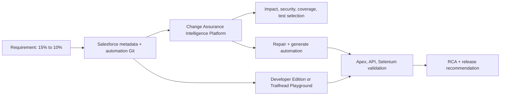

# Strategic Deal Assurance Salesforce App

## Personal Developer Edition / Trailhead Playground and Codex Implementation Guide

| Item | Decision |
|---|---|
| Target outcome | A working Salesforce demo app and a source-controlled Salesforce DX fixture for the Change Assurance Intelligence Platform |
| Recommended org | A dedicated, free Salesforce Developer Edition org |
| Fallback org | A new Trailhead Playground |
| Recommended build route | Local Salesforce CLI + Git + Codex CLI or Codex in the ChatGPT desktop app |
| Manual work that remains | Account creation, email activation, MFA, browser OAuth, and one short Flow Builder seed if generated Flow XML is incompatible |
| Data policy | Synthetic demo data only; no customer or production data |
| Baseline business rule | A strategic Opportunity with Amount greater than INR 5 crore and Discount greater than 15% requires Regional VP approval |
| Demonstrated change | Reduce the discount threshold from greater than 15% to greater than 10%; the amount and approver rules remain unchanged |

This guide turns the product solution design into a Salesforce application that can be developed in a personal org and used as the canonical live integration fixture. The wider Change Assurance Intelligence Platform still runs outside Salesforce and consumes this app's Git metadata, automation assets, test results, and optional live-org evidence.

---

## 1. What you are building

You are building two connected things:

1. **Strategic Deal Assurance**, a small but production-minded Salesforce app on the standard `Opportunity` object.
2. **A source-controlled change-assurance fixture**, containing Salesforce metadata plus Apex, API, and UI automation assets that the Change Assurance Intelligence Platform can analyze, repair, generate, execute, and use for RCA.

The Salesforce app contains:

- Opportunity fields for strategic deal classification, discount, Regional VP approver, approval status, and explanation.
- A Custom Metadata Type that centrally stores the amount and discount thresholds.
- Bulk-safe Apex policy logic exposed as a Flow invocable action.
- A record-triggered Flow that reevaluates approval only when relevant inputs change and avoids infinite update recursion.
- Separate user and approver permission sets.
- A Lightning app and Opportunity page suitable for a live demo.
- Optional native Approval Process enforcement after the core fixture is stable.
- Synthetic Opportunities representing boundary, positive, negative, permission, and failure scenarios.

The surrounding repository contains:

- Apex tests for deterministic policy boundaries.
- REST API tests or CLI API requests for end-to-end record behavior.
- A Selenium fixture for UI test inventory, impact, repair, locator-healing, and generation demonstrations.
- A baseline Git tag with the 15% rule and a feature branch changing the rule to 10%.



### What this demo proves

The intended demonstration is:

1. Git detects the threshold change.
2. The evidence graph links the changed rule to Custom Metadata, Apex, Flow, Opportunity fields, permissions, and tests.
3. Coverage identifies obsolete 15% assertions and missing 10% boundary cases.
4. Existing UI/API/Apex automation is classified as `KEEP`, `REPAIR`, `REFACTOR`, `RETIRE`, or `GENERATE`.
5. The platform proposes an isolated repair patch and complete missing test artifacts.
6. The artifacts pass parse, compile, discovery, execution, assertion-quality, and stability gates.
7. A seeded failure is classified as product, automation, locator, data, environment, timing/flaky, or unknown.
8. The release decision remains `NO_GO` or `CONDITIONAL_GO` until mandatory evidence passes.

---

## 2. Choose the personal Salesforce environment

### Recommended: dedicated Developer Edition

Use a dedicated Developer Edition for this project. Salesforce describes Developer Edition as a free, full-featured environment for building apps, Apex, automation, and API integrations, and its current edition remains available as long as it is kept in use. Start from Salesforce's [Developer Edition introduction and signup link](https://developer.salesforce.com/blogs/2025/03/introducing-the-new-salesforce-developer-edition-now-with-agentforce-and-data-cloud).

Why it is the preferred choice:

- It is a standalone personal development org rather than a course-specific environment.
- It is easier to name, authorize repeatedly, and keep as the live demo integration target.
- It supports Salesforce CLI, Metadata API, Apex, Flow, permission sets, REST API, and synthetic records.
- It is better suited to a multi-week source-control workflow.

### Fallback: Trailhead Playground

Use a new Trailhead Playground if Developer Edition signup is unavailable or you want to start immediately. Trailhead documents that a new Playground can be created from the org selector on a hands-on unit and usually takes a few minutes. The username and password can be obtained through the Playground Starter app; see [Access Playground Credentials and Management](https://trailhead.salesforce.com/content/learn/modules/trailhead_playground_management/get-your-trailhead-playground-username-and-password).

Limitations for this project:

- Playgrounds are excellent for learning but can contain Trailhead-specific packages and configuration.
- It is easy to accidentally use the wrong Playground.
- Credentials are initially hidden until you reset the password.
- Some newer features or limits may differ from a fresh Developer Edition.

### Selection rule

| Situation | Choose |
|---|---|
| You want a stable five-week project and demo org | Developer Edition |
| Developer Edition signup is blocked | Trailhead Playground |
| You are completing Trailhead badges at the same time | Use a separate Playground for the badges; do not use the app org |
| You already have a production Salesforce org | Do not use it; create a personal non-production org |

Do not build this fixture in a real client org. The fixture deliberately creates fields, automation, security configuration, records, and tests that must stay isolated.

---

## 3. Create and secure the personal account

### 3.1 Developer Edition setup

1. Open the Developer Edition signup link from the Salesforce page above.
2. Enter your real name and personal email address.
3. Enter a company value such as `Personal Learning` or `Hackathon Lab`.
4. Choose your country and role.
5. Create a globally unique Salesforce username. It must look like an email address but does not have to be a working mailbox. Example:

   ```text
   your.name+changeassurance.dev@example.com
   ```

6. Accept the terms and submit the form.
7. Open the activation email and set a strong, unique password.
8. Complete MFA enrollment if prompted. Prefer an authenticator app or security key.
9. Sign in and bookmark the org's My Domain URL.
10. In **Setup → Company Information**, verify the org edition and available user/API limits.
11. In **Setup → Company Information** or locale settings, use an India/INR currency locale for the demo if the org permits it. Do not enable multi-currency solely for this fixture unless the team needs currency conversion behavior.
12. In **Setup → My Domain**, confirm that My Domain is deployed. New orgs commonly have it already.

### 3.2 Trailhead Playground setup

1. Sign in to Trailhead with your personal account.
2. Open any hands-on unit.
3. At the bottom of the page, select the current org name and choose **Create Playground**.
4. Give it a distinctive name such as `Change Assurance Demo`.
5. Launch it after creation.
6. Open **App Launcher → Playground Starter → Get Your Login Credentials**.
7. Record the generated username.
8. Select **Reset My Password**, follow the email link, and set a strong password.
9. Do not change the generated Playground username; Trailhead warns that changing it can complicate later use.
10. Complete MFA if prompted.

Salesforce's current DX setup walkthrough confirms that a Playground password is required for tools outside Trailhead and that Salesforce CLI manages the app lifecycle, source synchronization, and tests; see [Set Up Your Salesforce DX Environment](https://trailhead.salesforce.com/content/learn/projects/quick-start-lightning-web-components/set-up-salesforce-dx).

### 3.3 Security rules before development

- Never paste a Salesforce password, security token, OAuth refresh token, SFDX auth URL, client secret, or access token into a Codex prompt.
- Never commit `.sf/`, `.sfdx/`, `.env`, browser profiles, screenshots containing tokens, or command output containing a frontdoor URL.
- Use the Salesforce CLI's local authenticated session.
- Grant the minimum access required through permission sets.
- Use synthetic names, accounts, opportunities, and emails.
- Keep the first connection interactive; automate noninteractive authentication only later and only with a dedicated automation user, External Client App, certificate, and secure secret store.

---

## 4. Install the local development tools

### Required

- Git
- Salesforce CLI (`sf`)
- Codex CLI or Codex in the ChatGPT desktop app opened on the local repository
- A current browser

### Optional but useful

- Visual Studio Code
- Salesforce Extension Pack
- Java 17 and Maven for Selenium Java and RestAssured fixtures
- Chrome/Edge plus a matching Selenium-managed driver
- Node.js if an LWC unit-test layer is added

### 4.1 Verify Salesforce CLI

Install Salesforce CLI using Salesforce's platform-specific installer, then run:

```bash
sf --version
sf update
sf commands --help
```

The official Trailhead DX setup states that Salesforce CLI controls environment creation, source synchronization, and test execution. The live command syntax should always be checked against the [Salesforce CLI command reference](https://developer.salesforce.com/docs/platform/salesforce-cli-reference/guide/).

### 4.2 Install and run Codex locally

Use Codex locally so it can work against the same repository and installed Salesforce CLI. The official [Codex CLI guide](https://learn.chatgpt.com/docs/codex/cli) documents that Codex can inspect and edit a local repository, run installed tools, and automate repeatable terminal workflows.

On supported macOS/Linux environments, the current official installer is:

```bash
curl -fsSL https://chatgpt.com/codex/install.sh | sh
```

Then:

```bash
codex
```

Sign in with ChatGPT when prompted. On Windows, use the installation option shown on the official Codex CLI page, or use the ChatGPT desktop app/IDE extension.

Start with normal workspace permissions. Codex uses a workspace sandbox plus an approval policy; network and out-of-workspace actions can require approval. Review [Agent approvals and security](https://learn.chatgpt.com/docs/agent-approvals-security) before broadening access.

### 4.3 Preflight checks

From a terminal, or by asking Codex to run them:

```bash
git --version
sf --version
java -version
mvn -version
codex --version
```

Java and Maven may be absent during the Salesforce-only phase. They become required when the Selenium/RestAssured fixture is implemented.

---

## 5. Create the source-controlled project

Run these commands yourself or give the first Codex prompt in section 15.

```bash
sf project generate --name strategic-deal-assurance --manifest
cd strategic-deal-assurance
git init
git add .
git commit -m "chore: initialize Salesforce DX project"
```

Salesforce documents `sf project generate` as the command that creates the DX project structure and `sfdx-project.json`; see [Generate a Salesforce DX project](https://developer.salesforce.com/docs/platform/salesforce-cli-reference/guide/cli_reference_template_generate_project.html).

Use this target structure:

```text
strategic-deal-assurance/
├── AGENTS.md
├── README.md
├── sfdx-project.json
├── manifest/
│   └── package.xml
├── force-app/main/default/
│   ├── applications/
│   ├── classes/
│   ├── customMetadata/
│   ├── flows/
│   ├── layouts/
│   ├── lwc/                       # optional policy card
│   ├── objects/
│   │   ├── Opportunity/fields/
│   │   └── Strategic_Discount_Rule__mdt/fields/
│   ├── permissionsets/
│   └── flexipages/                # optional retrieved page
├── automation/
│   ├── api-restassured/
│   └── ui-selenium/
├── data/
│   ├── seed-plan.json
│   └── *.json
├── requirements/
│   ├── BR-STRATEGIC-DISCOUNT-baseline.md
│   └── BR-STRATEGIC-DISCOUNT-change-10.md
└── evidence/
    └── README.md
```

### 5.1 Add repository guidance for Codex

Codex reads repository `AGENTS.md` instructions before it works. The official [AGENTS.md guide](https://learn.chatgpt.com/docs/agent-configuration/agents-md) describes repository-scoped guidance and precedence. Create this file:

```md
# AGENTS.md

## Goal
Maintain the Strategic Deal Assurance Salesforce fixture used by the Change Assurance Intelligence Platform demo.

## Rules
- Use Salesforce DX source format under force-app/main/default.
- Use the API version already present in sfdx-project.json; do not invent a newer version.
- Keep the rule threshold in Strategic_Discount_Rule.Default custom metadata, not duplicated in Flow or Apex.
- Amount comparison is strictly greater than INR 50,000,000.
- Discount comparison is strictly greater than the configured threshold.
- Apex must be bulk-safe, with sharing, deterministic, and free of DML/SOQL in loops.
- Do not add credentials, tokens, SFDX auth URLs, org URLs with session IDs, or real customer data.
- Do not delete metadata or deploy destructive changes without explicit approval.
- Treat Flow XML as version-sensitive. If generation fails, ask for a UI-created seed Flow, retrieve it, then edit it.
- Keep UI locators accessible and stable; prefer role, label, and data-testid over CSS position or generated Lightning classes.

## Required verification
- Run Apex tests with code coverage after Apex changes.
- Validate or deploy only to the explicitly named non-production org alias caip-dev.
- Query synthetic Opportunities after deployment and show boundary outcomes.
- Review git diff before committing.
- Done means metadata deploys, tests pass, Flow is active, no secrets are tracked, and the 15% baseline is tagged.
```

---

## 6. Authorize the org for Salesforce CLI

From the project directory:

```bash
sf org login web --alias caip-dev --set-default
```

This is the principal human handoff:

1. Codex can start the command.
2. Your browser opens.
3. You enter Salesforce credentials and complete MFA yourself.
4. You approve access.
5. Return to the terminal after the success page appears.

Salesforce documents that `sf org login web` opens browser authentication and then authorizes deploy/retrieve commands; it also recommends an alias. See [org login web](https://developer.salesforce.com/docs/platform/salesforce-cli-reference/guide/cli_reference_org_login_web.html).

Verify without printing secrets:

```bash
sf org list
sf org display --target-org caip-dev
sf org open --target-org caip-dev
```

Do not run commands that display the access token or SFDX auth URL in a recorded terminal or prompt.

---

## 7. Salesforce application design

### 7.1 Metadata inventory

| Type | API name | Purpose | P0/P1 |
|---|---|---|---|
| Standard object | `Opportunity` | Main business record | P0 |
| Opportunity field | `Strategic_Deal__c` | Marks the deal as strategic | P0 |
| Opportunity field | `Discount__c` | Discount percentage | P0 |
| Opportunity field | `Regional_VP_Approver__c` | User expected to approve | P0 |
| Opportunity field | `Approval_Status__c` | Not Required, Pending, Approved, Rejected, Configuration Error | P0 |
| Opportunity field | `Approval_Reason__c` | Human-readable evaluation evidence | P0 |
| Custom Metadata Type | `Strategic_Discount_Rule__mdt` | Central policy configuration | P0 |
| Custom metadata record | `Strategic_Discount_Rule.Default` | Active rule: 5 crore and 15% baseline | P0 |
| Apex class | `StrategicDiscountPolicy` | Bulk policy evaluation and Flow action | P0 |
| Apex test | `StrategicDiscountPolicyTest` | Boundary and configuration validation | P0 |
| Flow | `Strategic_Discount_Approval` | Reevaluate relevant Opportunity changes | P0 |
| Permission set | `Strategic_Deal_User` | Input-field edit and outcome read access | P0 |
| Permission set | `Regional_VP_Approver` | Approver outcome access | P0 |
| Custom application | `Strategic_Deal_Assurance` | Demo navigation shell | P0 |
| Lightning component | `strategicDealPolicyCard` | Clear demo status and stable UI locators | P1 |
| Approval Process | `Strategic_Opportunity_Regional_VP` | Native submit/approve/reject/lock behavior | P1 |

### 7.2 Business-rule truth table

The operators are intentionally strict (`>`), not inclusive (`>=`).

| Strategic | Amount INR | Discount baseline | Approver | Expected status |
|---:|---:|---:|---|---|
| No | 60,000,000 | 20.00 | Present | Not Required |
| Yes | 50,000,000 | 20.00 | Present | Not Required |
| Yes | 50,000,000.01 | 15.00 | Present | Not Required |
| Yes | 50,000,000.01 | 15.01 | Present | Pending Regional VP |
| Yes | 50,000,000.01 | 15.01 | Missing | Configuration Error |
| Yes | Null | 20.00 | Present | Not Required |
| Yes | 60,000,000 | Null | Present | Not Required |

After the feature change, replace 15.00/15.01 with 10.00/10.01. The 5-crore boundary does not change.

### 7.3 Why Custom Metadata is the source of truth

Do not copy the number `15` into the Flow, Apex, Approval Process criteria, LWC, and tests as separate production values. Central configuration prevents policy drift. The graph still maps the changed custom metadata record to the Apex class, Flow, Opportunity fields, permissions, and automation assertions.

Tests contain explicit boundary expectations because they are independent oracles. When the requirement changes, the assurance product should find and repair those old test expectations rather than silently reading the same configuration under test.

---

## 8. Implement the metadata

Codex should generate the XML files using the current `sourceApiVersion` from `sfdx-project.json`. The snippets below show the important values; all files use this root namespace:

```xml
xmlns="http://soap.sforce.com/2006/04/metadata"
```

### 8.1 Opportunity fields

Create these files under `force-app/main/default/objects/Opportunity/fields/`.

#### `Strategic_Deal__c.field-meta.xml`

```xml
<?xml version="1.0" encoding="UTF-8"?>
<CustomField xmlns="http://soap.sforce.com/2006/04/metadata">
    <fullName>Strategic_Deal__c</fullName>
    <defaultValue>false</defaultValue>
    <description>Marks an Opportunity as subject to the strategic-deal approval policy.</description>
    <label>Strategic Deal</label>
    <type>Checkbox</type>
</CustomField>
```

#### `Discount__c.field-meta.xml`

```xml
<?xml version="1.0" encoding="UTF-8"?>
<CustomField xmlns="http://soap.sforce.com/2006/04/metadata">
    <fullName>Discount__c</fullName>
    <description>Requested discount percentage. Enter 15 for 15 percent.</description>
    <label>Discount</label>
    <precision>5</precision>
    <scale>2</scale>
    <type>Percent</type>
</CustomField>
```

#### `Regional_VP_Approver__c.field-meta.xml`

```xml
<?xml version="1.0" encoding="UTF-8"?>
<CustomField xmlns="http://soap.sforce.com/2006/04/metadata">
    <fullName>Regional_VP_Approver__c</fullName>
    <deleteConstraint>SetNull</deleteConstraint>
    <description>User responsible for Regional VP approval.</description>
    <label>Regional VP Approver</label>
    <referenceTo>User</referenceTo>
    <relationshipName>Strategic_Opportunities</relationshipName>
    <required>false</required>
    <type>Lookup</type>
</CustomField>
```

#### `Approval_Status__c.field-meta.xml`

```xml
<?xml version="1.0" encoding="UTF-8"?>
<CustomField xmlns="http://soap.sforce.com/2006/04/metadata">
    <fullName>Approval_Status__c</fullName>
    <description>Current outcome of the strategic discount evaluation.</description>
    <label>Approval Status</label>
    <type>Picklist</type>
    <valueSet>
        <restricted>true</restricted>
        <valueSetDefinition>
            <sorted>false</sorted>
            <value><fullName>Not Required</fullName><default>true</default><label>Not Required</label></value>
            <value><fullName>Pending Regional VP</fullName><default>false</default><label>Pending Regional VP</label></value>
            <value><fullName>Approved</fullName><default>false</default><label>Approved</label></value>
            <value><fullName>Rejected</fullName><default>false</default><label>Rejected</label></value>
            <value><fullName>Configuration Error</fullName><default>false</default><label>Configuration Error</label></value>
        </valueSetDefinition>
    </valueSet>
</CustomField>
```

#### `Approval_Reason__c.field-meta.xml`

```xml
<?xml version="1.0" encoding="UTF-8"?>
<CustomField xmlns="http://soap.sforce.com/2006/04/metadata">
    <fullName>Approval_Reason__c</fullName>
    <description>Deterministic explanation of the latest policy evaluation.</description>
    <label>Approval Reason</label>
    <length>32768</length>
    <type>LongTextArea</type>
    <visibleLines>4</visibleLines>
</CustomField>
```

### 8.2 Custom Metadata Type

Create `force-app/main/default/objects/Strategic_Discount_Rule__mdt/Strategic_Discount_Rule__mdt.object-meta.xml`:

```xml
<?xml version="1.0" encoding="UTF-8"?>
<CustomObject xmlns="http://soap.sforce.com/2006/04/metadata">
    <description>Version-controlled strategic discount approval configuration.</description>
    <label>Strategic Discount Rule</label>
    <pluralLabel>Strategic Discount Rules</pluralLabel>
    <visibility>Public</visibility>
</CustomObject>
```

Add fields under its `fields/` directory:

| File/API name | Type | Detail |
|---|---|---|
| `Active__c.field-meta.xml` | Checkbox | Default `false` |
| `Minimum_Amount_INR__c.field-meta.xml` | Number | Precision 18, scale 2 |
| `Discount_Threshold_Percent__c.field-meta.xml` | Number | Precision 5, scale 2 |
| `Rule_Version__c.field-meta.xml` | Text | Length 40 |

Use these complete field definitions:

```xml
<!-- fields/Active__c.field-meta.xml -->
<?xml version="1.0" encoding="UTF-8"?>
<CustomField xmlns="http://soap.sforce.com/2006/04/metadata">
    <fullName>Active__c</fullName>
    <defaultValue>false</defaultValue>
    <description>Whether this policy configuration can be used.</description>
    <fieldManageability>DeveloperControlled</fieldManageability>
    <label>Active</label>
    <type>Checkbox</type>
</CustomField>
```

```xml
<!-- fields/Minimum_Amount_INR__c.field-meta.xml -->
<?xml version="1.0" encoding="UTF-8"?>
<CustomField xmlns="http://soap.sforce.com/2006/04/metadata">
    <fullName>Minimum_Amount_INR__c</fullName>
    <description>Strict lower amount boundary in INR.</description>
    <fieldManageability>DeveloperControlled</fieldManageability>
    <label>Minimum Amount INR</label>
    <precision>18</precision>
    <scale>2</scale>
    <type>Number</type>
</CustomField>
```

```xml
<!-- fields/Discount_Threshold_Percent__c.field-meta.xml -->
<?xml version="1.0" encoding="UTF-8"?>
<CustomField xmlns="http://soap.sforce.com/2006/04/metadata">
    <fullName>Discount_Threshold_Percent__c</fullName>
    <description>Strict lower discount boundary expressed as a percentage.</description>
    <fieldManageability>DeveloperControlled</fieldManageability>
    <label>Discount Threshold Percent</label>
    <precision>5</precision>
    <scale>2</scale>
    <type>Number</type>
</CustomField>
```

```xml
<!-- fields/Rule_Version__c.field-meta.xml -->
<?xml version="1.0" encoding="UTF-8"?>
<CustomField xmlns="http://soap.sforce.com/2006/04/metadata">
    <fullName>Rule_Version__c</fullName>
    <description>Human-readable policy version linked to evidence.</description>
    <fieldManageability>DeveloperControlled</fieldManageability>
    <label>Rule Version</label>
    <length>40</length>
    <type>Text</type>
</CustomField>
```

Create `force-app/main/default/customMetadata/Strategic_Discount_Rule.Default.md-meta.xml`:

```xml
<?xml version="1.0" encoding="UTF-8"?>
<CustomMetadata xmlns="http://soap.sforce.com/2006/04/metadata"
    xmlns:xsi="http://www.w3.org/2001/XMLSchema-instance"
    xmlns:xsd="http://www.w3.org/2001/XMLSchema">
    <label>Default</label>
    <protected>false</protected>
    <values>
        <field>Active__c</field>
        <value xsi:type="xsd:boolean">true</value>
    </values>
    <values>
        <field>Minimum_Amount_INR__c</field>
        <value xsi:type="xsd:double">50000000</value>
    </values>
    <values>
        <field>Discount_Threshold_Percent__c</field>
        <value xsi:type="xsd:double">15</value>
    </values>
    <values>
        <field>Rule_Version__c</field>
        <value xsi:type="xsd:string">baseline-15</value>
    </values>
</CustomMetadata>
```

### 8.3 Bulk-safe Apex policy

Create `force-app/main/default/classes/StrategicDiscountPolicy.cls`:

```apex
public with sharing class StrategicDiscountPolicy {
    private static final String CONFIG_NAME = 'Default';
    private static final String STATUS_NOT_REQUIRED = 'Not Required';
    private static final String STATUS_PENDING = 'Pending Regional VP';
    private static final String STATUS_CONFIGURATION_ERROR = 'Configuration Error';

    public class Input {
        @InvocableVariable(label='Opportunity Amount' required=true)
        public Decimal amount;

        @InvocableVariable(label='Discount Percent' required=true)
        public Decimal discountPercent;

        @InvocableVariable(label='Strategic Deal' required=true)
        public Boolean strategicDeal;

        @InvocableVariable(label='Regional VP Approver Id')
        public String regionalVpApproverId;
    }

    public class Output {
        @InvocableVariable public Boolean approvalRequired;
        @InvocableVariable public Boolean configurationValid;
        @InvocableVariable public String desiredStatus;
        @InvocableVariable public String reason;
        @InvocableVariable public String ruleVersion;
    }

    @InvocableMethod(
        label='Evaluate Strategic Discount Approval'
        description='Evaluates the version-controlled strategic opportunity approval policy.'
    )
    public static List<Output> evaluate(List<Input> inputs) {
        List<Output> outputs = new List<Output>();
        if (inputs == null) {
            return outputs;
        }

        Strategic_Discount_Rule__mdt config =
            Strategic_Discount_Rule__mdt.getInstance(CONFIG_NAME);

        Boolean active = config != null && config.Active__c == true;
        Decimal minimumAmount = config == null ? null : config.Minimum_Amount_INR__c;
        Decimal threshold = config == null ? null : config.Discount_Threshold_Percent__c;
        String ruleVersion = config == null ? null : config.Rule_Version__c;

        for (Input input : inputs) {
            outputs.add(evaluateOne(
                input,
                minimumAmount,
                threshold,
                active,
                ruleVersion
            ));
        }
        return outputs;
    }

    @TestVisible
    private static Output evaluateOne(
        Input input,
        Decimal minimumAmount,
        Decimal threshold,
        Boolean active,
        String ruleVersion
    ) {
        Output output = new Output();
        output.ruleVersion = ruleVersion;

        if (active != true || minimumAmount == null || threshold == null) {
            output.approvalRequired = false;
            output.configurationValid = false;
            output.desiredStatus = STATUS_CONFIGURATION_ERROR;
            output.reason = 'Strategic discount policy configuration is missing or inactive.';
            return output;
        }

        output.configurationValid = true;
        Boolean approvalRequired = input != null
            && input.strategicDeal == true
            && input.amount != null
            && input.amount > minimumAmount
            && input.discountPercent != null
            && input.discountPercent > threshold;

        output.approvalRequired = approvalRequired;

        if (approvalRequired && String.isBlank(input.regionalVpApproverId)) {
            output.desiredStatus = STATUS_CONFIGURATION_ERROR;
            output.reason = 'Regional VP approval is required, but no approver is configured.';
            return output;
        }

        if (approvalRequired) {
            output.desiredStatus = STATUS_PENDING;
            output.reason = 'Strategic deal exceeds INR ' + String.valueOf(minimumAmount)
                + ' and discount threshold ' + String.valueOf(threshold)
                + '%. Regional VP approval is required.';
        } else {
            output.desiredStatus = STATUS_NOT_REQUIRED;
            output.reason = 'The Opportunity does not exceed every configured strategic approval boundary.';
        }
        return output;
    }
}
```

Create `StrategicDiscountPolicy.cls-meta.xml` and set `<apiVersion>` to the exact `sourceApiVersion` already in `sfdx-project.json`. The example shows `67.0`; replace it only if the generated project contains a different value:

```xml
<?xml version="1.0" encoding="UTF-8"?>
<ApexClass xmlns="http://soap.sforce.com/2006/04/metadata">
    <apiVersion>67.0</apiVersion>
    <status>Active</status>
</ApexClass>
```

### 8.4 Apex tests

Create `StrategicDiscountPolicyTest.cls`. These are true boundary oracles; do not compute the expected answer from the custom metadata under test.

```apex
@IsTest
private class StrategicDiscountPolicyTest {
    private static StrategicDiscountPolicy.Input request(
        Boolean strategic,
        Decimal amount,
        Decimal discount,
        String approverId
    ) {
        StrategicDiscountPolicy.Input input = new StrategicDiscountPolicy.Input();
        input.strategicDeal = strategic;
        input.amount = amount;
        input.discountPercent = discount;
        input.regionalVpApproverId = approverId;
        return input;
    }

    private static StrategicDiscountPolicy.Output evaluateBaseline(
        StrategicDiscountPolicy.Input input
    ) {
        return StrategicDiscountPolicy.evaluateOne(
            input,
            50000000,
            15,
            true,
            'baseline-15'
        );
    }

    @IsTest
    static void exactAmountBoundaryDoesNotRequireApproval() {
        StrategicDiscountPolicy.Output result = evaluateBaseline(
            request(true, 50000000, 20, UserInfo.getUserId())
        );
        System.assertEquals(false, result.approvalRequired);
        System.assertEquals('Not Required', result.desiredStatus);
    }

    @IsTest
    static void exactDiscountBoundaryDoesNotRequireApproval() {
        StrategicDiscountPolicy.Output result = evaluateBaseline(
            request(true, 50000000.01, 15, UserInfo.getUserId())
        );
        System.assertEquals(false, result.approvalRequired);
        System.assertEquals('Not Required', result.desiredStatus);
    }

    @IsTest
    static void aboveBothBoundariesRequiresApproval() {
        StrategicDiscountPolicy.Output result = evaluateBaseline(
            request(true, 50000000.01, 15.01, UserInfo.getUserId())
        );
        System.assertEquals(true, result.approvalRequired);
        System.assertEquals('Pending Regional VP', result.desiredStatus);
        System.assert(result.reason.contains('15'));
    }

    @IsTest
    static void nonStrategicDealDoesNotRequireApproval() {
        StrategicDiscountPolicy.Output result = evaluateBaseline(
            request(false, 60000000, 20, UserInfo.getUserId())
        );
        System.assertEquals(false, result.approvalRequired);
    }

    @IsTest
    static void missingApproverFailsClosed() {
        StrategicDiscountPolicy.Output result = evaluateBaseline(
            request(true, 60000000, 20, null)
        );
        System.assertEquals(true, result.approvalRequired);
        System.assertEquals('Configuration Error', result.desiredStatus);
    }

    @IsTest
    static void missingConfigurationFailsClosed() {
        StrategicDiscountPolicy.Output result = StrategicDiscountPolicy.evaluateOne(
            request(true, 60000000, 20, UserInfo.getUserId()),
            null,
            null,
            false,
            null
        );
        System.assertEquals(false, result.configurationValid);
        System.assertEquals('Configuration Error', result.desiredStatus);
    }

    @IsTest
    static void configuredInvocableIsBulkSafe() {
        List<StrategicDiscountPolicy.Input> inputs = new List<StrategicDiscountPolicy.Input>{
            request(true, 60000000, 20, UserInfo.getUserId()),
            request(false, 60000000, 20, UserInfo.getUserId())
        };
        Test.startTest();
        List<StrategicDiscountPolicy.Output> outputs =
            StrategicDiscountPolicy.evaluate(inputs);
        Test.stopTest();
        System.assertEquals(2, outputs.size());
        System.assertEquals(true, outputs[0].configurationValid);
    }
}
```

Add a companion class metadata file using the same project API version.

### 8.5 Permission sets

Create two permission-set metadata files. Salesforce recommends managing field access with permission sets and permission set groups; see [Field-level security with permission sets](https://trailhead.salesforce.com/content/learn/modules/data_security/data_security_fields).

`Strategic_Deal_User.permissionset-meta.xml` should grant:

- Opportunity: Read, Create, Edit; not Delete or Modify All.
- Editable: `Strategic_Deal__c`, `Discount__c`, `Regional_VP_Approver__c`.
- Read only: `Approval_Status__c`, `Approval_Reason__c`.
- Apex class access: `StrategicDiscountPolicy`.
- Application visibility: Strategic Deal Assurance.

`Regional_VP_Approver.permissionset-meta.xml` should grant:

- Opportunity: Read.
- Read: all five custom fields.
- Edit `Approval_Status__c` only if P0 uses a controlled status update instead of a native Approval Process.
- Remove direct status editing when the native Approval Process is enabled.

The complete P0 sales-user file is:

```xml
<?xml version="1.0" encoding="UTF-8"?>
<PermissionSet xmlns="http://soap.sforce.com/2006/04/metadata">
    <applicationVisibilities>
        <application>Strategic_Deal_Assurance</application>
        <visible>true</visible>
    </applicationVisibilities>
    <classAccesses>
        <apexClass>StrategicDiscountPolicy</apexClass>
        <enabled>true</enabled>
    </classAccesses>
    <description>Least-privilege access for strategic Opportunity input and outcome viewing.</description>
    <fieldPermissions><editable>false</editable><field>Opportunity.Approval_Reason__c</field><readable>true</readable></fieldPermissions>
    <fieldPermissions><editable>false</editable><field>Opportunity.Approval_Status__c</field><readable>true</readable></fieldPermissions>
    <fieldPermissions><editable>true</editable><field>Opportunity.Discount__c</field><readable>true</readable></fieldPermissions>
    <fieldPermissions><editable>true</editable><field>Opportunity.Regional_VP_Approver__c</field><readable>true</readable></fieldPermissions>
    <fieldPermissions><editable>true</editable><field>Opportunity.Strategic_Deal__c</field><readable>true</readable></fieldPermissions>
    <hasActivationRequired>false</hasActivationRequired>
    <label>Strategic Deal User</label>
    <objectPermissions>
        <allowCreate>true</allowCreate>
        <allowDelete>false</allowDelete>
        <allowEdit>true</allowEdit>
        <allowRead>true</allowRead>
        <modifyAllRecords>false</modifyAllRecords>
        <object>Opportunity</object>
        <viewAllRecords>false</viewAllRecords>
    </objectPermissions>
</PermissionSet>
```

The P0 approver file is:

```xml
<?xml version="1.0" encoding="UTF-8"?>
<PermissionSet xmlns="http://soap.sforce.com/2006/04/metadata">
    <applicationVisibilities>
        <application>Strategic_Deal_Assurance</application>
        <visible>true</visible>
    </applicationVisibilities>
    <description>Least-privilege access for Regional VP review in the personal demo org.</description>
    <fieldPermissions><editable>false</editable><field>Opportunity.Approval_Reason__c</field><readable>true</readable></fieldPermissions>
    <fieldPermissions><editable>true</editable><field>Opportunity.Approval_Status__c</field><readable>true</readable></fieldPermissions>
    <fieldPermissions><editable>false</editable><field>Opportunity.Discount__c</field><readable>true</readable></fieldPermissions>
    <fieldPermissions><editable>false</editable><field>Opportunity.Regional_VP_Approver__c</field><readable>true</readable></fieldPermissions>
    <fieldPermissions><editable>false</editable><field>Opportunity.Strategic_Deal__c</field><readable>true</readable></fieldPermissions>
    <hasActivationRequired>false</hasActivationRequired>
    <label>Regional VP Approver</label>
    <objectPermissions>
        <allowCreate>false</allowCreate>
        <allowDelete>false</allowDelete>
        <allowEdit>true</allowEdit>
        <allowRead>true</allowRead>
        <modifyAllRecords>false</modifyAllRecords>
        <object>Opportunity</object>
        <viewAllRecords>false</viewAllRecords>
    </objectPermissions>
</PermissionSet>
```

If the application metadata has not been created yet, omit `applicationVisibilities` during the first permission-set deploy and add it after retrieving the app. When native approval is enabled, change the approver's `Approval_Status__c` permission to read-only. Do not grant broad administrative permissions merely to make the demo pass.

---

## 9. Build the record-triggered Flow safely

Flow XML changes across API versions and is easy for an assistant to invent incorrectly. The most reliable route is to deploy the fields, Custom Metadata, and Apex first; create one seed Flow in the UI; retrieve its XML; then let Codex maintain it.

Salesforce's current [record-triggered Flow walkthrough](https://trailhead.salesforce.com/content/learn/modules/record-triggered-flows/build-a-record-triggered-flow) recommends defining trigger, criteria, and action, documenting intent, saving frequently, and debugging before activation.

### 9.1 First deploy before Flow creation

```bash
sf project deploy start \
  --source-dir force-app/main/default/objects \
  --source-dir force-app/main/default/customMetadata \
  --source-dir force-app/main/default/classes \
  --target-org caip-dev \
  --test-level RunSpecifiedTests \
  --tests StrategicDiscountPolicyTest \
  --wait 20
```

Salesforce documents `sf project deploy start` as the source-format metadata deployment command; development orgs support explicit test levels. See [project deploy start](https://developer.salesforce.com/docs/platform/salesforce-cli-reference/guide/cli_reference_project_deploy_start.html).

### 9.2 Exact Flow Builder design

1. In the org, open **Setup → Flows → New Flow**.
2. Select **Record-Triggered Flow**.
3. Object: **Opportunity**.
4. Trigger: **A record is created or updated**.
5. Entry conditions: none. The first Decision element will prevent irrelevant work.
6. Optimize for: **Actions and Related Records (after save)**. An Apex Action is required, so do not use Fast Field Updates.
7. Add a Decision named **Relevant Inputs Changed**.
8. Create an outcome `Evaluate` that is true when any of these conditions is true:
   - Record is new (`$Record__Prior.Id` is null), or
   - Amount changed, or
   - `Discount__c` changed, or
   - `Strategic_Deal__c` changed, or
   - `Regional_VP_Approver__c` changed.
9. Leave the default outcome as `No Action` and end that path.
10. On `Evaluate`, add **Action → Apex → Evaluate Strategic Discount Approval**.
11. Map inputs:
    - Amount ← `$Record.Amount`
    - Discount Percent ← `$Record.Discount__c`
    - Strategic Deal ← `$Record.Strategic_Deal__c`
    - Regional VP Approver Id ← `$Record.Regional_VP_Approver__c`
12. Add a Decision named **Outcome Changed**.
13. Continue to update only if either:
    - Apex `desiredStatus` differs from `$Record.Approval_Status__c`, or
    - Apex `reason` differs from `$Record.Approval_Reason__c`.
14. Add **Update Records → Update Triggering Opportunity**.
15. Set:
    - `Approval_Status__c` ← Apex `desiredStatus`
    - `Approval_Reason__c` ← Apex `reason`
16. Save with:
    - Label: `Strategic Discount Approval`
    - API name: `Strategic_Discount_Approval`
    - Description: `BR-STRATEGIC-DISCOUNT: after-save evaluation using StrategicDiscountPolicy and version-controlled Custom Metadata. Updates only when relevant inputs or outputs change.`
17. Debug each baseline truth-table row.
18. Confirm the second execution caused by the status update takes `No Action`; this proves the recursion guard works.
19. Activate the Flow only after debug succeeds.

### 9.3 Retrieve the Flow into Git

```bash
sf project retrieve start \
  --metadata "Flow:Strategic_Discount_Approval" \
  --target-org caip-dev \
  --wait 20
```

The official [project retrieve start](https://developer.salesforce.com/docs/platform/salesforce-cli-reference/guide/cli_reference_project_retrieve_start.html) command retrieves org metadata in DX source format. Review the XML before committing.

### 9.4 Fully automated alternative

Codex may generate the Flow XML directly only after it has:

1. Read the project's actual API version.
2. Inspected a retrieved Flow from the same org/version, if available.
3. Produced a deployable file under `force-app/main/default/flows/`.
4. Run deploy validation.
5. Fallen back to the seed-Flow route if the deploy reports schema or element errors.

Do not spend hours hand-editing version-specific Flow XML. One short UI seed plus retrieval is the safer engineering tradeoff.

---

## 10. Create the Lightning app and record experience

### 10.1 P0 app shell

1. Open **Setup → App Manager → New Lightning App**.
2. App name: `Strategic Deal Assurance`.
3. Developer name: `Strategic_Deal_Assurance`.
4. Description: `Synthetic strategic Opportunity approval fixture for change assurance analysis and automation engineering.`
5. Navigation style: Standard.
6. Add navigation items: Home, Accounts, Opportunities, Reports.
7. Assign the app to System Administrator for initial development.
8. After permission sets exist, grant app visibility through them rather than profiles where possible.

### 10.2 Opportunity page

1. Open **Setup → Object Manager → Opportunity → Page Layouts**.
2. Add a section titled `Strategic Deal Assurance`.
3. Add the five custom fields.
4. Make approval status and reason read-only on the sales-user layout if the UI supports that configuration.
5. Use Lightning App Builder to create or clone an Opportunity Record Page if you want a richer demo.
6. Put the strategic section near the top and include the Approval History related list if P1 native approval is enabled.
7. Activate for the Strategic Deal Assurance app.

Retrieve the app, layout, and optional FlexiPage rather than leaving UI-only configuration untracked:

```bash
sf project retrieve start \
  --metadata "CustomApplication:Strategic_Deal_Assurance" \
  --metadata "Layout:Opportunity-Opportunity Layout" \
  --target-org caip-dev
```

If your layout name differs, ask Codex to list Opportunity layout metadata first and use the exact returned name.

### 10.3 Optional LWC policy card

Add `strategicDealPolicyCard` only after P0 passes. It should:

- Use Lightning Data Service to read Opportunity fields.
- Display the active rule version, threshold, approval status, reason, and approver.
- Avoid editing approval outcome directly.
- Expose stable semantic hooks such as `data-testid="approval-status"` and `data-testid="policy-threshold"`.
- Use accessible headings, labels, and status text.
- Include Jest tests if the LWC test toolchain is installed.

This component creates a controlled UI surface for Selenium locator-healing demonstrations. Do not use generated Lightning CSS classes or positional XPath as the primary locator.

---

## 11. Optional native Regional VP Approval Process

P0 proves policy evaluation and security impact. P1 adds true submit/approve/reject/lock behavior.

1. Confirm `Regional_VP_Approver__c` is populated.
2. In **Setup → Approval Processes**, select Opportunity.
3. Use the Standard Setup Wizard.
4. Name it `Strategic Opportunity Regional VP` with API name `Strategic_Opportunity_Regional_VP`.
5. Entry criterion should be `Approval_Status__c = Pending Regional VP`. Do not duplicate the numeric threshold here.
6. Choose the approver automatically from `Regional_VP_Approver__c` if supported by the wizard configuration.
7. Initial submission actions:
   - lock the record;
   - leave or set status to Pending Regional VP.
8. Final approval action: set `Approval_Status__c = Approved` and unlock according to the intended operating policy.
9. Final rejection action: set `Approval_Status__c = Rejected` and unlock according to policy.
10. Recall action: restore a controlled state; document it.
11. Activate only after testing with a separate approver identity where licenses permit.
12. Retrieve the Approval Process and actions into Git.

If a one-user personal org cannot provide a separate approver, use the same user for a functional demo but label the segregation-of-duties test as fixture-only. The production design still requires separate users and approval ownership.

---

## 12. Deploy, assign permissions, and seed synthetic data

### 12.1 Deploy all P0 source

```bash
sf project deploy start \
  --source-dir force-app \
  --target-org caip-dev \
  --test-level RunSpecifiedTests \
  --tests StrategicDiscountPolicyTest \
  --wait 30
```

For a dry validation that requires tests but does not deploy, use `sf project deploy validate`; Salesforce documents that it returns a validation job rather than changing the org: [project deploy validate](https://developer.salesforce.com/docs/platform/salesforce-cli-reference/guide/cli_reference_project_deploy_validate.html).

### 12.2 Assign permission sets

```bash
sf org assign permset --name Strategic_Deal_User --target-org caip-dev
sf org assign permset --name Regional_VP_Approver --target-org caip-dev
```

Salesforce's [org assign permset](https://developer.salesforce.com/docs/platform/salesforce-cli-reference/guide/cli_reference_org_assign_permset.html) supports assignment to the current org user or explicitly named users.

### 12.3 Run Apex tests with coverage

```bash
sf apex run test \
  --class-names StrategicDiscountPolicyTest \
  --target-org caip-dev \
  --code-coverage \
  --result-format human \
  --wait 20
```

The official [apex run test](https://developer.salesforce.com/docs/platform/salesforce-cli-reference/guide/cli_reference_apex_run_test.html) command supports named tests, wait time, human/JSON results, and code coverage.

### 12.4 Seed records

Create one synthetic Account:

```bash
sf data create record \
  --sobject Account \
  --values "Name='Synthetic Strategic Accounts Pvt Ltd'" \
  --target-org caip-dev
```

Query its ID:

```bash
sf data query \
  --query "SELECT Id, Name FROM Account WHERE Name = 'Synthetic Strategic Accounts Pvt Ltd' LIMIT 1" \
  --target-org caip-dev
```

Ask Codex to use the returned Account ID and current User ID to create Opportunities for every truth-table case. Prefer a data-plan JSON checked into `data/` so the seed is repeatable. Salesforce CLI supports small-record creation and tree import/export; see [data commands](https://developer.salesforce.com/docs/platform/salesforce-cli-reference/guide/cli_reference_data.html).

Each Opportunity requires at least:

- Name
- AccountId
- StageName, such as `Prospecting`
- CloseDate
- Amount
- `Strategic_Deal__c`
- `Discount__c`
- `Regional_VP_Approver__c` except the missing-approver case

Use names that encode expectations:

```text
SYN-01 Non Strategic High Discount
SYN-02 Exact Five Crore
SYN-03 Exact Fifteen Percent
SYN-04 Above Fifteen Percent
SYN-05 Missing Approver
SYN-06 Null Discount
```

### 12.5 Verify data outcomes

```bash
sf data query \
  --query "SELECT Name, Amount, Strategic_Deal__c, Discount__c, Approval_Status__c, Approval_Reason__c FROM Opportunity WHERE Name LIKE 'SYN-%' ORDER BY Name" \
  --target-org caip-dev \
  --result-format human
```

Save a sanitized JSON result under `evidence/` only if it contains no tokens, real people, or environment-sensitive information.

---

## 13. API and UI automation in scope

### 13.1 API validation without another OAuth application

For the personal demo, use the already-authorized Salesforce CLI to make authenticated REST calls. `sf api request rest` can send authenticated REST requests using the target-org session; see [api request rest](https://developer.salesforce.com/docs/platform/salesforce-cli-reference/guide/cli_reference_api_request_rest.html).

Keep request bodies in version control, for example:

```json
{
  "Name": "SYN-API Above Threshold",
  "StageName": "Prospecting",
  "CloseDate": "2026-12-31",
  "AccountId": "REPLACE_AT_RUNTIME",
  "Amount": 50000000.01,
  "Strategic_Deal__c": true,
  "Discount__c": 15.01,
  "Regional_VP_Approver__c": "REPLACE_AT_RUNTIME"
}
```

Then create and query the record using CLI commands. Codex should inject IDs at runtime without committing environment-specific values.

### 13.2 Independent RestAssured tests

When the Java API test must authenticate independently, create an **External Client App**, not a new Connected App. Salesforce states that Connected App creation is restricted as of Spring '26 and recommends External Client Apps for new integrations; see [External Client Apps and Connected Apps](https://developer.salesforce.com/docs/platform/mobile-sdk/guide/connected-apps.html).

Use Authorization Code + PKCE for interactive developer tests or JWT with a certificate for CI. Do not use username/password flow as the default design. Store client configuration and private keys outside Git in an approved secret store.

The API scenarios should include:

- Create at exact 15.00% and assert `Not Required`.
- Create at 15.01% and assert `Pending Regional VP`.
- Create above the threshold without approver and assert `Configuration Error`.
- Update 15.01% to 10.01% after the feature branch change and assert the new outcome.
- Negative user cannot directly set approval outcome where field permissions prohibit it.

### 13.3 Selenium fixture

The UI fixture should use Page Objects and stable locators:

```text
OpportunityListPage
OpportunityRecordPage
StrategicDealPolicyCard
```

Preferred locator order:

1. accessibility role and accessible name;
2. associated field label;
3. controlled `data-testid` in the optional LWC;
4. scoped semantic relationship;
5. CSS/XPath only when stable and documented.

Do not treat a fixed sleep, JavaScript click, generated Lightning class, or positional XPath as a healed locator.

For the hackathon, it is acceptable to:

- compile and discover Selenium tests locally;
- execute them against a mock/static fixture for repair demonstrations;
- run a live-org smoke test only when a secure, reliable UI login strategy exists.

Do not store a Salesforce frontdoor/session URL in a test fixture. A dedicated test user and approved OAuth/browser-session strategy are required before unattended live UI execution is considered production-ready.

---

## 14. Create the baseline and the 10% change branch

### 14.1 Baseline requirement file

Create `requirements/BR-STRATEGIC-DISCOUNT-baseline.md`:

```md
# BR-STRATEGIC-DISCOUNT

A Strategic Opportunity requires Regional VP approval when:

- Amount is strictly greater than INR 50,000,000; and
- Discount is strictly greater than 15%; and
- Strategic Deal is true.

At exactly INR 50,000,000 or exactly 15%, approval is not required.
If approval is required and no Regional VP approver is configured, fail closed with Configuration Error.
```

After deployment and verification:

```bash
git add .
git commit -m "feat: establish strategic discount approval baseline at 15 percent"
git tag demo-baseline-15
```

### 14.2 Create the change branch

```bash
git switch -c feature/strategic-discount-threshold-10
```

Create `requirements/BR-STRATEGIC-DISCOUNT-change-10.md`:

```md
# Change request: BR-STRATEGIC-DISCOUNT

Change the strategic Opportunity discount threshold from strictly greater than 15% to strictly greater than 10% for Opportunities above INR 5 crore. Regional VP approval remains mandatory. The exact 10% boundary does not require approval; 10.01% does.
```

Change only the source-of-truth metadata record first:

```diff
- <value xsi:type="xsd:double">15</value>
+ <value xsi:type="xsd:double">10</value>
```

Also change `Rule_Version__c` from `baseline-15` to `change-10`.

Do **not** immediately repair every test. First run the assurance platform against the requirement, baseline, branch diff, and current automation assets. The old 15% assertions should be identified as impacted evidence. The product then proposes the 10.00 and 10.01 repairs/generations.

Expected platform findings:

- Changed node: `Strategic_Discount_Rule.Default`.
- Impact path: Custom Metadata → Apex policy → Flow → Opportunity outcomes.
- Security path: input field writers and Regional VP approver.
- Coverage gap: exact 10.00, 10.01, missing approver, and permission-negative behavior.
- Automation impact: old Apex/API/Selenium threshold assertions.
- Test selection: targeted Apex boundary, API business process, permission negative; not full UI regression.

After the platform's patch is approved, update the tests and deploy the branch.

---

## 15. How to have Codex perform most of the build

### 15.1 What Codex can do

After local browser OAuth succeeds, Codex can:

- inspect the solution design and this guide;
- generate the DX repository and `AGENTS.md`;
- create fields, Custom Metadata, Apex, tests, permission sets, manifests, data files, and automation scaffolds;
- run Git and Salesforce CLI commands;
- deploy/retrieve metadata;
- run Apex tests and API requests;
- inspect deployment failures and patch source;
- compare the 15% tag to the 10% branch;
- generate or repair Apex/API/Selenium tests;
- review diffs and produce evidence reports.

### 15.2 What you must do

Codex should pause for you to:

- create the Salesforce/Trailhead account and accept terms;
- open activation emails and set passwords;
- complete MFA;
- complete the `sf org login web` browser flow;
- make any material product/security choice;
- create the seed Flow manually if generated Flow XML fails;
- approve deployment, metadata deletion, approval-process activation, or branch writeback where your policy requires it.

The local route is important: Codex working in a cloud container does not automatically inherit the Salesforce CLI authorization stored on your laptop.

### 15.3 Master Codex prompt

Open Codex in the empty parent directory and paste:

```text
Goal:
Build the Strategic Deal Assurance Salesforce DX fixture described in salesforce-playground-app-and-codex-implementation-guide.md for the Change Assurance Intelligence Platform demo.

Context:
- Read the full guide and the production solution design before editing.
- Target org alias will be caip-dev.
- Baseline rule: Strategic=true AND Amount > INR 50,000,000 AND Discount > 15 requires Regional VP approval.
- Demonstrated change later: threshold >15 becomes >10.

Constraints:
- Work only in a new local Git repository and the explicitly authorized non-production org.
- Use the existing sfdx-project.json API version.
- Keep threshold configuration in Strategic_Discount_Rule.Default custom metadata.
- Use synthetic data only.
- Never request, print, store, or commit credentials, tokens, SFDX auth URLs, session/frontdoor URLs, or real customer data.
- Do not run destructive metadata operations.
- Apex must be bulk-safe, with sharing, deterministic, and have boundary tests.
- Treat Flow XML as version-sensitive. Try a validated metadata implementation; if incompatible, stop and give me the exact short Flow Builder seed steps, then retrieve it after I confirm completion.
- Use permission sets, not broad profile edits.
- Do not add dependencies without asking.

Work in milestones:
1. Inspect installed git, sf, Java, Maven, and current directory. Report missing prerequisites.
2. Generate the DX project, AGENTS.md, README, requirement files, metadata inventory, and manifest. Initialize Git and show the diff before committing.
3. Ask me to complete Salesforce browser OAuth by running sf org login web --alias caip-dev --set-default. Do not handle my credentials.
4. Generate and deploy Opportunity fields, Custom Metadata, Apex policy, Apex tests, and permission sets. Run named Apex tests with coverage and fix failures.
5. Implement or seed/retrieve the record-triggered Flow. Prove the relevant-input and output-change guards prevent recursion. Activate only after debug/validation.
6. Create/retrieve the Lightning app and layout metadata, assign permission sets, and load synthetic boundary records.
7. Query outcomes and create a sanitized verification report.
8. Scaffold Apex, REST API, and Selenium automation assets with complete setup, actions, assertions, cleanup, and discovery configuration. Live UI execution may remain optional if secure login is not configured.
9. Commit the verified 15% baseline and tag demo-baseline-15.
10. Stop before creating the 10% change branch and ask for confirmation.

Done when:
- Source deploys to caip-dev.
- StrategicDiscountPolicyTest passes with coverage.
- Flow is active and boundary records show expected status.
- Permission metadata is present and least-privilege.
- App metadata and synthetic seed data are reproducible.
- Automation assets compile or are clearly labeled with an unmet prerequisite.
- Git is clean, baseline is tagged, no secret is tracked, and a concise verification report lists evidence and limitations.
```

This prompt follows OpenAI's recommended structure of goal, context, constraints, and “done when”; see [Codex best practices](https://learn.chatgpt.com/guides/best-practices).

### 15.4 Prompt after the Flow seed handoff

```text
I created and activated the Flow Strategic_Discount_Approval using the guide. Retrieve that exact Flow from caip-dev, inspect its metadata, verify it has relevant-input and output-change recursion guards, patch only if necessary, redeploy, run Apex tests, and query the synthetic boundary Opportunities. Do not retrieve unrelated org metadata.
```

### 15.5 Prompt for the 10% change demonstration

```text
Starting from tag demo-baseline-15, create feature/strategic-discount-threshold-10. Add the approved change requirement and modify only the central Custom Metadata rule from 15 to 10 plus its rule version. Do not repair tests yet. Run the existing targeted checks and capture their failures as change-assurance evidence. Then analyze impacted Salesforce components and Apex/API/Selenium assets, propose the minimum repair/generation patch, and stop for approval before applying it. After approval, apply the patch, deploy to caip-dev, run boundary/API tests, classify any failure by RCA category, and produce a release recommendation with evidence.
```

### 15.6 Recommended Codex operating pattern

1. Start in Plan mode for the initial repository and Flow architecture.
2. Keep normal workspace-write permissions.
3. Approve Salesforce network access only for the intended CLI operation.
4. Use small milestone commits.
5. Ask Codex to run `/review` or review the Git diff before every deployment.
6. Keep the active org alias explicit in every mutating command.
7. Require commands and test evidence in the final handoff.

---

## 16. Manual-only fallback

If Salesforce CLI or Codex cannot reach the org, the complete app can still be created in Setup:

1. Object Manager → Opportunity → Fields & Relationships → create the five fields.
2. Setup → Custom Metadata Types → create Strategic Discount Rule and its four fields.
3. Manage Records → create `Default` with Active=true, amount=50000000, threshold=15, version=baseline-15.
4. Developer Console → create Apex class and test; run tests.
5. Setup → Flows → create the record-triggered Flow from section 9.
6. Setup → Permission Sets → create both permission sets and assign them.
7. Setup → App Manager → create the Lightning app.
8. Object Manager → Opportunity → Page Layouts → add the strategic section.
9. Create synthetic records and validate the truth table.
10. As soon as CLI is available, retrieve every component into Git. The org must never remain the only source of truth.

This fallback works, but it weakens reproducibility until all metadata is retrieved and reviewed.

---

## 17. Verification and definition of done

### Account and environment

- [ ] Dedicated Developer Edition or clearly named Trailhead Playground exists.
- [ ] MFA is enabled where required.
- [ ] Only synthetic data is present.
- [ ] CLI alias `caip-dev` points to the intended org.
- [ ] No auth secrets are in Git or prompts.

### Metadata and behavior

- [ ] All five Opportunity fields deploy.
- [ ] Custom Metadata Type and `Default` record deploy.
- [ ] Baseline metadata contains amount `50000000`, discount `15`, and version `baseline-15`.
- [ ] Apex policy deploys and all named tests pass.
- [ ] Apex produces one output per input and performs no DML/SOQL in loops.
- [ ] Missing/inactive configuration fails closed.
- [ ] Missing approver produces `Configuration Error` when approval is required.
- [ ] Flow evaluates only relevant changes.
- [ ] Flow update re-entry takes the no-action path and does not recurse.
- [ ] Flow is active.
- [ ] App and layout metadata are retrieved into Git.

### Security

- [ ] Sales user can edit strategic input fields but not directly forge approval outcome.
- [ ] Approver access is separated.
- [ ] Permission sets contain no unnecessary Modify All/View All/Admin access.
- [ ] Independent API authentication, if added, uses an External Client App and secure OAuth flow.
- [ ] Approval Process numeric criteria do not duplicate the central threshold.

### Tests and automation engineering

- [ ] Apex exact-boundary and above-boundary tests pass at baseline.
- [ ] REST/API exact-boundary and above-boundary scenarios exist.
- [ ] Selenium test is discoverable and has meaningful assertions.
- [ ] UI locator policy rejects generated Lightning classes and positional XPath.
- [ ] A deliberately assertion-free generated test is rejected.
- [ ] One seeded failure can be classified by RCA.
- [ ] The 10% branch exposes old 15% automation impact before repair.
- [ ] Approved repairs include exact changed lines and validation results.

### Git and assurance integration

- [ ] `demo-baseline-15` tag exists.
- [ ] `feature/strategic-discount-threshold-10` changes the Custom Metadata value to 10 and version to `change-10`.
- [ ] Requirement IDs and metadata descriptions reference `BR-STRATEGIC-DISCOUNT`.
- [ ] The assurance platform maps rule → metadata → Apex → Flow → fields → permissions → tests.
- [ ] Missing mandatory evidence prevents `GO`.
- [ ] Every recommendation opens an evidence path.

---

## 18. Troubleshooting

| Symptom | Likely cause | Corrective action |
|---|---|---|
| Playground username unknown | Playground credentials are hidden | Use Playground Starter → Get Your Login Credentials → Reset My Password |
| `sf org login web` opens the wrong org | Existing browser session | Sign out or use a private browser window; verify alias after login |
| Apex action not visible in Flow | Apex deploy failed, signature invalid, or builder is stale | Run named Apex tests, confirm `@InvocableMethod`, refresh Flow Builder |
| Custom metadata record returns null | Wrong developer name or record not deployed | Confirm file is `Strategic_Discount_Rule.Default.md-meta.xml` and code uses `Default` |
| Picklist update fails | Status value missing or spelling differs | Deploy the restricted picklist values before Flow activation |
| Flow runs repeatedly | No relevant-input/output-change guard | Add both guards; confirm second execution performs no update |
| Approved status resets after unrelated edit | Flow evaluates every update | Ensure the relevant-input decision excludes unrelated fields |
| Fields do not appear | Layout or field-level security missing | Add to layout and permission set; verify field accessibility |
| Deployment uses wrong API schema | Handwritten API version differs from project/org | Use `sfdx-project.json` source version and retrieve a same-org seed |
| Permission-negative test passes unexpectedly | Test user has admin/profile access | Use a non-admin user/license or clearly label personal-org limitation |
| UI test is flaky | Lightning timing or fragile locator | Use explicit conditions and accessibility/label/test-ID locators; remove fixed sleeps |
| API test cannot create Connected App | Spring '26 restriction | Create an External Client App instead |
| CLI deploy passes but tests were skipped | Development org default is NoTestRun | Pass an explicit test level and named test class |
| Exact 15% behaves as approval required | Inclusive comparison used accidentally | Enforce strict `>` in Apex and add exact-boundary assertion |
| INR display differs | Org currency locale is not INR | Set appropriate locale/currency for demo; keep numeric rule at 50000000 |

---

## 19. Recommended implementation order

Use this order to reduce rework:

1. Create and secure Developer Edition.
2. Install Git, Salesforce CLI, and local Codex.
3. Generate DX project and repository instructions.
4. Authenticate `caip-dev` through browser OAuth.
5. Generate/deploy fields, Custom Metadata, Apex, and tests.
6. Run Apex tests before creating Flow.
7. Create/retrieve Flow and prove recursion guard.
8. Create/retrieve app and layout.
9. Assign permission sets and seed truth-table data.
10. Run Apex and CLI REST validations.
11. Add UI/API automation fixture and stable locator policy.
12. Commit and tag the verified 15% baseline.
13. Create the 10% branch without immediately repairing tests.
14. Run the Change Assurance Intelligence Platform analysis.
15. Review, apply, and validate the proposed automation repairs/generation.
16. Demonstrate RCA and the evidence-backed release recommendation.

### Practical time expectation

For a first-time Salesforce user, allow one focused day for account/tooling/P0 metadata/Flow and another day for automation fixtures and demo hardening. With an authenticated org, working CLI, and Codex following this guide, most file creation, deployment, test execution, querying, and iteration can be automated. Account security and browser authorization remain intentionally human-controlled.

---

## 20. Official references

- [Salesforce Developer Edition overview and signup](https://developer.salesforce.com/blogs/2025/03/introducing-the-new-salesforce-developer-edition-now-with-agentforce-and-data-cloud)
- [Trailhead Playground credentials and management](https://trailhead.salesforce.com/content/learn/modules/trailhead_playground_management/get-your-trailhead-playground-username-and-password)
- [Salesforce DX and CLI setup](https://trailhead.salesforce.com/content/learn/projects/quick-start-lightning-web-components/set-up-salesforce-dx)
- [Salesforce CLI command reference](https://developer.salesforce.com/docs/platform/salesforce-cli-reference/guide/)
- [Generate a Salesforce DX project](https://developer.salesforce.com/docs/platform/salesforce-cli-reference/guide/cli_reference_template_generate_project.html)
- [Authorize an org with browser OAuth](https://developer.salesforce.com/docs/platform/salesforce-cli-reference/guide/cli_reference_org_login_web.html)
- [Deploy source](https://developer.salesforce.com/docs/platform/salesforce-cli-reference/guide/cli_reference_project_deploy_start.html)
- [Validate a deployment](https://developer.salesforce.com/docs/platform/salesforce-cli-reference/guide/cli_reference_project_deploy_validate.html)
- [Retrieve source](https://developer.salesforce.com/docs/platform/salesforce-cli-reference/guide/cli_reference_project_retrieve_start.html)
- [Run Apex tests](https://developer.salesforce.com/docs/platform/salesforce-cli-reference/guide/cli_reference_apex_run_test.html)
- [Build a record-triggered Flow](https://trailhead.salesforce.com/content/learn/modules/record-triggered-flows/build-a-record-triggered-flow)
- [Field-level security with permission sets](https://trailhead.salesforce.com/content/learn/modules/data_security/data_security_fields)
- [External Client Apps and Connected Apps](https://developer.salesforce.com/docs/platform/mobile-sdk/guide/connected-apps.html)
- [Codex CLI](https://learn.chatgpt.com/docs/codex/cli)
- [Codex best practices](https://learn.chatgpt.com/guides/best-practices)
- [Codex AGENTS.md instructions](https://learn.chatgpt.com/docs/agent-configuration/agents-md)
- [Codex approvals and security](https://learn.chatgpt.com/docs/agent-approvals-security)

---

## Final build decision

Use a dedicated Developer Edition, Salesforce CLI, Git, and local Codex. Treat the Salesforce org as the live execution target and the Git repository as the canonical source. Build the P0 rule evaluation, Flow, permissions, app, and tests first; add native approval and richer LWC/Selenium execution only after the baseline is reproducible. This produces a credible Salesforce application while preserving the broader product's real purpose: evidence-backed impact, security, coverage, automation maintenance/generation, execution, RCA, and release assurance.
